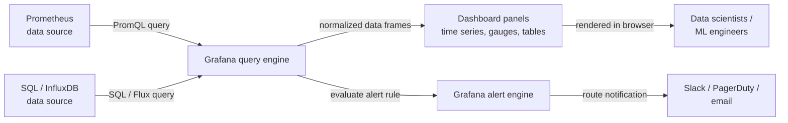

## Definição

Grafana é uma plataforma open source de análise e visualização interativa que se conecta a uma ampla gama de fontes de dados — [Prometheus](/docs/mlops/monitoring/prometheus), InfluxDB, Elasticsearch, Loki, PostgreSQL, APIs de monitoramento nativas da nuvem e dezenas de outros — e renderiza os dados como dashboards interativos e compartilháveis. Não possui armazenamento próprio; é puramente uma camada de consulta e visualização que fica na frente da infraestrutura de dados existente. Esse design torna o Grafana complementar a todo sistema de armazenamento de séries temporais ou logs, em vez de substituição para qualquer um deles.

Em contextos de ML e MLOps, o Grafana serve como a interface de observabilidade unificada. Cientistas de dados e engenheiros de ML o usam para rastrear métricas de desempenho de modelos (acurácia, F1, AUC) conforme elas mudam ao longo do tempo, visualizar latência de previsões e throughput junto com o uso de recursos de infraestrutura, e monitorar sinais de qualidade de dados como pontuações de desvio de features. Como o Grafana suporta múltiplas fontes de dados simultaneamente, um único dashboard pode combinar métricas do Prometheus, logs de aplicação do Loki e KPIs de negócios de um banco de dados SQL — dando uma visão completa e contextualizada do comportamento de um modelo em produção.

O Grafana está disponível como distribuição open source auto-hospedada, como Grafana Cloud (uma oferta SaaS gerenciada) e como Grafana Enterprise com recursos empresariais adicionais. A distribuição open source é totalmente funcional e é a escolha mais comum para equipes que já operam Kubernetes ou têm workflows de infraestrutura-como-código, já que dashboards do Grafana, configurações de fontes de dados e regras de alerta podem ser todos gerenciados como JSON ou por meio de provedores do Terraform.

## Como funciona

### Configuração de fontes de dados

O Grafana se conecta às fontes de dados via plugins. Um plugin de fonte de dados traduz o modelo de consulta interno do Grafana para a linguagem de consulta nativa do backend (PromQL para Prometheus, SQL para bancos de dados relacionais, Lucene para Elasticsearch, etc.) e retorna dados em um formato normalizado. As fontes de dados são configuradas na interface do Grafana ou via arquivos de provisionamento (YAML), o que permite gerenciar configurações como código em um repositório Git. As configurações de autenticação, TLS e tempo limite são todas configuráveis por fonte de dados.

### Composição de dashboards e painéis

Um dashboard do Grafana é um documento JSON contendo uma lista ordenada de painéis. Cada painel define uma consulta contra uma fonte de dados, um tipo de visualização (série temporal, gauge, gráfico de barras, tabela, heatmap, stat, etc.) e opções de exibição (eixos, limiares, legendas, substituições). Os painéis podem ser vinculados a outros dashboards, suportam variáveis (variáveis de template permitem que um único dashboard alterne entre ambientes, versões de modelos ou serviços via um menu suspenso) e podem referenciar anotações — eventos sobrepostos em gráficos de séries temporais para marcar implantações, execuções de retreinamento ou inícios de incidentes.

### Variáveis e templating

As variáveis de template transformam um dashboard estático em um dinâmico. Uma variável consulta a fonte de dados para obter uma lista de valores (por exemplo, todos os valores distintos de label `model_version` do Prometheus) e insere o valor selecionado em cada consulta de painel no dashboard. Isso torna possível construir um único dashboard de modelo de ML que funciona para todos os modelos e versões em vez de manter um dashboard por modelo.

### Alertas

O Grafana Alerting (introduzido no Grafana 8+) fornece regras de alerta unificadas e multi-fontes de dados que avaliam consultas de painéis em um cronograma e roteiam alertas disparados para pontos de contato (Slack, PagerDuty, email, webhooks). As regras de alerta são agrupadas em políticas de notificação que determinam o comportamento de roteamento, agrupamento e silenciamento. O Grafana Alerting pode coexistir com o Prometheus Alertmanager ou substituí-lo completamente, dependendo da preferência da equipe.

### Provisionamento e infraestrutura como código

O Grafana suporta provisionamento declarativo de fontes de dados, dashboards e regras de alerta via arquivos YAML e JSON carregados na inicialização. Combinado com o provedor Terraform do Grafana, toda a configuração do Grafana pode ser versionada e implantada por meio de pipelines de CI/CD — uma capacidade crítica para equipes que gerenciam múltiplos ambientes ou querem infraestrutura de monitoramento reprodutível.



## Quando usar / Quando NÃO usar

| Usar quando | Evitar quando |
|----------|------------|
| Você precisa de dashboards interativos e compartilháveis sobre dados do Prometheus ou outras séries temporais | Você precisa de uma interface completa de rastreamento de experimentos de ML (use MLflow ou W&B em vez disso) |
| Você quer correlacionar métricas de infraestrutura com desempenho de modelos em uma visão | Sua equipe não tem fonte de dados de séries temporais existente para conectar ao Grafana |
| Você tem múltiplas fontes de dados (Prometheus, SQL, Loki) para unificar em um dashboard | Um resumo textual ou tabular simples é suficiente e um dashboard não agrega valor |
| Você quer gerenciar dashboards como código via JSON ou Terraform | Sua organização já está padronizada em uma plataforma de observabilidade proprietária |
| Você precisa de alertas que abrangem múltiplas fontes de dados | Você precisa armazenar ou analisar logs de previsões brutos (o Grafana consulta, não armazena) |

## Comparações

O Grafana e o Prometheus são complementares — o Prometheus coleta e armazena métricas; o Grafana as visualiza. A tabela abaixo os compara para ajudar a esclarecer seus papéis distintos.

| Critério | Grafana | Prometheus |
|---------|---------|-----------|
| Papel principal | Visualização e dashboards | Coleta, armazenamento e alertas de métricas |
| Armazenamento de dados | Nenhum — consulta backends externos | TSDB local (scraping pull-based) |
| Linguagem de consulta | Depende da fonte de dados (PromQL, SQL, etc.) | PromQL |
| Alertas | Alertas unificados multi-fontes de dados (Grafana 8+) | Regras baseadas em PromQL + Alertmanager |
| Fontes de dados | 50+ plugins (Prometheus, SQL, Loki, nuvem, etc.) | Apenas si mesmo (TSDB) |
| Quando usar juntos | Sempre — o Grafana é a interface para os dados do Prometheus | Sempre — o Prometheus é o backend para os dashboards do Grafana |

## Vantagens e desvantagens

| Aspecto | Vantagens | Desvantagens |
|---------|-----------|--------------|
| Multi-fontes de dados | Unifica métricas, logs e SQL em um dashboard | A complexidade de configuração cresce com o número de fontes de dados |
| Dashboard como código | Exportação JSON e provedor Terraform habilitam workflows GitOps | Dashboards JSON são verbosos e difíceis de comparar manualmente |
| Variáveis de template | Um dashboard cobre todos os modelos, ambientes e versões | Consultas de variáveis adicionam latência no carregamento do dashboard |
| Biblioteca de visualização | Tipos de painéis ricos e personalizáveis | Alguns tipos de gráficos avançados requerem plugins ou Grafana Enterprise |
| Alertas | Regras de alerta unificadas e multi-fontes de dados | Curva de aprendizado para políticas de notificação e árvores de roteamento |
| Opção auto-hospedada | Controle total, nenhum dado sai da sua infraestrutura | Requer esforço operacional: upgrades, backups, gerenciamento de plugins |

## Exemplos de código

```json
// grafana_ml_dashboard.json
// Grafana dashboard definition for monitoring an ML model serving endpoint.
// Import this JSON via Grafana UI: Dashboards → Import → Upload JSON file.
// Prerequisites: Prometheus data source named "Prometheus" with ml_* metrics.
{
  "title": "ML Model Monitoring",
  "description": "Dashboard for monitoring ML model latency, throughput, confidence distribution, and data drift.",
  "uid": "ml-model-monitoring-v1",
  "schemaVersion": 36,
  "version": 1,
  "refresh": "30s",
  "time": { "from": "now-3h", "to": "now" },
  "templating": {
    "list": [
      {
        "name": "model_name",
        "label": "Model",
        "type": "query",
        "datasource": { "type": "prometheus", "uid": "Prometheus" },
        "query": "label_values(ml_predictions_total, model_name)",
        "includeAll": false,
        "multi": false,
        "current": {}
      },
      {
        "name": "model_version",
        "label": "Version",
        "type": "query",
        "datasource": { "type": "prometheus", "uid": "Prometheus" },
        "query": "label_values(ml_predictions_total{model_name=\"$model_name\"}, model_version)",
        "includeAll": true,
        "multi": true,
        "current": {}
      }
    ]
  },
  "panels": [
    {
      "id": 1,
      "title": "Prediction Throughput (req/s)",
      "type": "timeseries",
      "gridPos": { "x": 0, "y": 0, "w": 12, "h": 8 },
      "datasource": { "type": "prometheus", "uid": "Prometheus" },
      "targets": [
        {
          "expr": "sum(rate(ml_predictions_total{model_name=\"$model_name\", status=\"success\"}[2m])) by (model_version)",
          "legendFormat": "{{model_version}} — success",
          "refId": "A"
        },
        {
          "expr": "sum(rate(ml_predictions_total{model_name=\"$model_name\", status=\"error\"}[2m])) by (model_version)",
          "legendFormat": "{{model_version}} — error",
          "refId": "B"
        }
      ],
      "fieldConfig": {
        "defaults": {
          "unit": "reqps",
          "custom": { "lineWidth": 2, "fillOpacity": 10 }
        }
      }
    },
    {
      "id": 2,
      "title": "P50 / P95 / P99 Prediction Latency",
      "type": "timeseries",
      "gridPos": { "x": 12, "y": 0, "w": 12, "h": 8 },
      "datasource": { "type": "prometheus", "uid": "Prometheus" },
      "targets": [
        {
          "expr": "histogram_quantile(0.50, sum(rate(ml_prediction_latency_seconds_bucket{model_name=\"$model_name\"}[2m])) by (le, model_version))",
          "legendFormat": "p50 {{model_version}}",
          "refId": "A"
        },
        {
          "expr": "histogram_quantile(0.95, sum(rate(ml_prediction_latency_seconds_bucket{model_name=\"$model_name\"}[2m])) by (le, model_version))",
          "legendFormat": "p95 {{model_version}}",
          "refId": "B"
        },
        {
          "expr": "histogram_quantile(0.99, sum(rate(ml_prediction_latency_seconds_bucket{model_name=\"$model_name\"}[2m])) by (le, model_version))",
          "legendFormat": "p99 {{model_version}}",
          "refId": "C"
        }
      ],
      "fieldConfig": {
        "defaults": {
          "unit": "s",
          "thresholds": {
            "mode": "absolute",
            "steps": [
              { "color": "green", "value": null },
              { "color": "yellow", "value": 0.1 },
              { "color": "red", "value": 0.5 }
            ]
          }
        }
      }
    },
    {
      "id": 3,
      "title": "Data Drift Score",
      "type": "gauge",
      "gridPos": { "x": 0, "y": 8, "w": 8, "h": 6 },
      "datasource": { "type": "prometheus", "uid": "Prometheus" },
      "targets": [
        {
          "expr": "ml_data_drift_score{model_name=\"$model_name\"}",
          "legendFormat": "{{feature_set}}",
          "refId": "A"
        }
      ],
      "fieldConfig": {
        "defaults": {
          "unit": "none",
          "min": 0,
          "max": 1,
          "thresholds": {
            "mode": "absolute",
            "steps": [
              { "color": "green", "value": null },
              { "color": "yellow", "value": 0.1 },
              { "color": "red", "value": 0.25 }
            ]
          }
        }
      }
    },
    {
      "id": 4,
      "title": "Prediction Confidence Distribution (heatmap)",
      "type": "heatmap",
      "gridPos": { "x": 8, "y": 8, "w": 16, "h": 6 },
      "datasource": { "type": "prometheus", "uid": "Prometheus" },
      "targets": [
        {
          "expr": "sum(rate(ml_prediction_confidence_bucket{model_name=\"$model_name\"}[5m])) by (le)",
          "legendFormat": "{{le}}",
          "refId": "A",
          "format": "heatmap"
        }
      ]
    }
  ]
}
```

## Recursos práticos

- [Documentação do Grafana](https://grafana.com/docs/grafana/latest/) — Documentação oficial cobrindo instalação, fontes de dados, dashboards, alertas e provisionamento.
- [Melhores práticas de dashboards do Grafana](https://grafana.com/docs/grafana/latest/dashboards/build-dashboards/best-practices/) — Guia oficial sobre estruturação de dashboards eficazes, uso de variáveis de template e organização de painéis.
- [Provedor Terraform do Grafana](https://registry.terraform.io/providers/grafana/grafana/latest/docs) — Gerencie fontes de dados, dashboards e regras de alerta do Grafana como infraestrutura-como-código.
- [Awesome Grafana](https://github.com/monitoringartist/grafana-aws-cloudwatch-dashboards) — Coleção de dashboards Grafana pré-construídos para stacks de infraestrutura comuns, mantida pela comunidade.
- [Blog Grafana Labs — observabilidade de ML](https://grafana.com/blog/2021/08/09/how-to-monitor-machine-learning-models-with-grafana/) — Guia prático de configuração de dashboards de monitoramento de modelos de ML com Grafana e Prometheus.

## Veja também

- [Prometheus](/docs/mlops/monitoring/prometheus)
- [Monitoramento de ML](/docs/mlops/monitoring)
- [MLOps](/docs/mlops)
