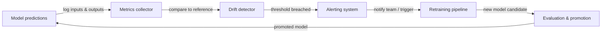

## Definição

O monitoramento de ML é a prática de observar continuamente modelos de machine learning e os dados em que eles operam após a implantação. Ao contrário do software tradicional, que ou funciona ou gera um erro, um modelo pode degradar silenciosamente: ainda produz saídas, mas essas saídas ficam cada vez mais erradas à medida que o mundo muda. O monitoramento de ML fornece os sistemas de alerta precoce que detectam essa degradação antes que cause danos ao negócio.

Três fenômenos impulsionam a maior parte da degradação de modelos em produção. O **concept drift** ocorre quando a relação estatística entre as features de entrada e a variável alvo muda — por exemplo, um modelo de detecção de fraude treinado antes de um novo vetor de ataque aparecer sistematicamente perderá o novo padrão. O **data drift** (também chamado de mudança de covariável) ocorre quando a distribuição das features de entrada muda sem uma mudança correspondente na relação alvo — padrões sazonais, mudanças demográficas e alterações de pipelines de dados upstream causam data drift. A **degradação do modelo** é a perda de desempenho cumulativa que resulta de um ou ambos esses drifts; se não for verificada, manifesta-se como taxas de erro crescentes, queda de receita e experiências de usuário degradadas.

O monitoramento eficaz de ML abrange três camadas: **monitoramento de qualidade de dados** (esquema, taxas de nulos, faixas de valores), **monitoramento de distribuição** (testes estatísticos para drift em features e previsões) e **monitoramento de desempenho do modelo** (métricas de negócios e ML calculadas contra verdade fundamental quando os rótulos estão disponíveis). A combinação das três camadas fornece defesa em profundidade — detectando problemas cedo, em sua origem e em seu efeito downstream.

## Como funciona

### Coleta de dados e previsões

Cada solicitação de previsão passa por uma camada de serviço instrumentada que registra entradas, saídas, timestamps e metadados em um armazenamento centralizado (armazenamento de objetos, um data warehouse ou uma plataforma de streaming como Kafka). Conjuntos de dados de referência — tipicamente o conjunto de dados de treinamento ou validação — são armazenados ao lado dos logs de produção para servir como linha de base estatística para cálculos de drift. Pipelines de rótulos ingerem verdade fundamental com atraso (os rótulos frequentemente chegam horas ou semanas após a previsão) e os juntam de volta às previsões registradas.

### Detecção de drift

Os detectores de drift comparam a distribuição de produção atual contra a linha de base de referência usando testes estatísticos. Para features contínuas, o Índice de Estabilidade da População (PSI), o teste de Kolmogorov-Smirnov ou a distância de Wasserstein medem mudanças de distribuição. Para features categóricas, testes qui-quadrado ou divergência de Jensen-Shannon são comuns. As próprias previsões são tratadas como uma feature: uma mudança na distribuição de previsões (por exemplo, um classificador subitamente gerando "positivo" 80% do tempo quando a linha de base era 30%) é um sinal precoce poderoso antes que os rótulos de verdade fundamental cheguem.

### Computação de métricas de desempenho

Quando os rótulos de verdade fundamental estão disponíveis, as métricas de desempenho são calculadas sobre janelas deslizantes ou coortes baseadas em tempo. Acurácia, precisão, recall, F1, RMSE e AUC-ROC são métricas de ML comuns. As métricas de negócios — receita atribuída a decisões impulsionadas pelo modelo, taxa de deflexão de chamadas, taxa de cliques em recomendações — frequentemente são mais acionáveis. Latência, throughput e taxas de erro são métricas de infraestrutura que indicam a saúde do serviço e devem ser monitoradas junto com a qualidade do modelo.

### Alertas e escalonamento

Limiares e regras de detecção de anomalias disparam alertas quando uma métrica cruza um limite. Limiares estáticos são simples, mas frágeis; controle estatístico de processos (por exemplo, gráficos de controle) e detecção de anomalias baseada em ML se adaptam à sazonalidade. Os alertas são roteados para PagerDuty, Slack ou email dependendo da gravidade. Hierarquias de alerta bem projetadas distinguem entre eventos informativos (apenas log), avisos (notificar a equipe de ML) e eventos críticos (acionar plantão, desencadear rollback automático ou retreinamento).

### Loop de feedback de retreinamento

O monitoramento é a entrada para o loop de retreinamento. Quando o drift é detectado ou o desempenho se degrada além de um limiar, um pipeline automatizado (ou decisão humana) aciona um trabalho de retreinamento em dados frescos. Após o retreinamento, o novo candidato a modelo passa por portais de avaliação antes da promoção, fechando o loop.



## Quando usar / Quando NÃO usar

| Usar quando | Evitar quando |
|----------|------------|
| Um modelo é implantado em produção e serve usuários reais | O modelo é uma análise pontual que nunca será usada novamente |
| As decisões do modelo têm impacto comercial mensurável | O volume de previsões é tão baixo que os testes estatísticos carecem de poder |
| Os rótulos de verdade fundamental ficam eventualmente disponíveis | Você não tem mecanismo de feedback para coletar rótulos ou resultados de negócios |
| Os requisitos regulatórios exigem desempenho de modelo auditável | O custo das ferramentas de monitoramento supera o valor esperado do modelo implantado |
| O processo de geração de dados é conhecido por mudar ao longo do tempo | O modelo é retreinado continuamente de qualquer forma e o drift é implicitamente tratado |
| Múltiplos modelos estão em produção simultaneamente | Um humano revisa cada previsão individualmente, tornando o monitoramento automatizado redundante |

## Comparações

| Ferramenta | Foco principal | Detecção de drift | Rastreamento de desempenho | Hospedagem |
|------|--------------|-----------------|---------------------|---------|
| Evidently AI | Relatórios de qualidade de dados e modelos | Sim (30+ testes) | Sim | Auto-hospedado / Nuvem |
| WhyLabs | Observabilidade de LLM e ML | Sim (estatístico) | Sim | SaaS |
| Arize AI | Plataforma de observabilidade de ML | Sim | Sim | SaaS |
| Dashboards customizados | Totalmente personalizado | Implementação manual | Implementação manual | Auto-hospedado |
| MLflow | Rastreamento de experimentos + monitoramento básico | Limitado | Sim (offline) | Auto-hospedado / Nuvem |

## Vantagens e desvantagens

| Aspecto | Vantagens | Desvantagens |
|--------|------|------|
| Detecção de concept drift | Detecta a degradação do modelo antes do impacto comercial | Requer rótulos de verdade fundamental, que chegam com atraso |
| Detecção de data drift | Funciona sem rótulos — detecta problemas cedo | Pode produzir falsos positivos em mudanças de distribuição benignas |
| Alertas automatizados | Reduz o tempo de detecção de semanas para minutos | Limiares mal ajustados causam fadiga de alertas |
| Ecossistema de ferramentas | Ricas opções open source e SaaS | Adiciona complexidade de infraestrutura e carga de manutenção |
| Gatilhos de retreinamento | Fecha o loop automaticamente | Risco de instabilidade de treinamento se o retreinamento disparar com muita frequência |

## Exemplos de código

```python
# drift_detection.py
# Demonstrates concept and data drift detection using Evidently AI.
# Run: pip install evidently scikit-learn pandas numpy

import numpy as np
import pandas as pd
from sklearn.datasets import make_classification
from sklearn.ensemble import RandomForestClassifier
from sklearn.model_selection import train_test_split

from evidently.report import Report
from evidently.metric_preset import DataDriftPreset, ClassificationPreset
from evidently import ColumnMapping

# --- 1. Simulate reference (training) data ---
X, y = make_classification(
    n_samples=1000,
    n_features=10,
    n_informative=5,
    random_state=42,
)
feature_names = [f"feature_{i}" for i in range(10)]
df = pd.DataFrame(X, columns=feature_names)
df["target"] = y

X_train, X_test, y_train, y_test = train_test_split(
    df[feature_names], df["target"], test_size=0.2, random_state=42
)

# --- 2. Train a simple classifier ---
clf = RandomForestClassifier(n_estimators=100, random_state=42)
clf.fit(X_train, y_train)

# Build reference DataFrame with predictions
reference = X_test.copy()
reference["target"] = y_test.values
reference["prediction"] = clf.predict(X_test)

# --- 3. Simulate production data with drift ---
# Introduce feature shift: scale feature_0 to simulate distribution change
X_prod, y_prod = make_classification(
    n_samples=500,
    n_features=10,
    n_informative=5,
    random_state=99,  # Different seed = different distribution
)
df_prod = pd.DataFrame(X_prod, columns=feature_names)
df_prod["feature_0"] = df_prod["feature_0"] * 3.0  # Artificial drift on feature_0
df_prod["target"] = y_prod

production = df_prod[feature_names].copy()
production["target"] = df_prod["target"].values
production["prediction"] = clf.predict(df_prod[feature_names])

# --- 4. Run Evidently drift + performance report ---
column_mapping = ColumnMapping(
    target="target",
    prediction="prediction",
    numerical_features=feature_names,
)

report = Report(metrics=[DataDriftPreset(), ClassificationPreset()])
report.run(
    reference_data=reference,
    current_data=production,
    column_mapping=column_mapping,
)

# Save HTML report for inspection
report.save_html("drift_report.html")
print("Drift report saved to drift_report.html")

# --- 5. Extract drift results programmatically ---
result = report.as_dict()
drift_summary = result["metrics"][0]["result"]
n_drifted = drift_summary.get("number_of_drifted_columns", 0)
total = drift_summary.get("number_of_columns", 0)
share = drift_summary.get("share_of_drifted_columns", 0)

print(f"Drifted columns: {n_drifted}/{total} ({share:.1%})")
if share > 0.3:
    print("WARNING: Significant drift detected — consider retraining.")
else:
    print("Drift within acceptable bounds.")
```

## Recursos práticos

- [Documentação do Evidently AI](https://docs.evidentlyai.com/) — Documentação oficial para a principal biblioteca de monitoramento de ML open source, cobrindo testes de drift, relatórios e monitoramento em tempo real.
- [Plataforma de observabilidade de ML WhyLabs](https://whylabs.ai/docs) — Documentação da plataforma SaaS para monitoramento de modelos LLM e ML com perfilamento estatístico e alertas.
- [Chip Huyen — Monitoramento de modelos de ML em produção](https://huyenchip.com/2022/02/07/data-distribution-shifts-and-monitoring.html) — Post de blog aprofundado cobrindo mudanças de distribuição de dados, estratégias de monitoramento e trade-offs práticos.
- [Google — Regras de Machine Learning: seção de monitoramento](https://developers.google.com/machine-learning/guides/rules-of-ml#monitoring) — Orientação de engenharia do Google sobre o que monitorar e como configurar alertas para ML em produção.
- [Arize AI — Guia de observabilidade de ML](https://arize.com/ml-observability/) — Guia do praticante cobrindo drift, monitoramento de embeddings e a stack de observabilidade para ML.

## Veja também

- [Prometheus](/docs/mlops/monitoring/prometheus)
- [Grafana](/docs/mlops/monitoring/grafana)
- [Serviço de modelos](/docs/mlops/deployment/model-serving)
