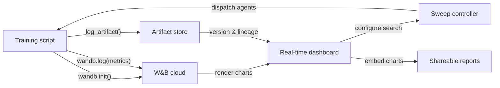

## Definição

Weights & Biases (comumente abreviado como W&B ou wandb) é uma plataforma MLOps nativa em nuvem que fornece rastreamento de experimentos, versionamento de datasets e modelos, otimização de hiperparâmetros e relatórios interativos em um único produto integrado. Fundada em 2017 e amplamente adotada tanto na pesquisa acadêmica quanto na indústria, o W&B é especialmente popular entre equipes que treinam modelos de aprendizado profundo que produzem saídas de mídia ricas — imagens, áudio, vídeo, nuvens de pontos — que se beneficiam da inspeção visual durante o treinamento.

A proposta de valor central do W&B é que ele requer quase nenhuma infraestrutura para começar: você se inscreve em uma conta gratuita, instala o pacote Python `wandb`, adiciona `wandb.init()` ao seu script e tudo é registrado automaticamente na nuvem do W&B. A plataforma é organizada em **projetos** (coleções de execuções relacionadas), **runs** (execuções de treinamento individuais), **artifacts** (datasets e arquivos de modelos versionados), **sweeps** (busca automatizada de hiperparâmetros) e **reports** (documentos narrativos compartilháveis que incorporam gráficos ao vivo).

Ao contrário de soluções auto-hospedadas como o MLflow, o W&B gerencia toda a infraestrutura backend. Isso elimina o ônus operacional, mas significa que os dados saem de suas instalações — uma consideração relevante para indústrias regulamentadas. O W&B oferece opções de implantação em nuvem privada e on-premise para clientes corporativos que precisam de garantias de residência de dados, embora estas exijam um plano pago.

## Como funciona

### Inicialização e auto-logging

Chamar `wandb.init(project="...", config={...})` inicia uma execução, envia a configuração ao W&B e retorna um objeto de execução. Muitos frameworks populares (PyTorch Lightning, Hugging Face Trainer, Keras, XGBoost, scikit-learn) oferecem callbacks ou integrações W&B que registram automaticamente gradientes, programações de taxa de aprendizado e métricas de avaliação sem código adicional. Nos bastidores, um thread em segundo plano agrupa e comprime os dados de log antes de enviá-los via HTTPS, minimizando a sobrecarga de treinamento.

### Painéis em tempo real

A UI do W&B renderiza curvas de métricas, utilização do sistema (GPU/CPU/memória) e mídia à medida que a execução progride. Múltiplas execuções podem ser sobrepostas no mesmo gráfico com codificação de cores automática. As execuções podem ser filtradas e agrupadas por qualquer dimensão de configuração, permitindo diagnóstico visual rápido.

### Sweeps

Um sweep é definido por um YAML ou dicionário Python especificando espaço de busca, estratégia de busca (grid, aleatória ou bayesiana) e critérios de parada. O controlador de sweep do W&B coordena múltiplos agentes em execução paralela, cada um selecionando combinações de hiperparâmetros do controlador e registrando os resultados de volta. A busca bayesiana adapta-se com base nos resultados observados, convergindo mais rapidamente do que a busca em grid.

### Artifacts

W&B Artifacts versiona datasets, checkpoints de modelos e saídas de avaliação como objetos endereçados por conteúdo. Um artifact é vinculado à execução que o produziu e às execuções que o consumiram, criando um grafo de linhagem de dados. Você pode baixar uma versão específica de artifact com duas linhas de Python, tornando a reprodutibilidade de datasets e modelos tão simples quanto especificar uma string de versão.

### Reports

Os reports são documentos interativos que incorporam gráficos ao vivo do W&B, comparações de execuções e narrativa em markdown. Eles são a principal superfície de colaboração: um pesquisador pode compartilhar um link de report em uma mensagem do Slack ou PR do GitHub para compartilhar evidências experimentais reproduzíveis sem exportar imagens estáticas.



## Quando usar / Quando NÃO usar

| Usar quando | Evitar quando |
|----------|------------|
| Treinando modelos de aprendizado profundo e precisando de registro de mídia rico | Os dados não podem sair das instalações e você não pode pagar o plano enterprise on-premise |
| Colaboração em equipe, compartilhamento de resultados e relatórios narrativos são importantes | É necessária uma solução completamente de código aberto e auto-hospedada sem dependência SaaS |
| Desejando otimização de hiperparâmetros integrada sem ferramentas adicionais | Os experimentos são simples e a sobrecarga de uma conta SaaS não é justificada |
| A equipe trabalha em pesquisa ou academia e se beneficia do acesso ao nível gratuito | O orçamento é apertado e os recursos do nível pago são necessários para o tamanho da equipe |

## Comparações

| Critério | W&B | MLflow |
|-----------|-----|--------|
| Facilidade de configuração | Conta SaaS gratuita; sem infraestrutura; `wandb login` + duas linhas de código | Auto-hospedável localmente; sem conta; `mlflow ui` para iniciar |
| Qualidade da UI | Polida, interativa; construída para cargas de trabalho visuais e com muita mídia | Limpa e funcional; melhor para comparação de métricas tabulares |
| Colaboração | Espaços de trabalho de equipe nativos, relatórios, links de compartilhamento, integração com Slack | Requer servidor compartilhado; sem recursos de colaboração integrados no OSS |
| Preço | Gratuito para indivíduos; pago para equipes maiores; enterprise para on-prem | Gratuito e de código aberto; Databricks Managed MLflow tem custo adicional |
| Otimização de hiperparâmetros | Sweeps integrados com Bayesian/grid/aleatório + parada antecipada | Requer ferramentas externas (Optuna, Ray Tune) |

## Exemplos de código

```python
# wandb_tracking_example.py
# W&B experiment tracking: logs config, metrics, images, and registers a model artifact.
# pip install wandb scikit-learn matplotlib Pillow

import wandb
import numpy as np
import matplotlib.pyplot as plt
from sklearn.ensemble import RandomForestClassifier
from sklearn.datasets import load_digits
from sklearn.model_selection import train_test_split
from sklearn.metrics import (
    accuracy_score, f1_score, confusion_matrix, ConfusionMatrixDisplay
)
import os, tempfile

run = wandb.init(
    project="digits-classification",
    name="random-forest-v1",
    config={
        "n_estimators": 150,
        "max_depth": 12,
        "min_samples_split": 4,
        "random_state": 7,
        "dataset": "sklearn-digits",
    },
)
cfg = wandb.config

X, y = load_digits(return_X_y=True)
X_train, X_test, y_train, y_test = train_test_split(
    X, y, test_size=0.2, stratify=y, random_state=cfg.random_state
)

clf = RandomForestClassifier(
    n_estimators=cfg.n_estimators,
    max_depth=cfg.max_depth,
    min_samples_split=cfg.min_samples_split,
    random_state=cfg.random_state,
)
clf.fit(X_train, y_train)

y_pred = clf.predict(X_test)
metrics = {
    "accuracy": accuracy_score(y_test, y_pred),
    "f1_macro": f1_score(y_test, y_pred, average="macro"),
    "n_train": len(X_train),
    "n_test": len(X_test),
}
wandb.log(metrics)
run.finish()
```

## Recursos práticos

- [W&B Official Documentation](https://docs.wandb.ai/) — Referência completa cobrindo o SDK Python, integrações, sweeps, artifacts e reports.
- [W&B Quickstart](https://docs.wandb.ai/quickstart) — Registre sua primeira execução do W&B em menos de cinco minutos com um exemplo mínimo.
- [W&B Sweeps Documentation](https://docs.wandb.ai/guides/sweeps) — Guia abrangente para configurar e executar buscas distribuídas de hiperparâmetros.
- [W&B Fully Connected Blog](https://wandb.ai/fully-connected) — Blog para praticantes com tutoriais aprofundados, relatórios de benchmark e artigos de engenharia de ML.
- [Hugging Face + W&B Integration](https://docs.wandb.ai/guides/integrations/huggingface) — Guia para registrar automaticamente todas as métricas do Hugging Face Trainer com um único argumento `report_to="wandb"`.

## Veja também

- [Experiment tracking](/docs/mlops/experiment-tracking)
- [MLflow](/docs/mlops/mlflow)
- [MLOps](/docs/mlops)
