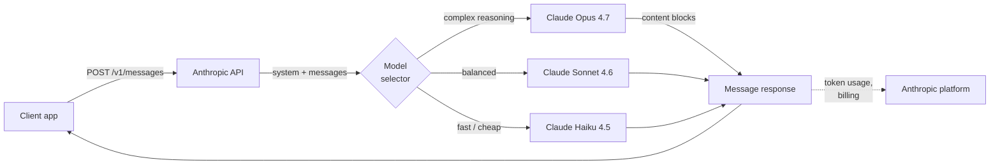
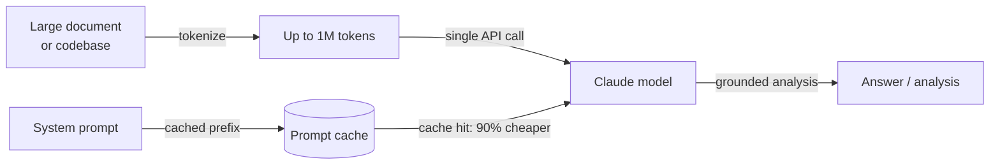

## Definição

**Anthropic** é uma empresa de segurança em IA e provedora de modelos fundada em 2021 por ex-pesquisadores da OpenAI. Sua tese central é que construir modelos de IA capazes e resolver o problema de alinhamento são objetivos inseparáveis — a empresa persegue capacidade de ponta ao lado de pesquisas de segurança como Constitutional AI, interpretabilidade e compreensão mecanística dos internos do modelo. O produto comercial dessa pesquisa é a família de modelos **Claude**, disponível por meio da API da Anthropic e de produtos empresariais.

A linha de modelos Claude em maio de 2026 segue uma convenção de nomenclatura de três níveis que reflete concessões entre capacidade e custo: **Opus** (maior qualidade, raciocínio complexo), **Sonnet** (qualidade e velocidade equilibradas) e **Haiku** (mais rápido e econômico).

| Modelo | API Model ID | Contexto | Saída Máxima | Entrada ($/1M) | Saída ($/1M) |
|-------|-------------|---------|------------|--------------|---------------|
| Claude Opus 4.7 | `claude-opus-4-7` | 1M tokens | 128K tokens | $5,00 | $25,00 |
| Claude Sonnet 4.6 | `claude-sonnet-4-6` | 1M tokens | 64K tokens | $3,00 | $15,00 |
| Claude Haiku 4.5 | `claude-haiku-4-5` | 200K tokens | 64K tokens | $1,00 | $5,00 |

> Todos os modelos da série Claude 3.x (Opus, Sonnet, Haiku) estão completamente superados e não devem ser referenciados como atuais. `claude-sonnet-4-20250514` e `claude-opus-4-20250514` serão descontinuados em **2026-06-15**.

De uma perspectiva de plataforma, a API da Anthropic é centrada na **Messages API** — uma interface limpa e de propósito específico para conversas de múltiplos turnos. A plataforma inclui tool use (o termo da Anthropic para function calling), extended thinking / adaptive thinking, prompt caching (reduz custo e latência para grandes contextos repetidos) e processamento em lote. O SDK Python (`anthropic`) e o SDK TypeScript são as principais bibliotecas clientes. Os modelos Claude também estão disponíveis pelo Amazon Bedrock, Google Cloud Vertex AI e contratos empresariais com opções de residência de dados.

## Como funciona

### Messages API

A Messages API (`POST /v1/messages`) é a interface principal da Anthropic. Ao contrário de algumas APIs que usam uma string `prompt` plana, a Messages API é orientada a conversação: você envia um array `messages` de turnos alternados `user` e `assistant`, com um parâmetro `system` opcional para contexto e persona. O modelo retorna um objeto `Message` contendo uma lista `content` — blocos de texto por padrão, blocos de tool use quando o modelo decide chamar uma ferramenta. Streaming é suportado e recomendado para uso interativo; o SDK fornece tanto auxiliares de streaming quanto acesso SSE bruto.



### Tool use

O tool use permite ao Claude chamar funções externas emitindo blocos de conteúdo `tool_use` estruturados. Você declara ferramentas como esquemas JSON no parâmetro `tools`. Quando o Claude decide que uma ferramenta é necessária, a resposta contém um bloco `tool_use` com o nome da ferramenta e o input; seu código executa a função e retorna um `tool_result` no próximo turno de usuário. O Claude então usa o resultado para completar sua resposta. Esse padrão habilita agentes, ambientes de execução de código, consultas de banco de dados e integrações de API sem que o modelo precise de acesso direto a qualquer sistema.


### Extended thinking e adaptive thinking

**Extended thinking** (Sonnet 4.6, Haiku 4.5) permite ao modelo raciocinar extensamente antes de produzir sua resposta final. Quando você define `thinking: {type: "enabled", budget_tokens: N}`, o modelo emite blocos de conteúdo `thinking` contendo seu rascunho interno — similar ao chain-of-thought, mas nativo e estruturado.

**Adaptive thinking** (Opus 4.7, Opus 4.6, Sonnet 4.6) escala automaticamente a profundidade do raciocínio de acordo com a complexidade da tarefa. Ambos os modos melhoram significativamente o desempenho em competições de matemática, código complexo, raciocínio de múltiplos passos e tarefas que exigem análise cuidadosa passo a passo. Os tokens de raciocínio contam para o orçamento de tokens, mas ficam visíveis na resposta, dando transparência sobre como o modelo chegou à sua resposta.

### Prompt caching

O prompt caching reduz drasticamente o custo e a latência para cargas de trabalho que usam repetidamente grandes prompts de sistema ou contextos de documentos. Você marca seções de prefixo da sua requisição com `cache_control: {type: "ephemeral"}`. Gravações de cache com TTL de 5 minutos custam 1,25× o valor base; gravações com TTL de 1 hora custam 2× o valor base; leituras de cache custam 0,1× o valor base (90% de desconto). Isso é especialmente valioso para pipelines de RAG (grande contexto passado com cada consulta), loops de agentes (grandes prompts de sistema repetidos a cada turno) e processamento em lote de documentos.

### Contexto longo (1M tokens)

Claude Opus 4.7 e Sonnet 4.6 suportam janela de contexto de 1M de tokens, e Haiku 4.5 suporta 200K tokens. O contexto longo permite que bases de código inteiras, documentos legais, artigos de pesquisa ou históricos completos de conversação sejam processados em uma única chamada sem fragmentação. A **Batch API** oferece 50% de desconto nos tokens de entrada e saída para cargas de trabalho assíncronas. Um header beta `output-300k-2026-03-24` estende a saída máxima para 300K tokens.



## Quando usar / Quando NÃO usar

| Use a Anthropic quando | Evite ou considere alternativas quando |
|--------------------|--------------------------------------|
| Você precisa de janela de contexto de 1M para processar documentos longos, bases de código ou conversas estendidas sem fragmentação | Sua carga de trabalho exige geração de imagens, transcrição de áudio ou texto para fala — Claude é somente texto/visão; OpenAI cobre áudio |
| Restrições de segurança e comportamento de recusa previsível são críticos (conformidade, saúde, finanças) | Você precisa de modelos de pesos abertos para auto-hospedagem, fine-tuning ou residência de dados — a Anthropic não oferece opção de pesos abertos |
| Você quer extended ou adaptive thinking para tarefas de raciocínio profundo (matemática, código complexo, análise de múltiplos passos) | Seu caso de uso principal é geração de embeddings em alto volume — a Anthropic não oferece API de embeddings |
| O prompt caching reduzirá significativamente os custos (grandes contextos repetidos, prompts de sistema de agentes) | Você depende fortemente de ferramentas específicas da OpenAI (DALL-E, Whisper) que não têm equivalente na Anthropic |
| Você está construindo fluxos de trabalho de tool use ou computer use e quer um modelo bem calibrado para saídas estruturadas | Você precisa do menor custo absoluto por token em escala — Claude Haiku compete em preço, mas modelos abertos podem ser mais baratos |

## Comparações

| Critério | Anthropic | OpenAI | Google Gemini |
|----------|-----------|--------|---------------|
| Modelo flagship | Claude Opus 4.7 | GPT-5.5 | Gemini 2.5 Pro |
| Janela de contexto | 1M (Opus 4.7, Sonnet 4.6); 200K (Haiku 4.5) | 1.050K (GPT-5.5 / GPT-5.4) | 1M (Gemini 2.5 Pro) |
| Raciocínio / thinking | Adaptive thinking (Opus 4.7); Extended thinking (Sonnet 4.6, Haiku 4.5) | Reasoning modes: none → xhigh | Gemini 2.5 Pro thinking |
| Entrada multimodal | Texto, imagem | Texto, imagem, áudio, vídeo | Texto, imagem, áudio, vídeo |
| Áudio / fala | Não | Sim (GPT Realtime 2) | Sim (Gemini) |
| Geração de imagens | Não | Sim (GPT Image 2) | Sim (Imagen 4) |
| API de embeddings | Não | Sim | Sim |
| Pesos abertos | Não | Não | Gemma (parcial) |
| Prompt caching | Sim (nativo, 90% de desconto na leitura) | Context caching (limitado) | Sim (Gemini) |
| Tool use / function calling | Maduro, suporte a computer use | Maduro, amplamente adotado | Maduro |
| Filosofia de segurança | Constitutional AI, ajuste para recusas | API de moderação, política de uso | Diretrizes de IA responsável |
| Opções de residência de dados | Contrato empresarial | Contrato empresarial | Regiões do Google Cloud |

## Prós e contras

| Prós | Contras |
|------|------|
| Janela de contexto de até 1M — melhor da categoria para documentos longos | Sem APIs de áudio, fala ou geração de imagens |
| Adaptive e extended thinking oferecem chain-of-thought transparente para tarefas difíceis de raciocínio | Sem API de embeddings — é necessário um segundo provedor para RAG |
| Prompt caching reduz significativamente os custos para grandes contextos repetidos | Modelo fechado sem opção de pesos abertos |
| Design orientado à segurança com calibração cuidadosa de recusas e Constitutional AI | Ecossistema menor que a OpenAI — menos tutoriais e integrações de terceiros |
| Computer use (beta) permite controle agêntico de interfaces gráficas de desktop | O preço pode ser maior que alternativas de pesos abertos para tarefas simples |

## Exemplos de código

### Messages API — conclusão básica e prompt de sistema

```python
import anthropic

client = anthropic.Anthropic(api_key="sk-ant-...")  # ou defina a variável de ambiente ANTHROPIC_API_KEY

# Mensagem básica
message = client.messages.create(
    model="claude-sonnet-4-6",
    max_tokens=1024,
    system="You are a concise technical assistant. Answer in plain English.",
    messages=[
        {"role": "user", "content": "What is the Anthropic Messages API?"}
    ],
)
print(message.content[0].text)

# Conversa de múltiplos turnos
messages = [
    {"role": "user", "content": "What is prompt caching?"},
    {"role": "assistant", "content": "Prompt caching stores repeated large context..."},
    {"role": "user", "content": "How much does it save?"},
]
response = client.messages.create(
    model="claude-haiku-4-5",
    max_tokens=512,
    messages=messages,
)
print(response.content[0].text)
```

### Tool use

```python
import json
import anthropic

client = anthropic.Anthropic()

# Definir ferramentas como esquemas JSON
tools = [
    {
        "name": "search_docs",
        "description": "Search the documentation for a given query and return relevant passages.",
        "input_schema": {
            "type": "object",
            "properties": {
                "query": {"type": "string", "description": "Search query"},
                "max_results": {"type": "integer", "default": 3},
            },
            "required": ["query"],
        },
    }
]

messages = [{"role": "user", "content": "How do I enable prompt caching?"}]

# Primeira chamada — o Claude pode solicitar uma ferramenta
response = client.messages.create(
    model="claude-sonnet-4-6",
    max_tokens=1024,
    tools=tools,
    messages=messages,
)

# Processar chamadas de ferramenta
if response.stop_reason == "tool_use":
    messages.append({"role": "assistant", "content": response.content})

    tool_results = []
    for block in response.content:
        if block.type == "tool_use":
            # Execução simulada de ferramenta
            result = f"Prompt caching docs for '{block.input['query']}': use cache_control param..."
            tool_results.append({
                "type": "tool_result",
                "tool_use_id": block.id,
                "content": result,
            })

    messages.append({"role": "user", "content": tool_results})

    # Chamada final com o resultado da ferramenta
    final = client.messages.create(
        model="claude-sonnet-4-6",
        max_tokens=1024,
        tools=tools,
        messages=messages,
    )
    print(final.content[0].text)
```

### Extended thinking

```python
import anthropic

client = anthropic.Anthropic()

response = client.messages.create(
    model="claude-sonnet-4-6",
    max_tokens=16000,
    thinking={
        "type": "enabled",
        "budget_tokens": 10000,  # tokens alocados para raciocínio interno
    },
    messages=[{
        "role": "user",
        "content": (
            "A train leaves city A at 9am traveling at 80 km/h. "
            "Another train leaves city B (320 km away) at 10am traveling at 100 km/h. "
            "At what time do they meet, and how far from city A?"
        ),
    }],
)

for block in response.content:
    if block.type == "thinking":
        print("=== Model's internal reasoning ===")
        print(block.thinking[:500], "...")  # primeiros 500 chars para brevidade
    elif block.type == "text":
        print("=== Final answer ===")
        print(block.text)
```

### Prompt caching para grande contexto repetido

```python
import anthropic

client = anthropic.Anthropic()

# Documento grande carregado uma vez — armazenado em cache após a primeira chamada
large_document = open("contract.txt").read()  # ex.: 50K tokens

response = client.messages.create(
    model="claude-sonnet-4-6",
    max_tokens=1024,
    system=[
        {
            "type": "text",
            "text": "You are a legal document analyst. Answer questions based solely on the document provided.",
        },
        {
            "type": "text",
            "text": large_document,
            "cache_control": {"type": "ephemeral"},  # marcar para cache
        },
    ],
    messages=[{"role": "user", "content": "What are the termination clauses?"}],
)

print(response.content[0].text)
# usage.cache_creation_input_tokens — tokens armazenados em cache nesta chamada (preço cheio × 1,25)
# usage.cache_read_input_tokens — tokens servidos do cache (10% do preço)
print(response.usage)
```

## Recursos práticos

- [Referência da API Anthropic](https://docs.anthropic.com/en/api/getting-started) — Documentação completa de endpoints com esquemas de requisição/resposta e referência de parâmetros
- [Visão geral dos modelos Claude](https://platform.claude.com/docs/en/docs/about-claude/models) — IDs de modelos atuais, janelas de contexto, comparação de capacidades e cronograma de descontinuação
- [Preços Claude](https://platform.claude.com/docs/en/docs/about-claude/pricing) — Preços por token, taxas de prompt caching, desconto em lote e preços do modo rápido
- [Guia de engenharia de prompts da Anthropic](https://docs.anthropic.com/en/docs/build-with-claude/prompt-engineering/overview) — Melhores práticas oficiais para prompts de sistema, chain-of-thought e técnicas específicas de tarefas
- [Anthropic Cookbook](https://github.com/anthropics/anthropic-cookbook) — Notebooks executáveis cobrindo tool use, RAG, multimodal, prompt caching e agentes
- [SDK Python da Anthropic no GitHub](https://github.com/anthropics/anthropic-sdk-python) — Código-fonte, changelog, stubs de tipo e guias de migração

## Veja também

- [Provedores de modelos](/docs/model-providers) — Visão geral e comparação de todos os provedores, incluindo tabela de comparação com 7 provedores
- [Estudo de caso: Claude](/docs/case-studies/claude) — Para uma análise mais profunda da arquitetura do modelo e metodologia de treinamento
- [OpenAI](/docs/model-providers/openai) — Modelos GPT-5.x, function calling, geração de imagem e vídeo
- [Engenharia de prompts](/docs/prompt-engineering) — Técnicas aplicáveis a todos os modelos Claude
- [Ferramentas](/docs/tools/claude-code) — Claude Code, o agente de codificação de IA da Anthropic, construído sobre a API Claude
- [Agentes](/docs/agents) — Construção de fluxos de trabalho agênticos com tool use do Claude
