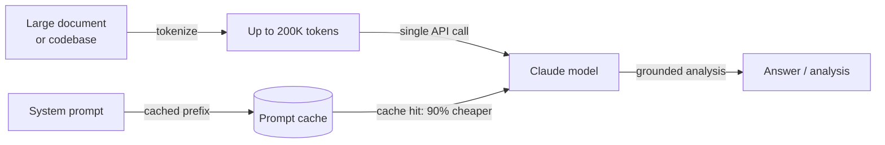

## Definição

**Anthropic** é uma empresa de segurança em IA e provedora de modelos fundada em 2021 por ex-pesquisadores da OpenAI. Sua tese central é que construir modelos de IA capazes e resolver o problema de alinhamento são objetivos inseparáveis — a empresa persegue capacidades de ponta junto com pesquisas de segurança como Constitutional AI, interpretabilidade e compreensão mecanística dos internos do modelo. O produto comercial dessa pesquisa é a família de modelos **Claude**, disponível por meio da API da Anthropic e produtos empresariais.

A linha de modelos Claude segue uma convenção de nomenclatura de três níveis que reflete os compromissos entre capacidade e custo: **Opus** (maior qualidade, raciocínio complexo), **Sonnet** (qualidade e velocidade equilibradas) e **Haiku** (mais rápido e econômico). A partir de 2025, a geração atual é o **Claude 3.7 Sonnet** — o modelo carro-chefe com capacidades de pensamento estendido — juntamente com **Claude 3 Opus**, **Claude 3.5 Sonnet** e **Claude 3.5 Haiku**. Todos os modelos Claude 3+ suportam entrada de imagens, e toda a família é projetada em torno de uma janela de contexto de 200K tokens que pode processar livros, grandes bases de código e longos históricos de conversação sem truncamento.

De uma perspectiva de plataforma, a API da Anthropic é centrada na **Messages API** — uma interface limpa e de propósito específico para conversas de múltiplos turnos. A plataforma inclui uso de ferramentas (o termo da Anthropic para chamadas de função), pensamento estendido (raciocínio de cadeia de pensamento visível), cache de prompts (reduz custos e latência para contextos repetidos grandes) e processamento em lote. O SDK Python (`anthropic`) e o SDK TypeScript são as principais bibliotecas cliente. Os modelos Claude também estão disponíveis por meio do Amazon Bedrock, Google Cloud Vertex AI e contratos empresariais com opções de residência de dados.

## Como funciona

### Messages API

A Messages API (`POST /v1/messages`) é a interface principal da Anthropic. Ao contrário de algumas APIs que usam uma string `prompt` plana, a Messages API é orientada a conversação: você envia um array `messages` de turnos alternados `user` e `assistant`, com um parâmetro `system` opcional para contexto e persona. O modelo retorna um objeto `Message` contendo uma lista `content` — blocos de texto por padrão, blocos de uso de ferramentas quando o modelo decide chamar uma ferramenta. Streaming é suportado e recomendado para uso interativo; o SDK fornece tanto auxiliares de streaming quanto acesso SSE bruto.


### Uso de ferramentas

O uso de ferramentas permite ao Claude chamar funções externas emitindo blocos de conteúdo `tool_use` estruturados. Você declara ferramentas como esquemas JSON no parâmetro `tools`. Quando o Claude decide que uma ferramenta é necessária, a resposta contém um bloco `tool_use` com o nome da ferramenta e a entrada; seu código executa a função e retorna um `tool_result` no próximo turno de usuário. O Claude então usa o resultado para completar sua resposta. Esse padrão habilita agentes, ambientes de execução de código, consultas de banco de dados e integrações de API sem que o modelo precise de acesso direto a qualquer sistema.


### Pensamento estendido

O pensamento estendido é um modo disponível no Claude 3.7 Sonnet que permite ao modelo raciocinar extensamente antes de produzir sua resposta final. Quando você define `thinking: {type: "enabled", budget_tokens: N}`, o modelo emite blocos de conteúdo `thinking` contendo seu rascunho interno — similar à cadeia de pensamento, mas nativo e estruturado. O pensamento estendido melhora significativamente o desempenho em competições de matemática, código complexo, raciocínio de múltiplos passos e tarefas que requerem análise cuidadosa passo a passo. Os tokens de pensamento contam para o orçamento de tokens, mas são visíveis na resposta, dando transparência sobre como o modelo chegou à sua resposta.

### Cache de prompts

O cache de prompts reduz drasticamente o custo e a latência para cargas de trabalho que usam repetidamente grandes prompts de sistema ou contextos de documentos. Você marca seções de prefixo de sua requisição com `cache_control: {type: "ephemeral"}`. Na primeira chamada, a Anthropic armazena em cache o prefixo do prompt em sua infraestrutura; chamadas subsequentes que correspondem ao prefixo são servidas do cache com 90% menos custo de tokens de entrada e tempo até o primeiro token significativamente reduzido. Isso é especialmente valioso para pipelines de RAG (contexto grande passado com cada consulta), loops de agentes (grandes prompts de sistema repetidos a cada turno) e processamento em lote de documentos.

### Contexto longo (200K tokens)

Todos os modelos Claude 3 e posteriores suportam uma janela de contexto de 200K tokens — equivalente a aproximadamente 150.000 palavras ou ~500 páginas de texto. O contexto longo permite que bases de código inteiras, documentos legais, artigos de pesquisa ou históricos completos de conversação sejam processados em uma única chamada sem fragmentação. A pesquisa da Anthropic sobre desempenho em contexto longo (avaliações de "agulha no palheiro") mostra que o Claude mantém forte precisão de recuperação em toda a faixa de 200K, tornando-o confiável para perguntas e respostas sobre documentos, análise de contratos e revisão de código em grandes repositórios. Este é um dos diferenciadores mais claros da Anthropic em relação à janela de 128K do GPT-4o.



## Quando usar / Quando NÃO usar

| Usar Anthropic quando | Evitar ou considerar alternativas quando |
|-----------------------|------------------------------------------|
| Você precisa de uma janela de contexto de 200K para processar documentos longos, bases de código ou conversas estendidas sem fragmentação | Sua carga de trabalho requer geração de imagens, transcrição de áudio ou texto para fala — Claude é somente texto/visão; OpenAI cobre áudio |
| Restrições de segurança e comportamento de rejeição previsível são críticos (conformidade, saúde, finanças) | Você precisa de modelos de pesos abertos para auto-hospedagem, ajuste fino ou residência de dados — Anthropic não oferece opção de pesos abertos |
| Você quer pensamento estendido para tarefas de raciocínio profundo (matemática, código complexo, análise de múltiplos passos) | Seu caso de uso principal é a geração de embeddings em alto volume — Anthropic não oferece uma API de embeddings |
| O cache de prompts reduzirá significativamente os custos (contextos repetidos grandes, prompts de sistema de agentes) | Você depende fortemente de ferramentas específicas da OpenAI (Assistants API, DALL-E, Whisper) que não têm equivalente na Anthropic |
| Você está construindo fluxos de trabalho de uso de ferramentas ou uso de computador e quer um modelo bem calibrado para saídas estruturadas | Você precisa do menor custo absoluto por token em escala — Claude Haiku compete em preço, mas GPT-4o-mini e modelos abertos são mais baratos |

## Comparações

| Critério | Anthropic | OpenAI | Google Gemini |
|----------|-----------|--------|---------------|
| Modelo carro-chefe | Claude 3.7 Sonnet | GPT-4o | Gemini 2.5 Pro |
| Janela de contexto | 200K (todos Claude 3+) | 128K (GPT-4o) | Até 1M (Gemini 1.5 Pro) |
| Raciocínio / pensamento | Pensamento estendido (CoT nativo) | Série o1, o3 | Pensamento Gemini 2.5 Pro |
| Entrada multimodal | Texto, imagem | Texto, imagem, áudio, vídeo | Texto, imagem, áudio, vídeo |
| Áudio / fala | Não | Sim (Whisper, TTS) | Sim (Gemini) |
| Geração de imagens | Não | Sim (DALL-E 3) | Sim (Imagen) |
| API de embeddings | Não | Sim | Sim |
| Pesos abertos | Não | Não | Gemma (parcial) |
| Cache de prompts | Sim (nativo, 90% de desconto) | Cache de contexto (limitado) | Sim (Gemini) |
| Uso de ferramentas / chamada de função | Maduro, suporte a computer use | Maduro, amplamente adotado | Maduro |
| Filosofia de segurança | Constitutional AI, ajustado para rejeições | API de moderação, política de uso | Diretrizes de IA responsável |
| Opções de residência de dados | Contrato empresarial | Contrato empresarial | Regiões do Google Cloud |

## Prós e contras

| Prós | Contras |
|------|---------|
| Janela de contexto de 200K em todos os modelos — melhor da categoria para documentos longos | Sem APIs de áudio, fala ou geração de imagens |
| O pensamento estendido oferece cadeia de pensamento transparente para tarefas de raciocínio difícil | Sem API de embeddings — você precisa de um segundo provedor para RAG |
| O cache de prompts reduz significativamente os custos para contextos grandes repetidos | Modelo fechado sem opção de pesos abertos |
| Design voltado para segurança com calibração cuidadosa de rejeições e Constitutional AI | Ecossistema menor que a OpenAI — menos tutoriais e integrações de terceiros |
| Computer use (beta) permite controle agêntico de GUIs de desktop | Os preços podem ser mais altos que GPT-4o-mini ou alternativas de pesos abertos para tarefas simples |

## Exemplos de código

### Messages API — conclusão básica e prompt de sistema

```python
import anthropic

client = anthropic.Anthropic(api_key="sk-ant-...")  # or set ANTHROPIC_API_KEY env var

# Basic message
message = client.messages.create(
    model="claude-3-7-sonnet-20250219",
    max_tokens=1024,
    system="You are a concise technical assistant. Answer in plain English.",
    messages=[
        {"role": "user", "content": "What is the Anthropic Messages API?"}
    ],
)
print(message.content[0].text)

# Multi-turn conversation
messages = [
    {"role": "user", "content": "What is prompt caching?"},
    {"role": "assistant", "content": "Prompt caching stores repeated large context..."},
    {"role": "user", "content": "How much does it save?"},
]
response = client.messages.create(
    model="claude-3-5-haiku-20241022",
    max_tokens=512,
    messages=messages,
)
print(response.content[0].text)
```

### Uso de ferramentas

```python
import json
import anthropic

client = anthropic.Anthropic()

# Define tools as JSON schemas
tools = [
    {
        "name": "search_docs",
        "description": "Search the documentation for a given query and return relevant passages.",
        "input_schema": {
            "type": "object",
            "properties": {
                "query": {"type": "string", "description": "Search query"},
                "max_results": {"type": "integer", "default": 3},
            },
            "required": ["query"],
        },
    }
]

messages = [{"role": "user", "content": "How do I enable prompt caching?"}]

# First call — Claude may request a tool
response = client.messages.create(
    model="claude-3-7-sonnet-20250219",
    max_tokens=1024,
    tools=tools,
    messages=messages,
)

# Process tool calls
if response.stop_reason == "tool_use":
    messages.append({"role": "assistant", "content": response.content})

    tool_results = []
    for block in response.content:
        if block.type == "tool_use":
            # Simulated tool execution
            result = f"Prompt caching docs for '{block.input['query']}': use cache_control param..."
            tool_results.append({
                "type": "tool_result",
                "tool_use_id": block.id,
                "content": result,
            })

    messages.append({"role": "user", "content": tool_results})

    # Final call with tool result
    final = client.messages.create(
        model="claude-3-7-sonnet-20250219",
        max_tokens=1024,
        tools=tools,
        messages=messages,
    )
    print(final.content[0].text)
```

### Pensamento estendido

```python
import anthropic

client = anthropic.Anthropic()

response = client.messages.create(
    model="claude-3-7-sonnet-20250219",
    max_tokens=16000,
    thinking={
        "type": "enabled",
        "budget_tokens": 10000,  # tokens allocated for internal reasoning
    },
    messages=[{
        "role": "user",
        "content": (
            "A train leaves city A at 9am traveling at 80 km/h. "
            "Another train leaves city B (320 km away) at 10am traveling at 100 km/h. "
            "At what time do they meet, and how far from city A?"
        ),
    }],
)

for block in response.content:
    if block.type == "thinking":
        print("=== Model's internal reasoning ===")
        print(block.thinking[:500], "...")  # first 500 chars for brevity
    elif block.type == "text":
        print("=== Final answer ===")
        print(block.text)
```

### Cache de prompts para contexto grande repetido

```python
import anthropic

client = anthropic.Anthropic()

# Large document loaded once — cached after first call
large_document = open("contract.txt").read()  # e.g., 50K tokens

response = client.messages.create(
    model="claude-3-5-sonnet-20241022",
    max_tokens=1024,
    system=[
        {
            "type": "text",
            "text": "You are a legal document analyst. Answer questions based solely on the document provided.",
        },
        {
            "type": "text",
            "text": large_document,
            "cache_control": {"type": "ephemeral"},  # mark for caching
        },
    ],
    messages=[{"role": "user", "content": "What are the termination clauses?"}],
)

print(response.content[0].text)
# usage.cache_creation_input_tokens — tokens cached this call (full price)
# usage.cache_read_input_tokens — tokens served from cache (10% price)
print(response.usage)
```

## Recursos práticos

- [Referência da API Anthropic](https://docs.anthropic.com/en/api/getting-started) — Documentação completa de endpoints com esquemas de requisição/resposta e referência de parâmetros
- [Guia de engenharia de prompts da Anthropic](https://docs.anthropic.com/en/docs/build-with-claude/prompt-engineering/overview) — Melhores práticas oficiais para prompts de sistema, cadeia de pensamento e técnicas específicas de tarefas
- [Anthropic Cookbook](https://github.com/anthropics/anthropic-cookbook) — Notebooks executáveis cobrindo uso de ferramentas, RAG, multimodal, cache de prompts e agentes
- [Visão geral do modelo Claude](https://docs.anthropic.com/en/docs/about-claude/models) — IDs de modelos atuais, janelas de contexto, comparação de capacidades e cronograma de descontinuação
- [SDK Python da Anthropic no GitHub](https://github.com/anthropics/anthropic-sdk-python) — Código fonte, changelog, stubs de tipo e guias de migração

## Veja também

- [Provedores de modelos](/docs/model-providers) — Visão geral e comparação de todos os provedores
- [Estudo de caso: Claude](/docs/case-studies/claude) — Para uma análise mais profunda da arquitetura do modelo e metodologia de treinamento
- [OpenAI](/docs/model-providers/openai) — GPT-4o, raciocínio da série o, chamada de função, DALL-E, Whisper
- [Engenharia de prompts](/docs/prompt-engineering) — Técnicas aplicáveis a todos os modelos Claude
- [Ferramentas](/docs/tools/claude-code) — Claude Code, o agente de codificação de IA da Anthropic
- [Agentes](/docs/agents) — Construção de fluxos de trabalho agênticos com uso de ferramentas do Claude
