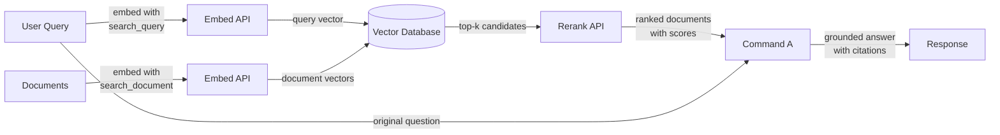

## Definição

**Cohere** é uma empresa de IA empresarial que constrói modelos de linguagem e APIs desenvolvidos especificamente para aplicações de negócios, com um foco distinto em busca, recuperação de informações e geração aumentada por recuperação (RAG). Ao contrário dos provedores de propósito geral que oferecem uma ampla gama de recursos para consumidores e desenvolvedores, a Cohere tem como alvo clientes empresariais que precisam de infraestrutura NLP confiável e pronta para produção — especialmente para casos de uso onde *encontrar e apresentar a informação certa* é o problema central.

A linha de modelos da Cohere em maio de 2026 reflete esse foco:

**Modelos Command (gerativos):**

| Modelo | API Model ID | Janela de Contexto | Notas |
|-------|-------------|----------------|-------|
| Command A | `command-a-03-2025` | 256K tokens | 111B parâmetros; flagship; 150% mais throughput que Command R+ |
| Command A Translate | `command-a-translate-08-2025` | 8K tokens | Especializado em tradução |
| Command A Reasoning | `command-a-reasoning-08-2025` | 256K tokens | Especializado em raciocínio |
| Command A Vision | `command-a-vision-07-2025` | 128K tokens | Entrada visão + texto |
| Command R7B | `command-r7b-12-2024` | 128K tokens | 7B parâmetros; leve |
| Command R+ 08-2024 | `command-r-plus-08-2024` | 128K tokens | $2,50/$10,00 por 1M; disponível mas superado |
| Command R 08-2024 | `command-r-08-2024` | 128K tokens | $0,15/$0,60 por 1M; disponível mas superado |

**Modelos Embed:**

| Modelo | API Model ID | Contexto | Dimensões |
|-------|-------------|---------|-----------|
| Embed v4.0 | `embed-v4.0` | 128K tokens | 256–1536 |
| Embed English v3.0 | `embed-english-v3.0` | 512 tokens | 1024 |
| Embed Multilingual v3.0 | `embed-multilingual-v3.0` | 512 tokens | 1024 |

**Modelos Rerank:**

| Modelo | API Model ID | Contexto |
|-------|-------------|---------|
| Rerank v4.0 Pro | `rerank-v4.0-pro` | 32K tokens |
| Rerank v4.0 Fast | `rerank-v4.0-fast` | 32K tokens |

**Modelos Aya (multilíngues):**

| Modelo | API Model ID | Parâmetros | Idiomas |
|-------|-------------|--------|-----------|
| Tiny Aya Global | `tiny-aya-global` | 3,35B | 70 |
| Aya Expanse 32B | `c4ai-aya-expanse-32b` | 32B | 23 |
| Aya Vision 32B | `c4ai-aya-vision-32b` | 32B | 23 (texto + imagens) |

> **Descontinuados / aposentados — não referenciar:** `command-r-03-2024` / alias `command-r` (aposentado em 15 de set. de 2025); `command-r-plus-04-2024` / alias `command-r-plus` (aposentado em 15 de set. de 2025); `command-light`, `command` (aposentados em 15 de set. de 2025); `embed-english-v2.0`, `embed-multilingual-v2.0` (aposentados em 4 de abr. de 2026); `c4ai-aya-expanse-8b`, `c4ai-aya-vision-8b` (aposentados em 4 de abr. de 2026); `rerank-english-v2.0`, `rerank-multilingual-v2.0` (aposentados em 30 de abr. de 2025).

**Command A** é o modelo gerativo flagship atual com 111B de parâmetros, janela de contexto de 256K e 150% mais throughput em comparação com o Command R+ 08-2024. Suporta tool use, agentes de múltiplas etapas, RAG com citações e 23 idiomas. A implantação empresarial on-premises requer apenas 2× GPUs A100/H100.

## Como funciona

### API de Chat e Geração

A família Command A é acessada via API de Chat da Cohere e suporta tanto interações conversacionais de múltiplos turnos quanto tarefas de geração de turno único. Ambos os modelos aceitam um parâmetro `documents` que permite passar contexto recuperado diretamente no prompt, habilitando um modo RAG nativo onde o modelo recebe instruções para fundamentar sua resposta no conteúdo fornecido e citar fontes.

### API Embed (embeddings multilíngues)

A API Embed converte texto em representações vetoriais densas adequadas para busca de similaridade semântica. O Embed v4.0 suporta contexto de 128K e dimensões de 256 a 1536. Os modelos Embed v3.0 mais antigos suportam mais de 100 idiomas em um único modelo. Embeddings podem ser gerados com diferentes valores de `input_type` — `search_document` para indexar conteúdo em repouso e `search_query` para codificar consultas em tempo de execução — uma distinção que aplica sinais de treinamento assimétricos e tipicamente melhora a precisão de recuperação em comparação com esquemas de embedding simétrico.

### API Rerank

A API Rerank aceita uma consulta e uma lista de documentos candidatos (geralmente os resultados top-k de uma busca vetorial ou por palavras-chave) e retorna cada documento com uma pontuação de relevância calculada por um cross-encoder. Cross-encoders avaliam a consulta e o documento conjuntamente em um único forward pass, proporcionando precisão muito maior do que bi-encoders que codificam consulta e documento separadamente. O reranking é mais valioso quando a recuperação inicial é barata (BM25 ou busca ANN), mas a precisão precisa ser maximizada antes de passar o contexto para um LLM.

Os modelos de rerank v4.0 vêm em duas variantes: **Rerank v4.0 Pro** (focado em qualidade, multilíngue) e **Rerank v4.0 Fast** (variante de baixa latência).

### Integração RAG

A integração RAG da Cohere une Embed, Rerank e Command A em um pipeline unificado. O fluxo típico é: embeder a consulta, executar busca de vizinhos mais próximos aproximados em um banco de dados vetorial, reranquear os principais candidatos para obter os documentos mais relevantes, depois passar esses documentos ao Command A com a consulta original para geração fundamentada. O modelo retorna uma resposta junto com objetos de citação que referenciam passagens específicas nos documentos recuperados, tornando simples construir aplicações de IA auditáveis com citações de fontes.



## Quando usar / Quando NÃO usar

| Use quando | Evite quando |
|----------|------------|
| Construindo busca empresarial ou perguntas e respostas de base de conhecimento onde a precisão de recuperação é crítica | Você precisa de assistência de chat de propósito geral sem componente de recuperação |
| Seu conteúdo abrange múltiplos idiomas e você precisa de um único modelo de embedding para todos | Seu caso de uso é principalmente geração de imagem, áudio ou multimodal — a Cohere é focada em texto |
| Você quer adicionar um passo de reranking para melhorar a precisão após uma busca vetorial ou BM25 inicial | Você precisa de raciocínio, matemática ou codificação altamente capazes para tarefas autônomas (GPT-5.4 ou Claude Sonnet 4.6 podem superar) |
| Requisitos de governança de dados exigem implantação on-premises ou em nuvem privada | Seu projeto é um protótipo rápido e você quer o ecossistema mais amplo de integrações |
| Você precisa de citações de fontes e fundamentação de documentos nativamente na saída do modelo | O orçamento é muito restrito — o preço do Command A é orientado a enterprise e não está totalmente publicado |

## Comparações

| Critério | Cohere | OpenAI | Mistral |
|----------|--------|--------|---------|
| Qualidade de embedding (MTEB) | Multilíngue de topo, Embed v4.0 suporta contexto de 128K | Forte com inglês em primeiro (text-embedding-3-large) | Competitivo; mistral-embed disponível |
| Reranking | API Rerank nativa v4.0 (cross-encoder, variantes Pro + Fast) | Sem endpoint de reranking nativo | Sem endpoint de reranking nativo |
| Modelos nativos de RAG | Command A projetado para RAG com citações | GPT-5.4 funciona bem com prompts RAG, mas não é nativo de RAG | Mistral Large 3 funciona com prompts RAG |
| Pesos abertos | Não (somente API proprietária) | Não (somente API proprietária) | Sim (modelos Mistral no Hugging Face) |
| On-premises / nuvem privada | Sim (contratos enterprise, Command A: 2× A100/H100) | Azure OpenAI (limitado) | Sim (auto-hospedar pesos abertos) |
| Embedding multilíngue | Modelo único, mais de 100 idiomas | Suporte multilíngue separado ou limitado | Suporte de embedding multilíngue limitado |
| Modelo de preços | Enterprise / pagamento por token (preço do Command A não totalmente publicado) | Pagamento por token, bem documentado | Pagamento por token; opção de auto-hospedagem gratuita |

## Prós e contras

| Prós | Contras |
|------|------|
| Embeddings multilíngues de melhor qualidade; Embed v4.0 suporta contexto de 128K | Ecossistema geral menor em comparação com a OpenAI |
| API Rerank nativa (v4.0 Pro/Fast) melhora significativamente a precisão de recuperação | Sem opção de pesos abertos para auto-hospedagem |
| Command A é desenvolvido para RAG com fundamentação e citações | Preço do Command A não totalmente publicado — processo de venda enterprise necessário |
| Opções de implantação enterprise incluindo nuvem privada (2× A100/H100 on-prem) | Documentação e recursos da comunidade mais escassos que a OpenAI |
| Componentes do pipeline RAG (Embed + Rerank + Command A) funcionam como uma pilha coesa | Aliases aposentados (`command-r-plus`, `command-r`) devem ser migrados para IDs versionados |

## Exemplos de código

### Chat com Command A

```python
import cohere

co = cohere.Client("YOUR_COHERE_API_KEY")

response = co.chat(
    model="command-a-03-2025",
    message="Explain retrieval-augmented generation in plain English.",
)
print(response.text)
```

### Embeddings para busca semântica

```python
import cohere

co = cohere.Client("YOUR_COHERE_API_KEY")

# Embed documents at indexing time
documents = [
    "Cohere specializes in enterprise NLP and semantic search.",
    "RAG combines retrieval with language model generation.",
    "Multilingual embeddings support over 100 languages.",
]
doc_embeddings = co.embed(
    texts=documents,
    model="embed-multilingual-v3.0",
    input_type="search_document",
).embeddings

# Embed a query at search time
query_embedding = co.embed(
    texts=["What does Cohere specialize in?"],
    model="embed-multilingual-v3.0",
    input_type="search_query",
).embeddings[0]

# Compute cosine similarity (or use a vector DB)
import numpy as np

doc_array = np.array(doc_embeddings)
query_array = np.array(query_embedding)
scores = doc_array @ query_array / (
    np.linalg.norm(doc_array, axis=1) * np.linalg.norm(query_array)
)
top_idx = int(np.argmax(scores))
print(f"Most relevant: '{documents[top_idx]}' (score: {scores[top_idx]:.4f})")
```

### Reranking de candidatos recuperados

```python
import cohere

co = cohere.Client("YOUR_COHERE_API_KEY")

query = "How does multilingual embedding work?"
candidates = [
    "Cohere Embed supports over 100 languages in a single model.",
    "Command A is optimized for RAG workflows with long context.",
    "Rerank re-scores retrieved documents with a cross-encoder.",
    "BM25 is a classic keyword-based retrieval algorithm.",
]

results = co.rerank(
    model="rerank-v4.0-pro",
    query=query,
    documents=candidates,
    top_n=3,
)

for hit in results.results:
    print(f"[{hit.relevance_score:.4f}] {candidates[hit.index]}")
```

### Pipeline RAG completo com citações do Command A

```python
import cohere

co = cohere.Client("YOUR_COHERE_API_KEY")

# Documents retrieved from your vector store (simplified)
retrieved_docs = [
    {"id": "doc1", "text": "Cohere Embed v4.0 supports 128K context for multilingual search."},
    {"id": "doc2", "text": "Command A is designed for grounded generation with source citations."},
    {"id": "doc3", "text": "Rerank v4.0 Pro improves precision by re-scoring candidates with a cross-encoder."},
]

response = co.chat(
    model="command-a-03-2025",
    message="How does Cohere's pipeline improve search quality?",
    documents=retrieved_docs,
)

print(response.text)
print("\n--- Citations ---")
for citation in response.citations:
    print(f"  [{citation.start}:{citation.end}] → {[doc['id'] for doc in citation.documents]}")
```

## Recursos práticos

- [Documentação de modelos Cohere](https://docs.cohere.com/docs/models) — Lista completa de modelos com IDs de API, janelas de contexto e visão geral de capacidades.
- [Descontinuações Cohere](https://docs.cohere.com/docs/deprecations) — Cronograma de aposentadoria de modelos legados e orientação de migração.
- [Documentação Cohere Embed](https://docs.cohere.com/docs/embeddings) — Guia detalhado sobre modelos de embedding, tipos de entrada e suporte multilíngue.
- [Documentação Cohere Rerank](https://docs.cohere.com/docs/reranking) — Guia da API Rerank com exemplos e conselhos de seleção de modelos.
- [Guia RAG Cohere](https://docs.cohere.com/docs/retrieval-augmented-generation-rag) — Passo a passo completo para construir um pipeline RAG com Command A.
- [MTEB Leaderboard](https://huggingface.co/spaces/mteb/leaderboard) — Benchmark independente comparando modelos de embedding incluindo Cohere Embed.

## Veja também

- [Provedores de modelos](/docs/model-providers)
- [RAG](/docs/rag)
- [Embeddings](/docs/rag/embeddings)
- [Busca semântica](/docs/semantic-search)
