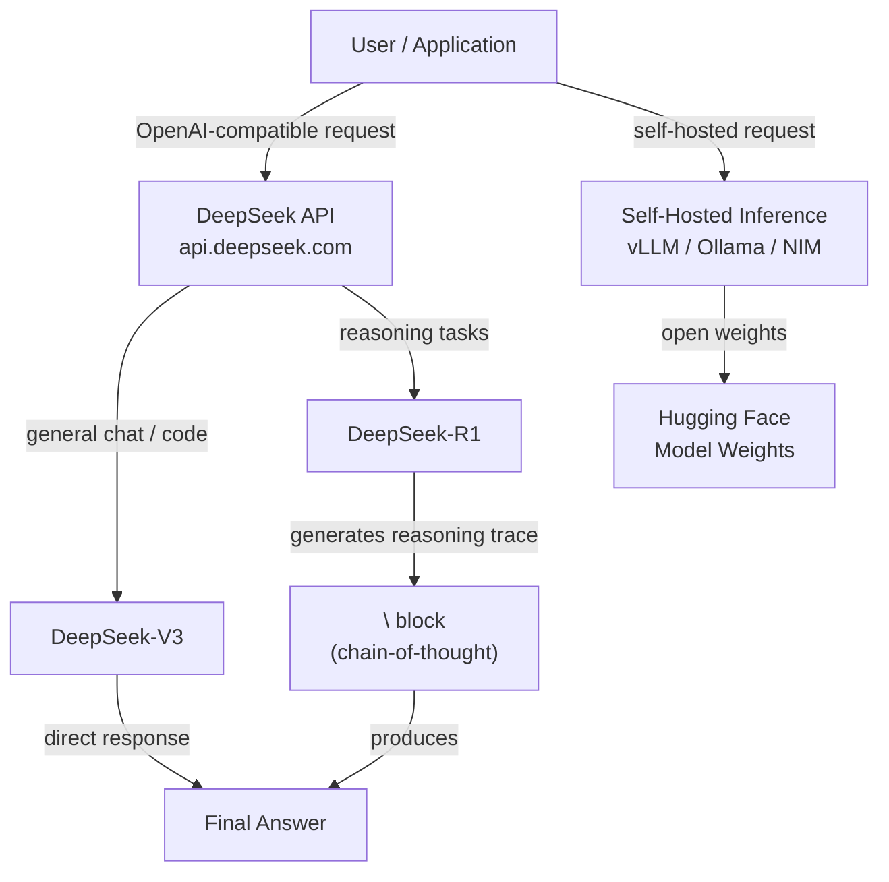

## Definição

**DeepSeek** é um laboratório de pesquisa em IA chinês e plataforma comercial que ganhou considerável atenção internacional por produzir modelos com desempenho competitivo em relação aos melhores modelos proprietários, enquanto publica os pesos de forma aberta e opera a uma fração do custo. Fundada em 2023 como subsidiária da High-Flyer (um fundo de hedge quantitativo), a abordagem da DeepSeek é caracterizada por pesquisa rigorosa sobre eficiência de treinamento — incluindo inovações em arquiteturas mixture-of-experts (MoE), aprendizado por reforço com feedback humano e novas abordagens de raciocínio que não dependem de orçamentos massivos de computação.

A linha de modelos abrange três áreas principais de capacidade. **DeepSeek-V3** é um modelo de chat e seguimento de instruções de uso geral que rivaliza com GPT-4o e Claude 3.5 Sonnet em benchmarks padrão, sendo dramaticamente mais barato via API. **DeepSeek-R1** é um modelo de raciocínio dedicado que usa chain-of-thought estendido (CoT) — o modelo gera rastros de raciocínio explícitos antes de produzir uma resposta final — tornando-o particularmente forte em matemática, dedução lógica e resolução de problemas em múltiplas etapas. **DeepSeek-Coder** (e suas variantes sucessoras integradas ao V3/R1) se especializa em geração, conclusão e depuração de código em uma ampla gama de linguagens de programação.

A abordagem de pesos abertos da DeepSeek significa que todos os principais modelos estão disponíveis no Hugging Face e podem ser auto-hospedados em sua própria infraestrutura — uma capacidade crítica para organizações com requisitos de soberania de dados ou que buscam evitar custos por token de API em escala. A plataforma DeepSeek também expõe uma API wire-compatível com o formato da API OpenAI, o que significa que qualquer aplicação construída com o SDK Python da OpenAI pode mudar para modelos DeepSeek alterando a `base_url` e a chave de API sem outras modificações de código.

## Como funciona

### Plataforma de API

A DeepSeek hospeda uma API de inferência em nuvem em `api.deepseek.com` que aceita requisições no formato OpenAI Chat Completions. Essa camada de compatibilidade significa que a sobrecarga de integração é mínima — desenvolvedores familiarizados com o SDK da OpenAI podem migrar ou testar modelos DeepSeek em minutos. A plataforma suporta respostas em streaming, chamadas de função e prompts de sistema. O preço é baseado em tokens e listado publicamente, com tarifas tipicamente 90–95% menores do que modelos OpenAI de nível equivalente, tornando as implantações de produção de alto volume substancialmente mais baratas.

### Modelos de raciocínio (DeepSeek-R1)

O DeepSeek-R1 é treinado usando um processo em múltiplas etapas que incorpora aprendizado por reforço para recompensar o modelo por produzir respostas finais corretas — crucialmente, sem depender de dados supervisionados de chain-of-thought na etapa central de treinamento. O modelo gera um bloco `<think>` contendo seu rastro de raciocínio antes da resposta final. Esse bloco de notas explícito permite ao modelo realizar dedução em múltiplas etapas, verificar seu trabalho e retroceder de caminhos incorretos — comportamentos que melhoram dramaticamente o desempenho em problemas de olimpíadas de matemática, lógica formal e tarefas de codificação complexas que exigem planejamento em muitas etapas.

### Modelos de código e DeepSeek-Coder

Os modelos especializados em código da DeepSeek são pré-treinados em grandes corpora de código-fonte (GitHub, plataformas de programação competitiva, documentação) e ajustados fino para seguir instruções em tarefas de codificação. Eles suportam conclusão fill-in-the-middle (FIM), que é o formato padrão usado por ferramentas de autocompletar de IDEs como o Copilot. O DeepSeek-Coder alcança desempenho de topo no HumanEval, MBPP e SWE-bench, superando frequentemente modelos várias vezes maiores de outros fornecedores. As capacidades de codificação também estão integradas ao DeepSeek-V3 e R1, de modo que os modelos de uso geral também funcionam bem em tarefas de código.

### Implantação de pesos abertos

Todos os principais modelos DeepSeek têm seus pesos publicados no Hugging Face sob licenças permissivas, permitindo inferência auto-hospedada em hardware GPU de consumidor ou empresarial. O DeepSeek-V3 usa uma arquitetura mixture-of-experts onde apenas um subconjunto de parâmetros é ativado por token, reduzindo significativamente o custo de inferência em comparação com modelos densos de capacidade comparável. As opções populares de implantação incluem vLLM, Ollama (para versões quantizadas) e contêineres NVIDIA NIM. A implantação auto-hospedada é particularmente atraente para cargas de trabalho em lote de grande escala, ajuste fino em dados proprietários ou cenários em que todos os dados devem permanecer on-premises.



## Quando usar / Quando NÃO usar

| Usar quando | Evitar quando |
|-------------|---------------|
| O custo é uma restrição principal — a API DeepSeek é mais de 90% mais barata que o GPT-4o com qualidade comparável | Você precisa de um fornecedor com SLA empresarial estabelecido, certificações de conformidade (SOC 2, HIPAA) ou processamento de dados baseado nos EUA |
| As tarefas exigem raciocínio profundo em múltiplas etapas: matemática, lógica, provas formais, codificação complexa | Sua tarefa é principalmente multimodal — DeepSeek-V3/R1 são modelos somente de texto |
| Você quer auto-hospedar modelos de pesos abertos para soberania de dados ou ajuste fino personalizado | Você precisa do ecossistema mais amplo possível de plugins/ferramentas e integrações de terceiros |
| Construindo pipelines de lote de alto volume onde a redução de custo por token se acumula significativamente | Aplicações de consumidor críticas para latência onde o rastro de raciocínio do R1 adiciona tempo de resposta |
| Geração de código, revisão de código ou depuração são seus principais casos de uso | Você está em uma jurisdição com requisitos regulatórios sobre a origem do modelo de IA |

## Comparações

| Critério | DeepSeek (V3 / R1) | OpenAI (GPT-4o / o1) | Meta / Llama |
|----------|--------------------|----------------------|--------------|
| Desempenho de raciocínio | R1 competitivo com o1 em benchmarks de matemática/lógica | o1 é de nível frontier; GPT-4o forte em raciocínio geral | Llama 3.x competitivo mas abaixo de R1/o1 em raciocínio difícil |
| Qualidade geral de chat | V3 competitivo com GPT-4o | GPT-4o melhor qualidade geral | Llama 3.3 70B competitivo para seu tamanho |
| Pesos abertos | Sim (todos os modelos no Hugging Face) | Não (somente proprietário) | Sim (Meta open-source Llama) |
| Custo de API | Muito baixo (~$0,27/M tokens de entrada para V3) | Alto (~$2,50/M para entrada GPT-4o) | Gratuito (auto-hospedado); API Fireworks/Together acessível |
| Ecossistema e integrações | Crescendo; API compatível com OpenAI facilita adoção | Maior ecossistema, mais integrações | Grande ecossistema open-source |
| Soberania de dados | Auto-hospedagem possível; dados de API processados na China | Azure OpenAI para processamento em região dos EUA | Auto-hospedagem completa possível |
| Multimodal | Somente texto (V3/R1) | Sim (GPT-4o, DALL-E) | Llama 3.2 tem capacidades de visão |

## Prós e contras

| Prós | Contras |
|------|---------|
| Custo de API dramaticamente menor que OpenAI/Anthropic | Dados de API roteados por servidores chineses — preocupação para alguns setores regulamentados |
| R1 oferece desempenho de raciocínio de nível frontier | Rastros de raciocínio do R1 adicionam latência e uso de tokens |
| API compatível com OpenAI — custo de migração quase nulo | Menor reconhecimento de confiança/marca em ciclos de vendas empresariais ocidentais |
| Pesos abertos permitem auto-hospedagem e ajuste fino | V3/R1 são somente texto; sem capacidades nativas de imagem ou áudio |
| Forte geração de código na maioria das linguagens de programação comuns | Comunidade e documentação principalmente em chinês; recursos em inglês ainda estão se atualizando |

## Exemplos de código

### Conclusão de chat com DeepSeek-V3 (compatível com OpenAI)

```python
from openai import OpenAI

# DeepSeek uses the OpenAI SDK with a custom base_url
client = OpenAI(
    api_key="YOUR_DEEPSEEK_API_KEY",
    base_url="https://api.deepseek.com",
)

response = client.chat.completions.create(
    model="deepseek-chat",  # maps to DeepSeek-V3
    messages=[
        {"role": "system", "content": "You are a helpful AI assistant."},
        {"role": "user", "content": "Explain the difference between MoE and dense transformer architectures."},
    ],
    temperature=0.7,
    max_tokens=1024,
)

print(response.choices[0].message.content)
```

### Raciocínio com DeepSeek-R1 (chain-of-thought)

```python
from openai import OpenAI

client = OpenAI(
    api_key="YOUR_DEEPSEEK_API_KEY",
    base_url="https://api.deepseek.com",
)

response = client.chat.completions.create(
    model="deepseek-reasoner",  # maps to DeepSeek-R1
    messages=[
        {
            "role": "user",
            "content": (
                "A train leaves City A at 08:00 and travels at 120 km/h. "
                "Another train leaves City B (300 km away) at 09:00 and travels "
                "toward City A at 80 km/h. At what time do they meet?"
            ),
        }
    ],
)

# R1 exposes the reasoning trace in reasoning_content
message = response.choices[0].message
if hasattr(message, "reasoning_content") and message.reasoning_content:
    print("=== Reasoning trace ===")
    print(message.reasoning_content)
    print()

print("=== Final answer ===")
print(message.content)
```

### Resposta em streaming com DeepSeek-V3

```python
from openai import OpenAI

client = OpenAI(
    api_key="YOUR_DEEPSEEK_API_KEY",
    base_url="https://api.deepseek.com",
)

stream = client.chat.completions.create(
    model="deepseek-chat",
    messages=[
        {"role": "user", "content": "Write a Python function that implements binary search."},
    ],
    stream=True,
)

for chunk in stream:
    delta = chunk.choices[0].delta
    if delta.content:
        print(delta.content, end="", flush=True)
print()
```

### Inferência auto-hospedada com vLLM

```python
# Start vLLM server (run in terminal):
# vllm serve deepseek-ai/DeepSeek-V3 --tensor-parallel-size 4 --port 8000

from openai import OpenAI

# Point to your local vLLM server instead of DeepSeek cloud
client = OpenAI(
    api_key="not-needed",  # vLLM does not require a real key
    base_url="http://localhost:8000/v1",
)

response = client.chat.completions.create(
    model="deepseek-ai/DeepSeek-V3",
    messages=[
        {"role": "user", "content": "Summarize the key advantages of mixture-of-experts models."},
    ],
)

print(response.choices[0].message.content)
```

## Recursos práticos

- [Documentação da API DeepSeek](https://platform.deepseek.com/api-docs/) — Referência oficial para a API da plataforma DeepSeek incluindo modelos, parâmetros e preços
- [GitHub DeepSeek](https://github.com/deepseek-ai) — Repositórios open-source para modelos DeepSeek, código de treinamento e artigos de pesquisa
- [DeepSeek-R1 no Hugging Face](https://huggingface.co/deepseek-ai/DeepSeek-R1) — Cartão do modelo com pesos, resultados de benchmark e instruções de implantação
- [Relatório técnico DeepSeek-V3](https://arxiv.org/abs/2412.19437) — Artigo de pesquisa detalhando a arquitetura V3, abordagem de treinamento e comparações de benchmark
- [Guia de implantação DeepSeek com vLLM](https://docs.vllm.ai/en/latest/models/supported_models.html) — Instruções para auto-hospedar modelos DeepSeek com vLLM para inferência em produção

## Veja também

- [Provedores de modelos](/docs/model-providers)
- [Estudo de caso DeepSeek](/docs/case-studies/deepseek)
- [Padrões de raciocínio](/docs/reasoning-patterns)
