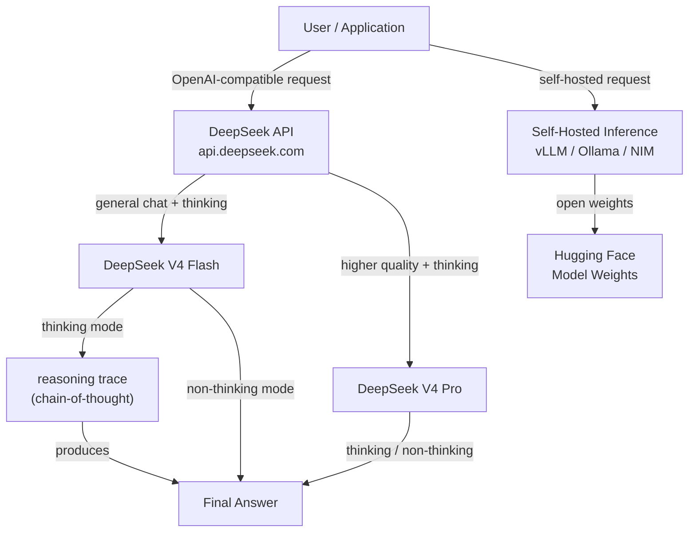

## Definição

**DeepSeek** é um laboratório de pesquisa em IA chinês e plataforma comercial que ganhou considerável atenção internacional por produzir modelos com desempenho competitivo em relação aos melhores modelos proprietários, enquanto publica os pesos de forma aberta e opera a uma fração do custo. Fundada em 2023 como subsidiária da High-Flyer (um fundo de hedge quantitativo), a abordagem da DeepSeek é caracterizada por pesquisa rigorosa sobre eficiência de treinamento — incluindo inovações em arquiteturas mixture-of-experts (MoE), aprendizado por reforço com feedback humano e novas abordagens de raciocínio.

A linha de modelos atual em maio de 2026 é a **série DeepSeek V4**, que substitui todos os modelos V3:

| Modelo | API Model ID | Janela de Contexto | Saída Máxima | Entrada Cache Hit ($/1M) | Entrada Cache Miss ($/1M) | Saída ($/1M) |
|-------|-------------|----------------|------------|----------------------|------------------------|---------------|
| DeepSeek V4 Flash | `deepseek-v4-flash` | 1M tokens | 384K tokens | $0,0028 | $0,14 | $0,28 |
| DeepSeek V4 Pro | `deepseek-v4-pro` | 1M tokens | 384K tokens | $0,003625* | $0,435* | $0,87* |

*O DeepSeek V4 Pro é oferecido com 75% de desconto estendido até **2026-05-31 15:59 UTC**. O preço pós-desconto ainda não foi confirmado.

Ambos os modelos suportam:
- **Modo thinking** (raciocínio estendido com rastros chain-of-thought)
- **Modo non-thinking** (respostas rápidas padrão)
- Saída JSON, tool calls, chat prefix completion (beta), FIM completion (somente non-thinking)
- Compatível com os formatos de API OpenAI ChatCompletions e Anthropic

> **Descontinuados — não referenciar:** `deepseek-chat` e `deepseek-reasoner` (aliases legados para V4-Flash, descontinuados em **2026-07-24**); DeepSeek V3 (`deepseek-v3`); DeepSeek V3.2 (`deepseek-v3.2`) — todos substituídos pela série V4.

A abordagem de pesos abertos da DeepSeek significa que os modelos estão disponíveis no Hugging Face e podem ser auto-hospedados em sua própria infraestrutura — uma capacidade crítica para organizações com requisitos de soberania de dados. A plataforma DeepSeek também expõe uma API com compatibilidade de wire com o formato da API OpenAI, o que significa que qualquer aplicação construída com o SDK Python da OpenAI pode mudar para modelos DeepSeek alterando a `base_url` e a chave de API.

## Como funciona

### Plataforma de API

A DeepSeek hospeda uma API de inferência em nuvem em `api.deepseek.com` que aceita requisições no formato OpenAI Chat Completions. Essa camada de compatibilidade significa que a sobrecarga de integração é mínima — desenvolvedores familiarizados com o SDK da OpenAI podem migrar ou testar modelos DeepSeek em minutos. A plataforma suporta respostas em streaming, function calling e prompts de sistema.

### Modo thinking (raciocínio estendido)

Os modelos DeepSeek V4 suportam um modo de thinking estendido. Quando habilitado, o modelo gera um rastro de raciocínio antes da resposta final. Esse bloco de notas explícito permite ao modelo realizar dedução em múltiplas etapas, verificar seu trabalho e retroceder de caminhos incorretos — comportamentos que melhoram dramaticamente o desempenho em matemática, lógica formal e tarefas de codificação complexas. O campo `reasoning_content` na resposta da API contém o rastro de thinking.

### Modo non-thinking

Ambos os modelos V4 também suportam um modo non-thinking padrão para tarefas de baixa latência onde o raciocínio chain-of-thought é desnecessário. A completação FIM (fill-in-the-middle) está disponível no modo non-thinking, tornando o V4 Flash adequado como backend de completação de código.

### Implantação de pesos abertos

Os pesos dos modelos DeepSeek V4 são publicados no Hugging Face sob licenças permissivas, permitindo inferência auto-hospedada. A arquitetura MoE significa que apenas um subconjunto de parâmetros é ativado por token, reduzindo significativamente o custo de inferência em comparação com modelos densos de qualidade comparável. As opções populares de implantação incluem vLLM, Ollama (para versões quantizadas) e contêineres NVIDIA NIM.



## Quando usar / Quando NÃO usar

| Use quando | Evite quando |
|----------|------------|
| O custo é uma restrição principal — o preço da API DeepSeek V4 é dramaticamente menor que modelos proprietários de nível equivalente | Você precisa de um provedor com SLA enterprise estabelecido, certificações de conformidade (SOC 2, HIPAA) ou processamento de dados baseado nos EUA |
| As tarefas exigem raciocínio profundo de múltiplas etapas: matemática, lógica, provas formais, codificação complexa | Sua tarefa é principalmente multimodal — os modelos DeepSeek V4 são somente texto |
| Você quer auto-hospedar modelos de pesos abertos para soberania de dados ou fine-tuning personalizado | Você precisa do ecossistema mais amplo possível de plugins/ferramentas e integrações de terceiros |
| Construindo pipelines de lote de alto volume onde a redução de custo por token se acumula significativamente | Aplicações de consumidor críticas para latência onde o modo thinking adiciona tempo de resposta |
| Geração de código, revisão de código, completação FIM ou depuração são seus principais casos de uso | Você está em uma jurisdição com requisitos regulatórios sobre a origem do modelo de IA |

## Comparações

| Critério | DeepSeek (V4 Flash / V4 Pro) | OpenAI (GPT-5.4 / GPT-5.5) | Meta / Llama 4 |
|----------|-----------------------------|----------------------------|----------------|
| Desempenho de raciocínio | V4 Pro competitivo em matemática/lógica com modo thinking | GPT-5.5 (modo xhigh) de topo | Llama 4 Maverick competitivo, mas abaixo do V4 Pro em raciocínio difícil |
| Qualidade geral de chat | V4 Flash forte para o custo; V4 Pro competitivo com fronteira | GPT-5.4 / GPT-5.5 melhor da categoria | Llama 4 Scout/Maverick competitivo |
| Pesos abertos | Sim (todos os modelos no Hugging Face) | Não (somente proprietário) | Sim (Meta faz open-source do Llama 4) |
| Custo de API | Muito baixo ($0,14/M cache-miss de entrada para V4 Flash) | Alto ($2,50/M para entrada GPT-5.4) | Gratuito (self-host); API Fireworks/Together acessível |
| Ecossistema e integrações | Crescendo; API compatível com OpenAI facilita adoção | Maior ecossistema, mais integrações | Grande ecossistema open-source |
| Soberania de dados | Auto-hospedagem possível; dados de API processados na China | Azure OpenAI para processamento em região dos EUA | Auto-hospedagem completa possível |
| Multimodal | Somente texto | Sim (texto, imagem, áudio, vídeo) | Texto + imagens (Llama 4) |

## Prós e contras

| Prós | Contras |
|------|------|
| Custo de API dramaticamente menor que OpenAI/Anthropic | Dados de API roteados por servidores chineses — preocupação para alguns setores regulamentados |
| V4 Pro com modo thinking entrega desempenho de raciocínio de nível frontier | O modo thinking adiciona latência e uso de tokens |
| API compatível com OpenAI — custo de migração quase nulo | Menor reconhecimento de confiança/marca em ciclos de vendas empresariais ocidentais |
| Pesos abertos permitem auto-hospedagem e fine-tuning | Modelos V4 são somente texto; sem capacidades nativas de imagem ou áudio |
| Janela de contexto de 1M com até 384K tokens de saída máxima | Aliases legados (`deepseek-chat`, `deepseek-reasoner`) descontinuados em julho de 2026 — atualize as integrações agora |

## Exemplos de código

### Chat completion com DeepSeek V4 Flash (compatível com OpenAI)

```python
import os
from openai import OpenAI

# Reads DEEPSEEK_API_KEY from the environment; set it with:
#   export DEEPSEEK_API_KEY="..."
client = OpenAI(
    api_key=os.environ["DEEPSEEK_API_KEY"],
    base_url="https://api.deepseek.com",
)

response = client.chat.completions.create(
    model="deepseek-v4-flash",
    messages=[
        {"role": "system", "content": "You are a helpful AI assistant."},
        {"role": "user", "content": "Explain the difference between MoE and dense transformer architectures."},
    ],
    temperature=0.7,
    max_tokens=1024,
)

print(response.choices[0].message.content)
```

### Raciocínio com DeepSeek V4 Pro (modo thinking)

```python
import os
from openai import OpenAI

client = OpenAI(
    api_key=os.environ["DEEPSEEK_API_KEY"],
    base_url="https://api.deepseek.com",
)

response = client.chat.completions.create(
    model="deepseek-v4-pro",
    messages=[
        {
            "role": "user",
            "content": (
                "A train leaves City A at 08:00 and travels at 120 km/h. "
                "Another train leaves City B (300 km away) at 09:00 and travels "
                "toward City A at 80 km/h. At what time do they meet?"
            ),
        }
    ],
    # Enable thinking mode via extra_body (DeepSeek API parameter)
    extra_body={"thinking": {"type": "enabled"}},
)

# V4 Pro exposes the reasoning trace in reasoning_content
message = response.choices[0].message
if hasattr(message, "reasoning_content") and message.reasoning_content:
    print("=== Reasoning trace ===")
    print(message.reasoning_content)
    print()

print("=== Final answer ===")
print(message.content)
```

### Resposta em streaming com DeepSeek V4 Flash

```python
import os
from openai import OpenAI

client = OpenAI(
    api_key=os.environ["DEEPSEEK_API_KEY"],
    base_url="https://api.deepseek.com",
)

stream = client.chat.completions.create(
    model="deepseek-v4-flash",
    messages=[
        {"role": "user", "content": "Write a Python function that implements binary search."},
    ],
    stream=True,
)

for chunk in stream:
    delta = chunk.choices[0].delta
    if delta.content:
        print(delta.content, end="", flush=True)
print()
```

### Inferência auto-hospedada com vLLM

```python
# Start vLLM server (run in terminal):
# vllm serve deepseek-ai/DeepSeek-V4-Flash --tensor-parallel-size 4 --port 8000

from openai import OpenAI

# Point to your local vLLM server instead of DeepSeek cloud
client = OpenAI(
    api_key="not-needed",  # vLLM does not require a real key
    base_url="http://localhost:8000/v1",
)

response = client.chat.completions.create(
    model="deepseek-ai/DeepSeek-V4-Flash",
    messages=[
        {"role": "user", "content": "Summarize the key advantages of mixture-of-experts models."},
    ],
)

print(response.choices[0].message.content)
```

## Recursos práticos

- [Preços API DeepSeek](https://api-docs.deepseek.com/quick_start/pricing/) — Preço oficial por token para V4 Flash e V4 Pro, incluindo taxas de cache hit/miss e cronograma de desconto.
- [Atualizações API DeepSeek](https://api-docs.deepseek.com/updates) — Notas de versão para novos modelos e mudanças na API.
- [GitHub DeepSeek](https://github.com/deepseek-ai) — Repositórios open-source para modelos DeepSeek, código de treinamento e artigos de pesquisa.
- [Modelos DeepSeek no Hugging Face](https://huggingface.co/deepseek-ai) — Pesos de modelos, resultados de benchmark e instruções de implantação para inferência auto-hospedada.
- [Guia de implantação DeepSeek com vLLM](https://docs.vllm.ai/en/latest/models/supported_models.html) — Instruções para auto-hospedar modelos DeepSeek com vLLM para inferência em produção.

## Veja também

- [Provedores de modelos](/docs/model-providers)
- [Estudo de caso DeepSeek](/docs/case-studies/deepseek)
- [Padrões de raciocínio](/docs/reasoning-patterns)
