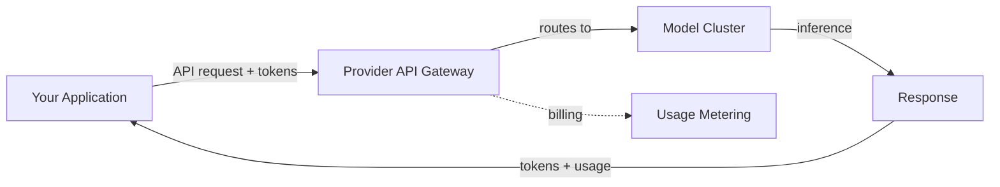
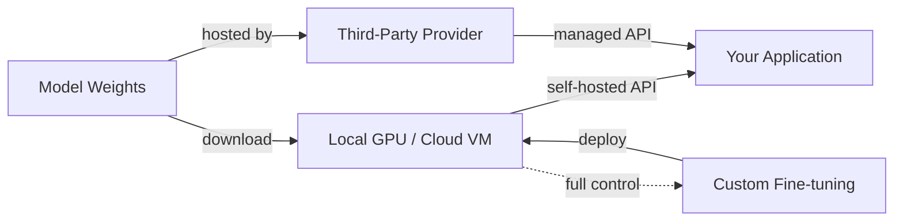

# Provedores de modelos

## Definição

Um provedor de modelos é uma organização que oferece acesso a grandes modelos de linguagem, seja por meio de APIs hospedadas, pesos de código aberto para download, ou ambos. A escolha do provedor molda as capacidades de sua aplicação, a estrutura de custos, a postura de privacidade de dados e a flexibilidade de implantação. Entender o panorama dos provedores é um pré-requisito para qualquer sistema de IA em produção.

O mercado se divide em três categorias. Os **provedores baseados em API** como OpenAI, Anthropic e Google oferecem modelos exclusivamente por meio de APIs gerenciadas — você envia requisições e eles cuidam da infraestrutura de inferência. Os **provedores de pesos abertos** como Meta e Mistral lançam pesos de modelos que você pode baixar e executar em seu próprio hardware ou por meio de hospedagem de terceiros. Os **provedores híbridos** como Mistral e DeepSeek oferecem tanto modelos de pesos abertos quanto acesso comercial à API, dando aos desenvolvedores flexibilidade para escolher com base em suas necessidades.

Escolher um provedor envolve compensações em múltiplas dimensões: qualidade do modelo, preços, tamanho da janela de contexto, capacidades multimodais, privacidade de dados, suporte a ajuste fino e maturidade do ecossistema. Nenhum provedor domina em todos os critérios, razão pela qual a maioria dos sistemas em produção avalia múltiplas opções e às vezes usa diferentes provedores para diferentes tarefas dentro da mesma aplicação.

## Como funciona

### Provedores baseados em API

Os provedores de API hospedam modelos em sua infraestrutura e os expõem por meio de APIs REST. Você se autentica com uma chave de API, envia uma requisição com seu prompt e parâmetros de configuração, e recebe uma resposta. O provedor lida com escalabilidade, alocação de GPU, atualizações de modelos e tempo de atividade. Este é o caminho mais simples para a produção — sem infraestrutura para gerenciar — mas você envia seus dados para um terceiro e paga por token.



### Provedores de pesos abertos

Os provedores de pesos abertos lançam arquivos de modelos (tipicamente no Hugging Face) que você baixa e executa localmente ou em sua infraestrutura na nuvem. Você controla toda a pilha: seleção de hardware, quantização, framework de serviço (vLLM, TGI, llama.cpp) e escalabilidade. Isso oferece máxima privacidade e personalização, mas requer expertise em infraestrutura de ML. Provedores de inferência de terceiros (Together AI, Groq, Fireworks) oferecem um meio-termo — eles hospedam modelos abertos com uma interface de API.



### Escolhendo um provedor

A árvore de decisão depende de suas restrições. Comece com seus requisitos — privacidade de dados, orçamento, latência, qualidade do modelo — e refine a partir daí. Muitas equipes começam com provedores de API para prototipagem e avaliam alternativas de pesos abertos para otimização de custos em produção ou requisitos de soberania de dados.

## Quando usar / Quando NÃO usar

| Usar quando | Evitar quando |
|-------------|---------------|
| **Provedores de API**: prototipagem rápida, sem equipe de infraestrutura de ML, necessidade imediata de modelos de ponta | Os dados não podem sair de sua infraestrutura (setores regulados, dados pessoais) |
| **Pesos abertos**: requisitos de privacidade de dados, controle sobre ajuste fino, otimização de custos em alto volume | Falta de infraestrutura GPU e expertise em ML ops |
| **Modelos abertos hospedados por terceiros**: flexibilidade de modelos abertos sem gerenciar infraestrutura | Necessita de SLAs garantidos e suporte empresarial (use APIs de provedores primários) |
| **Múltiplos provedores**: diferentes tarefas têm diferentes requisitos de qualidade/custo | Seu caso de uso é simples o suficiente para que um provedor cubra tudo |

## Comparações

| Critério | OpenAI | Anthropic | Google Gemini | Meta Llama | Mistral | Cohere | DeepSeek |
|----------|--------|-----------|---------------|------------|---------|--------|----------|
| Acesso ao modelo | Somente API | Somente API | API + Vertex AI | Pesos abertos | Aberto + API | Somente API | Aberto + API |
| Modelo de nível superior | GPT-4o, o3 | Claude Opus/Sonnet | Gemini Ultra/Pro | Llama 3.1 405B | Mistral Large | Command R+ | DeepSeek-V3 |
| Janela de contexto | 128K | 200K | 1M+ | 128K | 128K | 128K | 128K |
| Multimodal | Visão, áudio, geração de imagens | Visão | Visão, áudio, vídeo | Visão (3.2) | Visão | Focado em texto | Focado em texto |
| Especialidade | Propósito geral, ecossistema | Segurança, contexto longo | Multimodal, fundamentação em busca | Pesos abertos, personalização | Eficiência, multilíngue | Embeddings, RAG, reranking | Raciocínio, eficiência de custos |
| Ajuste fino | Ajuste fino por API | Não disponível | Ajuste fino no Vertex AI | Acesso completo aos pesos | Ajuste fino por API | Não disponível | Acesso completo aos pesos |
| Modelo de preços | Por token | Por token | Por token + nível gratuito | Grátis (auto-hospedado) ou terceiros | Por token + modelos gratuitos | Por token | Por token (custo muito baixo) |

## Exemplos de código

### Chamadas de API lado a lado (Python)

```python
# OpenAI
from openai import OpenAI

openai_client = OpenAI()
openai_response = openai_client.chat.completions.create(
    model="gpt-4o",
    messages=[{"role": "user", "content": "Explain RAG in one sentence."}],
)
print("OpenAI:", openai_response.choices[0].message.content)
```

```python
# Anthropic
import anthropic

anthropic_client = anthropic.Anthropic()
anthropic_response = anthropic_client.messages.create(
    model="claude-sonnet-4-20250514",
    max_tokens=256,
    messages=[{"role": "user", "content": "Explain RAG in one sentence."}],
)
print("Anthropic:", anthropic_response.content[0].text)
```

```python
# Google Gemini
import google.generativeai as genai

model = genai.GenerativeModel("gemini-1.5-pro")
gemini_response = model.generate_content("Explain RAG in one sentence.")
print("Gemini:", gemini_response.text)
```

### Interface unificada com LiteLLM (Python)

```python
from litellm import completion

# Same interface, different providers
providers = {
    "OpenAI": "gpt-4o",
    "Anthropic": "claude-sonnet-4-20250514",
    "Gemini": "gemini/gemini-1.5-pro",
}

for name, model in providers.items():
    response = completion(
        model=model,
        messages=[{"role": "user", "content": "Explain RAG in one sentence."}],
    )
    print(f"{name}: {response.choices[0].message.content}")
```

## Recursos práticos

- [Artificial Analysis](https://artificialanalysis.ai/) — Benchmarks independentes de LLM e comparação de preços
- [LiteLLM](https://docs.litellm.ai/) — API unificada para mais de 100 provedores de LLM
- [OpenRouter](https://openrouter.ai/) — Gateway de API único para múltiplos provedores
- [Hugging Face Open LLM Leaderboard](https://huggingface.co/spaces/open-llm-leaderboard/open_llm_leaderboard) — Benchmarks de modelos abertos
- [LMSYS Chatbot Arena](https://chat.lmsys.org/) — Rankings de LLM por avaliação humana cega colaborativa

## Veja também

- [OpenAI](/docs/model-providers/openai)
- [Anthropic](/docs/model-providers/anthropic)
- [Google Gemini](/docs/model-providers/google-gemini)
- [Meta Llama](/docs/model-providers/meta-llama)
- [Mistral](/docs/model-providers/mistral)
- [Cohere](/docs/model-providers/cohere)
- [DeepSeek](/docs/model-providers/deepseek)
- [LLMs](/docs/llms)
- [Infrastructure](/docs/infrastructure)
- [Local inference](/docs/local-inference)
