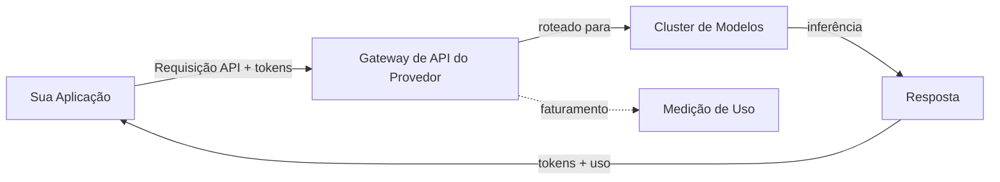
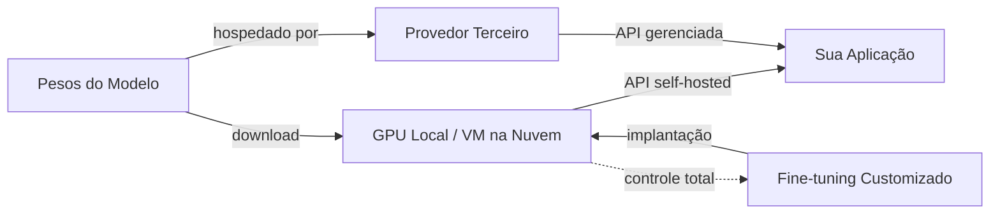

## Definição

Um provedor de modelos é uma organização que oferece acesso a grandes modelos de linguagem, seja por meio de APIs hospedadas, pesos para download ou ambos. A escolha do provedor molda as capacidades da sua aplicação, a estrutura de custos, a postura de privacidade de dados e a flexibilidade de implantação. Entender o panorama de provedores é um pré-requisito para qualquer sistema de IA em produção.

O mercado se divide em três categorias. **Provedores baseados em API** como OpenAI, Anthropic e Google oferecem modelos exclusivamente por meio de APIs gerenciadas — você envia requisições e eles cuidam da infraestrutura de inferência. **Provedores de pesos abertos** como Meta e Mistral disponibilizam pesos de modelos para download e execução em seu próprio hardware ou por hospedagem de terceiros. **Provedores híbridos** como Mistral e DeepSeek oferecem tanto modelos de pesos abertos quanto acesso comercial via API, dando aos desenvolvedores flexibilidade para escolher de acordo com suas necessidades.

Escolher um provedor envolve concessões em múltiplas dimensões: qualidade do modelo, preço, tamanho da janela de contexto, capacidades multimodais, privacidade de dados, suporte a fine-tuning e maturidade do ecossistema. Nenhum único provedor domina em todos os critérios, por isso a maioria dos sistemas em produção avalia múltiplas opções e às vezes usa provedores diferentes para tarefas distintas dentro da mesma aplicação.

## Como funciona

### Provedores baseados em API

Provedores de API hospedam modelos em sua infraestrutura e os expõem por meio de APIs REST. Você se autentica com uma chave de API, envia uma requisição com seu prompt e parâmetros de configuração, e recebe uma resposta. O provedor cuida da escalabilidade, alocação de GPU, atualizações de modelos e disponibilidade. Este é o caminho mais simples para produção — sem infraestrutura para gerenciar — mas você envia seus dados a um terceiro e paga por token.



### Provedores de pesos abertos

Provedores de pesos abertos disponibilizam arquivos de modelos (normalmente no Hugging Face) que você baixa e executa localmente ou em sua infraestrutura de nuvem. Você controla toda a pilha: seleção de hardware, quantização, framework de serviço (vLLM, TGI, llama.cpp) e escalabilidade. Isso oferece máxima privacidade e personalização, mas requer expertise em infraestrutura de ML. Provedores de inferência de terceiros (Together AI, Groq, Fireworks) oferecem um meio-termo — eles hospedam modelos abertos com uma interface de API.



### Escolhendo um provedor

A árvore de decisão depende das suas restrições. Comece pelos requisitos — privacidade de dados, orçamento, latência, qualidade do modelo — e refine a partir daí. Muitas equipes iniciam com provedores de API para prototipagem e avaliam alternativas de pesos abertos para otimização de custos em produção ou requisitos de soberania de dados.

## Quando usar / Quando NÃO usar

| Use quando | Evite quando |
|----------|------------|
| **Provedores de API**: prototipagem rápida, sem equipe de infra de ML, necessidade de modelos de ponta imediatamente | Dados não podem sair da sua infraestrutura (setores regulados, PII) |
| **Pesos abertos**: requisitos de privacidade de dados, necessidade de controle sobre fine-tuning, otimização de custos em alto volume | Falta infraestrutura de GPU e expertise em ML ops |
| **Modelos abertos hospedados por terceiros**: flexibilidade de modelo aberto sem gerenciar infraestrutura | Você precisa de SLAs garantidos e suporte empresarial (use APIs de primeira parte) |
| **Múltiplos provedores**: tarefas diferentes têm requisitos distintos de qualidade/custo | Seu caso de uso é simples o suficiente para um único provedor atender a tudo |

## Comparações

| Critério | OpenAI | Anthropic | Google Gemini | Meta Llama | Mistral | Cohere | DeepSeek |
|----------|--------|-----------|---------------|------------|---------|--------|----------|
| Acesso ao modelo | Somente API | Somente API | API + Vertex AI | Pesos abertos + Llama API | Aberto + API | Somente API | Aberto + API |
| Nível flagship | GPT-5.5 (`gpt-5.5`) | Claude Opus 4.7 (`claude-opus-4-7`) | Gemini 2.5 Pro (`gemini-2.5-pro`) | Llama 4 Maverick (17B ativos / 400B) | Mistral Large 3 (`mistral-large-2512`, 41B ativos / 675B) | Command A (`command-a-03-2025`, 111B) | DeepSeek V4 Pro (`deepseek-v4-pro`) |
| Janela de contexto | 1.050K (GPT-5.5 / GPT-5.4) | 1M (Opus 4.7, Sonnet 4.6); 200K (Haiku 4.5) | 1M (Gemini 2.5 Pro / Flash) | 10M (Scout), 1M (Maverick) | 256K (Mistral Large 3) | 256K (Command A) | 1M (V4 Flash / Pro) |
| Preço de entrada flagship | $5,00/1M (GPT-5.5) | $5,00/1M (Opus 4.7) | $1,25–$2,50/1M (Gemini 2.5 Pro) | Gratuito (self-host) | $0,50/1M (Mistral Large 3) | Não publicado (enterprise) | $0,435/1M cache-miss (V4 Pro) |
| Multimodal | Texto, imagem, áudio, vídeo | Texto, imagem | Texto, imagem, áudio, vídeo | Texto + imagens (até 5) | Texto + imagem (Large 3) | Texto + imagem (Command A Vision) | Somente texto |
| Especialidade | Ecossistema mais amplo, ferramentas para agentes | Segurança, contexto longo, raciocínio | Multimodal, fundamentação com Google Search | Pesos abertos, personalização, contexto enorme | Eficiência, soberania europeia, multilíngue | Embeddings, reranking, RAG empresarial | Raciocínio, custo muito baixo |
| Fine-tuning | Fine-tuning via API | Não disponível | Ajuste no Vertex AI | Acesso completo aos pesos | Pesos abertos LoRA/QLoRA; fine-tuning via API em beta | Não disponível | Acesso completo aos pesos |
| Modelo de preços | Por token | Por token | Por token + nível gratuito | Gratuito (self-host) ou API de terceiros | Por token + pesos abertos gratuitos | Por token (enterprise) | Por token (custo muito baixo) |

## Exemplos de código

### Chamadas de API lado a lado (Python)

```python
# OpenAI
from openai import OpenAI

openai_client = OpenAI()
openai_response = openai_client.chat.completions.create(
    model="gpt-5.4",
    messages=[{"role": "user", "content": "Explain RAG in one sentence."}],
)
print("OpenAI:", openai_response.choices[0].message.content)
```

```python
# Anthropic
import anthropic

anthropic_client = anthropic.Anthropic()
anthropic_response = anthropic_client.messages.create(
    model="claude-sonnet-4-6",
    max_tokens=256,
    messages=[{"role": "user", "content": "Explain RAG in one sentence."}],
)
print("Anthropic:", anthropic_response.content[0].text)
```

```python
# Google Gemini
import google.generativeai as genai

model = genai.GenerativeModel("gemini-2.5-flash")
gemini_response = model.generate_content("Explain RAG in one sentence.")
print("Gemini:", gemini_response.text)
```

### Interface unificada com LiteLLM (Python)

```python
from litellm import completion

# Mesma interface, provedores diferentes
providers = {
    "OpenAI": "gpt-5.4",
    "Anthropic": "claude-sonnet-4-6",
    "Gemini": "gemini/gemini-2.5-flash",
}

for name, model in providers.items():
    response = completion(
        model=model,
        messages=[{"role": "user", "content": "Explain RAG in one sentence."}],
    )
    print(f"{name}: {response.choices[0].message.content}")
```

## Recursos práticos

- [Artificial Analysis](https://artificialanalysis.ai/) — Benchmarks independentes de LLMs e comparação de preços
- [LiteLLM](https://docs.litellm.ai/) — API unificada para mais de 100 provedores de LLM
- [OpenRouter](https://openrouter.ai/) — Gateway de API único para múltiplos provedores
- [Hugging Face Open LLM Leaderboard](https://huggingface.co/spaces/open-llm-leaderboard/open_llm_leaderboard) — Benchmarks de modelos abertos
- [LMSYS Chatbot Arena](https://chat.lmsys.org/) — Rankings de LLMs por avaliação humana cega em crowdsourcing

## Veja também

- [OpenAI](/docs/model-providers/openai)
- [Anthropic](/docs/model-providers/anthropic)
- [Google Gemini](/docs/model-providers/google-gemini)
- [Meta Llama](/docs/model-providers/meta-llama)
- [Mistral](/docs/model-providers/mistral)
- [Cohere](/docs/model-providers/cohere)
- [DeepSeek](/docs/model-providers/deepseek)
- [LLMs](/docs/llms)
- [Infraestrutura](/docs/infrastructure)
- [Inferência local](/docs/local-inference)
