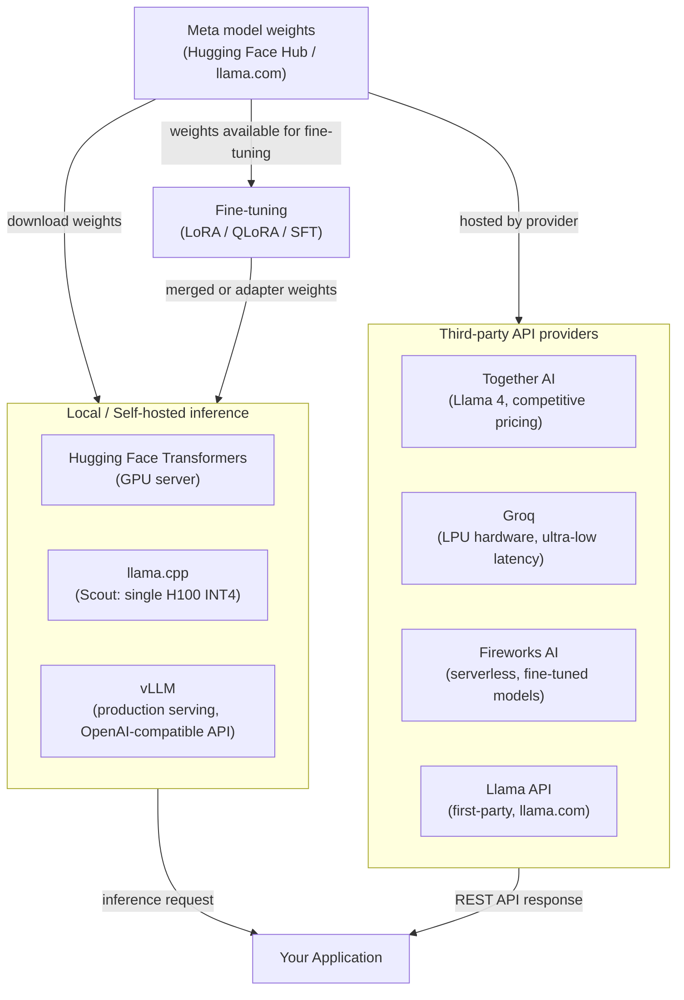

## Definição

O Llama (Large Language Model Meta AI) da Meta é uma família de grandes modelos de linguagem de pesos abertos lançados pela Meta AI Research. Ao contrário de modelos totalmente proprietários distribuídos apenas por uma API paga, os modelos Llama são lançados com pesos que desenvolvedores podem baixar, inspecionar, modificar e redistribuir sob a licença comunitária personalizada da Meta. Isso significa que organizações podem executar inferência inteiramente dentro de sua própria infraestrutura, sem rotear dados por um serviço de nuvem de terceiros — uma vantagem significativa para cargas de trabalho sensíveis à privacidade.

A geração atual é o **Llama 4**, uma família nativa multimodal de Mixture-of-Experts (MoE) anunciada em 2025. O Llama 4 substitui todas as variantes Llama 3.x.

| Modelo | Parâmetros Ativos | Total de Parâmetros | Janela de Contexto | Notas |
|-------|--------------|--------------|----------------|-------|
| Llama 4 Scout | 17B | 109B (16 especialistas) | 10M tokens | Roda em uma única H100 (INT4); pesos abertos |
| Llama 4 Maverick | 17B | 400B (128 especialistas) | 1M tokens | Requer multi-GPU; pesos abertos |
| Llama 4 Behemoth | 288B (ativo) | — | — | Ainda em treinamento em maio de 2026 |

**Capacidades compartilhadas do Llama 4:**
- Nativamente multimodal: texto + até 5 imagens (compreensão de imagens: apenas em inglês)
- Texto multilíngue: árabe, inglês, francês, alemão, hindi, indonésio, italiano, português, espanhol, tagalog, tailandês, vietnamita
- Tool calling, sistemas agênticos, arquitetura MoE
- Corte de conhecimento: agosto de 2024

A Llama API (`llama.com`) fornece acesso hospedado ao Scout e ao Maverick. Os pesos também estão disponíveis no Hugging Face.

> **Descontinuados — não referenciar como atuais:** Llama 3 405B (substituído pelo Maverick); Llama 2 (aposentado); variantes Llama 3.1 e 3.2 diferentes de 8B (superadas).

O espaço de modelos de pesos abertos está na interseção de um debate filosófico e prático: **aberto vs. fechado**. Defensores dos pesos abertos argumentam que transparência, auditabilidade, inovação comunitária e controle de custos superam a conveniência de uma API gerenciada. Críticos apontam que grandes modelos de pesos abertos são caros de servir em escala, exigem expertise de engenharia para implantar e proteger, e que "pesos abertos" não é o mesmo que "código aberto" — os dados de treinamento e a metodologia completa permanecem proprietários. Na prática, a maioria das organizações acaba em uma abordagem híbrida: usando modelos de pesos abertos para cargas de trabalho sensíveis ou de custo elevado enquanto ainda depende de provedores de API fechados para capacidade de ponta.

## Como funciona

### Implantação local — transformers, llama.cpp, vLLM

A forma mais direta de executar modelos Llama é localmente usando o Hugging Face **Transformers**, que fornece uma interface Python unificada sobre centenas de arquiteturas de modelos. Para o Llama 4 Scout, o **llama.cpp** pode executar inferência quantizada em INT4 em uma única H100 com latência aceitável. Para serviço em produção em escala, o **vLLM** é a solução recomendada — ele implementa PagedAttention para gerenciamento eficiente do KV-cache, habilita continuous batching e expõe uma API REST compatível com OpenAI, facilitando substituir o Llama por qualquer integração GPT existente com mínimas mudanças de código.

### Provedores de API de terceiros — Together AI, Groq, Fireworks AI

Para equipes que querem a flexibilidade de modelos de pesos abertos sem o ônus de infraestrutura, vários provedores especializados hospedam modelos Llama via APIs gerenciadas. O **Together AI** oferece modelos Llama 4 com preços por token competitivos e um SDK Python que espelha a interface da OpenAI. O **Groq** executa modelos Llama em hardware LPU (Language Processing Unit) personalizado, entregando latência extremamente baixa, adequada para aplicações interativas. O **Fireworks AI** foca em implantações de modelos ajustados fino e serverless. Esses provedores são particularmente valiosos para trabalhos de prova de conceito, cargas de trabalho de pico ou equipes sem infraestrutura de GPU.

### Llama API (llama.com)

A própria **Llama API** da Meta fornece acesso hospedado de primeira parte ao Llama 4 Scout e Maverick. Ela expõe uma interface compatível com OpenAI, tornando simples usar ferramentas existentes. O Llama 3.3 8B também está disponível para fine-tuning via Llama API.

### Fine-tuning com pesos abertos

Uma das vantagens mais atraentes dos modelos de pesos abertos é o acesso completo ao fine-tuning. Organizações podem adaptar o Llama a tarefas específicas de domínio, requisitos de estilo ou perfis de segurança usando supervised fine-tuning (SFT). Na prática, a maioria dos profissionais usa fine-tuning eficiente em parâmetros via **LoRA** (Low-Rank Adaptation) ou **QLoRA** (LoRA em pesos quantizados), o que reduz os requisitos de memória GPU em 4–10×. Ferramentas como **Hugging Face TRL**, **Axolotl** e **LLaMA-Factory** fornecem loops de treinamento de alto nível para fine-tuning do Llama com mínimo código boilerplate.



## Quando usar / Quando NÃO usar

| Use quando | Evite quando |
|----------|------------|
| Privacidade de dados é primordial — setores regulados, PII, IP confidencial que não pode sair da sua infraestrutura | Você precisa de capacidade de fronteira de ponta em raciocínio complexo de múltiplas etapas em todas as modalidades |
| Controle de custos em alto volume — custos de API por token se acumulam rapidamente; auto-hospedar grandes modelos pode ser significativamente mais barato acima de certos limites de QPS | Falta capacidade de engenharia de ML para gerenciar infraestrutura GPU, manter modelos atualizados e lidar com patches de segurança |
| Você precisa fazer fine-tuning do modelo em dados proprietários para personalizar profundamente o comportamento ou estilo | Você precisa de uma API gerenciada pronta para produção com SLAs, autoescalonamento e zero overhead operacional |
| Você quer auditabilidade completa e a capacidade de inspecionar os pesos do modelo para fins de conformidade ou red-teaming | Sua carga de trabalho exige grounding em tempo real na web ou multimodal nativo com vídeo/áudio (Gemini 2.5 é mais forte aqui) |
| Você quer executar inferência on-device ou na borda sem dependência de rede (Llama 4 Scout em INT4 em uma H100) | Sua equipe está avaliando modelos rapidamente e a velocidade de iteração importa mais que o controle de dados |

## Comparações

| Critério | Meta Llama 4 | OpenAI GPT-5.4 | Mistral (pesos abertos) |
|-----------|-------------|----------------|------------------------|
| Disponibilidade dos pesos | Download de pesos abertos (licença comunitária) | Somente API fechada | Pesos abertos para Mistral Large 3; fechado para alguns |
| Maior tamanho do modelo | 400B total / 17B ativo (Maverick, MoE) | Não divulgado | 675B total / 41B ativo (Mistral Large 3, MoE) |
| Auto-hospedagem | Totalmente suportada; llama.cpp, vLLM, Transformers | Não possível | Totalmente suportada; mesmo toolchain que Llama |
| Opções de API gerenciada | Llama API, Together AI, Groq, Fireworks, AWS Bedrock | OpenAI direto, Azure OpenAI | La Plateforme (mistral.ai), Together AI |
| Fine-tuning | Sim — LoRA, QLoRA, SFT nos pesos completos | API de fine-tuning apenas para modelos aplicáveis | Sim — mesmo toolchain de pesos abertos |
| Multimodal | Texto + imagens (até 5 imagens por requisição) | Texto + imagem, áudio, vídeo | Texto + imagem (Mistral Large 3) |
| Arquitetura | MoE (16 ou 128 especialistas) | Densa (não divulgado) | MoE (41B ativo / 675B total) |
| Soberania de dados europeia | Possível com auto-hospedagem em região da UE | Limitado (apenas regiões da UE no Azure) | Provedor europeu nativo (sede em Paris) |

## Exemplos de código

```python
# meta_llama_examples.py
# Demonstrates two deployment paths:
#   1. Local inference with Hugging Face Transformers (Llama 4 Scout)
#   2. Third-party API via Together AI (OpenAI-compatible interface)
#
# pip install transformers accelerate torch together

# ─────────────────────────────────────────────────────────────────────────────
# Path 1: Local inference with Hugging Face Transformers
# Llama 4 Scout runs on a single NVIDIA H100 in INT4 quantization.
# ─────────────────────────────────────────────────────────────────────────────
from transformers import AutoTokenizer, AutoModelForCausalLM
import torch


def local_llama_inference(prompt: str, model_id: str = "meta-llama/Llama-4-Scout-17B-16E-Instruct"):
    """
    Run Llama 4 Scout locally.
    Requires a Hugging Face token with access granted.
    Set HF_TOKEN environment variable or pass token= to from_pretrained.
    """
    tokenizer = AutoTokenizer.from_pretrained(model_id)
    model = AutoModelForCausalLM.from_pretrained(
        model_id,
        torch_dtype=torch.bfloat16,
        device_map="auto",          # automatically distribute across available GPUs
        # load_in_4bit=True,        # uncomment for INT4 / low VRAM inference
    )

    # Llama 4 instruct models use a chat template
    messages = [
        {"role": "system", "content": "You are a helpful data science assistant."},
        {"role": "user", "content": prompt},
    ]
    input_ids = tokenizer.apply_chat_template(
        messages,
        add_generation_prompt=True,
        return_tensors="pt",
    ).to(model.device)

    outputs = model.generate(
        input_ids,
        max_new_tokens=512,
        temperature=0.6,
        top_p=0.9,
        do_sample=True,
        eos_token_id=tokenizer.eos_token_id,
    )

    # Decode only the generated tokens (skip the input)
    generated = outputs[0][input_ids.shape[-1]:]
    return tokenizer.decode(generated, skip_special_tokens=True)


# ─────────────────────────────────────────────────────────────────────────────
# Path 2: Together AI — managed Llama API (OpenAI-compatible)
# Requires a Together AI account: https://api.together.ai
# pip install together
# ─────────────────────────────────────────────────────────────────────────────
from together import Together


def together_ai_inference(prompt: str):
    """
    Call Llama 4 Maverick via Together AI's managed inference API.
    Together AI uses an OpenAI-compatible interface, so the openai SDK
    also works — just point base_url at https://api.together.xyz/v1.
    """
    client = Together(api_key="YOUR_TOGETHER_API_KEY")

    response = client.chat.completions.create(
        model="meta-llama/Llama-4-Maverick-17B-128E-Instruct-FP8",
        messages=[
            {"role": "system", "content": "You are a helpful data science assistant."},
            {"role": "user", "content": prompt},
        ],
        max_tokens=512,
        temperature=0.6,
        top_p=0.9,
    )

    return response.choices[0].message.content


# ─────────────────────────────────────────────────────────────────────────────
# Path 3: vLLM — production-grade OpenAI-compatible server (run separately)
# Start server: vllm serve meta-llama/Llama-4-Scout-17B-16E-Instruct --port 8000
# Then query it as if it were the OpenAI API:
# ─────────────────────────────────────────────────────────────────────────────
from openai import OpenAI


def vllm_server_inference(prompt: str, base_url: str = "http://localhost:8000/v1"):
    """
    Query a locally running vLLM server.
    vLLM exposes an OpenAI-compatible API at /v1/chat/completions.
    """
    client = OpenAI(api_key="not-needed-for-local", base_url=base_url)

    response = client.chat.completions.create(
        model="meta-llama/Llama-4-Scout-17B-16E-Instruct",
        messages=[{"role": "user", "content": prompt}],
        max_tokens=256,
        temperature=0.7,
    )
    return response.choices[0].message.content


# ─────────────────────────────────────────────────────────────────────────────
if __name__ == "__main__":
    test_prompt = "Explain the bias-variance tradeoff in machine learning."

    # Uncomment to run local inference (requires GPU + HF access)
    # print("=== Local (Transformers) ===")
    # print(local_llama_inference(test_prompt))

    print("=== Together AI ===")
    print(together_ai_inference(test_prompt))

    # Uncomment if you have a vLLM server running
    # print("=== vLLM Server ===")
    # print(vllm_server_inference(test_prompt))
```

## Recursos práticos

- [Post do blog Llama 4 (Meta)](https://ai.meta.com/blog/llama-4-multimodal-intelligence/) — Anúncio e visão geral técnica do Llama 4 Scout, Maverick e Behemoth.
- [Cartões de modelo Llama 4](https://www.llama.com/docs/model-cards-and-prompt-formats/llama4/) — Cartões oficiais de modelo, instruções de download e licença comunitária para Llama 4.
- [Modelos Llama no Hugging Face](https://huggingface.co/meta-llama) — Pesos de modelos, arquivos de tokenizadores e fine-tunes da comunidade; requer conta Hugging Face com acesso concedido.
- [llama.cpp](https://github.com/ggerganov/llama.cpp) — Motor de inferência leve em C/C++ com quantização GGUF; a ferramenta padrão para implantação em CPU e GPU de consumidor.
- [Documentação Together AI](https://docs.together.ai/) — Referência da Llama API gerenciada, preços e guias de fine-tuning para modelos de pesos abertos hospedados.
- [Documentação vLLM](https://docs.vllm.ai/) — Framework de serviço em produção com PagedAttention, continuous batching e servidor compatível com OpenAI.

## Veja também

- [Provedores de Modelos](/docs/model-providers)
- [Inferência Local](/docs/local-inference)
- [Infraestrutura](/docs/infrastructure)
- [LLMs — Fine-tuning](/docs/llms/fine-tuning)
- [Comparação Meta Llama → Mistral](/docs/model-providers/mistral)
