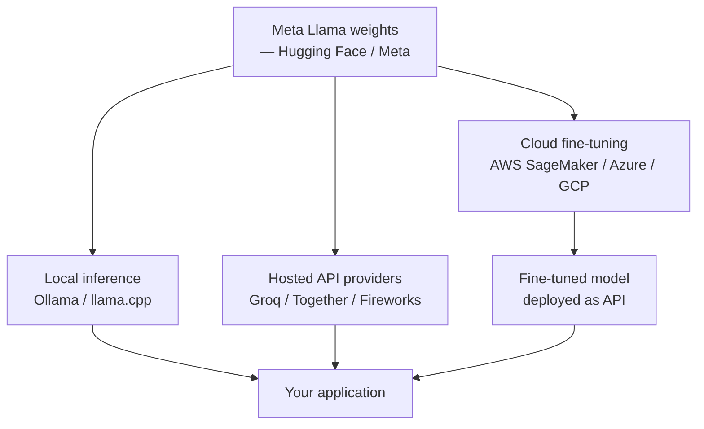

## Definição

**Meta Llama** é a família de modelos de linguagem de pesos abertos da Meta AI, lançada sob licenças que geralmente permitem uso comercial com certas restrições. Ao contrário dos modelos fechados da Anthropic ou do OpenAI, os modelos Llama estão disponíveis como downloads de pesos — você pode executá-los em seu próprio hardware, ajustá-los em seus próprios dados ou implantá-los atrás de sua própria API sem passar por um serviço de terceiros. Esse modelo de distribuição de "pesos abertos" (em oposição a "código aberto" no sentido pleno, já que os dados de treinamento geralmente não são publicados) tornou-se uma alternativa importante à IA generativa fechada.

A linhagem Llama a partir de 2025 inclui: **Llama 2** (os modelos originais 7B, 13B, 70B lançados em 2023 com licença comercial), **Llama 3** (modelos 8B e 70B lançados em abril de 2024 com janela de contexto melhorada de 8K tokens e conjuntos de dados de treinamento de maior qualidade), **Llama 3.1** (modelos 8B, 70B e 405B com janelas de contexto de 128K), **Llama 3.2** (adição de modelos de visão e pequenos modelos edge de 1B/3B), e **Llama 3.3** (melhorias no 70B). A Meta também lança variantes especializadas: **Code Llama** (otimizado para geração de código) e **Llama Guard** (classificação de segurança de conteúdo). Os modelos estão disponíveis no [Hugging Face](https://huggingface.co/meta-llama), [Meta AI](https://ai.meta.com/llama/) e via provedores de nuvem como AWS, Azure e Google Cloud.

## Como funciona

### Pesos abertos e ecossistema de implantação

Ao contrário dos modelos de API fechados, você interage com o Llama baixando os pesos do modelo e executando a inferência localmente ou em sua própria infraestrutura. Existem várias caminhos:



**Inferência local**: Ferramentas como [Ollama](https://ollama.com/) e [llama.cpp](https://github.com/ggerganov/llama.cpp) permitem executar modelos Llama em um MacBook, PC de mesa ou servidor Linux com GPU NVIDIA. O Ollama baixa e gerencia modelos quantizados; o llama.cpp fornece compilação C++ multiplataforma para implantação bare-metal. Modelos menores (8B quantizado) funcionam em hardware de consumo; modelos maiores requerem GPUs profissionais ou multi-GPU.

**Provedores hospedados**: Groq, Together AI, Fireworks AI e outros oferecem endpoints de inferência Llama que imitam o formato da API do OpenAI, permitindo integração de substituição direta em código existente.

**Fine-tuning**: Os pesos abertos permitem fine-tuning completo ou baseado em LoRA (Low-Rank Adaptation) em seus próprios dados usando frameworks como Hugging Face TRL, Unsloth ou torchtune da Meta. Esta é uma vantagem fundamental sobre os modelos fechados.

### Quantização e implantação edge

Os modelos Llama podem ser quantizados para reduzir os requisitos de memória com degradação mínima de desempenho. GGUF (formato usado pelo llama.cpp) suporta quantização de 4 bits, 5 bits e 8 bits. Um Llama 3.1 8B quantizado em 4 bits requer ~5 GB de RAM e pode ser executado em um Mac Apple Silicon série M.

## Quando usar / Quando NÃO usar

| Usar Llama quando | Evitar ou considerar alternativas quando |
|-------------------|------------------------------------------|
| A privacidade dos dados é primordial — os dados não saem de sua infraestrutura | Você precisa do melhor desempenho absoluto em tarefas de raciocínio complexas — modelos fechados de ponta ainda superam o Llama |
| Você precisa de fine-tuning em um domínio proprietário ou voz de marca específica | Você está construindo um protótipo rápido — as APIs fechadas têm menos atrito operacional |
| Os custos em grande escala são proibitivos nas APIs comerciais | Você não tem experiência em infraestrutura para implantar e manter modelos |
| Você opera em regiões ou setores com requisitos rígidos de residência de dados | A latência é crítica e você não pode pagar o overhead de inferência local |
| Você quer inspecionar, modificar ou redistribuir os pesos do modelo | Seu caso de uso requer recursos multimodais avançados — o Llama tem suporte limitado em comparação com o GPT-4o |

## Comparações

| Critérios | Llama 3.1 70B | GPT-4o | Claude 3.7 Sonnet | Mistral Large |
|-----------|---------------|--------|-------------------|---------------|
| Disponibilidade dos pesos | Sim (licença comercial) | Não | Não | Alguns modelos (Mistral 7B) |
| Janela de contexto | 128K | 128K | 200K | 128K |
| Melhor para | Fine-tuning, auto-hospedagem | Multimodal, agentes | Documentos longos, segurança | Eficiência, multilíngue |
| Preço (hospedado) | ~$0,9/1M tokens (Together) | ~$2,5/1M tokens | ~$3/1M tokens | ~$2/1M tokens |
| Inferência local | Sim | Não | Não | Sim (modelos abertos) |
| Pontuação MMLU | ~82% (70B) | ~88% | ~88% | ~83% |

## Exemplos de código

### Inferência local com Ollama

```python
# Local inference with Ollama
# Install Ollama from https://ollama.com, then: ollama pull llama3.1

import requests

def chat_ollama(prompt: str, model: str = "llama3.1") -> str:
    response = requests.post(
        "http://localhost:11434/api/generate",
        json={
            "model": model,
            "prompt": prompt,
            "stream": False,
        },
    )
    return response.json()["response"]

if __name__ == "__main__":
    answer = chat_ollama("Explain transformer attention in two sentences.")
    print(answer)
```

### API Llama via Together AI (compatível com OpenAI)

```python
# Llama via Together AI — OpenAI-compatible endpoint
# pip install openai

import os
from openai import OpenAI

client = OpenAI(
    api_key=os.environ["TOGETHER_API_KEY"],
    base_url="https://api.together.xyz/v1",
)

response = client.chat.completions.create(
    model="meta-llama/Meta-Llama-3.1-70B-Instruct-Turbo",
    messages=[
        {"role": "system", "content": "You are a concise technical assistant."},
        {"role": "user", "content": "What is LoRA fine-tuning and when should I use it?"},
    ],
    temperature=0.3,
    max_tokens=256,
)
print(response.choices[0].message.content)
```

### Fine-tuning LoRA com Hugging Face TRL

```python
# LoRA fine-tuning with Hugging Face TRL
# pip install transformers trl peft datasets accelerate bitsandbytes

from datasets import load_dataset
from transformers import AutoModelForCausalLM, AutoTokenizer, BitsAndBytesConfig
from peft import LoraConfig
from trl import SFTTrainer, SFTConfig
import torch

model_name = "meta-llama/Meta-Llama-3.1-8B-Instruct"

# Load in 4-bit quantization
bnb_config = BitsAndBytesConfig(
    load_in_4bit=True,
    bnb_4bit_quant_type="nf4",
    bnb_4bit_compute_dtype=torch.bfloat16,
)
model = AutoModelForCausalLM.from_pretrained(
    model_name, quantization_config=bnb_config, device_map="auto"
)
tokenizer = AutoTokenizer.from_pretrained(model_name)
tokenizer.pad_token = tokenizer.eos_token

# LoRA configuration
lora_config = LoraConfig(
    r=16,
    lora_alpha=32,
    target_modules=["q_proj", "v_proj"],
    lora_dropout=0.05,
    bias="none",
    task_type="CAUSAL_LM",
)

# Small demo dataset
dataset = load_dataset("json", data_files="train.jsonl", split="train")

training_args = SFTConfig(
    output_dir="./llama-finetuned",
    num_train_epochs=1,
    per_device_train_batch_size=2,
    gradient_accumulation_steps=4,
    learning_rate=2e-4,
    fp16=True,
    max_seq_length=512,
)

trainer = SFTTrainer(
    model=model,
    args=training_args,
    train_dataset=dataset,
    peft_config=lora_config,
)
trainer.train()
trainer.save_model()
```

## Recursos práticos

- [Site oficial Meta Llama](https://ai.meta.com/llama/) — Downloads oficiais de modelos, documentação e contrato de licença
- [Modelos Llama no Hugging Face](https://huggingface.co/meta-llama) — Hub para pesos, cartões de modelo e integrações da comunidade
- [Ollama](https://ollama.com/) — A maneira mais fácil de executar o Llama localmente no Mac, Windows ou Linux
- [llama.cpp](https://github.com/ggerganov/llama.cpp) — Inferência C++ multiplataforma com suporte a quantização para implantação bare-metal
- [Hugging Face TRL](https://huggingface.co/docs/trl/index) — Fine-tuning supervisionado, RLHF e fine-tuning DPO para modelos Llama

## Veja também

- [Provedores de modelos](/docs/model-providers)
- [OpenAI](/docs/model-providers/openai)
- [Mistral AI](/docs/model-providers/mistral)
- [Engenharia de prompts](/docs/prompt-engineering)
- [Ajuste fino](/docs/llms/fine-tuning)
- [MLOps](/docs/mlops)
