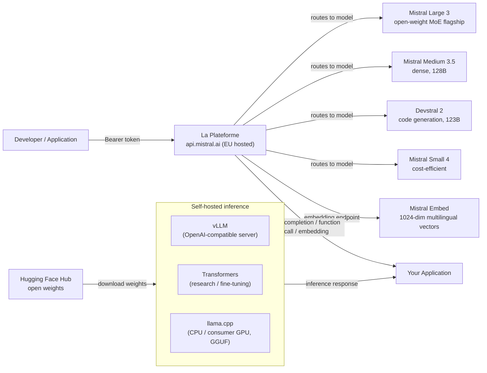

## Definição

A Mistral AI é uma startup francesa de IA fundada em 2023 que rapidamente se estabeleceu como uma das players mais influentes no ecossistema europeu de IA. A filosofia definidora da empresa é uma **abordagem dual**: lançar modelos de pesos abertos eficientes para a comunidade de pesquisa e o ecossistema de desenvolvedores, enquanto simultaneamente oferece uma plataforma de API comercial (**La Plateforme**) com modelos premium e recursos empresariais. Essa combinação tornou a Mistral particularmente popular entre desenvolvedores que querem experimentar livremente antes de se comprometer com uma implantação paga, e com empresas europeias que buscam um provedor de IA soberano com infraestrutura compatível com o GDPR hospedada em data centers da UE.

Em maio de 2026, a linha de modelos atual é construída em torno de grandes arquiteturas Mixture-of-Experts (MoE) e densas:

| Modelo | API Model ID | Janela de Contexto | Arquitetura | Entrada ($/1M) | Saída ($/1M) |
|-------|-------------|----------------|--------------|--------------|---------------|
| Mistral Large 3 | `mistral-large-2512` | 256K tokens | 41B ativo / 675B total (MoE) | $0,50 | $1,50 |
| Mistral Medium 3.5 | `mistral-medium-3-5` | 256K tokens | 128B denso | — | — |
| Devstral 2 | `devstral-2512` | 256K tokens | 123B denso | — | — |
| Mistral Small 4 | `mistral-small-2603` | 256K tokens | — | — | — |
| Ministral 14B | `ministral-14b-2512` | — | 14B | — | — |
| Ministral 8B | `ministral-8b-2512` | — | 8B | — | — |
| Ministral 3B | `ministral-3b-2512` | — | 3B | — | — |

Modelos especializados incluem **Voxtral TTS** (`voxtral-tts-2603`) para texto em fala com clonagem de voz, **Codestral** para geração de código, **OCR 3** para OCR de documentos e **Mistral Moderation 2** (`mistral-moderation-2603`) para moderação de conteúdo e detecção de jailbreak.

> **Descontinuados — não referenciar:** Mistral 7B (substituído pelo Mistral Small 4); Mixtral 8x7B e 8x22B (substituídos pelo Mistral Large 3); versões mais antigas do Mistral Small (descontinuadas em novembro de 2025); Mistral Large 2.0 (`mistral-large-2407`, superado pelo Mistral Large 3).

Os pontos fortes da Mistral se concentram em eficiência, desempenho multilíngue (particularmente em idiomas europeus — francês, espanhol, alemão, italiano) e uma API amigável ao desenvolvedor que segue de perto a interface da OpenAI. A empresa participa ativamente das discussões sobre a Lei de IA da UE e se posiciona como uma alternativa responsável e europeia às APIs de laboratórios de fronteira baseados nos EUA.

## Como funciona

### API La Plateforme

La Plateforme (`api.mistral.ai`) é a API de inferência gerenciada da Mistral, construída em torno da interface de chat completions da OpenAI. As requisições são estruturadas como `{"model": "...", "messages": [...]}` — qualquer biblioteca cliente construída para a API OpenAI pode ser redirecionada com uma única mudança de `base_url`. A API serve tanto modelos comerciais proprietários quanto modelos de pesos abertos. A autenticação usa tokens Bearer. La Plateforme é hospedada em data centers europeus, tornando-a uma escolha natural para organizações com requisitos de residência de dados na UE.

### Modelos de pesos abertos

O Mistral Large 3 está disponível como modelo de pesos abertos sob uma Licença MIT Modificada, distribuído via Hugging Face. Ele pode ser auto-hospedado usando o toolchain padrão de Transformers, vLLM ou llama.cpp (formato GGUF). A arquitetura MoE (41B ativo / 675B total, 256K de contexto) torna viável servir com menor custo computacional do que um modelo denso de qualidade equivalente. Mistral Medium 3.5 e Devstral 2 (ambos densos) também são de pesos abertos.

### Function calling

A Mistral suporta function calling estruturado (também chamado de tool use) tanto nos modelos instruct de pesos abertos quanto em todos os modelos da La Plateforme. A interface espelha o parâmetro `tools` da OpenAI: você passa uma lista de definições de ferramentas definidas por JSON Schema, o modelo retorna um array `tool_calls` especificando qual função invocar e com quais argumentos, sua aplicação executa a função e o resultado é retornado como uma mensagem de role `tool` para continuar a conversa.

### Embeddings

La Plateforme fornece um endpoint de embedding de texto (`/v1/embeddings`) alimentado pelo Mistral Embed, um modelo de embedding dedicado que produz vetores densos de 1024 dimensões. O modelo de embedding se destaca em tarefas de similaridade semântica, recuperação e classificação em múltiplos idiomas europeus. A interface é idêntica à API de embeddings da OpenAI.



## Quando usar / Quando NÃO usar

| Use quando | Evite quando |
|----------|------------|
| Você precisa de residência de dados na UE e infraestrutura de IA compatível com o GDPR de forma nativa | Você exige a capacidade absoluta mais alta em raciocínio complexo de múltiplos passos — o Mistral Large 3 é forte, mas pode ficar atrás dos melhores modelos fechados nos benchmarks mais difíceis |
| Você quer uma API compatível com OpenAI com custo mínimo de migração de integrações GPT existentes | Você precisa de um ecossistema extenso de fine-tunes de terceiros e suporte da comunidade (o Meta Llama tem uma comunidade aberta maior) |
| A eficiência importa — o MoE do Mistral Large 3 (41B parâmetros ativos) entrega alta qualidade com menor custo computacional ativo do que modelos densos de desempenho equivalente | Sua carga de trabalho requer grounding em tempo real na web ou endpoints de geração de imagens nativos |
| Idiomas europeus multilíngues (francês, espanhol, alemão, italiano) são fundamentais para seu caso de uso | Você precisa de inferência on-device / edge com modelos abaixo de 1B de parâmetros |
| Você quer auto-hospedar um modelo de pesos abertos sob licença permissiva (MIT Modificada) e potencialmente fazer fine-tuning em dados proprietários | Sua carga de trabalho requer I/O de áudio extenso além de TTS |

## Comparações

| Critério | Mistral AI | Meta Llama 4 | OpenAI GPT-5.4 |
|-----------|-----------|-------------|----------------|
| Disponibilidade dos pesos | Aberto para Mistral Large 3, Medium 3.5, Devstral 2; alguns fechados | Aberto para todos os tamanhos lançados | Somente API fechada |
| Localização do provedor de API | UE (Paris); nativo GDPR | Hosts de terceiros baseados nos EUA (Together, Groq) | EUA (regiões UE do Azure disponíveis) |
| Arquitetura MoE | Sim (Mistral Large 3: 41B ativo / 675B total) | Sim (Llama 4 Scout/Maverick) | Não divulgado |
| Function calling | Tool use completo em todos os modelos instruct/API | Sim (Llama 4) | Sim (maduro, mais documentado) |
| Multilíngue (idiomas da UE) | Forte — objetivo central de design | Bom, mas ênfase de treinamento centrada nos EUA | Forte em todos os principais idiomas |
| Suporte a fine-tuning | Pesos abertos: LoRA/QLoRA; fine-tuning via API em beta | Pesos abertos: fine-tuning completo disponível | API de fine-tuning para modelos aplicáveis |
| API de embedding | Mistral Embed (1024 dim, multilíngue) | Não disponível via Meta diretamente | text-embedding-3-small/large |
| Janela de contexto | 256K tokens (Mistral Large 3) | 10M (Scout), 1M (Maverick) | 1.050K tokens |

## Prós e contras

| Prós | Contras |
|------|------|
| API hospedada na UE com forte posicionamento GDPR; atrai clientes empresariais europeus | Ecossistema comunitário menor e menos fine-tunes da comunidade em comparação com Llama |
| Interface compatível com OpenAI minimiza esforço de migração | Janela de contexto do Mistral Large 3 (256K) é menor que os 10M do Llama 4 Scout |
| Lançamentos de pesos abertos genuinamente úteis sob licença MIT Modificada permissiva | Preços de muitos modelos mais novos (Medium 3.5, Devstral 2, Small 4) não são listados publicamente |
| Arquitetura MoE (Mistral Large 3) entrega alta qualidade com menor custo de parâmetros ativos | Sem geração nativa de imagem/vídeo em modelos prontos para produção |

## Exemplos de código

```python
# mistral_examples.py
# Demonstrates chat completion and function calling with the mistralai Python SDK.
# pip install mistralai

import os
import json
from mistralai import Mistral

# ── Configuration ─────────────────────────────────────────────────────────────
# Get your API key at: https://console.mistral.ai/api-keys
# Set it with: export MISTRAL_API_KEY="..."
client = Mistral(api_key=os.environ["MISTRAL_API_KEY"])


# ── 1. Chat completion ─────────────────────────────────────────────────────────
def chat_completion_example():
    """Standard multi-turn chat with Mistral Large 3."""
    response = client.chat.complete(
        model="mistral-large-2512",
        messages=[
            {
                "role": "system",
                "content": (
                    "You are a senior machine learning engineer. "
                    "Provide concise, technically accurate answers."
                ),
            },
            {
                "role": "user",
                "content": "What are the key differences between MoE and dense transformer architectures?",
            },
        ],
        temperature=0.4,
        max_tokens=512,
    )

    print("=== Chat Completion ===")
    print(response.choices[0].message.content)
    print(f"\nModel : {response.model}")
    print(f"Usage : {response.usage}")


# ── 2. Function calling ────────────────────────────────────────────────────────
def function_calling_example():
    """
    Mistral function calling (tool use).
    The model decides which tool to call and with what arguments.
    Your application executes the function and returns the result.
    """
    # Define available tools with JSON Schema
    tools = [
        {
            "type": "function",
            "function": {
                "name": "get_model_benchmark",
                "description": (
                    "Retrieves benchmark scores for a specified language model "
                    "on a given benchmark suite."
                ),
                "parameters": {
                    "type": "object",
                    "properties": {
                        "model_name": {
                            "type": "string",
                            "description": "The name of the model, e.g. 'mistral-large-2512'",
                        },
                        "benchmark": {
                            "type": "string",
                            "enum": ["MMLU", "HumanEval", "GSM8K", "HellaSwag"],
                            "description": "The benchmark suite to query.",
                        },
                    },
                    "required": ["model_name", "benchmark"],
                },
            },
        }
    ]

    # First turn — model decides to call a tool
    messages = [
        {
            "role": "user",
            "content": "What is Mistral Large 3's score on the MMLU benchmark?",
        }
    ]

    response = client.chat.complete(
        model="mistral-large-2512",
        messages=messages,
        tools=tools,
        tool_choice="auto",
    )

    assistant_message = response.choices[0].message
    print("=== Function Calling — Step 1: model requests tool call ===")
    print(f"Tool calls: {assistant_message.tool_calls}")

    # Simulate executing the tool
    if assistant_message.tool_calls:
        tool_call = assistant_message.tool_calls[0]
        function_args = json.loads(tool_call.function.arguments)
        print(f"\nExecuting: {tool_call.function.name}({function_args})")

        # Simulated function result
        tool_result = {
            "model": function_args["model_name"],
            "benchmark": function_args["benchmark"],
            "score": 84.0,
            "source": "Mistral AI official benchmarks",
        }

        # Second turn — return the tool result and get the final response
        messages.append({"role": "assistant", "content": None, "tool_calls": assistant_message.tool_calls})
        messages.append({
            "role": "tool",
            "tool_call_id": tool_call.id,
            "content": json.dumps(tool_result),
        })

        final_response = client.chat.complete(
            model="mistral-large-2512",
            messages=messages,
            tools=tools,
        )

        print("\n=== Function Calling — Step 2: final answer ===")
        print(final_response.choices[0].message.content)


# ── 3. Embeddings ──────────────────────────────────────────────────────────────
def embeddings_example(texts: list[str]):
    """
    Generate multilingual embeddings with Mistral Embed.
    Returns 1024-dimensional dense vectors suitable for semantic search and RAG.
    """
    response = client.embeddings.create(
        model="mistral-embed",
        inputs=texts,
    )

    print("\n=== Embeddings ===")
    for i, embedding_obj in enumerate(response.data):
        vec = embedding_obj.embedding
        print(f"Text    : {texts[i][:60]}...")
        print(f"Dims    : {len(vec)}")
        print(f"First 5 : {vec[:5]}\n")


# ── Entry point ────────────────────────────────────────────────────────────────
if __name__ == "__main__":
    chat_completion_example()
    function_calling_example()
    embeddings_example([
        "L'intelligence artificielle transforme l'industrie.",
        "Machine learning models require careful evaluation.",
        "Die Verarbeitung natürlicher Sprache verbessert sich rasant.",
    ])
```

## Recursos práticos

- [Documentação Mistral AI](https://docs.mistral.ai/) — Referência completa da API cobrindo chat, embeddings, function calling, fine-tuning e todos os modelos disponíveis.
- [Cartão de modelo Mistral Large 3](https://docs.mistral.ai/models/mistral-large-3-25-12) — Cartão oficial para o Mistral Large 3 (`mistral-large-2512`).
- [Changelog Mistral](https://docs.mistral.ai/getting-started/changelog/) — Histórico de lançamentos e atualizações de modelos.
- [Console La Plateforme](https://console.mistral.ai/) — Gerenciamento de chaves de API, dashboards de uso e playground de modelos para testes interativos.
- [Modelos Mistral no Hugging Face](https://huggingface.co/mistralai) — Pesos oficiais dos modelos para Mistral Large 3, Medium 3.5, Devstral 2 e variantes Ministral.
- [SDK Python mistralai no PyPI](https://pypi.org/project/mistralai/) — Código-fonte do SDK, changelog e exemplos de código para todos os recursos da API.

## Veja também

- [Provedores de Modelos](/docs/model-providers)
- [Meta Llama](/docs/model-providers/meta-llama)
- [Inferência Local](/docs/local-inference)
- [RAG — Embeddings](/docs/rag/embeddings)
