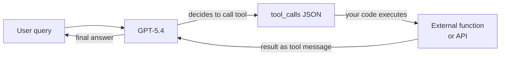

## Definição

**OpenAI** é uma empresa de pesquisa em IA e plataforma para desenvolvedores sediada em San Francisco. Fundada em 2015 e amplamente conhecida pelo lançamento do ChatGPT no final de 2022, a OpenAI opera uma das APIs de modelos mais amplamente usadas do setor. A plataforma oferece aos desenvolvedores acesso programático a uma família de modelos abrangendo linguagem, visão, áudio e geração de imagens — tornando-a uma solução completa para a maioria dos casos de uso de IA generativa.

A linha de modelos da OpenAI em maio de 2026 é centrada na **família GPT-5.x**. **GPT-5.5** (`gpt-5.5`) é o modelo flagship com janela de contexto de 1.050.000 tokens a $5,00/$30,00 por 1M de tokens (entrada/saída). **GPT-5.4** (`gpt-5.4`) é o nível intermediário equilibrado a $2,50/$15,00 por 1M de tokens com o mesmo contexto de 1M. **GPT-5.4 mini** (`gpt-5.4-mini`) é a variante otimizada para custo a $0,75/$1,25 por 1M de tokens com janela de contexto de 400K. Para geração de imagens, **GPT Image 2** (`gpt-image-2`) e GPT Image 1.5 substituem a série DALL-E aposentada. **Sora 2** cuida da geração de vídeo. **GPT Realtime 2** fornece I/O de áudio em tempo real.

> Nota: GPT-4o, o1, o3-mini, DALL-E 2/3 e GPT-3.5 Turbo estão todos programados para encerramento completo em **2026-10-23** e não devem ser usados em novas integrações.

De uma perspectiva de plataforma, a OpenAI oferece uma API em camadas com preços baseados em uso, um Playground para testes interativos, uma Batch API para inferência assíncrona em lote com 50% de redução de custo, fine-tuning para modelos aplicáveis e um framework Evals para avaliação sistemática de modelos. O SDK Python (`openai`) e um SDK TypeScript/Node.js são as principais bibliotecas clientes.

## Como funciona

### API de chat completions

O endpoint de chat completions (`POST /v1/chat/completions`) é o núcleo da plataforma OpenAI. Você envia um array de mensagens com roles (`system`, `user`, `assistant`) e recebe uma completação. A mensagem `system` define a persona e restrições do assistente; mensagens `user` carregam a entrada do usuário; mensagens `assistant` representam turnos anteriores do modelo para conversas de múltiplos turnos. Streaming é suportado via server-sent events para que a resposta possa ser exibida token por token. Temperatura e top-p controlam a aleatoriedade da resposta; `max_tokens` limita o comprimento da saída.

GPT-5.4 e GPT-5.5 suportam cinco modos de raciocínio — `none`, `low`, `medium`, `high` e `xhigh` — permitindo trocar computação por qualidade de raciocínio.

> **Nota sobre preços de contexto longo:** Entradas acima de 272K tokens no GPT-5.5 incorrem em sobretaxa de 2× entrada / 1,5× saída. Preço de entrada em cache: $0,50/1M (GPT-5.5), $0,25/1M (GPT-5.4).

```mermaid
flowchart LR
  Client[Client app] -->|POST messages array| ChatAPI[/v1/chat/completions]
  ChatAPI -->|model routing| Selector{Model\nselector}
  Selector -->|flagship| GPT55[GPT-5.5]
  Selector -->|balanced| GPT54[GPT-5.4]
  Selector -->|cost-optimized| Mini[GPT-5.4 mini]
  GPT55 -->|stream or complete| Resp[JSON response]
  GPT54 --> Resp
  Mini --> Resp
  Resp --> Client
```

### Function calling e ferramentas

O function calling (também chamado de "tool use") permite que o modelo invoque ferramentas externas produzindo JSON estruturado em vez de texto livre. Você declara esquemas de ferramentas na requisição; o modelo decide quando chamar uma ferramenta e preenche seus argumentos. Seu código executa a função e retorna o resultado como uma mensagem `tool`; o modelo então usa esse resultado para produzir sua resposta final. Esta é a base da maioria dos frameworks de agentes: o modelo atua como uma camada de raciocínio e roteamento enquanto a computação real acontece no seu código.

GPT-5.4 e GPT-5.5 também suportam ferramentas integradas: busca na web, busca em arquivos, interpretador de código, computer use e geração de imagens.



### API de embeddings

O endpoint de embeddings (`POST /v1/embeddings`) converte texto em vetores numéricos densos. Esses vetores codificam significado semântico: textos similares produzem vetores similares. `text-embedding-3-large` (3072 dimensões) oferece a melhor qualidade de recuperação; `text-embedding-3-small` (1536 dimensões) é mais rápido e barato. Embeddings são a espinha dorsal de pipelines de [RAG](/docs/rag): você embeda documentos no momento de indexação e embeda consultas no momento de busca, depois recupera documentos por similaridade de cosseno.

### APIs de imagem e vídeo

**GPT Image 2** (`POST /v1/images/generations`, modelo `gpt-image-2`) gera imagens a partir de prompts de texto a $8,00 de entrada / $30,00 de saída por 1M de tokens. **Sora 2** cuida da geração de vídeo a $0,10/seg (720p) ou $0,30–$0,70/seg (Pro). Essas APIs compartilham o mesmo modelo de autenticação e faturamento das APIs de texto.

## Quando usar / Quando NÃO usar

| Use a OpenAI quando | Evite ou considere alternativas quando |
|-----------------|--------------------------------------|
| Você precisa do ecossistema mais amplo: bibliotecas, tutoriais e suporte da comunidade todos usam OpenAI por padrão | Sua carga de trabalho envolve dados altamente sensíveis ou regulamentados que você não pode enviar para um provedor de terceiros nos EUA |
| Você quer suporte multimodal (texto + imagem + áudio + vídeo) de um único fornecedor | Você precisa fazer fine-tuning profundo ou controlar todos os aspectos do modelo — modelos de pesos abertos oferecem mais flexibilidade |
| Você precisa de raciocínio avançado em matemática, código ou lógica (GPT-5.4 / GPT-5.5 com modo de raciocínio high/xhigh) | Os custos em escala são proibitivos — em volumes muito altos de tokens, hospedar modelos abertos frequentemente supera o preço por token |
| Você está construindo fluxos de trabalho de function calling ou agentes — as saídas estruturadas e tool calling da OpenAI são maduros | Você precisa de uma experiência não centrada no inglês — Qwen ou Mistral podem ter melhor desempenho em certos idiomas |
| Você quer computer use ou busca na web integrada na API | Você precisa de saídas determinísticas reproduzíveis de uma versão de modelo congelada — a OpenAI atualiza modelos continuamente |

## Comparações

| Critério | OpenAI | Anthropic | Google Gemini |
|----------|--------|-----------|---------------|
| Modelo flagship | GPT-5.5 | Claude Opus 4.7 | Gemini 2.5 Pro |
| Modelo de raciocínio | GPT-5.5 (modo xhigh) | Adaptive thinking (Opus 4.7) | Gemini 2.5 Pro (thinking) |
| Janela de contexto | 1.050K (GPT-5.5 / GPT-5.4) | 1M (Opus 4.7, Sonnet 4.6) | 1M (Gemini 2.5 Pro) |
| Entrada multimodal | Texto, imagem, áudio, vídeo | Texto, imagem | Texto, imagem, áudio, vídeo |
| Opção de pesos abertos | Não | Não | Gemma (parcial) |
| Function / tool calling | Maduro, amplamente adotado | Forte, com computer use | Maduro, ecossistema Google |
| Preços (entrada flagship) | $5,00/1M (GPT-5.5) | $5,00/1M (Opus 4.7) | $1,25–$2,50/1M (Gemini 2.5 Pro) |
| Abordagem de segurança | API de moderação, políticas de uso | Constitutional AI, calibração de recusas | Diretrizes de IA responsável |
| Residência de dados | EUA (padrão), opções empresariais | EUA (padrão), opções empresariais | Multi-região, Google Cloud |
| Melhor para | Ecossistema mais amplo, ferramentas de agentes, raciocínio | Documentos longos, segurança, instrução nuançada | Contexto longo, multimodal, usuários do Google Cloud |

## Prós e contras

| Prós | Contras |
|------|------|
| API padrão do setor adotada pela maioria dos frameworks e bibliotecas | Modelo fechado — sem visibilidade nos pesos ou dados de treinamento |
| Linha de modelos mais ampla: linguagem, visão, áudio, imagem, vídeo em uma plataforma | Hospedado nos EUA por padrão; residência de dados é limitada |
| Modos de raciocínio do GPT-5.x se destacam em matemática, código e lógica | Os preços podem ser altos em escala comparado a modelos abertos auto-hospedados |
| Ecossistema forte: cookbook, evals, fine-tuning, batch API | Versões de modelos mudam continuamente — o comportamento pode mudar sem aviso |
| Limites de taxa confiáveis e SLAs empresariais | Sem oferta verdadeira de pesos abertos |

## Exemplos de código

### Chat completion com streaming

```python
import os
from openai import OpenAI

# Lê OPENAI_API_KEY do ambiente; defina com:
#   export OPENAI_API_KEY="sk-..."
client = OpenAI(api_key=os.environ["OPENAI_API_KEY"])

# Completação básica
response = client.chat.completions.create(
    model="gpt-5.4",
    messages=[
        {"role": "system", "content": "You are a concise technical assistant."},
        {"role": "user", "content": "Explain embeddings in two sentences."},
    ],
    temperature=0.2,
    max_tokens=256,
)
print(response.choices[0].message.content)

# Resposta em streaming
with client.chat.completions.stream(
    model="gpt-5.4",
    messages=[{"role": "user", "content": "Write a haiku about APIs."}],
) as stream:
    for text in stream.text_stream:
        print(text, end="", flush=True)
```

### Function calling

```python
import json
from openai import OpenAI

client = OpenAI()

# Definir esquema de ferramenta
tools = [
    {
        "type": "function",
        "function": {
            "name": "get_weather",
            "description": "Get the current weather for a city",
            "parameters": {
                "type": "object",
                "properties": {
                    "city": {"type": "string", "description": "City name"},
                    "unit": {"type": "string", "enum": ["celsius", "fahrenheit"]},
                },
                "required": ["city"],
            },
        },
    }
]

messages = [{"role": "user", "content": "What's the weather in Tokyo?"}]

# Primeira chamada — o modelo pode decidir chamar uma ferramenta
response = client.chat.completions.create(
    model="gpt-5.4",
    messages=messages,
    tools=tools,
    tool_choice="auto",
)

msg = response.choices[0].message
messages.append(msg)

# Se o modelo chamou uma ferramenta, execute-a e retorne o resultado
if msg.tool_calls:
    for tc in msg.tool_calls:
        args = json.loads(tc.function.arguments)
        # Execução simulada de função
        result = {"city": args["city"], "temp": "18°C", "condition": "Partly cloudy"}
        messages.append({
            "role": "tool",
            "tool_call_id": tc.id,
            "content": json.dumps(result),
        })

# Segunda chamada — o modelo usa o resultado da ferramenta para responder
final = client.chat.completions.create(model="gpt-5.4", messages=messages)
print(final.choices[0].message.content)
```

### Embeddings para busca semântica

```python
from openai import OpenAI
import numpy as np

client = OpenAI()

def embed(texts: list[str], model: str = "text-embedding-3-small") -> list[list[float]]:
    response = client.embeddings.create(input=texts, model=model)
    return [item.embedding for item in response.data]

# Indexar documentos
docs = [
    "Python is a high-level programming language.",
    "OpenAI provides a REST API for language models.",
    "RAG combines retrieval with generation.",
]
doc_vectors = embed(docs)

# Consulta
query = "How do I call OpenAI from Python?"
query_vector = embed([query])[0]

# Similaridade de cosseno
def cosine_sim(a, b):
    a, b = np.array(a), np.array(b)
    return float(np.dot(a, b) / (np.linalg.norm(a) * np.linalg.norm(b)))

scores = [(cosine_sim(query_vector, dv), doc) for dv, doc in zip(doc_vectors, docs)]
scores.sort(reverse=True)
for score, doc in scores:
    print(f"{score:.3f}  {doc}")
```

## Recursos práticos

- [Referência da API OpenAI](https://developers.openai.com/api/docs/models) — IDs de modelos atuais, janelas de contexto, capacidades e cronogramas de descontinuação
- [Preços OpenAI](https://developers.openai.com/api/docs/pricing) — Preços por token para todos os modelos incluindo descontos em lote e taxas de entrada em cache
- [Descontinuações OpenAI](https://developers.openai.com/api/docs/deprecations) — Cronograma de retirada de modelos legados
- [OpenAI Cookbook](https://cookbook.openai.com/) — Exemplos práticos cobrindo function calling, RAG, fine-tuning, evals e mais
- [SDK Python OpenAI no GitHub](https://github.com/openai/openai-python) — Código-fonte, changelog e guias de migração

## Veja também

- [Provedores de modelos](/docs/model-providers) — Visão geral e comparação de todos os provedores
- [Estudo de caso: ChatGPT](/docs/case-studies/chatgpt) — Para uma análise mais profunda da arquitetura do modelo
- [Anthropic](/docs/model-providers/anthropic) — Família de modelos Claude, tool use, contexto longo
- [Engenharia de prompts](/docs/prompt-engineering) — Técnicas que se aplicam a todos os modelos OpenAI
- [Agentes](/docs/agents) — Construindo fluxos de trabalho agênticos com function calling
- [RAG](/docs/rag) — Usando embeddings OpenAI em geração aumentada por recuperação
