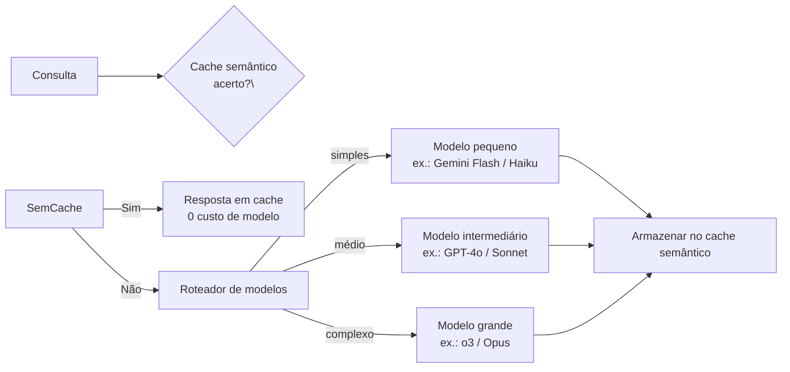

## Definição

**Roteamento de modelos** é a prática de direcionar cada requisição a um LLM para o modelo mais adequado em um pool, com base nas características da requisição. Um roteador age como uma camada de proxy situada entre a aplicação e uma ou mais APIs de provedores de LLM; ele avalia cada consulta recebida e a despacha para o modelo mais barato ou mais rápido capaz de respondê-la corretamente.

O roteamento de modelos tornou-se infraestrutura crítica à medida que empresas migram de implantações de modelo único para pilhas heterogêneas. O Hype Cycle do Gartner para IA Generativa 2025 classifica gateways de IA como tendo migrado de ferramentas opcionais para **infraestrutura crítica**; em 2026, 37% das empresas usam cinco ou mais modelos de LLM em produção.

O roteamento é distinto da cascata (que sempre começa no nível mais barato e escala) e do cache semântico (que ignora todos os modelos em um acerto de cache). Uma arquitetura de produção completa combina os três:

## Estratégias de roteamento

### Roteamento baseado em classificador

Um classificador leve (modelo pequeno ajustado fino, similaridade de embedding ou conjunto de regras) pontua a complexidade da consulta antes de invocar o modelo-alvo. **RouteLLM** (LMSys, 2024) treina um roteador com dados de preferência humana, reduzindo chamadas ao modelo premium em 40–85% com degradação de taxa de vitória &lt; 5%. O próprio classificador deve ser rápido (&lt; 20 ms) e barato — tipicamente um modelo de 1–7B ou uma regressão logística sobre embeddings de consulta.

### Cascata (fallback sequencial)

A requisição é primeiro enviada para o modelo mais barato. Se a confiança da resposta ou uma pontuação de auto-crítica cair abaixo de um limiar, a consulta original é reenviada para o próximo nível. A cascata é mais simples do que a classificação (sem classificador separado) mas menos eficiente porque o Nível 1 sempre roda. O fallback verdadeiro (falha do provedor / timeout) é uma preocupação separada: a lista de fallback do LiteLLM trata erros de API independentemente da escalação baseada em qualidade.

### Cache semântico

As consultas são embutidas e comparadas com um cache de consultas respondidas anteriormente. Em um acerto de similaridade de cosseno (tipicamente ≥ 0,92), a resposta em cache é retornada sem invocar nenhum modelo. O cache semântico entrega 100% de economia de custo nos acertos e é complementar ao roteamento — fica à montante e elimina a decisão de roteamento completamente para consultas repetidas. As taxas de acerto no mundo real variam de 15–30% para assistentes gerais a 50–70% para bots de FAQ e suporte.

### Fallback de provedor e balanceamento de carga

O roteador do LiteLLM suporta:
- **Listas de fallback:** se o provedor primário falha (limite de taxa, timeout), tentar automaticamente em um provedor secundário.
- **Balanceamento de carga:** distribuir requisições entre múltiplas chaves de API ou endpoints de provedores para manter-se dentro dos limites de taxa.
- **Retentativas com backoff exponencial:** lógica de tentativa configurável por provedor.

## LiteLLM

O LiteLLM é o principal gateway LLM de código aberto (2024–2026), fornecendo uma API unificada compatível com OpenAI sobre 100+ modelos de 20+ provedores. Capacidades-chave:

| Recurso | Descrição |
|---|---|
| API unificada | Chamadas no formato OpenAI para qualquer provedor |
| Roteador | Roteamento por classificador, fallback e balanceamento de carga |
| Limites de orçamento | Caps de gasto por usuário e por equipe |
| Logging | Registro unificado de requisição/resposta para ferramentas de observabilidade |
| Gerenciamento de prompts | Versionamento centralizado de prompts |
| Cache semântico | Via integração Redis |

## Quando usar / Quando NÃO usar

| Cenário | Usar roteamento de modelos | Ignorar |
|---|---|---|
| App em produção com consultas de complexidade mista | Sim — redução de custo de 40–70% | Não — se todas as consultas genuinamente precisam do modelo de fronteira |
| Resiliência multi-provedor necessária | Sim — roteamento de fallback fornece failover automático | Não — compromisso com provedor único por razões contratuais |
| Alta repetição de consultas (FAQ, suporte) | Sim — cache semântico acima do roteador | Não — tarefas criativas únicas por usuário não serão cacheadas |
| SLA de latência rígido &lt; 200 ms | Cache semântico (sem chamada ao modelo); roteamento adiciona latência do classificador | Medir overhead do classificador antes de ativar |
| Protótipo / baixo volume | Não — complexidade de roteamento não justificada | Sim — usar um único modelo diretamente |

## Fontes

- [LiteLLM – routing and load balancing documentation](https://docs.litellm.ai/docs/routing-load-balancing)
- [LLM routing and model cascades — TianPan](https://tianpan.co/blog/2025-11-03-llm-routing-model-cascades)
- [Top 5 LLM routing techniques — Maxim](https://www.getmaxim.ai/articles/top-5-llm-routing-techniques/)
- [Dynamic model routing and cascading for efficient LLM inference — arXiv 2603.04445](https://arxiv.org/html/2603.04445v2)
- [Top 5 LLM router solutions in 2026 — Maxim](https://www.getmaxim.ai/articles/top-5-llm-router-solutions-in-2026/)

## Veja também

- [Otimização de custos](/docs/cost-optimization)
- [Escalonamento de modelos](/docs/cost-optimization/model-tiering)
- [Busca semântica](/docs/semantic-search)
- [MLOps](/docs/mlops)
- [LLMs](/docs/llms)
