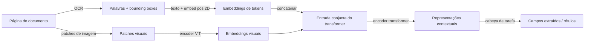

## Definição

Document AI abrange o conjunto de técnicas de IA para compreensão de documentos que combinam texto, layout, tabelas, formulários, gráficos e imagens — PDFs, formulários digitalizados, faturas, contratos, artigos de pesquisa e apresentações. Diferente do NLP de texto simples, os documentos carregam informações estruturais ricas (bounding boxes, ordem de leitura, tamanho de fonte, tabelas) que precisam ser modeladas junto com o conteúdo linguístico para extrair informações com precisão.

O campo evoluiu por fases distintas:

1. **OCR + extração baseada em regras** — Tesseract ou mecanismos de OCR comerciais extraem texto bruto; regex e templates extraem campos. Frágil a variações de layout.
2. **Família LayoutLM** (Microsoft, 2020-2022) — modelos de estilo BERT ajustados que incorporam posições de tokens (coordenadas x, y) junto com texto e opcionalmente features de imagem. O LayoutLMv3 combina texto, layout e patches de imagem em um objetivo de pré-treinamento unificado.
3. **VLMs fim-a-fim para documentos** — modelos como Donut (Document Understanding Transformer), Qwen2-VL e InternVL renderizam o documento como imagem e geram saída estruturada diretamente, contornando completamente o OCR.

## Como funciona

### Abordagem LayoutLM (texto + layout + imagem)

O LayoutLMv3 usa um transformer multimodal unificado. Os tokens de texto carregam codificações posicionais 2D de bounding box; os patches de imagem são extraídos com projeção de patch no estilo ViT. Um objetivo de Alinhamento Palavra-Patch alinha os tokens de texto com seus patches de imagem correspondentes.

### Abordagem VLM sem OCR (Donut / Qwen2-VL)

Esses modelos recebem a imagem bruta do documento como entrada. Um encoder ViT de alta resolução processa a imagem em resolução total. Um decoder de texto gera saída estruturada (JSON, XML, texto simples) diretamente usando treinamento com teacher-forcing em pares documento-esquema. Nenhum mecanismo de OCR externo é necessário, reduzindo a propagação de erros.

### Principais tarefas de Document AI

| Tarefa | Exemplo | Modelo típico |
|---|---|---|
| Classificação de documentos | Fatura vs. contrato vs. relatório | LayoutLMv3 ajustado |
| Extração de chave-valor | Número da fatura, data, total | Donut, LayoutLMv3 |
| Extração de tabelas | Análise de linha-coluna | TableFormer, Qwen2-VL |
| VQA de documentos | "Qual é o valor líquido?" | Donut, Qwen2-VL |
| Análise de recibos / formulários | Localização de campos + valores | LayoutLMv3, PaddleOCR |

## Quando usar / Quando NÃO usar

| Cenário | Usar | Evitar |
|---|---|---|
| Extração estruturada de documentos de formato fixo (faturas, formulários) | LayoutLMv3 ou Donut ajustados — alta precisão | LLM geral — compreensão fraca de layout |
| VQA de documento arbitrário sem dados de treinamento rotulados | Qwen2-VL ou GPT-4o — zero-shot | Modelo supervisionado — requer dados anotados |
| Documentos digitalizados de baixa qualidade | Pré-processar com PaddleOCR + LayoutLM | VLM sem OCR — pode ter dificuldade com qualidade de scan muito ruim |
| Processamento em lote de alto volume (milhões de páginas) | Donut leve ou LayoutLM quantizado | API GPT-4o — custo proibitivo em escala |
| On-premise, sem API externa | LayoutLMv3 ou Donut open-source (HuggingFace) | API proprietária — preocupação com privacidade de dados |

## Fontes

- [LayoutLMv3 — Pré-treinamento para Document AI (Microsoft, 2022)](https://arxiv.org/abs/2204.08387)
- [Donut — Document Understanding Transformer sem OCR (2021)](https://arxiv.org/abs/2111.15664)
- [Qwen2-VL para compreensão de documentos (Alibaba, 2024)](https://arxiv.org/abs/2409.12191)
- [Benchmark DocVQA — Mathew et al. (2021)](https://arxiv.org/abs/2007.00398)
- [PaddleOCR — OCR multilíngue open-source](https://github.com/PaddlePaddle/PaddleOCR)

## Veja também

- [IA Multimodal](/docs/multimodal-ai)
- [Modelos de visão e linguagem](/docs/multimodal-ai/vision-language-models)
- [NLP](/docs/nlp)
- [Extração de informação](/docs/nlp/information-extraction)
