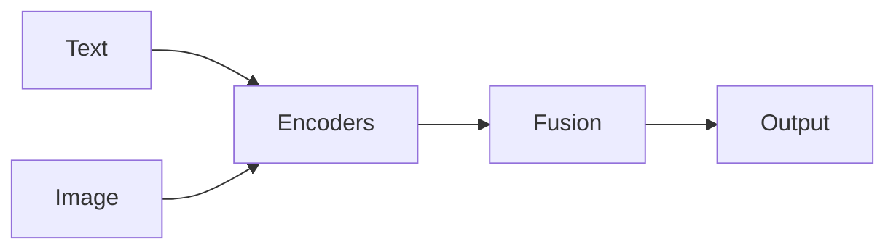

## Definição

A IA multimodal lida com múltiplas modalidades de entrada (e às vezes saída) em um sistema: por ex. vision-language models (VLMs) for image QA, captioning, or embodied agents that use vision and language.

Ele estende [NLP](/docs/nlp) and [computer vision](/docs/cv) by aligning or fusing modalities (text, image, audio, video). CLIP-style models learn a shared embedding space for recuperação and zero-shot classification; generative VLMs (por ex. LLaVA, GPT-4V) do captioning, QA, and raciocínio over images. Used in [agents](/docs/agents), [RAG](/docs/rag) with images, and accessibility tools.

## Como funciona

Cada modalidade (**texto**, **imagem**, e opcionalmente outras) é passada por **codificadores** (separados ou compartilhados). **Fusão** can be a shared embedding space (por ex. CLIP: contrastive loss so matching text-image pairs are close) or a unified [transformer](/docs/transformers) that attends over all modalities. **Output** can be a classification, caption, answer, or next token. Alignment is learned via contrastive (CLIP) or generative (captioning, VLM) objectives on paired data. Inference: embed or encode all inputs, then run the fusion model to get the output.

## Casos de uso

Multimodal models fit when the task combines two or more modalities (por ex. text and image) in input or output.

- Image captioning, visual QA, and document understanding (text + image)
- Cross-modal recuperação (por ex. search images by text, or vice versa)
- Embodied agents and robots that use vision and language

## Documentação externa

- [CLIP (Radford et al.)](https://arxiv.org/abs/2103.00020)
- [Hugging Face – Multimodal](https://huggingface.co/docs/transformers/main_classes/processing_automatic)

## Veja também

- [LLMs](/docs/llms)
- [Computer vision](/docs/cv)
- [NLP](/docs/nlp)
- [Local inference](/docs/local-inference) — Running multimodal models on-device
- [Edge raciocínio](/docs/edge-reasoning) — Multimodal at the edge
