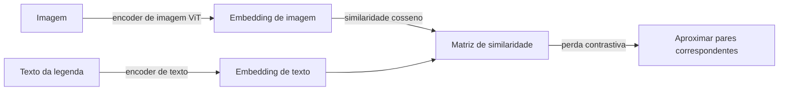
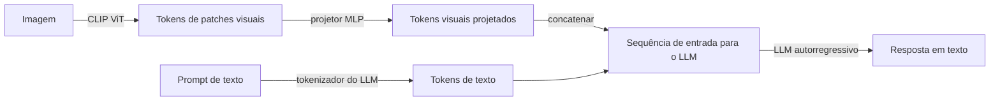

## Definição

Modelos de visão e linguagem (VLMs) são sistemas de IA que processam tanto imagens quanto texto, habilitando tarefas como visual question answering (VQA), legendagem de imagens, grounding visual, compreensão de documentos e raciocínio condicionado a imagens. Abrangem um espectro de modelos somente de alinhamento a modelos de chat com instrução ajustada completos:

- **CLIP** (OpenAI, 2021) — um modelo dual-encoder treinado com aprendizado contrastivo em 400 milhões de pares imagem-texto. O CLIP aprende um espaço de embedding compartilhado onde imagens e suas descrições textuais são aproximadas. Habilita classificação zero-shot poderosa e recuperação multimodal, mas não gera texto.
- **LLaVA** (Liu et al., 2023-2024) — conecta um encoder de imagem CLIP a um modelo de linguagem (Llama, Mistral, Qwen) via um projetor leve (MLP ou cross-attention). LLaVA-1.5 e LLaVA-NeXT alcançam desempenho no nível do GPT-4V em benchmarks abertos com uma fração do custo computacional.
- **PaliGemma** (Google DeepMind, 2024) — um VLM de 3B combinando SigLIP (CLIP aprimorado) e Gemma 2B. Projetado como base de transferência: ajustar o PaliGemma alcança estado da arte em tarefas densas (legendagem, VQA, detecção de objetos, segmentação) cabendo em uma única GPU para consumidores.
- **Qwen-VL** (Alibaba, 2023-2024) — uma série de VLMs (7B, 72B) com suporte a múltiplas imagens, alta resolução e entradas de vídeo. O Qwen2-VL adiciona codificação posicional 2D (RoPE-2D) e resolução dinâmica nativa, alcançando os melhores resultados no OCRBench e DocVQA.

## Como funciona

### CLIP: dual-encoder contrastivo

Um lote de pares (imagem, legenda) é codificado; a diagonal da matriz de similaridade é maximizada e as entradas fora da diagonal são minimizadas. Na inferência, qualquer prompt de texto pode ser usado como consulta para classificar imagens ou classificar comparando embeddings de imagem com embeddings de rótulo.

### VLM estilo LLaVA: projetor + LLM

Os tokens visuais são projetados para o espaço de tokens do LLM e pré-adicionados aos tokens de texto. O LLM vê uma sequência mista de tokens visuais e de texto e gera uma resposta autorregressivamente. O treinamento ocorre em dois estágios: (1) alinhar o projetor com pares imagem-legenda, (2) ajuste de instrução do modelo completo com VQA, conversação e dados específicos de tarefas.

### Principais benchmarks (estado em maio de 2026)

| Benchmark | Tarefa | Principais modelos abertos |
|---|---|---|
| MMBench / MMStar | VQA geral | Qwen2-VL-72B, LLaVA-NeXT-110B |
| DocVQA | Compreensão de documentos | Qwen2-VL-7B, PaliGemma-2 |
| OCRBench | Reconhecimento de texto em imagens | Qwen2-VL-72B |
| MMMU | Raciocínio multimodal em nível universitário | GPT-4o, Gemini 1.5 Pro |

## Quando usar / Quando NÃO usar

| Cenário | Usar | Evitar |
|---|---|---|
| Classificação ou recuperação de imagens zero-shot | Embeddings CLIP — rápidos, sem ajuste fino | VLM completo — superdimensionado para recuperação |
| VQA visual, legendagem de imagens, compreensão de gráficos | LLaVA-NeXT ou Qwen2-VL (7B) | CLIP — não pode gerar texto |
| Tarefas densas (segmentação, detecção, grounding) | PaliGemma ajustado — transferência estado da arte | VLM geral sem ajuste fino |
| Compreensão de múltiplas imagens e vídeo | Qwen2-VL — suporte nativo a vídeo e múltiplas imagens | LLaVA 1.5 — apenas imagem única |
| Implantação no dispositivo ou com poucos recursos | PaliGemma 3B (cabe em 1 GPU) | VLMs de 70B+ — inviável |

## Fontes

- [CLIP — Aprendendo modelos visuais transferíveis a partir de linguagem natural (OpenAI, 2021)](https://arxiv.org/abs/2103.00020)
- [LLaVA — Ajuste de instrução visual (Liu et al., 2023)](https://arxiv.org/abs/2304.08485)
- [LLaVA-NeXT — Melhores linhas de base com ajuste de instrução visual (2024)](https://arxiv.org/abs/2310.03744)
- [PaliGemma — Um VLM versátil de 3B para transferência (Google DeepMind, 2024)](https://arxiv.org/abs/2407.07726)
- [Relatório técnico Qwen2-VL (Alibaba, 2024)](https://arxiv.org/abs/2409.12191)

## Veja também

- [IA Multimodal](/docs/multimodal-ai)
- [Visão computacional](/docs/cv)
- [Vision Transformers](/docs/cv/vision-transformers)
- [LLMs](/docs/llms)
- [Document AI](/docs/multimodal-ai/document-ai)
