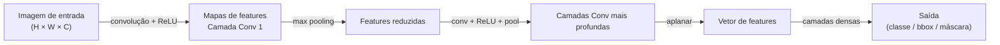

## Definição

Redes Neurais Convolucionais são um tipo de rede neural projetada para dados com estrutura espacial — principalmente imagens, mas também áudio, texto e séries temporais. Em vez de conectar cada neurônio a todas as entradas, as CNNs usam **filtros convolucionais** compartilhados que deslizam pela entrada, detectando features locais independentemente da sua posição.

A ideia central é **equivariância à translação**: um filtro treinado para detectar bordas verticais funcionará em qualquer região da imagem. Camadas convolucionais empilhadas constroem uma hierarquia de features: as camadas iniciais detectam bordas e texturas, camadas intermediárias detectam partes como olhos ou rodas, e camadas profundas reconhecem objetos inteiros. As camadas de **pooling** reduzem dimensões espaciais (reduzem a amostragem), tornando as representações mais compactas e robustas a pequenas variações.

As CNNs dominam tarefas de [visão computacional](/docs/cv): classificação de imagens, detecção de objetos, segmentação semântica e muito mais. Arquiteturas como ResNet, EfficientNet e Vision Transformer são construídas sobre esses princípios. Embora os [Transformers](/docs/transformers) tenham alcançado as CNNs em muitas tarefas de visão, as CNNs permanecem eficientes e práticas para implantação.

## Funcionamento



### Camada convolucional

Um **filtro** (ou kernel) K×K é convolucionado sobre os mapas de features de entrada. O kernel aprende detectar um padrão específico. Múltiplos filtros em paralelo produzem múltiplos mapas de features. **Stride** controla quanto o filtro avança a cada passo; **padding** preserva as dimensões espaciais.

### Camada de pooling

**Max pooling** seleciona o valor máximo em cada janela, reduzindo dimensões espaciais e adicionando robustez a invariância de translação. **Average pooling** funciona de forma similar mas usa médias. O **Global Average Pooling** (GAP) colapsa cada mapa de feature para um único valor — elimina camadas densas nas arquiteturas modernas.

### Camadas totalmente conectadas

Após as camadas convolucionais, o tensor de features é aplanado e alimentado em **camadas densas** para classificação final ou regressão. Arquiteturas modernas (ResNet, EfficientNet) usam GAP + uma única camada linear ao invés de múltiplas camadas densas.

## Quando usar / Quando NÃO usar

| Cenário | Usar CNNs | NÃO usar CNNs |
|---------|----------|--------------|
| Classificação de imagens / detecção de objetos | Sim — ainda eficientes e práticas | |
| Implantação edge / mobile | Sim — MobileNet, EfficientNet são otimizados para isso | |
| Reconhecimento de séries temporais ou áudio | Sim — CNNs 1D capturam padrões locais temporais | |
| Compreensão de imagens em grande escala com muitos dados | Com cautela | Vision Transformers podem superar com dados suficientes |
| NLP (texto) | Com cautela | Os Transformers dominam NLP hoje |

## Comparações

| Aspecto | CNN | Vision Transformer (ViT) |
|---------|-----|--------------------------|
| Indução de localidade | Embutida (kernel local) | Aprendida via atenção |
| Invariância à translação | Via pooling | Via dados e aumentação |
| Eficiência de dados | Alta (bom com menos dados) | Requer dados grandes |
| Escalabilidade | Boa | Excelente com escala |
| Melhor para | Mobile, edge, datasets médios | Datasets grandes, tarefas de linguagem-visão |

## Vantagens e desvantagens

| Vantagens | Desvantagens |
|---------|------------|
| Peso compartilhado reduz parâmetros drasticamente | Contexto global limitado (campo receptivo finito) |
| Equivariância à translação embutida na arquitetura | Menos flexível do que Transformers para novos domínios |
| Eficiente de treinar — amplamente suportado em hardware | Arquiteturas profundas exigem ajuste cuidadoso |
| Muitos modelos pré-treinados disponíveis | Não adequado para dados relacionais ou grafos sem modificações |

## Exemplos de código

```python
import torch
import torch.nn as nn

class SimpleCNN(nn.Module):
    def __init__(self, num_classes: int = 10):
        super().__init__()
        self.features = nn.Sequential(
            nn.Conv2d(1, 32, kernel_size=3, padding=1),   # 28x28 -> 28x28
            nn.ReLU(),
            nn.MaxPool2d(2),                               # 28x28 -> 14x14
            nn.Conv2d(32, 64, kernel_size=3, padding=1),  # 14x14 -> 14x14
            nn.ReLU(),
            nn.MaxPool2d(2),                               # 14x14 -> 7x7
        )
        self.classifier = nn.Sequential(
            nn.Flatten(),
            nn.Linear(64 * 7 * 7, 128),
            nn.ReLU(),
            nn.Linear(128, num_classes),
        )

    def forward(self, x: torch.Tensor) -> torch.Tensor:
        return self.classifier(self.features(x))

model = SimpleCNN(num_classes=10)
x     = torch.randn(4, 1, 28, 28)   # batch de 4 imagens MNIST
print(model(x).shape)                # (4, 10)
```

## Recursos práticos

- [cs231n: CNNs para Reconhecimento Visual (Stanford)](https://cs231n.github.io/) — Notas do curso canônico com visualizações detalhadas
- [PyTorch – Tutorial de Classificação de Imagens](https://pytorch.org/tutorials/beginner/blitz/cifar10_tutorial.html) — Tutorial de ponta a ponta em CIFAR-10
- [Papers with Code – Classificação de Imagens](https://paperswithcode.com/task/image-classification) — Leaderboards de state-of-the-art e implementações

## Veja também

- [Redes Neurais](/docs/neural-networks)
- [RNN](/docs/neural-networks/rnn)
- [Transformers](/docs/transformers)
- [Deep Learning](/docs/fundamentals/deep-learning)
