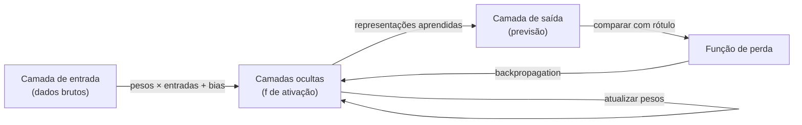

## Definição

Redes neurais artificiais são modelos computacionais inspirados no cérebro biológico. Elas consistem em **neurônios** (nós) organizados em **camadas** que transformam entradas em saídas por meio de funções matemáticas.

Uma rede neural típica tem três tipos de camadas: uma **camada de entrada** que recebe os dados brutos, uma ou mais **camadas ocultas** que aprendem representações intermediárias, e uma **camada de saída** que produz a previsão final. Cada conexão entre neurônios tem um **peso** — um parâmetro aprendido que escala o sinal. Cada neurônio também tem um **bias** — um deslocamento aprendido adicionado antes de aplicar a **função de ativação** (por ex. ReLU, sigmoid, tanh) que introduz não-linearidade.

O aprendizado acontece via **backpropagation** combinado com **descida de gradiente**: a perda (diferença entre saída prevista e alvo) é calculada, os gradientes fluem para trás pela rede usando a regra da cadeia, e os pesos são atualizados para reduzir a perda. Iterar esse processo sobre muitos exemplos empurra a rede em direção a parâmetros que generalizam bem para novos dados. Arquiteturas mais profundas (mais camadas ocultas) podem aprender hierarquias de características mais abstratas — a ideia central do [deep learning](/docs/fundamentals/deep-learning).

## Funcionamento



### Neurônio único

Um **neurônio** calcula: `saída = ativação(Σ(peso_i × entrada_i) + bias)`. A função de ativação determina quando o neurônio "dispara" — sem ela toda a rede colapsaria para uma função linear.

### Funções de ativação comuns

**ReLU** (`max(0, x)`) — padrão para camadas ocultas, computacionalmente eficiente. **Sigmoid** (`1/(1+e^{-x})`) — mapeia para (0,1), usado em classificação binária de saída. **Tanh** — saída entre (−1, 1), frequentemente em RNNs. **Softmax** — normaliza saídas em distribuição de probabilidade para classificação multi-classe.

### Backpropagation

Backpropagation aplica a regra da cadeia para calcular ∂Perda/∂peso para cada parâmetro na rede em uma única passagem para trás. Isso possibilita que as redes com milhões de parâmetros sejam treinadas eficientemente em GPU.

## Quando usar / Quando NÃO usar

| Cenário | Usar Redes Neurais | Considerar alternativas |
|---------|------------------|------------------------|
| Dados tabulares de tamanho médio com features estruturadas | Com cautela | Gradient boosting (XGBoost, LightGBM) frequentemente supera |
| Dados de alta dimensão (imagens, texto, áudio) | Sim — CNNs, Transformers, RNNs excedem aqui | |
| Poucos exemplos de treinamento rotulados (\<1000) | Com cautela | Modelos clássicos generalizam melhor com dados escassos |
| Interprebilidade é crítica | Com cautela | Modelos mais simples (árvores de decisão, regressão) são mais explicáveis |
| Escalar para bilhões de parâmetros | Sim — deep learning é projetado para isso | |

## Comparações

| Aspecto | Redes Neurais Rasas | Redes Profundas (Deep Learning) |
|---------|--------------------|---------------------------------|
| Camadas | 1–2 ocultas | 10 a centenas |
| Representação | Features de baixo nível | Hierarquias de features abstratas |
| Dados necessários | Moderado | Muito |
| Poder computacional | Baixo a médio | Alto (GPU/TPU necessário) |
| Melhor para | Problemas simples, dados limitados | Imagens, texto, fala, jogos |

## Vantagens e desvantagens

| Vantagens | Desvantagens |
|---------|------------|
| Pode aproximar qualquer função contínua | Requer grandes quantidades de dados rotulados |
| Aprende automaticamente features de dados brutos | Computacionalmente intensivo para treinar |
| Escalável para problemas muito complexos | Interpretabilidade limitada ("caixa preta") |
| Arquiteturas unificadas para domínios diferentes | Sensível à escala dos dados e hiperparâmetros |

## Exemplos de código

```python
import torch
import torch.nn as nn

# A simple 2-hidden-layer neural network
class MLP(nn.Module):
    def __init__(self, input_dim: int, hidden_dim: int, output_dim: int):
        super().__init__()
        self.net = nn.Sequential(
            nn.Linear(input_dim, hidden_dim),
            nn.ReLU(),
            nn.Linear(hidden_dim, hidden_dim),
            nn.ReLU(),
            nn.Linear(hidden_dim, output_dim),
        )

    def forward(self, x):
        return self.net(x)

model = MLP(input_dim=20, hidden_dim=64, output_dim=3)
x     = torch.randn(8, 20)   # batch of 8 examples
print(model(x).shape)        # (8, 3)
```

## Recursos práticos

- [Neural Networks and Deep Learning (Nielsen)](http://neuralnetworksanddeeplearning.com/) — Livro interativo online grátis com intuições matemáticas
- [cs231n: Redes Neurais Convolucionais (Stanford)](https://cs231n.github.io/) — Notas de curso com visualizações detalhadas
- [3Blue1Brown – Redes Neurais (YouTube)](https://www.youtube.com/playlist?list=PLZHQObOWTQDNU6R1_67000Dx_ZCJB-3pi) — Série de vídeos animados explicando backpropagation e gradiente descendente

## Veja também

- [CNN](/docs/neural-networks/cnn)
- [RNN](/docs/neural-networks/rnn)
- [Deep Learning](/docs/fundamentals/deep-learning)
- [Transformers](/docs/transformers)
