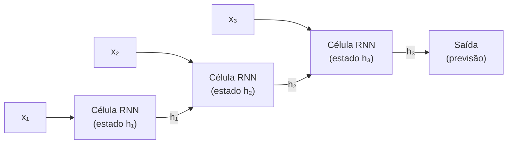

## Definição

Redes Neurais Recorrentes são arquiteturas neurais projetadas para **dados sequenciais** — séries temporais, texto, fala e qualquer entrada onde a ordem importa. Uma RNN mantém um **estado oculto** que atua como memória, sendo atualizado a cada passo de tempo com base na entrada atual e no estado anterior.

A ideia central: uma RNN processa uma sequência passo a passo, carregando informação do contexto passado adiante via estado oculto. Isso permite, em princípio, capturar dependências ao longo de toda uma sequência. Na prática, as RNNs básicas sofrem com o problema do **gradiente que desaparece** — gradientes diminuem exponencialmente ao propagarem para trás por muitos passos de tempo, tornando difícil aprender dependências de longa distância.

**LSTM** (Long Short-Term Memory) e **GRU** (Gated Recurrent Unit) resolvem isso com mecanismos de portão que controlam o fluxo de informação: o portão de esquecimento decide o que apagar do estado da célula, o portão de entrada decide o que escrever, e o portão de saída decide o que ler. Isso permite que as LSTMs retenham informações relevantes por centenas de passos de tempo. Embora os [Transformers](/docs/transformers) tenham substituído amplamente as RNNs para NLP, as RNNs e LSTMs permanecem úteis para previsão de séries temporais, modelos de sistema embarcados e cenários de latência com estado.

## Funcionamento



### Passo recorrente

Em cada passo de tempo t: `h_t = tanh(W_h · h_{t-1} + W_x · x_t + b)`. O mesmo conjunto de pesos (W_h, W_x, b) é reutilizado em todos os passos — isso é chamado **compartilhamento de pesos ao longo do tempo**.

### Portas LSTM

Uma célula LSTM mantém dois estados: um **estado oculto** h_t e um **estado de célula** c_t. Três portões controlam o fluxo: **portão de esquecimento** f_t (o que apagar de c_t), **portão de entrada** i_t (o que escrever em c_t) e **portão de saída** o_t (o que ler de c_t para h_t). As conexões aditivas no estado da célula criam uma **autoestrada de gradiente** que reduz o desaparecimento de gradientes.

### RNNs bidirecionais e empilhadas

**RNNs bidirecionais** processam a sequência em ambas as direções e concatenam os estados ocultos — úteis quando o contexto futuro importa (por ex. POS tagging). **RNNs empilhadas** alimentam a saída de uma camada RNN como entrada para a próxima, construindo representações abstratas mais altas.

## Quando usar / Quando NÃO usar

| Cenário | Usar RNN/LSTM | NÃO usar RNN/LSTM |
|---------|--------------|------------------|
| Previsão de séries temporais (baixa latência, embeddings) | Sim — eficiente para sequências curtas a médias | |
| Modelagem de linguagem em dispositivos resource-constrained | Sim — menor footprint do que Transformers | |
| Geração de sequências step-by-step com estado | Sim — a recorrência modela dependências passo a passo | |
| Compreensão e geração de texto NLP moderno | | Transformers com atenção superam por grande margem |
| Sequências muito longas (\>500 passos de tempo) | | Transformers com atenção esparsa lidam melhor |

## Comparações

| Aspecto | RNN / LSTM | Transformer |
|---------|-----------|-------------|
| Como processa sequências | Sequencialmente (passo a passo) | Em paralelo (todos os tokens de uma vez) |
| Custo de treinamento | Baixo | Alto (atenção quadrática) |
| Dependências de longa distância | Moderadas (LSTM/GRU) | Excelentes (atenção direta) |
| Inferência com estado | Natural (carrega estado oculto) | Requer cache KV |
| Popularidade no NLP moderno | Declinando | Dominante |

## Vantagens e desvantagens

| Vantagens | Desvantagens |
|---------|------------|
| Processa sequências de comprimento variável naturalmente | Treinamento lento — difícil de paralelizar |
| Inferência com estado eficiente para sequências curtas | Dificuldade de capturar dependências muito longas |
| Menor pegada de memória do que Transformers | LSTMs/GRUs adicionam complexidade vs RNNs simples |
| Bom para previsão de séries temporais em tempo real | Amplamente substituído por Transformers em NLP |

## Exemplos de código

```python
import torch
import torch.nn as nn

class LSTMClassifier(nn.Module):
    """Classifica sequências usando um LSTM seguido de pooling médio."""
    def __init__(self, vocab_size: int, embed_dim: int, hidden_dim: int, num_classes: int):
        super().__init__()
        self.embedding = nn.Embedding(vocab_size, embed_dim, padding_idx=0)
        self.lstm      = nn.LSTM(embed_dim, hidden_dim, batch_first=True, bidirectional=True)
        self.fc        = nn.Linear(hidden_dim * 2, num_classes)  # ×2 para bidirecional

    def forward(self, x: torch.Tensor) -> torch.Tensor:
        emb, _  = self.lstm(self.embedding(x))  # (B, T, 2*H)
        pooled  = emb.mean(dim=1)                # pooling médio ao longo do tempo
        return self.fc(pooled)

model = LSTMClassifier(vocab_size=10_000, embed_dim=64, hidden_dim=128, num_classes=5)
x     = torch.randint(0, 10_000, (16, 50))   # batch de 16 sequências de comprimento 50
print(model(x).shape)                         # (16, 5)
```

## Recursos práticos

- [cs224n: NLP com Deep Learning (Stanford)](https://web.stanford.edu/class/cs224n/) — Notas do curso cobrindo LSTMs, atenção e Transformers
- [PyTorch – Tutorial de Classificação de Texto](https://pytorch.org/tutorials/beginner/text_sentiment_ngrams_tutorial.html) — Exemplo com pipeline de texto PyTorch
- [Understanding LSTMs (Olah)](https://colah.github.io/posts/2015-08-Understanding-LSTMs/) — A explicação visual definitiva de LSTMs

## Veja também

- [Redes Neurais](/docs/neural-networks)
- [CNN](/docs/neural-networks/cnn)
- [Transformers](/docs/transformers)
- [NLP](/docs/nlp)
