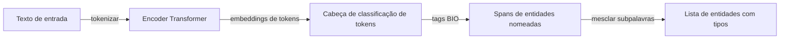

## Definição

A extração de informação (IE) converte texto em linguagem natural não estruturada em fatos estruturados que podem ser armazenados em bancos de dados, grafos de conhecimento ou planilhas. As três tarefas canônicas de IE são:

- **Reconhecimento de entidades nomeadas (NER)** — identificar e rotular menções de entidades como pessoas (PER), organizações (ORG), locais (LOC), datas (DATE) e tipos específicos de domínio (genes, produtos químicos, produtos).
- **Extração de relações (RE)** — determinar a relação semântica entre duas entidades detectadas, por exemplo, (`Apple`, `fundada_por`, `Steve Jobs`).
- **Extração de eventos** — detectar menções de eventos (por exemplo, "aquisição", "explosão") e seus argumentos (quem, o quê, quando, onde).

A IE tradicional usava sistemas baseados em regras (padrões Spacy, regex) e rotuladores de sequência com features manuais (CRF, HMM). Os pipelines modernos substituem a maior parte disso com transformers ajustados: classificadores de tokens para NER, classificadores de pares de spans ou modelos gerativos para RE, e LLMs com instrução ajustada para extração conjunta de esquemas arbitrários.

## Como funciona

### Pipeline de NER

A classificação de tokens atribui um rótulo BIO (Begin-Inside-Outside) a cada token. `B-PER` marca o primeiro token de um nome de pessoa, `I-PER` o continua, e `O` marca tokens que não são entidades. O pós-processamento mescla tokens de subpalavras em spans completos.

### Pipeline de extração de relações

Após o NER, a extração de relações recebe pares de spans de entidades e classifica o tipo de relação. As abordagens incluem:

1. **Cross-encoder** — concatenar marcadores de entidade (`[E1]…[/E1]`) na entrada e classificar com uma cabeça linear.
2. **Extração generativa** — instruir um LLM com o texto e o esquema alvo; o modelo gera triplas estruturadas em JSON ou um template.
3. **Modelos conjuntos fim-a-fim** (REBEL, InstructIE) — prever tanto entidades quanto relações em uma única passagem.

### Extração zero-shot com LLMs

LLMs com ajuste de instrução podem extrair esquemas arbitrários de textos usando prompts estruturados — sem necessidade de dados de treinamento anotados. A troca é menor precisão em tipos específicos de domínio em comparação com modelos ajustados treinados em corpora anotados.

## Quando usar / Quando NÃO usar

| Cenário | Usar IE | Evitar IE |
|---|---|---|
| Construção de grafos de conhecimento a partir de documentos | Sim — NER + RE preenche triplas entidade-relação | Não — se os documentos já estiverem estruturados |
| Marcação de entidades médicas/jurídicas com ontologia de domínio | NER ajustado em corpus anotado | NER genérico pronto — perde entidades de domínio |
| Prototipagem rápida sem dados rotulados | Extração LLM zero-shot | Modelo ajustado — sem rótulos ainda |
| Pipeline de produção de alto volume (milhões de documentos) | Encoder ajustado leve (GLiNER, SpanBERT) | LLM completo em escala — custo e latência |
| Esquema estrito com baixa tolerância a alucinações | Classificador ajustado com saída determinística | LLM generativo — pode alucinar relações |

## Fontes

- [SpaCy — Reconhecimento de entidades nomeadas](https://spacy.io/usage/linguistic-features#named-entities)
- [GLiNER — Modelo generalista para NER (2024)](https://arxiv.org/abs/2311.08526)
- [REBEL — Extração de relações por geração de linguagem fim-a-fim (2021)](https://arxiv.org/abs/2110.14202)
- [UniversalNER — Destilação direcionada de LLMs para NER (2023)](https://arxiv.org/abs/2308.03279)
- [InstructIE — IE com ajuste de instrução com LLMs (2023)](https://arxiv.org/abs/2305.11527)

## Veja também

- [NLP](/docs/nlp)
- [Classificação de texto](/docs/nlp/text-classification)
- [Transformers](/docs/transformers)
- [RAG](/docs/rag)
