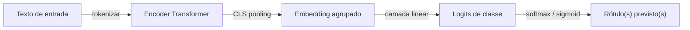

## Definição

Classificação de texto é a tarefa de mapear um trecho de texto para uma ou mais categorias predefinidas. Subtarefas comuns incluem análise de sentimentos (positivo / negativo / neutro), detecção de intenção (book_flight, cancel_order), rotulagem de tópicos (esportes, política, finanças), detecção de spam e filtragem de conteúdo tóxico. A saída pode ser binária, multiclasse (exatamente um rótulo) ou multirótulo (qualquer subconjunto de rótulos).

As abordagens modernas se dividem em duas famílias. **Encoders ajustados** (BERT, RoBERTa, DeBERTa) extraem uma representação do token `[CLS]` e a passam por uma camada de classificação treinada em exemplos rotulados — geralmente atingindo o estado da arte em benchmarks estruturados quando algumas centenas a alguns milhares de rótulos estão disponíveis. **LLMs zero-shot ou few-shot** (GPT-4, Claude, Llama 3) não requerem dados de treinamento rotulados: o modelo lê os rótulos candidatos no prompt e produz uma decisão, trocando eficiência de rótulos por precisão ligeiramente menor em domínios estreitos.

Sistemas práticos frequentemente combinam as duas abordagens: um LLM para rotulagem exploratória ou categorias raras, e um encoder ajustado para classificação de produção em alto volume assim que rótulos suficientes forem coletados.

## Como funciona

1. **Tokenizar** — o texto é dividido em tokens de subpalavras (BPE, WordPiece) e mapeado para embeddings com codificações posicionais.
2. **Codificar** — as camadas do transformer produzem representações contextuais; o embedding `[CLS]` (ou com pooling médio) captura a sequência completa.
3. **Classificar** — uma camada linear projeta o vetor agrupado para o número de classes; softmax para rótulo único, sigmoid para multirótulo.
4. **Treinar** — a perda de entropia cruzada (rótulo único) ou entropia cruzada binária (multirótulo) orienta as atualizações de gradiente; apenas a cabeça é atualizada para extração de features, ou todas as camadas no ajuste fino completo.

### Caminho zero-shot

Para classificação zero-shot, o texto de entrada e os rótulos candidatos são formatados como um par premissa + hipótese de implicação em linguagem natural (NLI) ou um prompt direto, e o modelo pontua cada rótulo com base em probabilidade ou saída verbalizada.

## Quando usar / Quando NÃO usar

| Cenário | Usar | Não usar |
|---|---|---|
| Detecção de sentimentos, spam ou intenção com dados rotulados | Encoder ajustado — alta precisão, inferência rápida | LLM em escala — custo proibitivo para milhões de requisições |
| Nova taxonomia sem exemplos rotulados | LLM zero-shot ou classificador NLI | Ajuste fino — sem rótulos disponíveis |
| Tráfego de produção em streaming de alto volume | Encoder destilado (DistilBERT, TinyBERT) em GPU/TPU | LLM de tamanho completo — latência e custo |
| Rótulos hierárquicos ou extremamente granulares (&gt;1000 classes) | Classificador hierárquico ou embedding + kNN | Softmax plano sobre 1000+ classes |
| Loop de aprendizado ativo com revisores humanos | LLM para rotular, ajuste fino com rótulos confirmados | Apenas dataset estático |

## Fontes

- [Hugging Face — Guia de classificação de texto](https://huggingface.co/docs/transformers/tasks/sequence_classification)
- [Artigo RoBERTa — Liu et al. (2019)](https://arxiv.org/abs/1907.11692)
- [Classificação de texto zero-shot via NLI — Yin et al. (2019)](https://arxiv.org/abs/1909.00161)
- [DeBERTa-v3 — He et al. (2021)](https://arxiv.org/abs/2111.09543)
- [SetFit — Ajuste fino eficiente com poucos exemplos (2022)](https://arxiv.org/abs/2209.11055)

## Veja também

- [NLP](/docs/nlp)
- [Transformers](/docs/transformers)
- [Extração de informação](/docs/nlp/information-extraction)
- [Engenharia de prompt](/docs/prompt-engineering)
