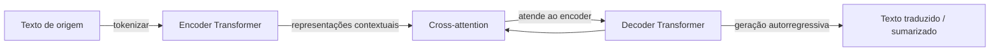

## Definição

**Tradução automática (MT)** converte automaticamente texto de um idioma de origem para um idioma de destino preservando o significado. A MT neural moderna usa transformers encoder-decoder treinados em massivos corpora paralelos multilíngues. Os principais modelos incluem NLLB-200 (Meta, 200 idiomas), mBART-50 (50 idiomas) e a família Helsinki-NLP Opus-MT de modelos especializados leves. Sistemas proprietários (Google Tradutor, DeepL) usam arquiteturas semelhantes em maior escala.

**Sumarização automática** condensa um documento mais longo em uma forma mais curta. Divide-se em dois paradigmas: sumarização **extrativa** seleciona as frases mais importantes literalmente da fonte (rápida, factualmente fundamentada); sumarização **abstrativa** gera novo texto que pode reformular ou fundir informações (mais fluente, mas com risco de alucinações). Modelos abstrativistas modernos (BART, Pegasus, T5, Llama 3) superam dramaticamente as linhas de base extrativas em benchmarks de domínio aberto, embora a extração ainda seja preferida em domínios de alto risco (jurídico, médico) onde a fidelidade é primordial.

Ambas as tarefas compartilham uma arquitetura encoder-decoder seq2seq: o encoder lê a sequência de origem completa e o decoder gera a sequência de destino token por token usando cross-attention para a saída do encoder.

## Como funciona

1. **Codificar** — os tokens de origem são processados pelo encoder em representações contextuais ricas (uma por token).
2. **Decodificar** — o decoder gera tokens de destino um de cada vez; a cada passo, atenção a todas as representações do encoder via cross-attention e aos tokens previamente gerados via masked self-attention.
3. **Beam search ou amostragem** — no momento da inferência, beam search (k=4 ou k=5) ou amostragem nucleus é usado para produzir saída fluente equilibrando diversidade e qualidade.
4. **Pós-processamento** — detokenização, normalização específica do idioma e verificações opcionais de fidelidade são aplicadas.

### Métricas de qualidade

| Tarefa | Métrica | Observações |
|---|---|---|
| Tradução | BLEU, chrF, COMET | COMET correlaciona melhor com o julgamento humano |
| Sumarização | ROUGE-1/2/L | Mede sobreposição de n-gramas; BERTSCORE para similaridade semântica |
| Ambas | Avaliação humana (MQM, Likert) | Padrão-ouro, mas custoso |

## Quando usar / Quando NÃO usar

| Cenário | Usar | Não usar |
|---|---|---|
| Traduzir documentos em mais de 10 idiomas em escala | NLLB-200 ou mBART-50 (open-source, auto-hospedado) | Modelo ajustado por idioma — overhead de manutenção |
| Par de idiomas único de alta qualidade em produção | Modelo Helsinki-NLP ajustado ou API DeepL | Modelo multilíngue genérico — modelo especializado vence |
| Sumarização de documentos longos (&gt;100K tokens) | Sumarização em partes com pipeline map-reduce | LLM de passagem única — excede a janela de contexto |
| Sumarização crítica quanto à fidelidade (jurídica, clínica) | Extrativa ou LLM com restrição de fidelidade | Puramente abstrativa — risco de alucinação |
| Tradução no dispositivo / offline | CTranslate2 + NLLB quantizado — leve | LLM em servidor — requer conectividade |

## Fontes

- [NLLB-200 — No Language Left Behind (Meta, 2022)](https://arxiv.org/abs/2207.04672)
- [BART — Pré-treinamento de Sequência para Sequência com Denoising (Lewis et al., 2019)](https://arxiv.org/abs/1910.13461)
- [Pegasus — Pré-treinamento com frases de lacunas extraídas (Zhang et al., 2019)](https://arxiv.org/abs/1912.08777)
- [Modelos Helsinki-NLP Opus-MT no Hugging Face](https://huggingface.co/Helsinki-NLP)
- [COMET — Um framework neural para avaliação de MT (2020)](https://arxiv.org/abs/2009.09025)

## Veja também

- [NLP](/docs/nlp)
- [Transformers](/docs/transformers)
- [Classificação de texto](/docs/nlp/text-classification)
- [LLMs](/docs/llms)
