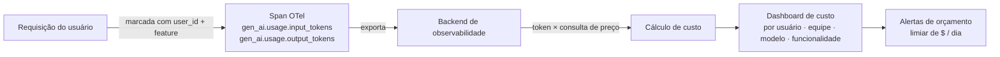

## Definição

**Atribuição de custos** é a prática de associar o gasto de tokens LLM à entidade de negócio que o causou — um usuário, uma equipe, uma funcionalidade de produto ou um experimento. Sem atribuição, o gasto em IA na nuvem é um único item opaco que cresce de forma imprevisível, tornando impossível identificar desperdícios, impor orçamentos ou tomar decisões informadas de seleção de modelos.

Os custos de LLM são impulsionados por dois fatores: **tokens de entrada** (o prompt enviado ao modelo) e **tokens de saída** (o completion retornado). Os tokens de saída são tipicamente 3–5x mais caros por token que os de entrada, e ambos são cobrados por requisição. Em sistemas de múltiplos agentes ou RAG, uma única ação do usuário pode disparar dezenas de chamadas LLM, tornando a atribuição de custo por requisição essencial para entender o custo total por interação.

As Convenções Semânticas GenAI do OpenTelemetry (estáveis na v1.37+) fornecem atributos de span padrão para rastreamento de tokens:
- `gen_ai.usage.input_tokens`
- `gen_ai.usage.output_tokens`
- `gen_ai.request.model`
- `gen_ai.provider.name`

Esses atributos, combinados com tags de dimensão personalizadas (ID do usuário, nome da funcionalidade, ID do experimento), habilitam dashboards de atribuição de custos em qualquer backend compatível com OTel.

## Como funciona

No momento da instrumentação, atributos de span personalizados marcam cada chamada LLM com dimensões de negócio (`user.id`, `team.name`, `feature.name`, `experiment.id`). O backend de observabilidade multiplica as contagens de tokens pela tabela de preços por token do provedor (atualizada periodicamente) para calcular o custo em reais/dólares. Dashboards agregados e alertas disparam quando o gasto por usuário ou por funcionalidade excede os limiares configurados.

## Quando usar / Quando NÃO usar

| Cenário | Atribuir custos | Pular ou adiar |
|---|---|---|
| Produto SaaS multi-tenant com precificação por assento | Sim — atribua ao tenant para conciliação da fatura | Não — gastos não atribuídos levam a surpresas na margem |
| Plataforma interna com múltiplas equipes compartilhando uma chave de API | Sim — estorno requer atribuição por equipe | Não — sem atribuição, a otimização de custos é chutômetro |
| Experimentação com múltiplas variantes de modelo | Sim — rastreie a relação custo-qualidade por experimento | Não — comparar saídas de modelos sem custo ignora o valor total |
| Protótipo de locatário único ou projeto pessoal | Talvez — rastreie o gasto total; atribuição por usuário é opcional | Sim — o overhead não vale a pena em pequena escala |
| Sistemas de agentes com longas cadeias multi-hop | Sim — sem atribuição por chamada, o custo total é opaco | Não — atribuição por hop é essencial para otimização |

## Dimensões de atribuição de custos

| Dimensão | Atributo de span / tag | Caso de uso |
|---|---|---|
| Usuário | `user.id` | Faturamento por usuário, aplicação de cotas |
| Equipe / org | `team.id` | Estorno interno |
| Funcionalidade | `feature.name` | Análise de ROI por funcionalidade |
| Experimento | `experiment.id` | Trade-offs de custo-qualidade em A/B |
| Modelo | `gen_ai.request.model` | Comparar custo vs. qualidade do modelo |
| Etapa do agente | nome do span | Decomposição de custo multi-hop |

## Alavancas de otimização de custos

Uma vez que a atribuição está em vigor, as ações comuns de otimização incluem:
- **Roteamento de modelos**: Use um modelo barato e rápido para consultas simples; escale para um modelo grande apenas quando necessário.
- **Compressão de prompt**: Remova contexto e espaços em branco redundantes; prompts mais curtos reduzem diretamente os custos de entrada.
- **Prefix caching**: Prompts de sistema e contexto compartilhado cobrados uma vez, não por requisição.
- **Limites de comprimento de saída**: `max_tokens` evita custos de geração fora de controle.
- **Cache de respostas**: Cache de pares de query/resposta determinísticos (cache semântico) para servir consultas repetidas gratuitamente.

## Fontes

- [Convenções Semânticas GenAI do OpenTelemetry](https://opentelemetry.io/docs/specs/semconv/gen-ai/) — atributos padrão de token e modelo para atribuição de custos
- [Rastreamento de custos do Langfuse](https://langfuse.com/docs/model-usage-and-cost) — tabelas de preços por modelo e dashboard de custos no Langfuse
- [OpenObserve — guia OTel para LLMs](https://openobserve.ai/blog/opentelemetry-for-llms/) — guia prático incluindo atribuição de custos via atributos OTel
- [Uptrace — sistemas de IA com OTel](https://uptrace.dev/blog/opentelemetry-ai-systems) — dashboards de custo e tokens com backends OTel

## Veja também

- [Observabilidade](/docs/observability)
- [Tracing](/docs/observability/tracing)
- [Langfuse](/docs/observability/langfuse)
- [Otimização de inferência](/docs/inference-optimization)
- [MLOps](/docs/mlops)
