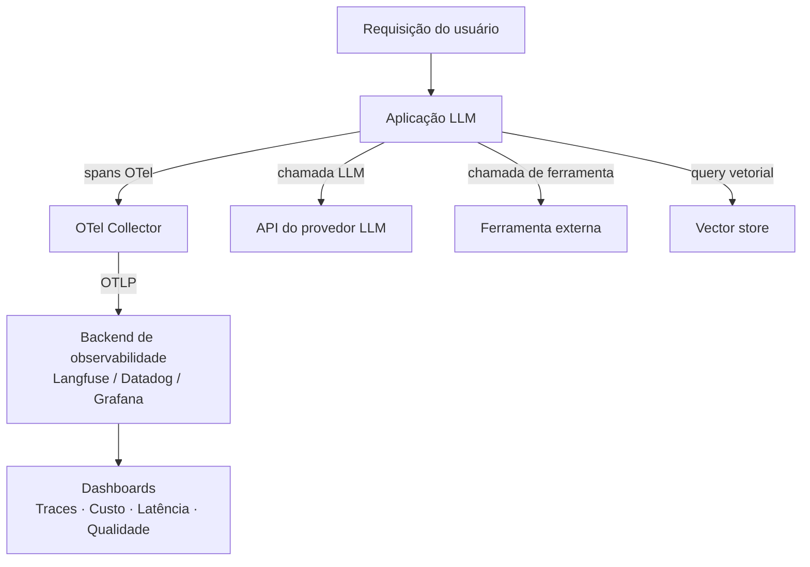

## Definição

**Observabilidade de LLM** é a prática de instrumentar aplicações de modelos de linguagem para que seu comportamento interno possa ser compreendido a partir de suas saídas externas. Emprestado da observabilidade de sistemas distribuídos, os três pilares — **logs**, **métricas** e **traces** — são estendidos com sinais específicos de IA: contagens de tokens, nomes de modelos, templates de prompt, chunks recuperados, chamadas de ferramentas e latência por etapa de geração.

A observabilidade para sistemas de IA é mais difícil do que para serviços convencionais porque chamadas LLM são não-determinísticas, pipelines de agentes em múltiplas etapas introduzem caminhos de execução ramificados, e uma única ação do usuário pode disparar dezenas de chamadas LLM aninhadas. Sem tracing estruturado, depurar uma saída ruim significa reproduzir toda a sessão manualmente.

**OpenTelemetry (OTel)** emergiu como a fundação padrão. As Convenções Semânticas GenAI do OTel (estáveis a partir do OTel v1.37+, 2025) definem nomes de atributos canônicos — `gen_ai.request.model`, `gen_ai.usage.input_tokens`, `gen_ai.provider.name` — para que traces de qualquer framework instrumentado possam ser ingeridos por qualquer backend compatível (Langfuse, Datadog, New Relic, Grafana Tempo) sem alterações no SDK.

## Como funciona

Cada operação lógica — uma chamada LLM, uma etapa de recuperação, uma invocação de ferramenta — é envolvida em um **span OTel**. Spans carregam timestamps de início/fim, status e atributos. Spans aninhados formam uma **árvore de trace** que representa o caminho completo de execução de uma única requisição. Backends ingerem traces via OTLP (HTTP ou gRPC) e os renderizam como diagramas de cascata, permitindo análise de causa raiz quando uma resposta é lenta ou incorreta.

## Quando usar / Quando NÃO usar

| Cenário | Instrumentar | Adiar ou pular |
|---|---|---|
| Agente em múltiplas etapas com chamadas de ferramentas | Sim — trace cada span para depurar loops e falhas | Não — logs sozinhos não conseguem reconstruir o raciocínio do agente |
| Pipeline de RAG em produção | Sim — trace recuperação + geração separadamente | Não — métricas de latência combinadas escondem gargalos de recuperação vs. LLM |
| Gestão de custos entre equipes | Sim — atribua tokens e gastos por usuário/equipe | Não — gastos não atribuídos levam a surpresas na fatura |
| Script de chamada única / protótipo | Talvez — logging leve é suficiente | Sim — configuração completa de OTel é excessiva |
| Ambiente regulado (HIPAA, LGPD) | Sim — mas limpe PII antes de exportar | Não — nunca envie conteúdo bruto de prompt/resposta para backends de terceiros sem revisão |

## Conceitos-chave

| Conceito | Descrição |
|---|---|
| Span | Operação cronometrada única (uma chamada LLM, uma chamada de ferramenta) |
| Trace | Árvore de spans representando uma requisição ponta a ponta |
| OTel GenAI SIG | Grupo de trabalho do OpenTelemetry que define convenções semânticas específicas de IA |
| Atribuição de tokens | Rastrear `input_tokens` e `output_tokens` por span para contabilidade de custos |
| Agrupamento de sessão | Vincular traces que pertencem à mesma conversa do usuário |

## Fontes

- [Convenções Semânticas GenAI do OpenTelemetry](https://opentelemetry.io/docs/specs/semconv/gen-ai/) — definições canônicas de atributos para spans de LLM e agentes
- [Blog do OpenTelemetry — observabilidade GenAI](https://opentelemetry.io/blog/2026/genai-observability/) — post oficial do blog OTel sobre o trabalho do GenAI SIG
- [Observabilidade de agentes de IA — Blog OTel 2025](https://opentelemetry.io/blog/2025/ai-agent-observability/) — padrões em evolução para tracing específico de agentes
- [Documentação do Langfuse](https://langfuse.com/docs) — plataforma open-source de observabilidade de LLM com suporte a backend OTel
- [Uptrace — OpenTelemetry para sistemas de IA](https://uptrace.dev/blog/opentelemetry-ai-systems) — guia prático de instrumentação OTel para apps LLM

## Veja também

- [Tracing](/docs/observability/tracing)
- [Langfuse](/docs/observability/langfuse)
- [Atribuição de custos](/docs/observability/cost-attribution)
- [MLOps](/docs/mlops)
- [Agentes](/docs/agents)
