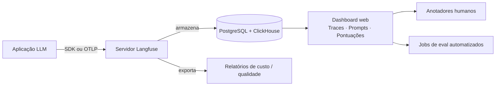

## Definição

**Langfuse** é uma plataforma open-source para observabilidade, avaliação e gerenciamento de prompts de LLM. Ela fornece um backend auto-hospedável que ingere traces de aplicações LLM, permite que equipes anotem e pontuem saídas, gerenciem versões de prompts e monitorem métricas de custo e qualidade ao longo do tempo.

O Langfuse se diferencia de ferramentas de APM fechadas por ser totalmente open-source (licença MIT para o núcleo), suportar auto-hospedagem em qualquer infraestrutura e alinhar-se ativamente com as Convenções Semânticas GenAI do OpenTelemetry — o que significa que pode operar como um backend OTLP padrão, recebendo traces de qualquer framework instrumentado com OTel.

Principais capacidades:
- **Tracing**: Captura spans aninhados para cada chamada LLM, etapa de recuperação e invocação de ferramenta com logging completo de prompt/resposta.
- **Gerenciamento de prompts**: Templates de prompt versionados com comparação A/B e rollout seguro para implantação.
- **Pontuação**: Anexe anotações humanas ou pontuações automáticas de LLM-as-judge a qualquer trace ou span.
- **Analytics**: Uso de tokens, atribuição de custos, latência p50/p95/p99, tendências de qualidade ao longo do tempo.
- **Datasets**: Crie conjuntos de dados de eval curados a partir de traces de produção para testes de regressão.

## Como funciona

As aplicações instrumentam chamadas usando o SDK Python ou JS/TS do Langfuse, ou apontando seu exportador OTel para o endpoint OTLP do Langfuse (`/api/public/otel`). O Langfuse armazena traces no PostgreSQL (metadados, hierarquia) e ClickHouse (analytics de alto volume). O dashboard web fornece visualizações de cascata de traces, diffs de prompts e gráficos de tendências de pontuação.

## Quando usar / Quando NÃO usar

| Cenário | Usar Langfuse | Considerar alternativas |
|---|---|---|
| Observabilidade auto-hospedada necessária (privacidade de dados) | Sim — auto-hospede em sua própria infraestrutura | Não — ferramentas somente na nuvem (Helicone, LangSmith) não funcionarão |
| Versionamento de prompts e testes A/B | Sim — gerenciamento de prompts de primeira classe integrado | Não — se você gerencia prompts no código sem ferramentas de UI |
| Equipe pequena querendo uma ferramenta para tracing + eval | Sim — integra ambos em uma única plataforma | Não — se você já tem Datadog + uma ferramenta de eval separada |
| Alto volume em produção (\>10M traces/mês) | Sim — backend ClickHouse escala para esse nível | Talvez — faça benchmark do desempenho auto-hospedado antes de se comprometer |
| Precisa de fila de anotação humana estilo Braintrust | Sim — fila de anotação e pontuação são integradas | Não — o Braintrust tem uma UX de anotação mais refinada |

## Padrões de integração

| Integração | Método |
|---|---|
| Python SDK | Context managers `langfuse.trace()` / `langfuse.generation()` |
| JS/TS SDK | `langfuse.trace()` com padrões de callback e decorator |
| LangChain | `CallbackHandler` — integração sem alteração de código |
| LlamaIndex | `LlamaIndexInstrumentor` com configuração de uma linha |
| OpenAI SDK | Wrapper drop-in `langfuse.openai` |
| Qualquer framework OTel | Aponte `OTEL_EXPORTER_OTLP_ENDPOINT` para o endpoint OTLP do Langfuse |

## Fontes

- [Documentação do Langfuse](https://langfuse.com/docs) — documentação completa do produto cobrindo SDK, auto-hospedagem e integrações
- [GitHub do Langfuse](https://github.com/langfuse/langfuse) — repositório open-source (licença MIT)
- [Integração OpenTelemetry do Langfuse](https://langfuse.com/integrations/native/opentelemetry) — guia para usar o Langfuse como backend OTLP
- [Gerenciamento de prompts do Langfuse](https://langfuse.com/docs/prompts/get-started) — gerenciamento de prompts versionados com recuperação via SDK

## Veja também

- [Observabilidade](/docs/observability)
- [Tracing](/docs/observability/tracing)
- [Atribuição de custos](/docs/observability/cost-attribution)
- [Evals](/docs/evals)
