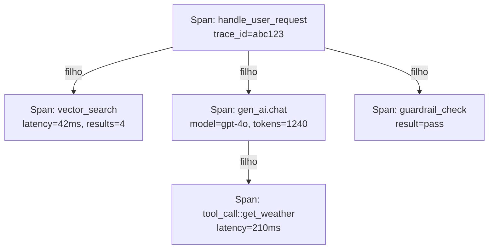

## Definição

**Tracing** em aplicações LLM é a prática de instrumentar cada operação significativa — uma chamada LLM, uma etapa de recuperação, uma invocação de ferramenta, uma verificação de guardrail — como um **span**, e vincular spans relacionados em um **trace** que representa o caminho completo de execução de uma requisição do usuário.

Os traces dão aos engenheiros a capacidade de responder perguntas que logs e métricas sozinhos não conseguem: Por que essa resposta levou 8 segundos? Qual chunk de recuperação foi responsável pela afirmação alucinada? Qual etapa do agente causou o pico de custo? Sem tracing, essas perguntas exigem correlação manual tediosa de logs.

**OpenTelemetry (OTel)** é o padrão aberto para tracing distribuído, e suas **Convenções Semânticas GenAI** (lançadas como estáveis no OTel v1.37+, 2025) definem os atributos canônicos para spans de IA: `gen_ai.request.model`, `gen_ai.usage.input_tokens`, `gen_ai.usage.output_tokens`, `gen_ai.provider.name`, `gen_ai.system`, entre outros. A padronização significa que traces emitidos pelo LangChain, LlamaIndex ou CrewAI podem ser ingeridos pelo Datadog, Grafana ou Langfuse sem conversão de formato.

## Como funciona

### Anatomia de um span

Cada span OTel possui:
- Um **nome** (ex: `gen_ai.chat`, `db.vector_search`)
- **Timestamps de início/fim** para medição de latência
- Um **status** (OK, ERROR)
- **Atributos** carregando metadados estruturados (nome do modelo, contagens de tokens, ID do template de prompt)
- **Eventos** opcionais (ex: timestamps de chunks de streaming)
- Um **ID de span pai** vinculando-o à operação que o envolve

### Montagem do trace

O SDK do OTel, bibliotecas de instrumentação (opentelemetry-instrumentation-openai, opentelemetry-instrumentation-langchain) ou criação manual de spans propagam o `trace_id` por todas as chamadas aninhadas. O OTel Collector recebe spans, aplica amostragem e batching, e os encaminha via OTLP para um backend de observabilidade.

## Quando usar / Quando NÃO usar

| Cenário | Adicionar tracing | Pular tracing |
|---|---|---|
| Agente em múltiplas etapas com chamadas de ferramentas | Sim — essencial para depurar qual etapa falhou | Não — sem tracing, a depuração exige reprodução |
| Pipeline de RAG (recuperar + gerar) | Sim — spans separados para recuperação vs. LLM revelam o gargalo | Não — uma única métrica de latência esconde onde o tempo é gasto |
| Endpoint simples de chat com chamada única | Talvez — span leve para latência; pule instrumentação rica em atributos | Sim — excessivo para um app de uma chamada |
| Setor regulado exigindo trilha de auditoria | Sim — traces fornecem registros imutáveis de chamadas | Não — nunca pule em contextos regulados |
| Desenvolvimento / testes locais | Talvez — amostragem a 100% é adequada localmente | Sim — sem necessidade de exportar; use exportador de console para depuração |

## Atributos-chave GenAI do OTel

| Atributo | Tipo | Descrição |
|---|---|---|
| `gen_ai.system` | string | Provedor LLM (`openai`, `anthropic`, `vertex_ai`) |
| `gen_ai.request.model` | string | ID do modelo solicitado |
| `gen_ai.response.model` | string | Modelo real que atendeu a requisição |
| `gen_ai.usage.input_tokens` | int | Contagem de tokens do prompt |
| `gen_ai.usage.output_tokens` | int | Contagem de tokens do completion |
| `gen_ai.operation.name` | string | Tipo de operação (`chat`, `embeddings`, `rerank`) |
| `server.address` | string | Nome do host do endpoint da API |

## Fontes

- [Convenções Semânticas GenAI do OpenTelemetry](https://opentelemetry.io/docs/specs/semconv/gen-ai/) — definições canônicas de atributos para spans de LLM e agentes
- [Blog OTel — observabilidade GenAI 2026](https://opentelemetry.io/blog/2026/genai-observability/) — guia de implementação para tracing OTel GenAI
- [Blog OTel — observabilidade de agentes de IA 2025](https://opentelemetry.io/blog/2025/ai-agent-observability/) — padrões em evolução para spans de nível de agente e convenções
- [OpenTelemetry para IA — Zylos Research](https://zylos.ai/research/2026-02-28-opentelemetry-ai-agent-observability) — análise profunda sobre instrumentação específica de framework de agentes
- [Integração OTel do Langfuse](https://langfuse.com/integrations/native/opentelemetry) — recebendo spans OTel no Langfuse como backend OTLP

## Veja também

- [Observabilidade](/docs/observability)
- [Langfuse](/docs/observability/langfuse)
- [Atribuição de custos](/docs/observability/cost-attribution)
- [Agentes](/docs/agents)
