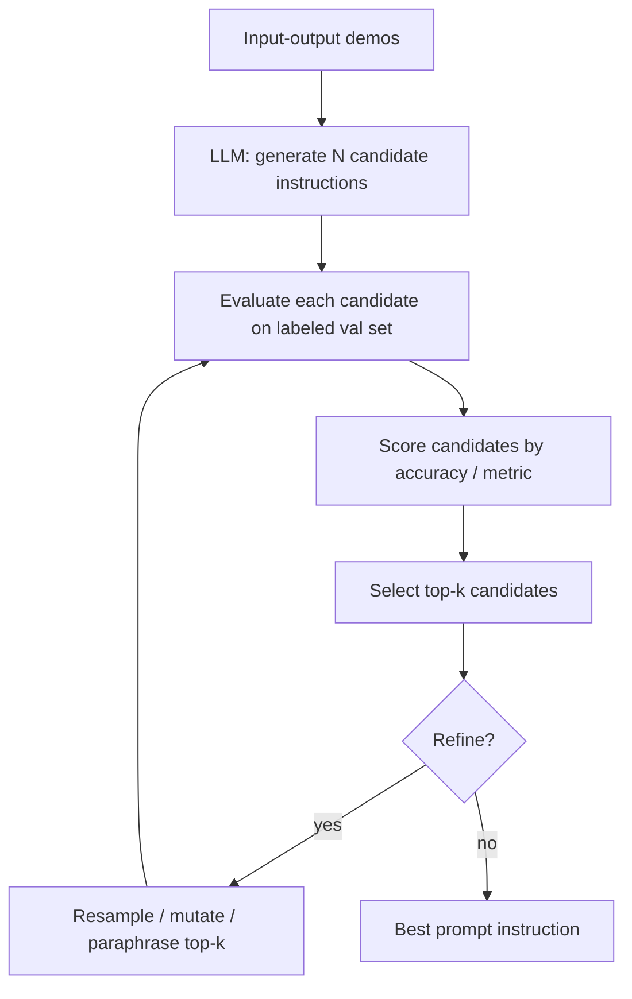

## Definição

A Engenharia Automática de Prompts (APE) é o conjunto de métodos que usam LLMs para gerar, avaliar e selecionar automaticamente instruções de prompts, substituindo a iteração humana manual por otimização sistemática. Em vez de formular prompts manualmente, você define uma função objetivo — geralmente precisão num conjunto de validação — e deixa um algoritmo pesquisar no espaço de prompts possíveis para encontrar o que maximiza essa métrica.

A APE trata prompts como hiperparâmetros e os otimiza por um processo de três etapas: um LLM gera instruções candidatas a partir de exemplos de demonstração entrada-saída; cada candidata é avaliada num conjunto de exemplos rotulados; e as melhores candidatas são selecionadas, opcionalmente refinadas por reamostragem, melhores estratégias de busca ou otimização baseada em gradiente via representações de tokens suaves.

Na prática, a APE varia de ferramentas leves como gerar variações de prompts num LLM e selecionar a melhor num conjunto de validação, a frameworks completos como DSPy (que otimiza cadeias de prompts de ponta a ponta), TextGrad (gradiente textual via LLM) e OPRO (otimização por prompting) da Google DeepMind. A APE é especialmente valiosa quando a engenharia manual de prompts atinge um platô, quando você tem dados rotulados disponíveis, ou quando precisa sistematicamente adaptar prompts para um novo modelo ou domínio.

## Como funciona



### Geração de candidatos

Dado um conjunto de pares de demonstração entrada-saída, um LLM gerador (que pode ser o mesmo modelo que o alvo ou um modelo diferente) é solicitado a sintetizar instruções que corresponderiam a esses exemplos. Prompts típicos de geração parecem com: *"Aqui estão exemplos de tarefas. Escreva uma instrução que melhor descreve a tarefa."* Você pode gerar dezenas a centenas de candidatas em uma única passagem.

### Avaliação e pontuação

Cada instrução candidata é inserida em um template de prompt e testada em um conjunto de validação rotulado. A pontuação de desempenho (precisão, F1, BLEU, exatidão de execução de código — qualquer métrica que corresponda ao seu objetivo) determina a classificação da candidata. Esse loop de avaliação é a parte computacionalmente cara: N candidatos × M exemplos de validação = N×M chamadas de LLM.

### Refinamento

Frameworks APE avançados adicionam loops de refinamento: pegar as melhores instruções, parafraseá-las ou mutá-las e reavaliar. O DSPy compila programas inteiros com módulos interconectados, permitindo a otimização de cadeias complexas e não apenas de instruções únicas. O OPRO mantém um histórico de todos os prompts anteriores e suas pontuações no meta-prompt, encorajando o LLM otimizador a construir iterativamente melhores instruções.

## Quando usar / Quando NÃO usar

| Cenário | APE recomendada | Evitar APE |
|---------|-----------------|------------|
| Você tem ≥ 50 pares entrada-saída rotulados | Sim — conjunto de validação torna a pontuação confiável | Sem dados de treinamento — você não pode pontuar candidatos |
| Engenharia manual de prompts atingiu um platô | Sim — APE explora formulações que humanos perdem | Protótipo inicial — iteração manual é mais rápida e instrutiva |
| Você precisa portar prompts para um novo modelo | Sim — reotimize automaticamente em vez de reformular manualmente | Tarefa de produção de chamada única — overhead da APE não é justificado |
| Restrições de custo rígidas | Não — N×M chamadas de LLM podem ser caras | — |
| Cadeias de raciocínio complexas | Sim (DSPy) — otimiza pipelines de ponta a ponta | — |

## Exemplos de código

### APE leve — gerar e pontuar instruções candidatas

```python
# Lightweight APE: generate candidate prompt instructions and pick the best one
# pip install openai

import os, itertools
from openai import OpenAI

client = OpenAI(api_key=os.environ["OPENAI_API_KEY"])

DEMOS = [
    {"input": "The food was terrible and the service was slow.", "output": "negative"},
    {"input": "Absolutely loved the ambiance and the pasta!", "output": "positive"},
    {"input": "It was okay, nothing special.", "output": "neutral"},
]

VAL_SET = [
    ("Best meal I've had in years!", "positive"),
    ("Never going back, rude staff.", "negative"),
    ("Decent place, a bit pricey.", "neutral"),
    ("Outstanding desserts and friendly service.", "positive"),
    ("Food was cold and tasteless.", "negative"),
]


def generate_candidates(demos: list[dict], n: int = 5) -> list[str]:
    demo_text = "\n".join(
        f"Input: {d['input']}\nOutput: {d['output']}" for d in demos
    )
    prompt = (
        f"Here are example input-output pairs for a task:\n\n{demo_text}\n\n"
        f"Write {n} distinct one-sentence instructions that describe this task. "
        "Output one instruction per line, no numbering."
    )
    resp = client.chat.completions.create(
        model="gpt-4o",
        messages=[{"role": "user", "content": prompt}],
        temperature=0.9,
        max_tokens=300,
    )
    return [line.strip() for line in resp.choices[0].message.content.splitlines() if line.strip()]


def score_instruction(instruction: str, val_set: list[tuple]) -> float:
    correct = 0
    for text, label in val_set:
        resp = client.chat.completions.create(
            model="gpt-4o",
            messages=[
                {"role": "system", "content": instruction},
                {"role": "user", "content": text},
            ],
            temperature=0,
            max_tokens=10,
        )
        pred = resp.choices[0].message.content.strip().lower()
        if label in pred:
            correct += 1
    return correct / len(val_set)


if __name__ == "__main__":
    candidates = generate_candidates(DEMOS, n=6)
    print(f"Generated {len(candidates)} candidates\n")

    results = []
    for inst in candidates:
        acc = score_instruction(inst, VAL_SET)
        results.append((acc, inst))
        print(f"  {acc:.2f}  {inst}")

    best_acc, best_inst = max(results)
    print(f"\nBest instruction (acc={best_acc:.2f}):\n{best_inst}")
```

### DSPy — otimização automática de prompt de ponta a ponta

```python
# DSPy: compile a prompt program with automatic instruction optimization
# pip install dspy-ai

import dspy

# Configure the LM
lm = dspy.LM("openai/gpt-4o", api_key="YOUR_KEY")
dspy.configure(lm=lm)

# Define a typed signature
class SentimentClassifier(dspy.Signature):
    """Classify the sentiment of a customer review."""
    review: str = dspy.InputField()
    sentiment: str = dspy.OutputField(desc="positive, negative, or neutral")

# Wrap in a module
class SentimentModule(dspy.Module):
    def __init__(self):
        self.classify = dspy.Predict(SentimentClassifier)

    def forward(self, review: str) -> dspy.Prediction:
        return self.classify(review=review)

# Training and validation examples
trainset = [
    dspy.Example(review="Best meal I've had in years!", sentiment="positive").with_inputs("review"),
    dspy.Example(review="Never going back, rude staff.", sentiment="negative").with_inputs("review"),
    dspy.Example(review="Decent place, a bit pricey.", sentiment="neutral").with_inputs("review"),
]

# Define metric
def exact_match(example, prediction, trace=None):
    return example.sentiment.lower() == prediction.sentiment.lower()

# Compile with MIPROv2 optimizer (automatic prompt generation + selection)
optimizer = dspy.MIPROv2(metric=exact_match, num_candidates=8, init_temperature=0.9)
module = SentimentModule()
compiled = optimizer.compile(module, trainset=trainset)

# Use the optimized module
result = compiled(review="The waiter was incredibly attentive and the food divine.")
print(result.sentiment)  # positive
```

## Recursos práticos

- [Zhou et al., 2022 — APE original paper](https://arxiv.org/abs/2211.01910) — Paper fundador introduzindo APE: gerar instruções via LLM e selecionar via desempenho no conjunto de validação
- [Documentação DSPy](https://dspy-docs.vercel.app/) — Framework para programar em vez de fazer prompting; otimizadores como MIPRO e BootstrapFewShotWithRandomSearch automatizam APE para pipelines inteiros
- [OPRO — DeepMind, 2023](https://arxiv.org/abs/2309.03409) — "Otimização por prompting": o LLM vê o histórico de prompts anteriores + pontuações e gera instruções melhoradas iterativamente
- [TextGrad](https://github.com/zou-group/textgrad) — Retropropagação via texto: usa feedback de LLM como "gradientes textuais" para refinar componentes do pipeline
- [PromptBreeder (Google DeepMind)](https://arxiv.org/abs/2309.16797) — Algoritmo evolutivo autorreferencial que muta e seleciona simultaneamente prompts de tarefa e prompts de mutação

## Veja também

- [Engenharia de prompts](/docs/prompt-engineering)
- [Temperatura, Top-K, Top-P](/docs/prompt-engineering/temperature-top-k-top-p)
- [Autoconsistência](/docs/prompt-engineering/self-consistency)
- [Autoavaliação e calibração](/docs/prompt-engineering/self-evaluation-calibration)
- [Ensembling de prompts](/docs/prompt-engineering/prompt-ensembling)
- [LLMs](/docs/llms)
