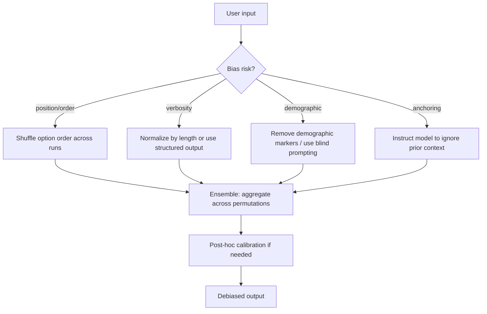

## Definição

Técnicas de desviesamento são métodos projetados para reduzir vieses sistemáticos nas saídas de LLMs — tendências consistentes de produzir certas respostas independentemente do conteúdo de entrada. LLMs herdam vieses de seus dados de treinamento, processo de ajuste fino e da própria formulação dos prompts. Esses vieses podem se manifestar como preferências de posição (favorecer a primeira opção em uma lista), vieses de verbosidade (recompensar respostas mais longas), estereótipos demográficos, efeitos de ancoragem (ser influenciado desproporcionalmente pelo contexto recente) e vieses de conformidade (concordar com o usuário mesmo quando ele está errado).

O desviesamento opera em três níveis. **Técnicas de prompting** modificam a entrada para contrarrestar vieses conhecidos — randomizar a ordem das opções, pedir explicitamente ao modelo que considere alternativas, ou usar templates neutros que não impliquem uma resposta preferida. **Métodos de ensemble** executam múltiplas versões de um prompt com variações controladas e agregam os resultados, fazendo a média dos vieses que vão em direções diferentes entre as variações. **Técnicas de calibração** post-hoc ajustam as probabilidades de saída ou rótulos de classe para alinhar a confiança do modelo com sua precisão real num conjunto de validação.

## Como funciona



### Viés de posição e permutação de ordem

Quando um LLM avalia opções ou responde a questões de múltipla escolha, tende a favorecer sistematicamente certas posições (frequentemente a primeira ou a última). A contramedida mais direta é permutar a ordem das opções em múltiplas chamadas e agregar os votos. Se o modelo realmente prefere a opção A por causa de seu conteúdo, essa preferência deve persistir entre as permutações; se é um viés de posição, os votos se distribuirão entre as posições.

### Desviesamento por instrução

Alguns vieses podem ser mitigados simplesmente pedindo ao modelo. Pedir ao modelo para "ignorar o comprimento das respostas ao avaliar a qualidade", "considerar contra-argumentos antes de responder" ou "não assumir gênero, raça ou etnia" pode reduzir os vieses de verbosidade, ancoragem e demográficos, respectivamente. Essas instruções funcionam melhor em prompts de sistema e devem ser testadas empiricamente num conjunto de validação rotulado.

### Calibração post-hoc

A calibração é um processo estatístico que alinha a confiança relatada pelo modelo com sua precisão real. Se um modelo diz "80% de confiança" mas só está correto 60% das vezes nesses casos, está mal calibrado. A escala de Platt e a calibração de temperatura (um parâmetro de temperatura aprendido no logit antes do softmax) são técnicas comuns. Para tarefas de classificação, você também pode aplicar correção de viés de rótulo baseada na distribuição das previsões num conjunto de calibração.

## Quando usar / Quando NÃO usar

| Cenário | Técnica recomendada | Evitar |
|---------|---------------------|--------|
| Avaliação LLM-as-judge em listas de opções | Permutação de ordem + votação majoritária | Pontuação de passagem única — viés de posição distorce os rankings |
| Extração de atributos demográficos | Prompting cego — remover marcadores identificadores antes da consulta LLM | Passar dados demográficos irrelevantes no contexto |
| Síntese de documentos longos | Pedir explicitamente neutralidade; evitar formulações que impliquem a conclusão | Formulações de prompt iniciais que conduzem o modelo a um resultado |
| Pontuação de confiança de classificação | Calibração de temperatura + curvas de confiabilidade | Confiar em probabilidades brutas de softmax para tomada de decisão de alto risco |
| Redução de viés de gênero/raça | Instrução de desviesamento + teste A/B num conjunto rotulado | Assumir que instruções sozinhas são suficientes — sempre valide empiricamente |

## Exemplos de código

### Desviesamento por permutação de ordem para avaliação LLM

```python
# Debiasing via option-order permutation for LLM-as-judge evaluation
# pip install openai

import os, itertools, collections
from openai import OpenAI

client = OpenAI(api_key=os.environ["OPENAI_API_KEY"])

JUDGE_PROMPT = """You are an impartial evaluator. Given a question and two answers,
decide which answer is better. Reply with ONLY 'A' or 'B'.

Question: {question}

Answer A: {answer_a}

Answer B: {answer_b}
"""


def judge_pair(question: str, answer_a: str, answer_b: str) -> str:
    """Single-pass judge — susceptible to position bias."""
    prompt = JUDGE_PROMPT.format(
        question=question, answer_a=answer_a, answer_b=answer_b
    )
    resp = client.chat.completions.create(
        model="gpt-4o",
        messages=[{"role": "user", "content": prompt}],
        temperature=0,
        max_tokens=1,
    )
    return resp.choices[0].message.content.strip().upper()


def debiased_judge(question: str, ans1: str, ans2: str, runs: int = 4) -> str:
    """
    Run the judge with both orderings multiple times and aggregate.
    Returns the answer content that wins the majority vote.
    """
    votes: dict[str, int] = {ans1: 0, ans2: 0}

    for _ in range(runs // 2):
        # Order 1: ans1 = A, ans2 = B
        result = judge_pair(question, ans1, ans2)
        winner = ans1 if result == "A" else ans2
        votes[winner] += 1

        # Order 2: ans2 = A, ans1 = B
        result = judge_pair(question, ans2, ans1)
        winner = ans2 if result == "A" else ans1
        votes[winner] += 1

    return max(votes, key=votes.get)


if __name__ == "__main__":
    q = "What is the capital of Australia?"
    a = "Sydney is the capital of Australia."          # wrong but verbose
    b = "Canberra is the capital of Australia."        # correct

    biased = judge_pair(q, a, b)
    print(f"Single-pass winner position: {biased}")   # might say A (position bias)

    winner = debiased_judge(q, a, b, runs=4)
    print(f"Debiased winner: {winner[:60]}...")        # should consistently pick b
```

### Desviesamento por instrução e teste A/B

```python
# Instruction-based debiasing with A/B validation
# pip install anthropic

import os, anthropic

client = anthropic.Anthropic(api_key=os.environ["ANTHROPIC_API_KEY"])

BIASED_SYSTEM = "You are a helpful assistant."

DEBIASED_SYSTEM = """You are a helpful assistant.
Important guidelines:
- Do not let the length or style of a response influence your quality judgments.
- Do not assume gender, race, ethnicity, or other demographic attributes unless explicitly stated.
- Consider counter-arguments before drawing conclusions.
- Base your answers solely on the content provided, not on the order information is presented."""

VAL_SET = [
    {
        "question": "Who invented the telephone?",
        "expected_keywords": ["alexander", "graham", "bell"],
    },
    {
        "question": "Is a longer answer always a better answer?",
        "expected_keywords": ["no", "not", "concise", "brevity"],
    },
]


def evaluate(system_prompt: str, val_set: list[dict]) -> float:
    correct = 0
    for item in val_set:
        resp = client.messages.create(
            model="claude-opus-4-5",
            max_tokens=256,
            system=system_prompt,
            messages=[{"role": "user", "content": item["question"]}],
            temperature=0,
        )
        answer = resp.content[0].text.lower()
        if any(kw in answer for kw in item["expected_keywords"]):
            correct += 1
    return correct / len(val_set)


if __name__ == "__main__":
    biased_score = evaluate(BIASED_SYSTEM, VAL_SET)
    debiased_score = evaluate(DEBIASED_SYSTEM, VAL_SET)
    print(f"Biased system prompt accuracy:   {biased_score:.2f}")
    print(f"Debiased system prompt accuracy: {debiased_score:.2f}")
```

## Recursos práticos

- [Zhao et al., 2021 — Calibrate Before Use](https://arxiv.org/abs/2102.09690) — Identifica vieses de maioria de rótulo e de posição no prompting few-shot; propõe calibração contextual para corrigi-los
- [Wang et al., 2023 — Large Language Models are not Fair Evaluators](https://arxiv.org/abs/2305.17926) — Documenta vieses de posição em LLMs-as-judge e propõe permutação de posição + calibração como remédio
- [Ko et al., 2020 — Revisiting the Calibration of Modern Language Models](https://arxiv.org/abs/2010.14180) — Fornece métodos de calibração de temperatura aplicados às saídas de LLM
- [Anthropic — Pesquisa sobre vieses e equidade](https://www.anthropic.com/research) — Trabalhos publicados da Anthropic sobre equidade, preconceitos e redução de comportamentos prejudiciais

## Veja também

- [Engenharia de prompts](/docs/prompt-engineering)
- [Autoconsistência](/docs/prompt-engineering/self-consistency)
- [Ensembling de prompts](/docs/prompt-engineering/prompt-ensembling)
- [Autoavaliação e calibração](/docs/prompt-engineering/self-evaluation-calibration)
- [LLMs](/docs/llms)
