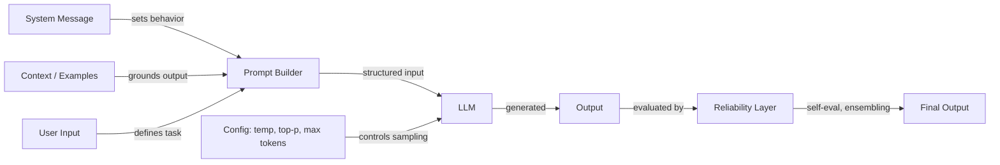

## Definição

A engenharia de prompts é a prática de elaborar texto de entrada — instruções, exemplos, restrições e contexto — para controlar o comportamento de grandes modelos de linguagem sem modificar seus pesos. É a interface principal entre a intenção humana e a saída do modelo, abrangendo desde a formulação de instruções simples até sofisticadas estratégias de raciocínio em múltiplas etapas.

A disciplina cobre três domínios interligados. A **configuração** inclui parâmetros de amostragem (temperatura, Top-K, Top-P) e controles de geração (máximo de tokens, sequências de parada) que determinam como o modelo produz tokens. As **técnicas** incluem abordagens estruturadas como cadeia de pensamento, autoconsistência, step-back prompting e prompting de sistema/papel que guiam o processo de raciocínio do modelo. A **confiabilidade** aborda métodos para tornar as saídas mais confiáveis — desviesamento, ensembling de prompts e autoavaliação.

À medida que os LLMs se integram a sistemas de produção, a engenharia de prompts evoluiu de experimentação ad hoc para uma prática sistemática. Ferramentas como o [DSPy](https://dspy-docs.vercel.app/) e a [Engenharia Automática de Prompts](/docs/prompt-engineering/automatic-prompt-engineering) até automatizam partes do processo. Seja construindo um chatbot, um assistente de código ou um pipeline de extração de dados, a engenharia de prompts é a primeira — e mais acessível — alavanca para melhorar a qualidade das saídas.

## Como funciona

### O pipeline de prompts

Toda interação com um LLM começa com um prompt — uma entrada estruturada que pode incluir uma mensagem de sistema, instruções do usuário, exemplos e contexto recuperado. O modelo processa essa entrada e gera a saída token por token, moldada tanto pelo conteúdo do prompt quanto pela configuração de amostragem.

### Configuração vs. técnica

Parâmetros de configuração (temperatura, Top-K, Top-P, máximo de tokens) operam no nível da amostragem de tokens — eles influenciam *como* o modelo seleciona cada token. Técnicas (cadeia de pensamento, autoconsistência, step-back) operam no nível do design do prompt — elas influenciam *sobre o que* o modelo raciocina. Essas duas camadas interagem: a autoconsistência requer temperatura alta para gerar caminhos de raciocínio diversificados, enquanto a extração de saídas estruturadas funciona melhor com temperatura baixa para determinismo.

### A camada de confiabilidade

A engenharia avançada de prompts adiciona uma camada de confiabilidade sobre o prompting básico. Isso inclui executar múltiplos prompts em paralelo (ensembling), pedir ao modelo que critique sua própria saída (autoavaliação) e aplicar estratégias de desviesamento para reduzir erros sistemáticos. Esses métodos trocam custo computacional por qualidade de saída e são especialmente importantes em aplicações de alto risco.

## Quando usar / Quando NÃO usar

| Cenário | Aplicar engenharia de prompts | Pular / usar alternativas |
|---|---|---|
| Melhorar a qualidade das saídas sem retreinar | Sim — a engenharia de prompts é a alavanca mais rápida | Não — se o problema é uma lacuna de capacidade que o modelo não consegue superar |
| Ajustar persona, tom ou formato do modelo | Sim — system prompts e instruções de papel são altamente eficazes | Não — se o parsing downstream exige schemas rígidos, use [saídas estruturadas](/docs/prompt-engineering/structured-outputs) com modo JSON |
| Tarefas de raciocínio em múltiplas etapas (matemática, lógica, planejamento de código) | Sim — adicione cadeia de pensamento ou step-back prompting | Não — para respostas simples em etapa única, adicionar etapas de raciocínio aumenta o custo sem benefício |
| Reduzir alucinações em consultas com muito conhecimento | Sim — combine com [RAG](/docs/rag) para fundamentar respostas em fatos recuperados | Não — a engenharia de prompts isolada não adiciona conhecimento que o modelo não foi treinado |
| Inferência de alto volume e com restrição de latência | Parcialmente — mantenha os prompts concisos; evite exemplos few-shot quando zero-shot é suficiente | Sim — prompts longos e técnicas com múltiplas chamadas (autoconsistência, ensembling) adicionam custo e latência |
| Salvaguardas de segurança e conformidade | Parcialmente — system prompts podem restringir o comportamento | Não — para requisitos de segurança estritos, adicione guardrails programáticos; modelos podem ser jailbroken |
| Precisão em domínio específico em escala | Parcialmente — o prompting few-shot ajuda | Sim — considere [ajuste fino](/docs/llms/fine-tuning) quando a engenharia de prompts atinge o teto de qualidade |

## Recursos práticos

- [OpenAI — Guia de engenharia de prompts](https://platform.openai.com/docs/guides/prompt-engineering) — Guia abrangente cobrindo melhores práticas e estratégias
- [Anthropic — Design de prompts](https://docs.anthropic.com/en/docs/build-with-claude/prompt-engineering/overview) — Documentação oficial de prompting da Anthropic
- [Learn Prompting](https://learnprompting.org/) — Curso de código aberto cobrindo técnicas de engenharia de prompts
- [Prompt Engineering Guide (DAIR.AI)](https://www.promptingguide.ai/) — Guia mantido pela comunidade com papers e técnicas
- [Documentação DSPy](https://dspy-docs.vercel.app/) — Framework para otimização programática de prompts

## Veja também

- [Temperatura, Top-K, Top-P](/docs/prompt-engineering/temperature-top-k-top-p)
- [Máximo de tokens e sequências de parada](/docs/prompt-engineering/max-tokens-stop-sequences)
- [Saídas estruturadas](/docs/prompt-engineering/structured-outputs)
- [Prompts de sistema, de papel e contextuais](/docs/prompt-engineering/system-role-contextual-prompting)
- [Autoconsistência](/docs/prompt-engineering/self-consistency)
- [Step-back prompting](/docs/prompt-engineering/step-back-prompting)
- [Engenharia Automática de Prompts (APE)](/docs/prompt-engineering/automatic-prompt-engineering)
- [Técnicas de desviesamento](/docs/prompt-engineering/debiasing-techniques)
- [Ensembling de prompts](/docs/prompt-engineering/prompt-ensembling)
- [Autoavaliação e calibração](/docs/prompt-engineering/self-evaluation-calibration)
- [LLMs](/docs/llms)
- [Cadeia de pensamento](/docs/reasoning-patterns/cot)
- [RAG](/docs/rag)
- [Agentes de IA](/docs/agents)
