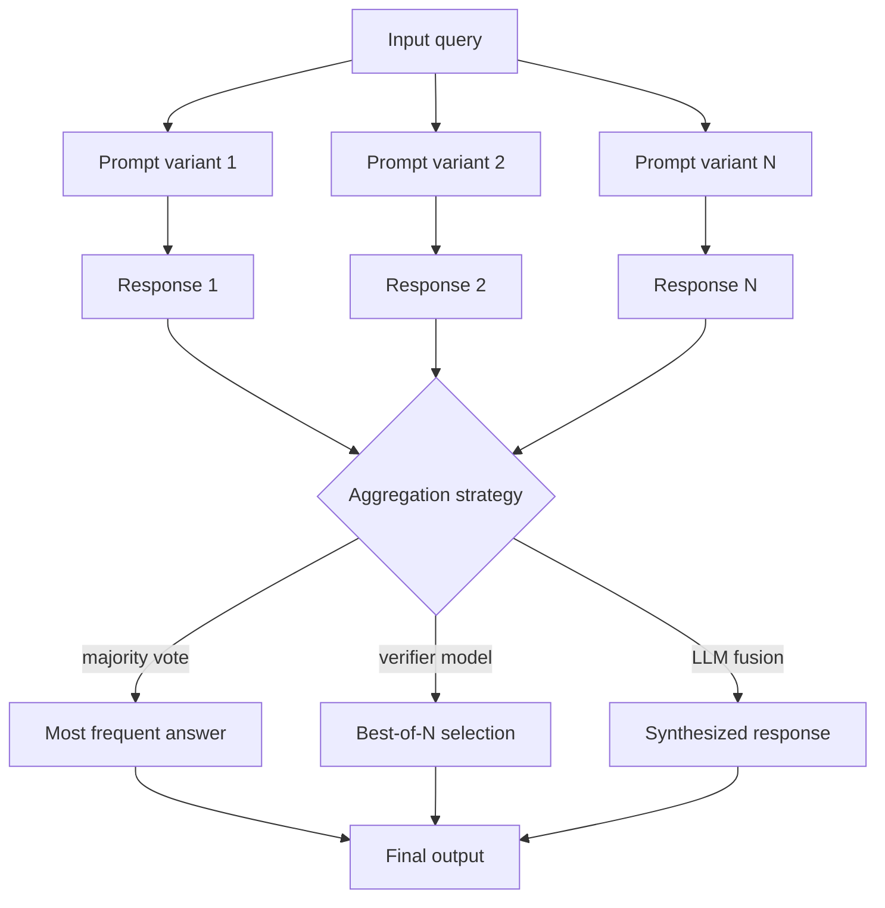

## Definição

Ensembling de prompts é a prática de executar múltiplas versões de um prompt — variando a formulação, os exemplos few-shot, os parâmetros de amostragem ou até os modelos subjacentes — e então agregar suas saídas para produzir uma resposta final mais confiável. Assim como métodos de ensemble no aprendizado de máquina tradicional (florestas aleatórias, boosting) reduzem a variância combinando preditores fracos, o ensembling de prompts aproveita a diversidade das saídas de LLM para mitigar erros sistemáticos, vieses de posição e variância de amostragem.

A estratégia de agregação mais simples é a votação majoritária: fazer a mesma pergunta de múltiplas formas e tomar a resposta mais frequente. Para tarefas de geração de texto livre, estratégias mais sofisticadas incluem seleção do melhor resultado por um modelo verificador, fusão de respostas (pedir a um LLM para sintetizar as N melhores respostas em uma única) e ponderação baseada em confiança (ponderar respostas pelas probabilidades log ou pontuações de confiança auto-relatadas).

O ensembling de prompts está intimamente relacionado à autoconsistência (que é um tipo de ensemble para tarefas de raciocínio) mas é mais geral: aplica-se a classificação, perguntas e respostas factuais, geração de resumos, tradução, anotação de dados e qualquer cenário onde você possa definir um procedimento de agregação e possa executar o pipeline N vezes.

## Como funciona



### Variantes de prompts

A diversidade é o motor do ensembling. Tipos comuns de variação incluem: reformulação das instruções (formal vs. informal, direta vs. guiada), diferentes seleções de exemplos few-shot (conjuntos diferentes ou aleatórios de exemplos), variação do papel ou persona no prompt de sistema, diferentes parâmetros de temperatura ou ordem de geração, e modelos subjacentes completamente diferentes.

### Estratégias de agregação

**Votação majoritária**: Contar respostas distintas e tomar a mais frequente. Funciona bem para classificação e perguntas e respostas de resposta curta. Para respostas longas, você precisa primeiro normalizar ou resumir antes de votar.

**Melhor de N (verificador)**: Gerar N respostas candidatas e usar um modelo separado (ou o mesmo modelo com um prompt diferente) para avaliá-las e selecionar a melhor. Mais caro mas mais preciso do que votação cega quando um bom sinal de verificação está disponível.

**Fusão por LLM**: Fornecer todas as N respostas para um LLM e pedir para sintetizá-las em uma única resposta coerente. Útil quando as respostas são parcialmente corretas e se complementam.

## Quando usar / Quando NÃO usar

| Cenário | Ensemble recomendado | Evitar |
|---------|----------------------|--------|
| Tarefas de classificação de alto risco | Votação majoritária em >= 5 variantes | Resposta única — variância de passagem única degrada métricas |
| Perguntas e respostas factuais com ambiguidade conhecida | Melhor de N com verificador | Quando a precisão não pode ser avaliada programaticamente |
| Geração de resumos | Fusão por LLM das N melhores saídas | Conteúdo criativo — o ensemble homogeneiza o estilo |
| Anotação de dados para treinamento | Votação majoritária + filtro de desacordo | Latência em tempo real crítica — N chamadas = N× o atraso |
| Restrições de custo rígidas | Não recomendado | — |

## Exemplos de código

### Votação majoritária em variantes de prompts

```python
# Prompt ensembling with majority vote
# pip install openai

import os, collections
from openai import OpenAI

client = OpenAI(api_key=os.environ["OPENAI_API_KEY"])

QUESTION = "What is the boiling point of water at sea level in Celsius?"

PROMPT_VARIANTS = [
    "Answer in one word or number: {question}",
    "Give only the numeric answer: {question}",
    "You are a science tutor. {question} Reply with just the number.",
    "Fact: {question} Answer concisely.",
    "In exactly one number, answer: {question}",
]


def ask(prompt_template: str, question: str) -> str:
    prompt = prompt_template.format(question=question)
    resp = client.chat.completions.create(
        model="gpt-4o",
        messages=[{"role": "user", "content": prompt}],
        temperature=0.3,
        max_tokens=20,
    )
    return resp.choices[0].message.content.strip()


def majority_vote(answers: list[str]) -> str:
    # Normalize: extract first numeric token if present
    normalized = []
    for a in answers:
        tokens = a.split()
        num = next((t.strip("°C.") for t in tokens if t.strip("°C.").lstrip("-").isdigit()), a)
        normalized.append(num)
    counter = collections.Counter(normalized)
    return counter.most_common(1)[0][0]


if __name__ == "__main__":
    answers = [ask(v, QUESTION) for v in PROMPT_VARIANTS]
    for variant, ans in zip(PROMPT_VARIANTS, answers):
        print(f"  [{ans:>5}]  {variant[:50]}")

    final = majority_vote(answers)
    print(f"\nEnsemble answer: {final}")   # expected: 100
```

### Melhor de N com um LLM verificador

```python
# Best-of-N ensembling with a verifier
# pip install anthropic

import os
import anthropic

client = anthropic.Anthropic(api_key=os.environ["ANTHROPIC_API_KEY"])

TASK = (
    "Write a one-paragraph explanation of gradient descent "
    "suitable for a high-school student."
)


def generate_candidates(task: str, n: int = 4) -> list[str]:
    candidates = []
    for _ in range(n):
        resp = client.messages.create(
            model="claude-opus-4-5",
            max_tokens=200,
            messages=[{"role": "user", "content": task}],
            temperature=0.8,
        )
        candidates.append(resp.content[0].text.strip())
    return candidates


def select_best(task: str, candidates: list[str]) -> str:
    numbered = "\n\n".join(f"[{i+1}] {c}" for i, c in enumerate(candidates))
    verifier_prompt = (
        f"Task: {task}\n\nCandidates:\n{numbered}\n\n"
        "Which candidate best fulfills the task? "
        "Reply with ONLY the number (e.g. '2')."
    )
    resp = client.messages.create(
        model="claude-opus-4-5",
        max_tokens=5,
        messages=[{"role": "user", "content": verifier_prompt}],
        temperature=0,
    )
    idx_str = resp.content[0].text.strip()
    idx = int(idx_str) - 1
    return candidates[idx]


if __name__ == "__main__":
    candidates = generate_candidates(TASK, n=4)
    best = select_best(TASK, candidates)
    print("Selected best candidate:\n")
    print(best)
```

## Recursos práticos

- [Wang et al., 2022 — Self-Consistency improves Chain-of-Thought](https://arxiv.org/abs/2203.11171) — Introduz a autoconsistência como uma forma de ensemble para raciocínio; votação majoritária em caminhos de pensamento diversificados
- [Cobbe et al., 2021 — Training Verifiers to Solve Math Word Problems](https://arxiv.org/abs/2110.14168) — Seleção melhor de N guiada por verificador aprendido; mostra como verificadores podem melhorar a seleção no ensemble
- [Li et al., 2022 — Competition-Level Code Generation](https://arxiv.org/abs/2203.07814) — AlphaCode gera centenas de milhares de programas e filtra/agrupa para encontrar os melhores — ensemble ao extremo para geração de código
- [Liang et al., 2022 — Holistic Evaluation of Language Models](https://arxiv.org/abs/2211.09110) — HELM fornece benchmarks que revelam variância entre execuções, motivando abordagens de ensemble

## Veja também

- [Engenharia de prompts](/docs/prompt-engineering)
- [Autoconsistência](/docs/prompt-engineering/self-consistency)
- [Técnicas de desviesamento](/docs/prompt-engineering/debiasing-techniques)
- [Autoavaliação e calibração](/docs/prompt-engineering/self-evaluation-calibration)
- [Engenharia automática de prompts](/docs/prompt-engineering/automatic-prompt-engineering)
- [LLMs](/docs/llms)
