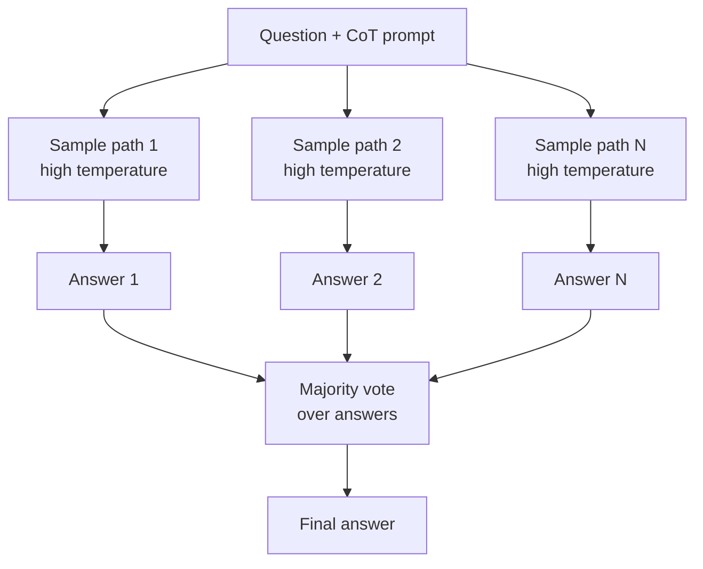

## Definição

A autoconsistência é uma estratégia de decodificação para LLMs que substitui a resposta de caminho único da cadeia de pensamento (CoT) por um ensemble de caminhos de raciocínio diversificados, depois seleciona a resposta final por votação majoritária. Em vez de confiar em uma única cadeia de pensamento (que pode conter um erro de raciocínio fatal), você amostra N caminhos de pensamento independentes em temperatura mais alta e toma a resposta que aparece com mais frequência. Essa ideia simples melhora de forma confiável a precisão em aritmética, raciocínio lógico e tarefas de perguntas e respostas factuais sem exigir treinamento adicional ou feedback externo.

A intuição é que processos de raciocínio corretos tendem a convergir para a resposta certa por múltiplas rotas, enquanto os erros são mais aleatórios. Ao agregar N tentativas, o sinal correto se amplifica e o ruído estocástico é reduzido pela média. O método é complementar à CoT básica: você ainda precisa de um prompt CoT eficaz; a autoconsistência simplesmente adiciona robustez executando esse prompt várias vezes.

## Como funciona



### Etapa 1: Prompt CoT

Construir um prompt CoT básico — seja com exemplos few-shot que mostram raciocínio passo a passo, ou com uma instrução zero-shot como "Vamos raciocinar passo a passo". Esse prompt permanece fixo para todos os caminhos.

### Etapa 2: Amostragem com temperatura

Definir temperatura > 0 (tipicamente 0,5–1,0) para encorajar diversidade. Amostrar N completações independentes — cada execução produz um caminho de raciocínio diferente e um rótulo de resposta final. N fica tipicamente no intervalo de 5–40, dependendo do orçamento de custo e da complexidade da tarefa.

### Etapa 3: Votação majoritária

Extrair a resposta final de cada caminho (frequentemente a última linha ou um token de resposta claramente delimitado). Agregar por votação majoritária — a resposta que aparece com mais frequência vence. Para respostas de texto livre, você precisará normalizar as respostas (correspondência de string, LLM-as-judge ou expressões regulares) antes de votar.

## Quando usar / Quando NÃO usar

| Cenário | Parâmetros recomendados | Evitar |
|---------|-------------------------|--------|
| Raciocínio aritmético e matemático | N=10–20, temperatura=0,7 | Temperature=0 — todos os caminhos seriam idênticos |
| Perguntas e respostas factuais de resposta curta | N=5–10, temperatura=0,5 | Saídas muito longas — custo N× é proibitivo |
| Raciocínio lógico e simbólico | N=10–20, temperatura=0,8 | Tarefas criativas — consistência não é um objetivo útil aqui |
| Problemas de álgebra e provas | N=20–40, temperatura=0,7 | Restrições rígidas de latência — N chamadas = N× o atraso |
| Anotação de dados (auto-rotulagem) | N=5, voto como rótulo de confiança | Tarefas de geração de texto livre — difícil de votar de forma confiável |

## Exemplos de código

### Autoconsistência com raciocínio matemático

```python
# Self-consistency for math reasoning
# pip install openai

import os, re, collections
from openai import OpenAI

client = OpenAI(api_key=os.environ["OPENAI_API_KEY"])

COT_SYSTEM = (
    "You are a math tutor. Solve step by step, then write "
    "'Answer: <number>' on the last line."
)

PROBLEM = (
    "A store sells apples for $0.50 each and oranges for $0.75 each. "
    "If Alice buys 4 apples and 3 oranges, how much does she spend in total?"
)


def sample_path(problem: str) -> str:
    resp = client.chat.completions.create(
        model="gpt-4o",
        messages=[
            {"role": "system", "content": COT_SYSTEM},
            {"role": "user", "content": problem},
        ],
        temperature=0.7,
        max_tokens=300,
    )
    return resp.choices[0].message.content.strip()


def extract_answer(path: str) -> str | None:
    match = re.search(r"Answer:\s*\$?([\d.]+)", path, re.IGNORECASE)
    return match.group(1) if match else None


def self_consistent_answer(problem: str, n: int = 10) -> str:
    paths = [sample_path(problem) for _ in range(n)]
    answers = [extract_answer(p) for p in paths]
    valid = [a for a in answers if a is not None]

    if not valid:
        return "Could not extract a consistent answer."

    counter = collections.Counter(valid)
    winner, count = counter.most_common(1)[0]
    print(f"Vote distribution: {dict(counter)}")
    return f"${winner} (voted by {count}/{n} paths)"


if __name__ == "__main__":
    result = self_consistent_answer(PROBLEM, n=10)
    print(f"\nSelf-consistent answer: {result}")
    # Expected: $4.25 (4×0.50 + 3×0.75 = 2.00 + 2.25)
```

### Autoconsistência com Anthropic

```python
# Self-consistency with Anthropic for logical reasoning
# pip install anthropic

import os, re, collections
import anthropic

client = anthropic.Anthropic(api_key=os.environ["ANTHROPIC_API_KEY"])

SYSTEM = (
    "Solve the following logic problem step by step. "
    "At the very end, write 'Answer: <your answer>' on its own line."
)

PROBLEM = (
    "All mammals are warm-blooded. Dolphins are mammals. "
    "Some warm-blooded animals live in the ocean. "
    "Is it necessarily true that dolphins are warm-blooded? "
    "Answer Yes or No."
)


def sample(problem: str) -> str:
    resp = client.messages.create(
        model="claude-opus-4-5",
        max_tokens=300,
        system=SYSTEM,
        messages=[{"role": "user", "content": problem}],
        temperature=0.6,
    )
    return resp.content[0].text.strip()


def extract(text: str) -> str | None:
    m = re.search(r"Answer:\s*(Yes|No)", text, re.IGNORECASE)
    return m.group(1).capitalize() if m else None


if __name__ == "__main__":
    n = 8
    paths = [sample(PROBLEM) for _ in range(n)]
    answers = [extract(p) for p in paths]
    valid = [a for a in answers if a]

    counter = collections.Counter(valid)
    print("Vote distribution:", dict(counter))

    if valid:
        winner = counter.most_common(1)[0][0]
        print(f"Self-consistent answer: {winner}")   # Expected: Yes
```

## Recursos práticos

- [Wang et al., 2022 — Self-Consistency improves Chain-of-Thought Reasoning in LLMs](https://arxiv.org/abs/2203.11171) — Paper fundador: demonstra melhorias significativas de precisão no GSM8K, MATH e benchmarks de raciocínio substituindo decodificação gulosa por votação majoritária de amostragem
- [Wei et al., 2022 — Chain-of-Thought Prompting Elicits Reasoning in LLMs](https://arxiv.org/abs/2201.11903) — O paper CoT original do qual a autoconsistência é uma extensão; fornece a base e os benchmarks
- [Fu et al., 2022 — Complexity-Based Prompting for Multi-Step Reasoning](https://arxiv.org/abs/2210.00720) — Mostra que selecionar respostas CoT por complexidade de raciocínio (comprimento dos passos) melhora ainda mais a autoconsistência
- [Liang et al., 2023 — Encouraging Divergent Thinking in LLMs](https://arxiv.org/abs/2305.19118) — Prompting por decomposição múltipla (DECOMP) para diversificar caminhos de raciocínio além da variação de temperatura

## Veja também

- [Engenharia de prompts](/docs/prompt-engineering)
- [Cadeia de pensamento](/docs/reasoning-patterns/cot)
- [Ensembling de prompts](/docs/prompt-engineering/prompt-ensembling)
- [Temperatura, Top-K, Top-P](/docs/prompt-engineering/temperature-top-k-top-p)
- [Autoavaliação e calibração](/docs/prompt-engineering/self-evaluation-calibration)
- [LLMs](/docs/llms)
