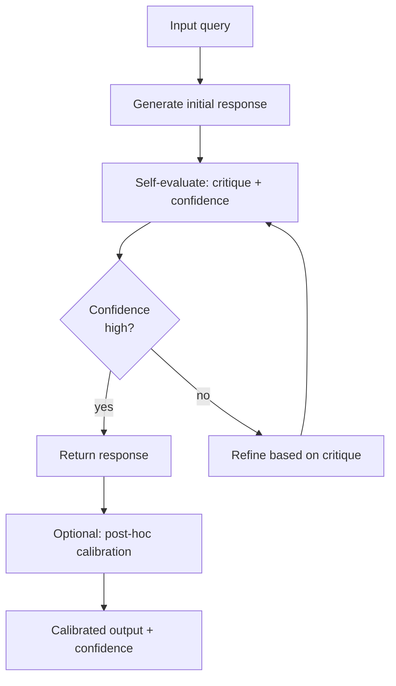

## Definição

Autoavaliação é a capacidade de um LLM de criticar, classificar ou refinar suas próprias saídas sem supervisão humana. Calibração refere-se ao alinhamento entre a confiança relatada por um modelo e sua precisão real — um modelo bem calibrado que diz "estou 80% confiante" deve estar correto 80% das vezes para essas afirmações. Juntas, essas capacidades permitem que pipelines de LLM melhorem iterativamente, sinalizem respostas incertas para revisão humana e forneçam estimativas de incerteza acionáveis.

A autoavaliação assume várias formas. A **autocrítica** pede ao modelo para revisar sua própria saída e identificar erros ou omissões. A **pontuação de confiança** solicita ao modelo que expresse sua incerteza sobre sua resposta, seja verbalmente ("Tenho bastante certeza...") ou numericamente (uma pontuação de 0–100). A **correção iterativa** usa essas críticas para refinar a saída em múltiplos turnos. A **calibração de probabilidade** é um processo post-hoc que ajusta as probabilidades de saída de um modelo para que correspondam à precisão empírica num conjunto de validação.

## Como funciona



### Autocrítica em turno único

A forma mais simples de autoavaliação consiste em pedir ao modelo para revisar sua própria resposta no mesmo turno de conversa. Após gerar uma resposta inicial, você adiciona um acompanhamento: "Examine sua resposta anterior. Há erros, omissões ou formulações enganosas? Se sim, forneça uma versão corrigida." Isso custa uma chamada de LLM adicional mas frequentemente melhora a qualidade para tarefas factuais e analíticas.

### Pontuação de confiança

Solicitar explicitamente aos modelos que expressem sua incerteza frequentemente produz estimativas de confiança úteis. Prompts como "Responda, depois avalie sua confiança numa escala de 1–10 com justificativa" ou "Se não tiver certeza, diga claramente" podem ajudar a identificar casos de borda. No entanto, note que LLMs são conhecidos por ser mal calibrados — eles podem expressar alta confiança enquanto estão incorretos — então pontuações auto-relatadas devem ser validadas empiricamente em conjuntos de dados de referência.

### Calibração post-hoc

A calibração de probabilidade tenta corrigir a curva de confiança do modelo. A escala de Platt e o binning de Platt aprendem uma transformação monotônica sobre as pontuações brutas do modelo para que correspondam a taxas de precisão empíricas. A calibração de temperatura divide os logits do modelo por um parâmetro de temperatura T aprendido num conjunto de validação (distinto do conjunto de teste). Esses métodos são especialmente importantes em aplicações de alto risco onde a confiança mal calibrada pode ter graves consequências.

## Quando usar / Quando NÃO usar

| Cenário | Recomendado | Evitar |
|---------|-------------|--------|
| Extração de fatos de alta precisão | Autocrítica + calibração de temperatura | Sem mecanismo de autoverificação — alucinações passam sem sinalização |
| Anotação automática de dados | Pontuação de confiança + filtro de limiar | Aceitar todas as anotações autogeradas sem filtro de confiança |
| Sistemas de alto risco (médico, jurídico) | Calibração post-hoc + regras de escalada humana | Confiar em pontuações de confiança auto-relatadas sem validação empírica |
| Perguntas e respostas em tempo real com latência restrita | Autocrítica leve em turno único | Loops de refinamento multi-turno — latência muito alta |
| Conjunto de dados de teste / confiabilidade de avaliações | Calibração + curvas de confiabilidade | Usar probabilidades brutas não calibradas para decisões de limiarização |

## Exemplos de código

### Autocrítica e refinamento iterativo

```python
# Self-evaluation with iterative refinement
# pip install openai

import os
from openai import OpenAI

client = OpenAI(api_key=os.environ["OPENAI_API_KEY"])


def generate(prompt: str) -> str:
    resp = client.chat.completions.create(
        model="gpt-4o",
        messages=[{"role": "user", "content": prompt}],
        temperature=0.3,
        max_tokens=512,
    )
    return resp.choices[0].message.content.strip()


def self_critique(response: str, task: str) -> str:
    critique_prompt = (
        f"Task: {task}\n\n"
        f"Response to evaluate:\n{response}\n\n"
        "Identify any factual errors, logical gaps, missing important points, "
        "or unclear statements in the response above. "
        "Be specific. If the response is fully correct and complete, say 'No issues found.'"
    )
    return generate(critique_prompt)


def refine(response: str, critique: str, task: str) -> str:
    refine_prompt = (
        f"Task: {task}\n\n"
        f"Original response:\n{response}\n\n"
        f"Critique:\n{critique}\n\n"
        "Write an improved response that addresses all the issues raised in the critique."
    )
    return generate(refine_prompt)


def self_evaluate_pipeline(task: str, max_rounds: int = 2) -> str:
    response = generate(task)
    print(f"Initial response:\n{response}\n")

    for round_num in range(1, max_rounds + 1):
        critique = self_critique(response, task)
        print(f"Round {round_num} critique:\n{critique}\n")

        if "no issues found" in critique.lower():
            print("Self-evaluation: response accepted.")
            break

        response = refine(response, critique, task)
        print(f"Round {round_num} refined response:\n{response}\n")

    return response


if __name__ == "__main__":
    task = (
        "Explain the difference between supervised and unsupervised learning "
        "in machine learning. Include one example of each."
    )
    final = self_evaluate_pipeline(task, max_rounds=2)
    print("=== FINAL RESPONSE ===")
    print(final)
```

### Pontuação de confiança com Anthropic

```python
# Confidence scoring and calibration check
# pip install anthropic

import os, re
import anthropic

client = anthropic.Anthropic(api_key=os.environ["ANTHROPIC_API_KEY"])

QA_PAIRS = [
    ("What is the chemical symbol for gold?", "Au"),
    ("Who wrote 'Pride and Prejudice'?", "Jane Austen"),
    ("What is the square root of 144?", "12"),
    ("In what year did World War II end?", "1945"),
    ("What is the capital of Brazil?", "Brasília"),
]


def ask_with_confidence(question: str) -> tuple[str, int]:
    prompt = (
        f"Question: {question}\n\n"
        "Answer the question, then on a new line write: "
        "'Confidence: X/10' where X is your confidence (1=very unsure, 10=certain)."
    )
    resp = client.messages.create(
        model="claude-opus-4-5",
        max_tokens=150,
        messages=[{"role": "user", "content": prompt}],
        temperature=0,
    )
    text = resp.content[0].text.strip()
    confidence_match = re.search(r"Confidence:\s*(\d+)/10", text)
    confidence = int(confidence_match.group(1)) if confidence_match else 5
    answer_text = re.sub(r"\nConfidence:.*", "", text).strip()
    return answer_text, confidence


def calibration_report(qa_pairs: list[tuple]) -> None:
    high_conf_correct = 0
    high_conf_total = 0
    low_conf_correct = 0
    low_conf_total = 0

    for question, expected in qa_pairs:
        answer, confidence = ask_with_confidence(question)
        correct = expected.lower() in answer.lower()
        print(f"Q: {question}")
        print(f"A: {answer[:80]} | Confidence: {confidence}/10 | Correct: {correct}")
        print()

        if confidence >= 8:
            high_conf_total += 1
            if correct:
                high_conf_correct += 1
        else:
            low_conf_total += 1
            if correct:
                low_conf_correct += 1

    print("=== Calibration Summary ===")
    if high_conf_total:
        print(f"High confidence (>=8): {high_conf_correct}/{high_conf_total} correct "
              f"({100*high_conf_correct/high_conf_total:.0f}%)")
    if low_conf_total:
        print(f"Lower confidence (<8): {low_conf_correct}/{low_conf_total} correct "
              f"({100*low_conf_correct/low_conf_total:.0f}%)")


if __name__ == "__main__":
    calibration_report(QA_PAIRS)
```

## Recursos práticos

- [Kadavath et al., 2022 — Language Models (Mostly) Know What They Know](https://arxiv.org/abs/2207.05221) — Paper da Anthropic estudando o autoconhecimento de LLMs; modelos podem estimar a probabilidade de suas respostas estarem corretas
- [Guo et al., 2017 — On Calibration of Modern Neural Networks](https://arxiv.org/abs/1706.04599) — Introduz diagramas de confiabilidade e calibração de temperatura para redes neurais; aplicável às saídas de LLM
- [Madaan et al., 2023 — Self-Refine: Iterative Refinement with Self-Feedback](https://arxiv.org/abs/2303.17651) — Demonstra autorefinamento em geração de código, ensaio e resolução de problemas matemáticos
- [Shinn et al., 2023 — Reflexion: Language Agents with Verbal Reinforcement Learning](https://arxiv.org/abs/2303.11366) — Agentes usam reflexão verbal sobre tentativas passadas para melhorar o desempenho futuro

## Veja também

- [Engenharia de prompts](/docs/prompt-engineering)
- [Autoconsistência](/docs/prompt-engineering/self-consistency)
- [Ensembling de prompts](/docs/prompt-engineering/prompt-ensembling)
- [Técnicas de desviesamento](/docs/prompt-engineering/debiasing-techniques)
- [Cadeia de pensamento](/docs/reasoning-patterns/cot)
- [LLMs](/docs/llms)
