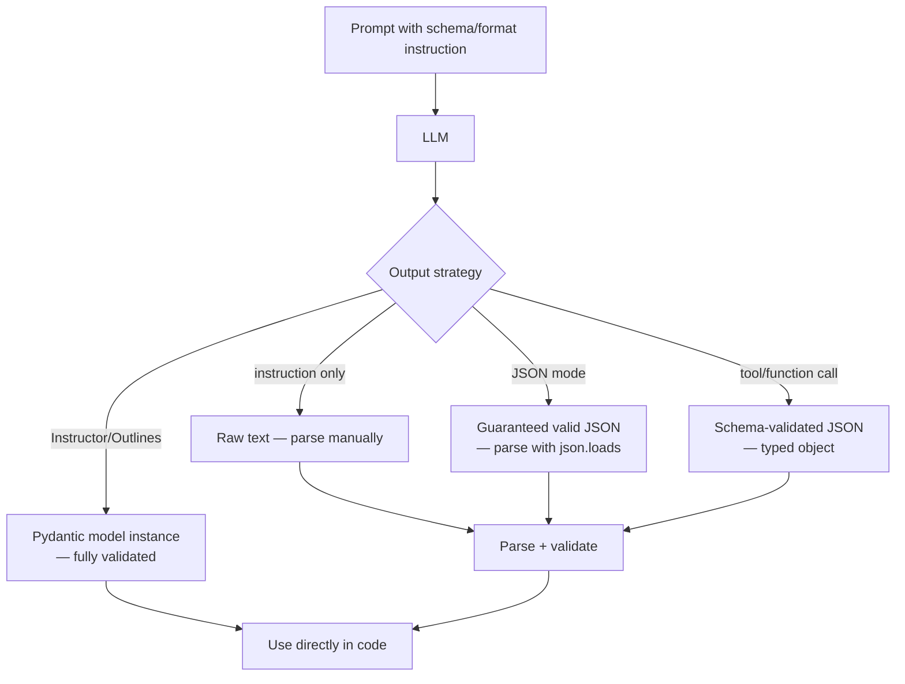

## Definição

Saídas estruturadas designam técnicas que restringem ou guiam um LLM a produzir texto em formato previsível e legível por máquina — mais comumente JSON, XML, CSV, Markdown ou código — em vez de texto livre. Sistemas de produção que alimentam saídas de LLM diretamente em bancos de dados, interfaces de usuário ou pipelines downstream precisam de um formato confiável; saídas imprevisíveis ou malformadas causam falhas de análise, degradação silenciosa ou interrupções de serviço.

As abordagens para obter saídas estruturadas formam um espectro de esforço e confiabilidade. No nível mais simples, a **instrução de prompt** pede ao modelo para "responder em JSON" ou "preencher este template" — fácil de implementar mas sujeito a violações de formato em casos extremos. O **modo JSON** (OpenAI) e as **saídas estruturadas** (OpenAI, Anthropic) restringem a decodificação no nível de tokenização para garantir conformidade com JSON. A **definição de esquema** (via ferramentas/funções do OpenAI ou `tool_choice` do Anthropic) vincula o modelo a um esquema JSON específico, permitindo integração com tipo seguro. Finalmente, bibliotecas como **Instructor** e **Outlines** fornecem interfaces Python idiomáticas sobre essas funcionalidades, integrando-se com Pydantic para validação de esquema.

## Como funciona



### Instrução de formato no prompt

A maneira mais direta de guiar o formato é instruí-lo no prompt. Incluir um exemplo do formato desejado, especificar o esquema em prosa ou fornecer um template a ser preenchido. Adicionar uma sequência de parada no delimitador de fechamento (ex. `</json>`) para evitar texto adicional após o objeto. Essa abordagem funciona em qualquer modelo mas às vezes falha em entradas complexas ou inesperadas.

### Modo JSON e saídas estruturadas

`response_format={"type": "json_object"}` do OpenAI garante que cada token gerado continue um JSON válido — o modelo não pode produzir JSON malformado. `response_format={"type": "json_schema", "json_schema": {...}}` vai além aplicando um esquema específico. O Anthropic oferece suporte a funcionalidade similar via `tool_use`: definir uma ferramenta com um esquema JSON e forçá-la com `tool_choice`, o que obriga o modelo a preencher os argumentos da ferramenta de acordo com o esquema.

### Instructor e Pydantic

**Instructor** é uma biblioteca Python que envolve os SDKs do OpenAI e Anthropic, permitindo que você defina o formato de saída como um modelo Pydantic e obtenha de volta uma instância totalmente validada. Ela lida com retries, validação e correção de erros automaticamente. Atualmente é uma das abordagens mais ergonômicas para saídas estruturadas em código Python de produção.

## Quando usar / Quando NÃO usar

| Cenário | Abordagem recomendada | Evitar |
|---------|-----------------------|--------|
| Extração de dados para ingestão em banco de dados | Saídas estruturadas / modo JSON + Pydantic | Análise de texto livre — frágil e não sustentável |
| Preenchimento de formulário de UI alimentado por LLM | Definição de esquema via chamada de função/ferramenta | Confiar em instrução sozinha para entradas de usuário arbitrárias |
| Geração de código | Sequências de parada em delimitadores de código; extrair conteúdo entre tags | Obter toda a resposta — prosa antes/depois do código atrapalha a execução |
| Pipelines de agentes com raciocínio estruturado | Saídas estruturadas para ações; texto livre para raciocínio | Forçar estrutura para saídas de raciocínio intermediário — degrada CoT |
| Prototipagem rápida | Instrução de prompt com sequências de parada | Engenharia excessiva com esquemas completos para experimentação de uso único |

## Exemplos de código

### Modo JSON e saídas estruturadas do OpenAI

```python
# OpenAI JSON mode and structured outputs
# pip install openai pydantic

import os, json
from openai import OpenAI
from pydantic import BaseModel

client = OpenAI(api_key=os.environ["OPENAI_API_KEY"])

# --- Approach 1: JSON mode (valid JSON guaranteed, no schema enforcement) ---
resp = client.chat.completions.create(
    model="gpt-4o",
    messages=[
        {
            "role": "system",
            "content": "Extract information and return as JSON with keys: name, date, location.",
        },
        {
            "role": "user",
            "content": "The React Summit conference will be held in Amsterdam on June 13, 2025.",
        },
    ],
    response_format={"type": "json_object"},
    temperature=0,
)
data = json.loads(resp.choices[0].message.content)
print(data)  # {'name': 'React Summit', 'date': 'June 13, 2025', 'location': 'Amsterdam'}


# --- Approach 2: Structured outputs with Pydantic schema ---
class EventExtraction(BaseModel):
    name: str
    date: str
    location: str
    is_virtual: bool


completion = client.beta.chat.completions.parse(
    model="gpt-4o",
    messages=[
        {"role": "system", "content": "Extract event information from the text."},
        {
            "role": "user",
            "content": "PyCon US will be in Pittsburgh, PA on May 14-22, 2025. It is in-person.",
        },
    ],
    response_format=EventExtraction,
)
event = completion.choices[0].message.parsed
print(event.name, event.location, event.is_virtual)
```

### Saídas estruturadas do Anthropic via chamada de ferramenta

```python
# Anthropic structured outputs via tool_use
# pip install anthropic

import os, json
import anthropic

client = anthropic.Anthropic(api_key=os.environ["ANTHROPIC_API_KEY"])

extract_tool = {
    "name": "extract_product_info",
    "description": "Extract structured product information from text",
    "input_schema": {
        "type": "object",
        "properties": {
            "product_name": {"type": "string"},
            "price_usd": {"type": "number"},
            "in_stock": {"type": "boolean"},
            "categories": {
                "type": "array",
                "items": {"type": "string"},
            },
        },
        "required": ["product_name", "price_usd", "in_stock", "categories"],
    },
}

resp = client.messages.create(
    model="claude-opus-4-5",
    max_tokens=512,
    tools=[extract_tool],
    tool_choice={"type": "tool", "name": "extract_product_info"},
    messages=[
        {
            "role": "user",
            "content": (
                "The UltraBook Pro 15 laptop is priced at $1,299.99. "
                "It is currently available. Categories: electronics, laptops, productivity."
            ),
        }
    ],
)

tool_use_block = next(b for b in resp.content if b.type == "tool_use")
product = tool_use_block.input
print(json.dumps(product, indent=2))
```

### Instructor com Pydantic

```python
# Instructor library for ergonomic structured outputs
# pip install instructor openai pydantic

import os
import instructor
from openai import OpenAI
from pydantic import BaseModel, Field

client = instructor.from_openai(OpenAI(api_key=os.environ["OPENAI_API_KEY"]))


class Person(BaseModel):
    name: str
    age: int = Field(ge=0, le=150)
    occupation: str
    city: str


class PeopleList(BaseModel):
    people: list[Person]


text = (
    "Dr. Sarah Chen, 34, is a neurologist based in Boston. "
    "Her colleague James O'Brien, 41, is a radiologist in the same hospital."
)

result = client.chat.completions.create(
    model="gpt-4o",
    messages=[
        {"role": "user", "content": f"Extract all people from: {text}"},
    ],
    response_model=PeopleList,
)

for person in result.people:
    print(f"{person.name}, {person.age}, {person.occupation}, {person.city}")
```

## Recursos práticos

- [Documentação OpenAI — Saídas estruturadas](https://platform.openai.com/docs/guides/structured-outputs) — Guia oficial para modo JSON, saídas estruturadas baseadas em esquema e chamadas de função
- [Documentação Anthropic — Uso de ferramentas](https://docs.anthropic.com/en/docs/build-with-claude/tool-use) — Referência para usar `tool_use` do Anthropic para extrair saídas estruturadas com esquemas
- [Biblioteca Instructor](https://python.useinstructor.com/) — Biblioteca Python que envolve SDKs de LLM populares para saídas Pydantic; inclui retries, streaming e correção de erros
- [Outlines](https://github.com/outlines-dev/outlines) — Geração de texto estruturada via restrições de FSM e orientação no nível de logits; suporta JSON, regex e gramáticas personalizadas
- [LangChain — Parsers de saída](https://python.langchain.com/docs/concepts/output_parsers/) — Abstração para analisar saídas de LLM em tipos Python, incluindo parsers Pydantic, JSON e CSV

## Veja também

- [Engenharia de prompts](/docs/prompt-engineering)
- [Máximo de tokens e sequências de parada](/docs/prompt-engineering/max-tokens-stop-sequences)
- [Prompts de sistema, de papel e contextuais](/docs/prompt-engineering/system-role-contextual-prompting)
- [Agentes de IA](/docs/agents)
- [LLMs](/docs/llms)
