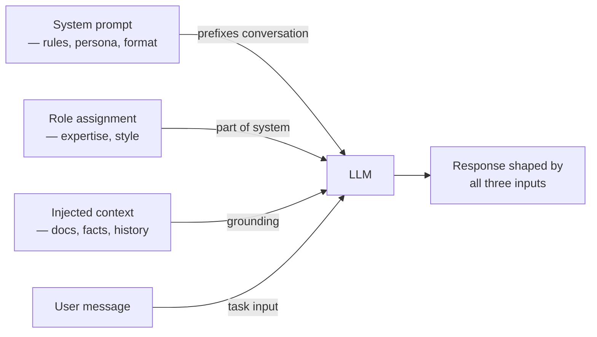

## Definição

Prompts de sistema, prompts de papel e prompts contextuais são três tipos de entradas estruturadas complementares que guiam o comportamento do LLM antes que o usuário faça uma pergunta. Juntos, formam a "configuração de cena" de uma interação com LLM, estabelecendo a personalidade, as regras e o conhecimento base do modelo.

O **prompt de sistema** é uma mensagem passada num campo especial (o papel `system` nas APIs do OpenAI e Anthropic) que precede a conversa. Ele define regras persistentes, restrições, limites de segurança ou instruções de tarefa que se aplicam a toda a conversa. Ao contrário das mensagens de usuário, o prompt de sistema é geralmente invisível ao usuário final e não pode ser facilmente substituído por instruções na conversa.

O **prompting de papel** é o subconjunto do prompting de sistema que pede ao modelo para adotar um persona específico — "Você é um engenheiro DevOps especialista especializado em Kubernetes" ou "Você é um professor de matemática do ensino médio paciente." Atribuir um papel alinha o conhecimento, o estilo de comunicação e os valores implícitos do modelo à tarefa alvo, frequentemente melhorando a precisão e a consistência do tom.

O **prompting contextual** injeta informações de fundo relevantes — trechos de documentos, conteúdo de base de conhecimento, histórico de conversa, resultados de chamadas de API — diretamente no prompt. É a espinha dorsal da geração aumentada por recuperação (RAG) e de sistemas agentivos: o modelo só sabe o que você lhe diz no contexto mais seu conhecimento de pré-treinamento.

## Como funciona



### Prompts de sistema

Um prompt de sistema eficaz geralmente contém:

- **Persona ou papel**: quem é o modelo
- **Tarefa ou domínio**: o que o modelo faz
- **Regras de comportamento**: o que o modelo deve e não deve fazer
- **Instruções de formato de saída**: como o modelo deve formatar as respostas
- **Limites**: o que o modelo recusa ou redireciona

Prompts de sistema são persistentes na conversa — eles definem o comportamento padrão para cada turno. Mantenha-os concisos mas completos; prompts de sistema excessivamente longos podem diluir a atenção nas mensagens críticas do usuário.

### Prompting de papel

Pesquisas mostram que atribuições de papel afetam as saídas de LLM de forma mensurável. "Você é um especialista em segurança cibernética" antes de fazer uma pergunta de segurança produz respostas diferentes (frequentemente mais precisas e nuançadas) do que perguntar sem contexto de papel. O efeito é mais forte para assuntos de alta especialização onde o modelo tem conhecimento de domínio diferenciado. Para tarefas criativas, atribuições de papel ajudam a manter a consistência do tom em conteúdo longo.

### Injeção de contexto

A injeção de contexto é a técnica de fornecer fatos, documentos ou dados ao modelo no prompt, complementando seu conhecimento de pré-treinamento. Para RAG, isso significa recuperar passagens relevantes e incluí-las como contexto antes da pergunta. Para agentes, isso significa incluir resultados de chamadas de ferramentas anteriores ou estado da sessão. Práticas principais: priorizar contexto recente e mais relevante, truncar documentos longos e instruir explicitamente o modelo sobre como usar o contexto ("Responda apenas usando as informações fornecidas").

## Quando usar / Quando NÃO usar

| Cenário | Abordagem recomendada | Evitar |
|---------|-----------------------|--------|
| Chatbot de suporte ao cliente em produção | Prompt de sistema detalhado com restrições + persona | Sem prompt de sistema — o comportamento é imprevisível e não guiado |
| Tutor educacional | Persona de papel de professor + nível do aprendiz no prompt de sistema | Ignorar o público-alvo — o estilo de comunicação será inadequado |
| Perguntas e respostas baseadas em documentos | Injetar trechos de documentos recuperados como contexto | Perguntar sobre fatos do documento sem fornecê-los — alucinações garantidas |
| Análise de código ou revisão | Prompt de sistema com a linguagem e os padrões relevantes | Prompt de sistema genérico — perde convenções específicas de domínio |
| Prototipagem rápida / exploração | Prompt de sistema mínimo | Prompt de sistema excessivamente engenheirado — retarda a iteração |

## Exemplos de código

### Prompts de sistema e de papel com OpenAI

```python
# System and role prompting with OpenAI
# pip install openai

import os
from openai import OpenAI

client = OpenAI(api_key=os.environ["OPENAI_API_KEY"])

# --- Role + Behavioral system prompt ---
SYSTEM_DEVOPS = """You are a senior DevOps engineer with 10 years of experience
in Kubernetes, Terraform, and CI/CD pipelines.

Rules:
- Provide concrete, production-ready answers
- Always mention security considerations where relevant
- Format code examples with appropriate language tags
- If a question is ambiguous, ask one clarifying question before answering
- Never suggest deprecated tools or practices"""


def ask_devops(question: str) -> str:
    resp = client.chat.completions.create(
        model="gpt-4o",
        messages=[
            {"role": "system", "content": SYSTEM_DEVOPS},
            {"role": "user", "content": question},
        ],
        temperature=0.2,
        max_tokens=600,
    )
    return resp.choices[0].message.content.strip()


# --- Contextual prompting: inject retrieved document ---
SYSTEM_QA = (
    "You are a helpful assistant. Answer questions using ONLY the provided context. "
    "If the answer is not in the context, say 'I don't have that information.'"
)


def answer_from_context(context: str, question: str) -> str:
    user_message = f"Context:\n{context}\n\nQuestion: {question}"
    resp = client.chat.completions.create(
        model="gpt-4o",
        messages=[
            {"role": "system", "content": SYSTEM_QA},
            {"role": "user", "content": user_message},
        ],
        temperature=0,
        max_tokens=300,
    )
    return resp.choices[0].message.content.strip()


if __name__ == "__main__":
    # Role prompting
    answer = ask_devops("What's the safest way to store Kubernetes secrets?")
    print("DevOps answer:", answer[:200], "...")

    # Contextual prompting
    doc = (
        "Our company's data retention policy states that customer PII must be "
        "deleted within 90 days of account closure. Backups are retained for 30 days. "
        "Logs are kept for 12 months for compliance purposes."
    )
    qa_answer = answer_from_context(doc, "How long are customer logs retained?")
    print("\nDoc-grounded answer:", qa_answer)
```

### Prompts de sistema e contextuais com Anthropic

```python
# System and contextual prompting with Anthropic
# pip install anthropic

import os
import anthropic

client = anthropic.Anthropic(api_key=os.environ["ANTHROPIC_API_KEY"])

SYSTEM_TUTOR = """You are a patient and encouraging mathematics tutor for high school students.

Guidelines:
- Always explain the underlying concept before solving
- Use simple language, avoid jargon unless you define it
- Show all steps clearly, numbered
- End every explanation with a check-for-understanding question
- If the student seems confused, offer an analogy or real-world example"""

SYSTEM_ANALYST = (
    "You are a data analyst. Analyze the provided data and give concise, "
    "actionable insights. Format your response as: "
    "1) Key Finding, 2) Supporting Evidence, 3) Recommended Action."
)


def tutor_explain(problem: str) -> str:
    resp = client.messages.create(
        model="claude-opus-4-5",
        max_tokens=600,
        system=SYSTEM_TUTOR,
        messages=[{"role": "user", "content": problem}],
        temperature=0.4,
    )
    return resp.content[0].text.strip()


def analyze_data(data_summary: str, question: str) -> str:
    resp = client.messages.create(
        model="claude-opus-4-5",
        max_tokens=400,
        system=SYSTEM_ANALYST,
        messages=[
            {
                "role": "user",
                "content": f"Data summary:\n{data_summary}\n\nAnalysis question: {question}",
            }
        ],
        temperature=0,
    )
    return resp.content[0].text.strip()


if __name__ == "__main__":
    explanation = tutor_explain("How do I solve a quadratic equation using the quadratic formula?")
    print("Tutor explanation:\n", explanation[:300], "...\n")

    data = (
        "Q1 revenue: $1.2M (target $1.0M). Q2 revenue: $0.9M (target $1.1M). "
        "Top product: Widget A (40% of revenue). Churn rate increased from 5% to 8%."
    )
    analysis = analyze_data(data, "What should leadership focus on next quarter?")
    print("Analysis:\n", analysis)
```

## Recursos práticos

- [OpenAI — Guia de engenharia de prompts](https://platform.openai.com/docs/guides/prompt-engineering) — Melhores práticas oficiais incluindo como estruturar mensagens de sistema
- [Anthropic — Guia de prompting](https://docs.anthropic.com/en/docs/build-with-claude/prompt-engineering/overview) — Diretrizes e exemplos do Anthropic para mensagens de sistema com modelos Claude
- [DAIR.AI — Guia de engenharia de prompts](https://www.promptingguide.ai/) — Guia mantido pela comunidade cobrindo técnicas de prompting zero-shot, few-shot, CoT e de sistema
- [Lilian Weng — Engenharia de prompts](https://lilianweng.github.io/posts/2023-03-15-prompt-engineering/) — Post aprofundado cobrindo técnicas incluindo exemplos de sistema e contextuais com avaliação empírica

## Veja também

- [Engenharia de prompts](/docs/prompt-engineering)
- [Máximo de tokens e sequências de parada](/docs/prompt-engineering/max-tokens-stop-sequences)
- [Saídas estruturadas](/docs/prompt-engineering/structured-outputs)
- [RAG](/docs/rag)
- [Agentes de IA](/docs/agents)
- [LLMs](/docs/llms)
