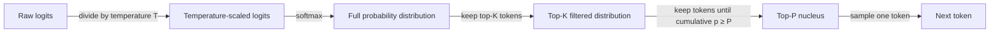

## Definição

Temperatura, Top-K e Top-P são parâmetros de amostragem que controlam como um LLM seleciona o próximo token durante a geração de texto. Após o modelo calcular uma distribuição de probabilidade sobre seu vocabulário inteiro (via softmax sobre os logits), esses parâmetros determinam quais tokens são candidatos à seleção e qual a probabilidade de escolher cada candidato. Juntos, eles governam a troca entre determinismo e diversidade: valores baixos tornam o modelo previsível e focado, valores altos o tornam criativo e variado.

A **temperatura** redimensiona os logits brutos antes da etapa softmax, efetivamente achatando ou afinando a distribuição de probabilidade. Uma temperatura de 1,0 deixa a distribuição inalterada. Valores abaixo de 1,0 tornam a distribuição mais pronunciada — o modelo quase sempre escolhe o token de maior probabilidade. Valores acima de 1,0 achatam a distribuição — mais tokens se tornam candidatos plausíveis, produzindo saídas mais surpreendentes e variadas. Na temperatura 0, a geração torna-se determinística (decodificação argmax).

**Top-K** e **Top-P** são estratégias de truncamento aplicadas após o escalonamento da temperatura. Top-K mantém apenas os K tokens mais prováveis e redistribui a massa de probabilidade entre eles, eliminando todos os outros. Top-P (também chamado de amostragem nuclear) seleciona dinamicamente o menor conjunto de tokens cuja massa de probabilidade cumulativa atinge um limiar P, depois amostra desse conjunto. Top-P é geralmente preferível ao Top-K porque o tamanho do conjunto de candidatos se adapta ao formato da distribuição: quando o modelo está confiante, o núcleo é pequeno; quando o modelo está incerto, o núcleo se expande para incluir mais alternativas.

## Como funciona



Os parâmetros são aplicados sequencialmente: primeiro escalonamento de temperatura, depois truncamento Top-K, depois seleção do núcleo Top-P, depois amostragem. Na prática, a maioria das APIs aplica apenas temperatura + Top-P (padrão do OpenAI) ou temperatura + Top-K (padrão do Anthropic); aplicar tanto Top-K quanto Top-P é possível mas incomum.

### Temperatura

A temperatura `T` divide cada logit bruto `z_i` antes do softmax: `p_i = softmax(z / T)`. Quando `T < 1`, as diferenças de logit são amplificadas — o token de maior probabilidade obtém uma fatia ainda maior da massa de probabilidade. Quando `T > 1`, as diferenças de logit diminuem — a massa de probabilidade se distribui mais uniformemente. Predefinições comuns: `T = 0` para tarefas de extração determinística, `T = 0,2–0,4` para perguntas e respostas factuais, `T = 0,7–1,0` para escrita criativa, `T > 1,0` para diversidade máxima (embora a qualidade se degrade em valores extremos).

### Top-K

A amostragem Top-K restringe o pool de candidatos aos K tokens de maior probabilidade após o escalonamento de temperatura. Todos os tokens fora do top K recebem probabilidade zero antes da renormalização. A limitação principal é que K é fixo independentemente de como a distribuição parece: quando o modelo está muito confiante, mesmo K=50 pode incluir muitos tokens com probabilidade quase zero que introduzem ruído; quando o modelo está incerto, um K baixo pode eliminar alternativas razoáveis. A API do Anthropic expõe `top_k` como parâmetro direto; a API do OpenAI não oferece suporte nativo.

### Top-P (amostragem nuclear)

A amostragem Top-P constrói o conjunto de candidatos dinamicamente. Começando pelo token mais provável e descendo, tokens são adicionados ao núcleo até que sua probabilidade cumulativa atinja o limiar P. Apenas os tokens no núcleo são considerados para amostragem. Com `P = 0,9`, o modelo amostra entre os tokens que coletivamente representam 90% da massa de probabilidade. Como o núcleo se contrai quando o modelo está confiante (poucos tokens dominam) e se expande quando incerto (a massa de probabilidade é difusa), Top-P se adapta naturalmente ao estado interno do modelo. Top-P é suportado pelas APIs do OpenAI (`top_p`) e do Anthropic (`top_p`).

## Quando usar / Quando NÃO usar

| Cenário | Parâmetros recomendados | Evitar |
|---------|-------------------------|--------|
| Perguntas e respostas factuais, extração de dados, classificação | `temperature=0–0,2`, `top_p=1,0` para saída quase determinística | Temperatura alta; introduz alucinações e erros de formato |
| Escrita criativa, brainstorming, ideação | `temperature=0,8–1,0`, `top_p=0,95` para saídas diversas e originais | Temperature=0; produz texto repetitivo e previsível |
| Geração de código | `temperature=0,2–0,4`, `top_p=0,95`; alguma variação ajuda a evitar ótimos locais | Temperatura \> 0,8; erros de sintaxe e desvio lógico aumentam |
| Autoconsistência (múltiplos caminhos de raciocínio) | `temperature=0,6–1,0`; diversidade é intencional | Temperature=0; todos os caminhos seriam idênticos, frustrando o propósito |
| Extração de saída estruturada (JSON, tabelas) | `temperature=0`, `top_p=1,0` para estrita conformidade com o esquema | Top-P \< 0,9 combinado com temperatura alta; violações de esquema aumentam |
| Diálogo / chatbots | `temperature=0,5–0,7`, `top_p=0,9`; equilibra coerência e naturalidade | Temperatura extrema em qualquer direção; muito robótico ou muito incoerente |

## Exemplos de código

### OpenAI — temperatura e Top-P

```python
# OpenAI API call with temperature and top_p
# pip install openai

import os
from openai import OpenAI

client = OpenAI(api_key=os.environ["OPENAI_API_KEY"])


def generate(prompt: str, temperature: float = 0.7, top_p: float = 0.95) -> str:
    """Generate text with configurable sampling parameters."""
    response = client.chat.completions.create(
        model="gpt-4o",
        messages=[{"role": "user", "content": prompt}],
        temperature=temperature,
        top_p=top_p,
        max_tokens=512,
    )
    return response.choices[0].message.content


if __name__ == "__main__":
    # Deterministic factual extraction
    factual = generate(
        "List the three primary colors.",
        temperature=0.0,
        top_p=1.0,
    )
    print("Factual:", factual)

    # Creative brainstorming
    creative = generate(
        "Suggest five unusual names for a café that serves only breakfast.",
        temperature=0.9,
        top_p=0.95,
    )
    print("Creative:", creative)
```

### Anthropic — temperatura e Top-K

```python
# Anthropic API call with temperature and top_k
# pip install anthropic

import os
import anthropic

client = anthropic.Anthropic(api_key=os.environ["ANTHROPIC_API_KEY"])


def generate(prompt: str, temperature: float = 0.7, top_k: int = 50) -> str:
    """Generate text with configurable temperature and top-k sampling."""
    message = client.messages.create(
        model="claude-opus-4-5",
        max_tokens=512,
        temperature=temperature,
        top_k=top_k,
        messages=[{"role": "user", "content": prompt}],
    )
    return message.content[0].text


if __name__ == "__main__":
    # Near-deterministic output for structured tasks
    deterministic = generate(
        "Translate 'hello world' into French, German, and Japanese.",
        temperature=0.0,
        top_k=1,
    )
    print("Deterministic:", deterministic)

    # Creative output with broader candidate pool
    creative = generate(
        "Write the opening sentence of a science fiction novel set on Europa.",
        temperature=1.0,
        top_k=250,
    )
    print("Creative:", creative)
```

## Recursos práticos

- [OpenAI — Referência da API: temperatura e top_p](https://platform.openai.com/docs/api-reference/chat/create) — Documentação oficial dos parâmetros com intervalos válidos e valores padrão
- [Anthropic — Referência da API: temperatura, top_k, top_p](https://docs.anthropic.com/en/api/messages) — Referência de parâmetros do Anthropic incluindo top_k (não disponível no OpenAI)
- [Paper sobre Nucleus Sampling (Holtzman et al., 2020)](https://arxiv.org/abs/1904.09751) — Paper original introduzindo a amostragem Top-P / nuclear com motivação e resultados empíricos
- [Hugging Face — Estratégias de geração de texto](https://huggingface.co/docs/transformers/generation_strategies) — Guia abrangente de estratégias de amostragem incluindo greedy, beam search, temperatura, Top-K e Top-P
- [Lilian Weng — Geração de texto controlável](https://lilianweng.github.io/posts/2021-01-02-controllable-text-generation/) — Post aprofundado sobre métodos de amostragem no contexto de geração controlável

## Veja também

- [Engenharia de prompts](/docs/prompt-engineering)
- [Máximo de tokens e sequências de parada](/docs/prompt-engineering/max-tokens-stop-sequences)
- [Saídas estruturadas](/docs/prompt-engineering/structured-outputs)
- [Autoconsistência](/docs/prompt-engineering/self-consistency)
- [Cadeia de pensamento](/docs/reasoning-patterns/cot)
- [LLMs](/docs/llms)
