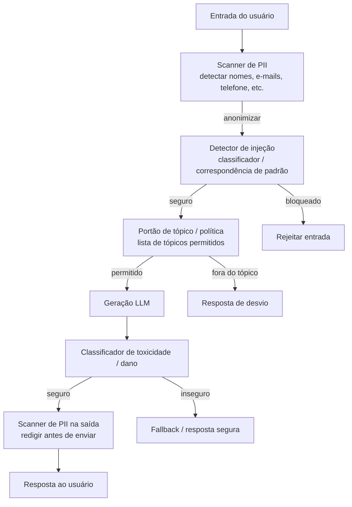

## Definição

**Guardrails** são componentes de middleware programáveis que interceptam entradas e saídas de LLMs para impor políticas de segurança, conformidade e proteção de dados. Ao contrário do treinamento de segurança integrado do modelo (que é estático e pode ser contornado), os guardrails são controlados pelo desenvolvedor, configuráveis e auditáveis. Ficam fora do modelo e podem ser atualizados de forma independente sem retreinamento.

Uma arquitetura completa de guardrail impõe quatro categorias de controle:
1. **Segurança de conteúdo** — detectar e bloquear entradas e saídas nocivas, tóxicas ou que violam políticas.
2. **Segurança** — detectar tentativas de injeção de prompt e padrões de jailbreak.
3. **Proteção de dados** — identificar e anonimizar PII (Informações de Identificação Pessoal) em entradas e saídas.
4. **Conformidade** — impor regras de negócio, restrições de tópico, requisitos específicos de jurisdição e obrigações do AI Act da UE (em vigor em agosto de 2026 para IA de alto risco).

## Como funciona



### NVIDIA NeMo Guardrails

NeMo Guardrails é um toolkit Python de código aberto que adiciona rails de segurança programáveis a qualquer aplicação LLM. Usa **Colang**, uma linguagem de domínio específico (DSL) para expressar políticas de guardrail como fluxos de diálogo:

```text
define user ask harmful question
  "how to make a bomb"
  "explain how to hack"

define bot refuse harmful
  "I can't help with that."

define flow safety
  user ask harmful question
  bot refuse harmful
```

O NeMo Guardrails intercepta a conversa em cinco estágios de pipeline: rail de entrada, gerenciamento de diálogo, rail de saída e (para agentes) rail de execução e rail de recuperação. Inferência acelerada por GPU alcança tempos de resposta sub-100ms para a própria avaliação do rail. O Colang 2.0 (lançado em 2024) adicionou fluxos nativos em Python e melhor suporte para pipelines agentivos.

### Guardrails.ai

Guardrails.ai é um framework Python que envolve chamadas LLM com **Validators** — verificações componíveis aplicadas à saída. Validators podem impor:
- **Conformidade de schema** — a saída é um JSON válido correspondente a um schema Pydantic.
- **Sem PII** — a saída não contém PII detectado (integrado com Presidio).
- **Sem linguagem tóxica** — a saída passa por um classificador de toxicidade.
- **Embasamento factual** — as afirmações da saída estão presentes no contexto fornecido (verificação de embasamento RAG).
- **Validators personalizados** — funções Python definidas pelo usuário.

Em caso de falha do validator, o Guardrails.ai pode retornar um erro, fazer uma nova solicitação ao LLM com a explicação da falha ou retornar um resultado parcial com os campos violadores redigidos.

### LlamaGuard

LlamaGuard (Meta, 2023–2025) é um modelo Llama ajustado fino especialmente desenvolvido para classificação de segurança de entrada/saída. Cobre a taxonomia de Segurança de IA do MLCommons: crimes violentos, discurso de ódio, conteúdo sexual, automutilação e violações de privacidade. O LlamaGuard 3 (2024) suporta classificação multilíngue e segurança de chamadas de ferramentas para sistemas agentivos. Tem peso aberto e pode ser implantado localmente para aplicações sensíveis à latência.

### Detecção e anonimização de PII

Guardrails de PII identificam entidades sensíveis (nomes, endereços de e-mail, números de telefone, CPF, números de cartão de crédito, IDs de prontuário médico) tanto nas entradas quanto nas saídas.

| Ferramenta | Abordagem | Cobertura | Notas |
|---|---|---|---|
| **Microsoft Presidio** | NER + regex + checksum | 50+ tipos de PII, 15+ idiomas | Código aberto; integra com Guardrails.ai |
| **Azure AI Content Safety PII** | API Azure AI Language | Detecção refinada em nível de entidade | Gerenciado; alto recall (0,865) |
| **AWS Comprehend** | Serviço NLP gerenciado | 15+ tipos de PII | Nativo AWS; pago por chamada de API |
| **spaCy + regras personalizadas** | Pipeline NER | Personalizável por domínio | DIY; cobertura menor no estado padrão |

Estratégias de anonimização: **redação** (substituir por `[REDIGIDO]`), **pseudonimização** (substituir por um valor falso consistente para mapeamento de re-identificação) ou **tokenização** (substituir por um token opaco, reversível por um serviço autorizado).

## Quando usar / Quando NÃO usar

| Guardrail | Sempre aplicar | Relaxar |
|---|---|---|
| Classificador de toxicidade / dano na saída | Sim para qualquer app público | Ferramentas de desenvolvimento interno com usuários autenticados podem simplificar |
| Scanner de PII na entrada | Sim quando usuários podem compartilhar dados pessoais | Assistente de código puro sem contexto de dados pessoais |
| Scanner de PII na saída | Sim quando o LLM pode ecoar PII do usuário ou alucinar PII | Dados internos que nunca contêm PII |
| Detector de injeção de prompt | Sim para agentes que processam conteúdo externo | Q&A direto com usuário sem recuperação de documentos |
| Validator de schema / formato (Guardrails.ai) | Sim para tarefas de saída estruturada | Geração de texto livre |
| NeMo Guardrails | Para imposição de política de diálogo complexa | Q&A simples de turno único |

## Fontes

- [NVIDIA NeMo Guardrails documentation](https://docs.nvidia.com/nemo/guardrails/)
- [NVIDIA NeMo Guardrails GitHub](https://github.com/NVIDIA/NeMo-Guardrails)
- [Guardrails.ai documentation](https://www.guardrailsai.com/docs)
- [Microsoft Presidio — open-source PII anonymisation](https://microsoft.github.io/presidio/)
- [The complete AI guardrails implementation guide for 2026 — Maxim](https://www.getmaxim.ai/articles/the-complete-ai-guardrails-implementation-guide-for-2026/)
- [Best AI guardrails platforms in 2026 — Galileo](https://galileo.ai/blog/best-ai-guardrails-platforms)
- [Benchmarking LLM guardrail providers — TrueFoundry](https://www.truefoundry.com/blog/benchmarking-llm-guardrail-providers)

## Veja também

- [Segurança de prompts](/docs/prompt-security)
- [Injeção de prompt](/docs/prompt-security/prompt-injection)
- [Segurança de agentes](/docs/agents/security)
- [Segurança em IA](/docs/ai-safety)
- [Ética em IA](/docs/ai-ethics)
