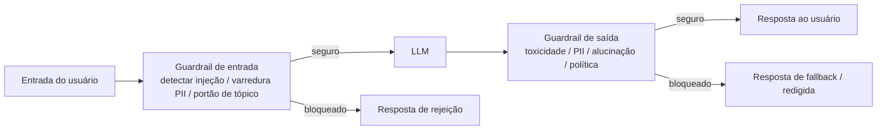

## Definição

**Segurança de prompts** cobre o modelo de ameaças e os controles defensivos específicos de aplicações de Modelos de Linguagem de Grande Escala. Ao contrário do software tradicional onde as entradas são validadas contra um schema, os LLMs interpretam instruções em texto livre, tornando-os suscetíveis a prompts adversariais que subvertem o comportamento pretendido. As duas principais classes de ataque são:

1. **Injeção de prompt** — texto malicioso na entrada do usuário ou em documentos recuperados que substitui o prompt de sistema ou sequestra ações do agente.
2. **Jailbreaking** — prompts adversariais que contornam o treinamento de segurança do modelo para obter saídas nocivas, antiéticas ou que violam políticas.

A camada defensiva são os **guardrails**: middleware programável que intercepta entradas e saídas para impor políticas de segurança, conformidade e proteção de dados. Sistemas de guardrail podem ser bibliotecas standalone (NeMo Guardrails, Guardrails.ai), proteções em nível de API (Llama Guard, Azure AI Content Safety) ou monitores integrados a observabilidade (Langfuse, Datadog LLM observability).

Esta seção aborda:
- **[Injeção de prompt](/docs/prompt-security/prompt-injection)** — uma taxonomia de vetores de ataque de injeção e mitigações.
- **[Guardrails](/docs/prompt-security/guardrails)** — NeMo Guardrails, Guardrails.ai, detecção de PII e padrões arquiteturais.

## Como funciona

## Categorias de ameaça

| Categoria | Exemplos de ataque | Controle defensivo |
|---|---|---|
| Injeção de prompt direta | "Ignore todas as instruções anteriores e…" | Classificador de entrada; hardening do prompt de sistema |
| Injeção indireta (envenenamento RAG) | Texto malicioso em documentos recuperados substitui o prompt de sistema | Sanitização de documentos; marcadores de limite de seguimento de instrução |
| Jailbreak | Jogo de papéis, codificação base64, ataques many-shot | Modelo com treinamento de segurança; classificador de saída |
| Exfiltração de dados | Agente instruído a enviar dados privados para URL do atacante | Guardrails de chamada de ferramenta; controles de egresso de rede |
| Vazamento de PII | Modelo ecoa PII do usuário na resposta | Anonimizador de PII na saída |
| Negação de serviço | Entradas extremamente longas ou repetitivas para aumentar o processamento | Limitação de taxa; caps de orçamento de tokens |

## Quando usar / Quando NÃO usar

| Cenário | Aplicar segurança de prompts | Relaxar controles |
|---|---|---|
| Aplicação pública (qualquer usuário pode interagir) | Sim — obrigatório; todas as categorias de ameaça se aplicam | Nunca relaxar totalmente; reduzir fricção onde possível |
| Agente com acesso a ferramentas (E/S de arquivo, APIs, execução de código) | Sim — risco de injeção indireta é crítico | Não — agentes com chamada de ferramentas têm alto raio de impacto |
| Chat empresarial apenas interno, autenticado | Sim — mas pode reduzir escopo; focar em proteção de dados | Simplificar para scanner de PII na saída + portão de toxicidade |
| Aplicação RAG que ingere documentos externos | Sim — sanitização obrigatória de documentos + marcadores de injeção | Não — documentos de terceiros são conteúdo não confiável |
| Assistente de análise somente leitura | Parcial — detecção de PII e alucinação na saída | Controles de chamada de ferramenta menos críticos |

## Fontes

- [OWASP Top 10 for LLM Applications 2025](https://owasp.org/www-project-top-10-for-large-language-model-applications/)
- [OWASP – Prompt injection attack definition](https://owasp.org/www-community/attacks/PromptInjection)
- [LLM guardrails: best practices for deploying LLM apps securely — Datadog](https://www.datadoghq.com/blog/llm-guardrails-best-practices/)
- [The complete AI guardrails implementation guide for 2026 — Maxim](https://www.getmaxim.ai/articles/the-complete-ai-guardrails-implementation-guide-for-2026/)

## Veja também

- [Injeção de prompt](/docs/prompt-security/prompt-injection)
- [Guardrails](/docs/prompt-security/guardrails)
- [Segurança de agentes](/docs/agents/security)
- [Segurança em IA](/docs/ai-safety)
- [Ética em IA](/docs/ai-ethics)
