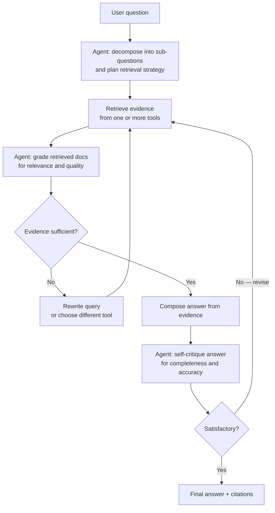

## Definição

O **RAG Agêntico** transforma a recuperação de um pipeline fixo de uma única passagem em um **loop de controle dinâmico**. Em vez de embeder uma consulta, buscar os top-k fragmentos e enviá-los a um LLM, um sistema de RAG agêntico usa um **agente** (um LLM com acesso a ferramentas) para orquestrar a recuperação: planejando o que buscar, avaliando a qualidade do que encontra, decidindo se deve re-consultar e apenas compondo uma resposta quando a evidência for suficiente.

A mudança fundamental: no RAG simples, a recuperação é determinística e acontece uma vez. No RAG agêntico, a recuperação é **iterativa, adaptativa e autocorretiva**. O agente pode:

- Decompor uma pergunta complexa em sub-perguntas e recuperar para cada uma.
- Escolher entre múltiplas ferramentas de recuperação (busca vetorial, busca por palavras-chave, SQL, web).
- Avaliar documentos recuperados quanto à relevância e descartar evidências fracas.
- Reescrever a consulta e tentar novamente se os resultados iniciais forem fracos.
- Detectar contradições nas evidências recuperadas e resolvê-las com recuperação adicional.

Benchmarks de pesquisa consistentemente mostram que o RAG agêntico supera pipelines estáticos em consultas complexas: um estudo encontrou RAG estático com 34% de precisão em perguntas multi-hop, RAG agêntico com 78%.

## Como funciona

### Loop central



### Planejamento (decomposição de consulta)

Quando uma pergunta é complexa ou multiparte, o agente a decompõe em uma sequência de sub-perguntas atômicas, cada uma com um plano de recuperação direcionado. Por exemplo, "Compare o consumo de energia do GPT-4 e do Gemini Ultra" se torna duas tarefas de recuperação separadas. O planejamento pode ser explícito (o agente escreve um plano de recuperação antes de agir) ou implícito (o agente intercala etapas de pensamento e recuperação via prompting estilo ReAct).

### Uso de ferramentas de recuperação

O agente tem acesso a uma ou mais ferramentas de recuperação, selecionadas por sub-pergunta:

| Ferramenta | Melhor para |
|---|---|
| **Busca vetorial** | Similaridade semântica, correspondência difusa |
| **Busca por palavras-chave / BM25** | Termos exatos, nomes próprios, código |
| **SQL / consulta estruturada** | Dados tabulares, filtros, agregações |
| **Busca na web** | Informações em tempo real ou fora do corpus |
| **GraphRAG** | Relacionamentos entre entidades, consultas temáticas |

O roteamento entre ferramentas é uma forma de **engenharia de contexto**: o agente seleciona o método de recuperação cujo tipo de saída melhor se adapta à sub-pergunta.

### Avaliação de documentos e autocorreção

Após cada recuperação, o agente avalia os resultados quanto à relevância. Documentos irrelevantes ou de baixa qualidade são filtrados antes de serem adicionados ao contexto. Se a qualidade de recuperação for ruim, o agente reescreve a consulta — alterando palavras-chave, ampliando o escopo de busca ou trocando de ferramenta — e tenta novamente. Esse loop de autocorreção é o mecanismo que impulsiona a melhoria de precisão sobre pipelines estáticos.

### Reflexão

A etapa de **reflexão** solicita ao agente que critique sua própria resposta preliminar: está completa? Está fundamentada nas evidências recuperadas? Há contradições? A reflexão é opcional, mas adiciona robustez para tarefas de alto risco (perguntas e respostas médicas, jurídicas, financeiras).

### RAG Agêntico vs. RAG simples

| Dimensão | RAG vetorial simples | RAG Agêntico |
|---|---|---|
| **Estratégia de recuperação** | Fixa: embeda → busca top-k | Dinâmica: planeja → recupera → avalia → repete |
| **Tratamento de consulta** | Consulta única, recuperação única | Decomposição em múltiplas etapas |
| **Qualidade de evidência** | Todos os fragmentos top-k usados como estão | Avaliados; evidência fraca descartada |
| **Perguntas multi-hop** | Fraco | Forte (encadeamento iterativo de sub-perguntas) |
| **Latência** | Baixa (passagem única) | Maior (múltiplas chamadas ao LLM + recuperação) |
| **Custo** | Baixo | Maior (múltiplas chamadas ao modelo por consulta) |
| **Risco de alucinação** | Médio | Menor (autocorreção reduz erros de fundamentação) |
| **Complexidade de implementação** | Baixa | Maior (requer framework de agente) |

## Quando usar / Quando NÃO usar

| Use quando | Evite quando |
|---|---|
| Perguntas exigem **raciocínio multi-hop** em múltiplos documentos | Perguntas são simples e factuais — RAG de passagem única é mais rápido e barato |
| A qualidade da evidência é **incerta** e a avaliação + re-consulta é justificada | A latência é crítica — o loop adiciona múltiplas viagens de ida e volta |
| Existem múltiplas **ferramentas de recuperação** e a correta depende da sub-pergunta | Seu corpus de recuperação é pequeno e bem curado — RAG simples é suficiente |
| As respostas devem ser **altamente fundamentadas** (médico, jurídico, conformidade) e a autocorreção reduz o risco de alucinação | Você não tem um framework de agente configurado — RAG simples é mais simples de implementar |
| O corpus é **heterogêneo** (dados estruturados + não estruturados) e o roteamento de ferramentas é necessário | Os custos são muito restritos — cada iteração do loop multiplica as chamadas ao LLM |

## Nota sobre engenharia de contexto

O RAG agêntico expõe a recuperação como um **problema de engenharia de contexto**: o trabalho do agente é preencher a janela de contexto do LLM com as *evidências certas* no *momento certo*. Isso significa:

- A recuperação não é mais uma única transformação — é uma série de decisões de construção de contexto.
- O agente deve equilibrar riqueza de contexto (mais evidências = mais preciso) contra comprimento de contexto (mais tokens = mais custo e possível distração).
- A qualidade de fundamentação escala com a capacidade do agente de selecionar, filtrar e organizar evidências recuperadas — não apenas com o recall de recuperação.

Esse enquadramento conecta o RAG agêntico à disciplina mais ampla de engenharia de contexto: projetar o pipeline completo que governa quais informações fluem para uma janela de contexto de LLM.

## Guia prático

### Padrão de RAG agêntico com LangGraph

```python
from langgraph.graph import StateGraph, END
from langchain_core.messages import HumanMessage
from typing import TypedDict, List

class RAGState(TypedDict):
    question: str
    sub_questions: List[str]
    retrieved_docs: List[str]
    answer: str
    iterations: int

def plan_node(state: RAGState) -> RAGState:
    """Decompose the question into sub-questions."""
    # LLM call: decompose state["question"]
    ...

def retrieve_node(state: RAGState) -> RAGState:
    """Retrieve evidence for each sub-question."""
    # Vector search + grading for each sub-question
    ...

def compose_node(state: RAGState) -> RAGState:
    """Compose a grounded answer from retrieved evidence."""
    ...

def should_retry(state: RAGState) -> str:
    """Decide whether to retry retrieval or return the answer."""
    if state["iterations"] >= 3:
        return "compose"
    if evidence_quality_ok(state["retrieved_docs"]):
        return "compose"
    return "retrieve"

graph = StateGraph(RAGState)
graph.add_node("plan", plan_node)
graph.add_node("retrieve", retrieve_node)
graph.add_node("compose", compose_node)

graph.set_entry_point("plan")
graph.add_edge("plan", "retrieve")
graph.add_conditional_edges("retrieve", should_retry, {"retrieve": "retrieve", "compose": "compose"})
graph.add_edge("compose", END)

app = graph.compile()
result = app.invoke({"question": "How does GraphRAG differ from naive RAG?", "iterations": 0})
```

## Fontes

- [Agentic RAG vs Classic RAG — Towards Data Science](https://towardsdatascience.com/agentic-rag-vs-classic-rag-from-a-pipeline-to-a-control-loop/)
- [Agentic Retrieval-Augmented Generation: A Survey — arXiv 2501.09136](https://arxiv.org/html/2501.09136v4)
- [Agentic RAG explained — MachineLearningMastery](https://machinelearningmastery.com/agentic-rag-explained-in-3-levels-of-difficulty/)
- [From RAG to Context — 2025 year-end review (RAGFlow)](https://ragflow.io/blog/rag-review-2025-from-rag-to-context)
- [Next-Generation Agentic RAG with LangGraph 2026 — Medium](https://medium.com/@vinodkrane/next-generation-agentic-rag-with-langgraph-2026-edition-d1c4c068d2b8)

## Veja também

- [Arquitetura RAG](/docs/rag/architecture)
- [GraphRAG](/docs/rag/graphrag)
- [Agentes de IA](/docs/agents)
- [Visão geral de RAG](/docs/rag)
- [Bancos de dados vetoriais](/docs/rag/vector-databases)
