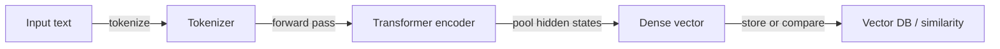
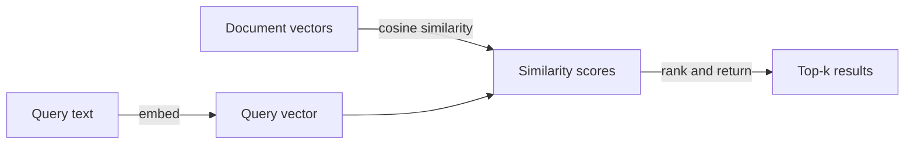

## Definição

Embeddings são vetores numéricos densos de tamanho fixo que codificam o significado semântico do texto (ou outras modalidades de dados, como imagens e áudio). Quando o texto é processado por um modelo codificador, o conteúdo semanticamente similar produz vetores que estão geometricamente próximos no espaço de alta dimensão — de modo que frases como "suporte ao cliente" e "central de atendimento" terão vetores próximos se treinados em dados similares.

Eles são a ponte entre o texto bruto e os [bancos de dados vetoriais](/docs/rag/vector-databases). Tanto os documentos quanto as consultas devem ser incorporados usando o **mesmo codificador** para que seus vetores vivam no mesmo espaço e comparações de similaridade significativas possam ser feitas. A métrica de similaridade mais comum é a **similaridade de cosseno**, embora o produto escalar e a distância euclidiana também sejam usados dependendo da configuração do índice.

A escolha do modelo de embedding é uma das decisões de maior impacto em um sistema [RAG](/docs/rag). Os fatores incluem dimensionalidade vetorial (maior = mais expressivo mas mais armazenamento), janela de contexto (quanto texto o codificador processa de uma vez), especificidade do domínio (um modelo jurídico ou biomédico pode superar um de propósito geral), suporte multilíngue e custo (API vs. auto-hospedado). Opções populares incluem OpenAI `text-embedding-3-large`, Cohere Embed e o `sentence-transformers` de código aberto. Ver [arquitetura RAG](/docs/rag/architecture) para como os embeddings se encaixam na pipeline completa.

## Como funciona

### Pipeline de codificação



### Busca de similaridade



**O texto** (uma sentença, parágrafo ou fragmento) é inserido em um **codificador** (ex. embeddings OpenAI, Cohere ou sentence-transformers de código aberto). O codificador produz um **vetor** de tamanho fixo (ex. 768 ou 1536 dimensões). O treinamento usa objetivos contrastivos ou similares para que textos semanticamente relacionados obtenham vetores próximos. No momento da consulta, a similaridade é calculada como cosseno ou produto escalar entre o vetor de consulta e os vetores de documentos armazenados. Os modelos podem ser multilíngues ou específicos do domínio. Para [RAG](/docs/rag), sempre usar o mesmo codificador para documentos e consultas para que as distâncias sejam significativas.

## Quando usar / Quando NÃO usar

| Cenário | Usar embeddings | Não usar embeddings |
|---|---|---|
| Busca semântica ("encontrar significado similar") | Sim — embeddings capturam intenção semântica | Não — busca por palavras-chave se correspondência exata de string for necessária |
| Recuperação multilíngue | Sim — codificadores multilíngues mapeiam idiomas no mesmo espaço | Não — BM25 específico do idioma se tiver apenas um idioma |
| Consultas curtas contra documentos longos | Sim — incorporar consulta e documentos fragmentados | Não — incorporar documentos longos inteiros sem fragmentação perde precisão |
| Busca exata por ID ou campo estruturado | Não — usar um BD relacional ou filtro de metadados | Sim — embeddings não são necessários para correspondência exata |
| Baixa latência, computação limitada | Considerar modelos menores (ex. MiniLM) | Evitar grandes modelos baseados em API para cada solicitação |

## Comparações

| Modelo | Dimensões | Contexto | Multilíngue | Custo | Melhor para |
|---|---|---|---|---|---|
| OpenAI `text-embedding-3-large` | 3072 | 8191 tokens | Sim | API (pago) | RAG de produção de alta precisão |
| OpenAI `text-embedding-3-small` | 1536 | 8191 tokens | Sim | API (baixo custo) | Apps sensíveis a custo |
| Cohere Embed v3 | 1024 | 512 tokens | Sim | API (pago) | Reranking + recuperação |
| `sentence-transformers/all-MiniLM-L6-v2` | 384 | 256 tokens | Não | Auto-hospedado (gratuito) | Baixa latência ou offline |
| `BAAI/bge-large-en-v1.5` | 1024 | 512 tokens | Não | Auto-hospedado (gratuito) | Código aberto de alta qualidade |

## Prós e contras

| Prós | Contras |
|---|---|
| Captura o significado semântico, não apenas palavras-chave | O espaço vetorial varia por modelo; não é possível misturar codificadores |
| Permite recuperação multilíngue com modelos multilíngues | A dimensionalidade aumenta o custo de armazenamento e computação |
| Reutilizável: os mesmos vetores servem busca, clustering, deduplicação | A qualidade depende muito da escolha do modelo e da adequação ao domínio |
| Rápido no momento da consulta com índices ANN | Sem interpretabilidade — difícil depurar por que um fragmento foi retornado |

## Exemplos de código

```python
from openai import OpenAI

client = OpenAI()

def embed(text: str) -> list[float]:
    response = client.embeddings.create(
        model="text-embedding-3-small",
        input=text,
    )
    return response.data[0].embedding

# Embed a document chunk and a query
doc_vec = embed("The refund policy allows returns within 30 days.")
query_vec = embed("How long do I have to return a product?")

# Cosine similarity (manual)
import numpy as np
def cosine_sim(a, b):
    a, b = np.array(a), np.array(b)
    return float(np.dot(a, b) / (np.linalg.norm(a) * np.linalg.norm(b)))

print(f"Similarity: {cosine_sim(doc_vec, query_vec):.4f}")
```

## Recursos práticos

- [OpenAI – Embeddings guide](https://platform.openai.com/docs/guides/embeddings) — Uso da API, comparação de modelos e melhores práticas
- [Hugging Face – Sentence Transformers](https://www.sbert.net/) — Modelos de embedding de código aberto e benchmarks de avaliação
- [MTEB leaderboard](https://huggingface.co/spaces/mteb/leaderboard) — Massive Text Embedding Benchmark para comparar modelos em tarefas
- [Cohere – Embed API](https://docs.cohere.com/docs/embeddings) — Modelos de embedding da Cohere com variantes otimizadas para recuperação

## Veja também

- [RAG](/docs/rag)
- [Bancos de dados vetoriais](/docs/rag/vector-databases)
- [Arquitetura RAG](/docs/rag/architecture)
- [Busca semântica](/docs/semantic-search)
