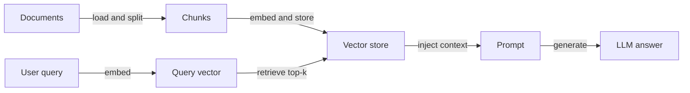
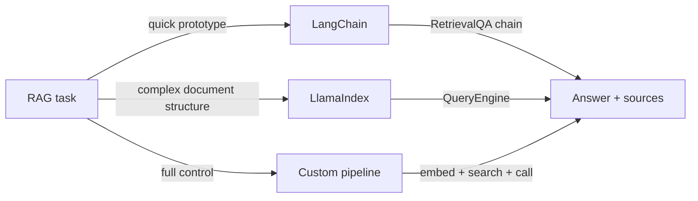

# Exemplos de RAG

## Definição

Esta página reúne exemplos concretos de RAG: Q&A simples, Q&A de documentos e busca híbrida com código que você pode adaptar. Cada exemplo demonstra um fluxo completo e executável desde a ingestão de documentos até a geração de respostas.

Cada exemplo segue o mesmo fluxo [RAG](/docs/rag) — indexar documentos, incorporar consulta, recuperar, gerar — mas com diferentes frameworks ou opções. O objetivo é fornecer pontos de partida que você pode integrar ao seu próprio projeto e estender. Ajuste o [chunking](/docs/rag/architecture), os [embeddings](/docs/rag/embeddings) e o [armazenamento vetorial](/docs/rag/vector-databases) para corresponder ao seu volume de dados, domínio e requisitos de latência.

Escolher o exemplo certo depende do seu stack: LangChain é adequado para protótipos rápidos com muitas integrações integradas; LlamaIndex se destaca na ingestão estruturada de documentos e consultas multi-índice; uma pipeline personalizada fornece controle máximo ao custo de mais código repetitivo. As três abordagens produzem a mesma saída conceitual — contexto recuperado alimentado em uma chamada de LLM.

## Como funciona

### Visão geral da pipeline



### Seleção de framework



## Quando usar / Quando NÃO usar

| Cenário | Usar estes exemplos | Não usar |
|---|---|---|
| Prototipagem rápida de um bot de Q&A | Sim — o exemplo do LangChain é mínimo | Não — construir uma pipeline personalizada do zero adiciona tempo desnecessário |
| App de produção com chunking personalizado | Sim — exemplo de pipeline personalizada | Não — os padrões do framework podem não corresponder à sua estratégia de chunking |
| Pesquisa multi-documento sobre dados estruturados | Sim — exemplo do LlamaIndex | Não — a cadeia genérica do LangChain pode perder a estrutura do documento |
| Documento único que cabe na janela de contexto | Não — passar o documento diretamente | Sim — a pipeline de recuperação é overhead desnecessário |
| Busca híbrida (semântica + palavras-chave) | Sim — usar Chroma ou Weaviate com BM25 | Não — busca de vetor único pode perder consultas críticas por palavras-chave |

## Exemplos de código

### Exemplo 1: RAG mínimo com LangChain

```python
from langchain_openai import OpenAIEmbeddings, ChatOpenAI
from langchain_community.vectorstores import Chroma
from langchain.text_splitter import RecursiveCharacterTextSplitter
from langchain.chains import RetrievalQA
from langchain_community.document_loaders import TextLoader

# Load and chunk
loader = TextLoader("my_document.txt")
docs = loader.load()
splitter = RecursiveCharacterTextSplitter(chunk_size=500, chunk_overlap=50)
chunks = splitter.split_documents(docs)

# Index
vectorstore = Chroma.from_documents(chunks, OpenAIEmbeddings())

# Retrieve and generate
qa = RetrievalQA.from_chain_type(
    llm=ChatOpenAI(model="gpt-4o-mini"),
    retriever=vectorstore.as_retriever(search_kwargs={"k": 4}),
    return_source_documents=True,
)

result = qa.invoke({"query": "Summarize the main points."})
print(result["result"])
for doc in result["source_documents"]:
    print("Source:", doc.metadata)
```

### Exemplo 2: Q&A de documentos com LlamaIndex

```python
from llama_index.core import VectorStoreIndex, SimpleDirectoryReader

# Load all documents from a folder
documents = SimpleDirectoryReader("./docs_folder").load_data()

# Build index (embeds and stores automatically)
index = VectorStoreIndex.from_documents(documents)

# Query
query_engine = index.as_query_engine()
response = query_engine.query("What is the refund policy?")
print(response)
```

### Exemplo 3: busca híbrida (densa + palavras-chave)

```python
from langchain_community.retrievers import BM25Retriever
from langchain.retrievers import EnsembleRetriever
from langchain_community.vectorstores import Chroma
from langchain_openai import OpenAIEmbeddings

# Dense retriever
vectorstore = Chroma.from_documents(chunks, OpenAIEmbeddings())
dense_retriever = vectorstore.as_retriever(search_kwargs={"k": 4})

# Sparse (BM25) retriever
bm25_retriever = BM25Retriever.from_documents(chunks)
bm25_retriever.k = 4

# Hybrid: combine both with equal weight
hybrid_retriever = EnsembleRetriever(
    retrievers=[bm25_retriever, dense_retriever],
    weights=[0.5, 0.5],
)

results = hybrid_retriever.invoke("product return window")
for r in results:
    print(r.page_content[:200])
```

## Recursos práticos

- [LangChain – Question answering](https://python.langchain.com/docs/use_cases/question_answering/) — Passo a passo completo de RAG com componentes LangChain
- [LlamaIndex – RAG tutorial](https://docs.llamaindex.ai/en/stable/getting_started/starter_example/) — Exemplo inicial para indexação e consulta de documentos
- [Chroma – Quickstart](https://docs.trychroma.com/getting-started) — Configurando um armazenamento vetorial local para desenvolvimento
- [OpenAI Cookbook – RAG](https://cookbook.openai.com/examples/question_answering_using_embeddings) — Exemplo RAG passo a passo com embeddings da OpenAI

## Veja também

- [RAG](/docs/rag)
- [Arquitetura RAG](/docs/rag/architecture)
- [Tools: LangChain](/docs/tools/langchain)
- [Tools: LlamaIndex](/docs/tools/llamaindex)
