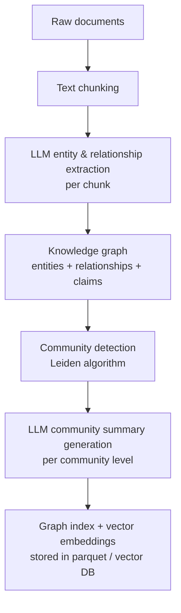
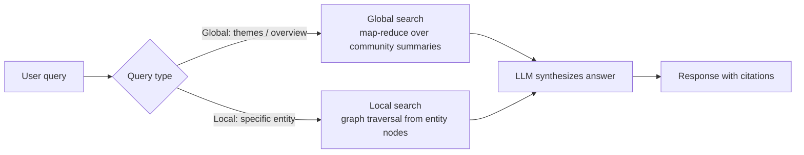

## Definição

**GraphRAG** (Graph Retrieval-Augmented Generation) é um framework de código aberto desenvolvido pela **Microsoft Research** que aumenta o RAG padrão com um grafo de conhecimento construído a partir do corpus-fonte. Em vez de recuperar fragmentos de texto brutos por similaridade vetorial, o GraphRAG primeiro extrai **entidades** (pessoas, lugares, conceitos, eventos) e seus **relacionamentos** dos documentos, organiza-os em um grafo hierárquico e então gera **sumários de comunidades** — descrições concisas em linguagem natural de clusters de entidades relacionadas.

No momento da consulta, duas estratégias de recuperação estão disponíveis:

- **Busca global** — responde perguntas sobre o "corpus inteiro" (ex.: "Quais são os temas principais neste conjunto de dados?") agregando sumários de comunidades que abrangem todo o grafo.
- **Busca local** — responde perguntas específicas sobre entidades percorrendo o grafo a partir de entidades relevantes pelos seus relacionamentos e fragmentos de texto associados.

Essa recuperação de modo duplo aborda a limitação central do RAG vetorial simples: a similaridade vetorial recupera documentos que são *localmente* similares à consulta, mas não consegue raciocinar sobre padrões *globais* em um corpus inteiro.

O GraphRAG foi disponibilizado como código aberto no GitHub em meados de 2024 e foi significativamente ampliado ao longo de 2025, incluindo o **LazyGraphRAG** — uma variante que pula a etapa cara de sumarização antecipada.

## Como funciona

### Pipeline de indexação

A fase de indexação offline é o passo mais distintivo do GraphRAG e seu principal centro de custo.

1. **Chunking** — Documentos são divididos em unidades de texto (padrão ~300 tokens com sobreposição).
2. **Extração de entidades e relacionamentos** — Um LLM lê cada fragmento e extrai triplas estruturadas: `(nome_entidade, tipo_entidade, descrição)` e `(origem, destino, descrição_relacionamento)`.
3. **Construção do grafo** — Entidades e relacionamentos extraídos são mesclados em um grafo de propriedades global; entidades duplicadas são resolvidas por correspondência de nomes.
4. **Detecção de comunidades** — O algoritmo Leiden particiona o grafo em comunidades hierarquicamente aninhadas (níveis 0–3+), onde comunidades em níveis mais altos representam clusters temáticos mais amplos.
5. **Sumarização de comunidades** — Um LLM gera um sumário em linguagem natural para cada comunidade descrevendo suas entidades, relacionamentos-chave e temas. Esses sumários se tornam o índice para consultas globais.
6. **Embedding vetorial** — Descrições de entidades, descrições de relacionamentos e fragmentos de texto também são embedados para busca local.

### Pipeline de consulta

A **busca global** usa uma estratégia map-reduce: a consulta é enviada a cada sumário de comunidade (em paralelo), cada um produz uma resposta parcial e uma etapa final de reduce sintetiza-as em uma resposta coerente. Isso é caro (muitas chamadas ao LLM), mas único ao GraphRAG — nenhuma outra variante de RAG consegue responder perguntas globais de forma confiável.

A **busca local** combina similaridade vetorial (para encontrar os fragmentos de texto mais relevantes) com travessia de grafo (para incluir entidades relacionadas e seu contexto de comunidade), produzindo contexto mais rico que o RAG vetorial puro.

## Quando usar / Quando NÃO usar

| Cenário | Use GraphRAG | Use RAG vetorial simples |
|---|---|---|
| Perguntas sobre **padrões globais, temas ou visões gerais** ("Quais são os principais riscos neste corpus?") | Sim — sumários de comunidades são feitos para isso | Não — similaridade vetorial perde a estrutura global |
| Consultas **centradas em entidades** com cadeias de relacionamentos complexas | Sim — travessia de grafo conecta entidades relacionadas | Parcial — pode perder relacionamentos multi-hop |
| Corpus é **estável e atualizado em lote** (artigos de pesquisa, documentos legais) | Sim — custo de indexação antecipada se amortiza em muitas consultas | Qualquer um funciona |
| Corpus é **atualizado frequentemente** em tempo real | Não — reindexação completa é necessária para consistência do grafo | Sim — índices vetoriais se atualizam de forma incremental |
| **Orçamento é limitado** (indexação custa 10–100× mais em chamadas ao LLM que RAG vetorial) | Somente se consultas globais justificam o custo | Sim — muito mais barato para indexar |
| Domínio requer **proveniência rastreável de entidades** | Sim — citações ligam de volta aos fragmentos-fonte via entidades | Parcial — citações somente a nível de fragmento |
| Perguntas e respostas factuais simples sobre um corpus pequeno | Exagero | Sim — adequado e muito mais barato |

## GraphRAG vs. RAG simples

| Dimensão | RAG vetorial simples | GraphRAG (local) | GraphRAG (global) |
|---|---|---|---|
| **Unidade de recuperação** | Fragmentos de texto | Fragmentos de texto + nós do grafo de entidades | Sumários de comunidades |
| **Força do tipo de consulta** | Factual específico | Específico de entidade com contexto | Temático / corpus inteiro |
| **Custo de indexação** | Baixo (embeda fragmentos) | Alto (extração LLM + embedding) | Alto + sumarização |
| **Custo de atualização** | Baixo (incremental) | Alto (re-extrai entidades afetadas) | Alto (re-sumariza comunidades) |
| **Raciocínio multi-hop** | Fraco | Bom (travessia de grafo) | Excelente (comunidade abrange muitos hops) |
| **Risco de alucinação** | Médio | Menor (contexto estruturado de entidade) | Menor (sumários pré-computados) |
| **Latência** | Baixa | Média | Alta (map-reduce) |

## LazyGraphRAG

O **LazyGraphRAG** (Microsoft Research, final de 2024) é uma variante otimizada em custo que pula a pré-geração de sumários de comunidades. Em vez disso, ele usa **frases nominais extraídas com PNL** (em vez de entidades extraídas por LLM) para construir um grafo leve, e gera sumários **sob demanda** no momento da consulta a partir do subgrafo relevante. Isso reduz dramaticamente os custos de tokens de indexação (frequentemente mais de 99%) enquanto mantém muito da qualidade de consulta global. É adequado quando o volume de consultas é baixo ou o corpus muda frequentemente.

## Recursos práticos

- [Documentação oficial do GraphRAG — Microsoft](https://microsoft.github.io/graphrag/)
- [Repositório GitHub do GraphRAG](https://github.com/microsoft/graphrag)
- [Microsoft Research: Anúncio do GraphRAG](https://www.microsoft.com/en-us/research/blog/graphrag-new-tool-for-complex-data-discovery-now-on-github/)
- [LazyGraphRAG — blog da Microsoft Research](https://www.microsoft.com/en-us/research/blog/lazygraphrag-setting-a-new-standard-for-quality-and-cost/)
- [RAG vs GraphRAG — análise aprofundada da Weaviate](https://weaviate.io/blog/graph-rag)

## Fontes

- [Documentação Microsoft GraphRAG](https://microsoft.github.io/graphrag/)
- [Microsoft Research — Post do blog GraphRAG](https://www.microsoft.com/en-us/research/blog/graphrag-new-tool-for-complex-data-discovery-now-on-github/)
- [LazyGraphRAG — novo padrão de qualidade e custo](https://www.microsoft.com/en-us/research/blog/lazygraphrag-setting-a-new-standard-for-quality-and-cost/)
- [Explorando RAG e GraphRAG — Weaviate](https://weaviate.io/blog/graph-rag)
- [RAG vs GraphRAG: Avaliação sistemática — arXiv 2502.11371](https://arxiv.org/html/2502.11371v2)
- [Guia completo de GraphRAG 2025 — Meilisearch](https://www.meilisearch.com/blog/graph-rag)

## Veja também

- [Visão geral de RAG](/docs/rag)
- [Arquitetura RAG](/docs/rag/architecture)
- [RAG Agêntico](/docs/rag/agentic-rag)
- [Bancos de dados vetoriais](/docs/rag/vector-databases)
- [Embeddings](/docs/rag/embeddings)
