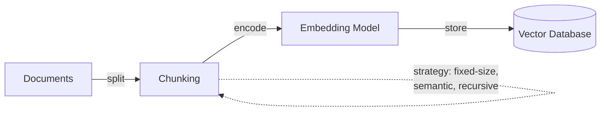
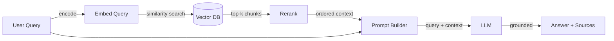

## Definição

A **geração aumentada por recuperação (RAG)** é uma técnica que aumenta um grande modelo de linguagem com uma etapa de recuperação externa: dada uma consulta do usuário, o sistema primeiro recupera documentos relevantes de uma fonte de conhecimento (tipicamente um armazenamento vetorial ou índice de busca), depois passa esses documentos como contexto ao LLM para gerar uma resposta fundamentada. Essa abordagem reduz alucinações ao ancorar a saída do modelo em dados reais e verificáveis, em vez de depender exclusivamente do conhecimento codificado durante o pré-treinamento.

RAG surgiu como um meio-termo prático entre dois extremos — usar um LLM de propósito geral sem conhecimento do domínio e fazer ajuste fino de um modelo em dados específicos do domínio. A arquitetura RAG original foi proposta por [Lewis et al. (2020)](https://arxiv.org/abs/2005.11401) no Facebook AI, combinando um recuperador (baseado em Dense Passage Retrieval) com um gerador sequência a sequência (BART). Desde então, o padrão evoluiu para um padrão arquitetônico amplamente adotado com muitas variações em estratégias de fragmentação, métodos de recuperação e técnicas de geração.

RAG é particularmente importante em ambientes empresariais e de produção porque permite que as organizações aproveitem dados proprietários ou que mudam frequentemente sem o custo e a complexidade do ajuste fino do modelo. Também permite a **citação de fontes** — o sistema pode apontar para os documentos exatos que informaram sua resposta, o que é fundamental para confiança, conformidade e auditabilidade em domínios como jurídico, saúde e finanças.

## Como funciona

### Indexação (offline)

Antes que o RAG possa responder consultas, sua base de conhecimento deve ser indexada. Os documentos são divididos em fragmentos (parágrafos, seções ou janelas deslizantes), cada fragmento é convertido em um vetor denso usando um [modelo de embeddings](/docs/rag/embeddings), e os vetores resultantes são armazenados em um [banco de dados vetorial](/docs/rag/vector-databases). A estratégia de fragmentação impacta significativamente a qualidade da recuperação — fragmentos muito grandes diluem a relevância, fragmentos muito pequenos perdem o contexto.



### Recuperação (no momento da consulta)

Quando um usuário envia uma consulta, ela é convertida em embedding usando o mesmo modelo, e o sistema realiza uma busca de similaridade (cosseno ou produto escalar) contra o banco de dados vetorial para recuperar os k fragmentos mais relevantes. Pipelines RAG avançadas adicionam uma etapa de **reranking** após a recuperação inicial para melhorar a precisão — um modelo cross-encoder pontua cada fragmento recuperado em relação à consulta e os reordena.

### Geração (no momento da consulta)

Os fragmentos recuperados são injetados no prompt do LLM como contexto, junto com a consulta original. O LLM gera uma resposta fundamentada nesse contexto. O design do prompt importa aqui — instruções como "Responda usando apenas o contexto fornecido" ajudam a reduzir alucinações, enquanto "Se o contexto não contiver a resposta, diga isso" previne fabricações.



## Quando usar / Quando NÃO usar

| Usar quando | Evitar quando |
|----------|------------|
| O conhecimento muda frequentemente (documentos, FAQs, políticas) e retreinar é impraticável | O conhecimento é estático e pequeno o suficiente para caber inteiramente na janela de contexto do prompt |
| São necessárias respostas fundamentadas em dados privados ou específicos do domínio | O modelo precisa aprender um novo comportamento ou estilo (o ajuste fino é melhor) |
| Citação de fontes e auditabilidade são requisitos | A latência é extremamente crítica e a etapa de recuperação adiciona atraso inaceitável |
| Deseja-se manter custos baixos — nenhum cómputo de treinamento necessário | O domínio requer raciocínio sobre todo o corpus, não apenas fragmentos recuperados |
| Múltiplas fontes de dados precisam ser consultadas (RAG multi-índice) | Os dados são principalmente estruturados/tabulares (SQL ou consultas estruturadas podem ser mais apropriadas) |

## Comparações

| Critério | RAG | Ajuste fino |
|----------|-----|-------------|
| Velocidade de atualização do conhecimento | Instantânea (atualizar índice) | Lenta (retreinar modelo) |
| Custo | Baixo (inferência + embedding) | Alto (cómputo de treinamento + hospedagem) |
| Controle de alucinações | Forte (fundamentado em documentos recuperados) | Moderado (depende da qualidade dos dados de treinamento) |
| Citação de fontes | Nativa (fragmentos recuperados são rastreáveis) | Não suportado |
| Comportamento/estilo personalizado | Limitado | Forte |
| Complexidade de configuração | Moderada (fragmentação + BD vetorial + recuperação) | Alta (curadoria de dados + pipeline de treinamento) |

## Prós e contras

| Prós | Contras |
|------|------|
| Reduz alucinações ao se fundamentar em dados reais | A qualidade da recuperação depende muito das escolhas de fragmentação e embedding |
| Não precisa retreinar quando o conhecimento muda | Adiciona latência pela etapa de recuperação |
| Permite citação de fontes para confiança e conformidade | Requer manutenção de banco de dados vetorial e pipeline de indexação |
| Funciona com qualquer LLM (API ou auto-hospedado) | Os limites da janela de contexto restringem quantos fragmentos podem ser passados |
| Menor custo que o ajuste fino para a maioria dos casos de uso | "Lixo entra, lixo sai" — má qualidade de documentos se propaga para as respostas |

## Benchmarks

- [RAGAS](https://docs.ragas.io/) — Framework para avaliar pipelines RAG (fidelidade, relevância das respostas, precisão/recall do contexto)
- [MTEB Leaderboard](https://huggingface.co/spaces/mteb/leaderboard) — Benchmarks de modelos de embedding relevantes para qualidade de recuperação RAG
- [RGB Benchmark](https://arxiv.org/abs/2309.01431) — Avaliação de geração aumentada por recuperação em cenários de ruído, rejeição, integração e contrafactuais

## Exemplos de código

### Pipeline RAG básica com LangChain (Python)

```python
from langchain_community.vectorstores import Chroma
from langchain_openai import OpenAIEmbeddings, ChatOpenAI
from langchain_core.prompts import ChatPromptTemplate

# 1. Index documents (one-time or incremental)
embeddings = OpenAIEmbeddings(model="text-embedding-3-small")
vectorstore = Chroma.from_documents(documents, embeddings)

# 2. Retrieve relevant chunks
query = "What is retrieval-augmented generation?"
docs = vectorstore.similarity_search(query, k=4)
context = "\n\n".join(d.page_content for d in docs)

# 3. Generate grounded answer
prompt = ChatPromptTemplate.from_messages([
    ("system", "Answer using only the context below. If the context "
               "doesn't contain the answer, say 'I don't know'.\n\n{context}"),
    ("human", "{question}"),
])

llm = ChatOpenAI(model="gpt-4o")
chain = prompt | llm
answer = chain.invoke({"context": context, "question": query})
print(answer.content)
```

### RAG com LlamaIndex (Python)

```python
from llama_index.core import VectorStoreIndex, SimpleDirectoryReader

# 1. Load and index documents
documents = SimpleDirectoryReader("./data").load_data()
index = VectorStoreIndex.from_documents(documents)

# 2. Query with built-in retrieval + generation
query_engine = index.as_query_engine(similarity_top_k=4)
response = query_engine.query("What is RAG?")
print(response)

# Access source nodes for citation
for node in response.source_nodes:
    print(f"Source: {node.metadata['file_name']} (score: {node.score:.3f})")
```

## Recursos práticos

- [RAG paper — Lewis et al. (2020)](https://arxiv.org/abs/2005.11401) — O artigo de pesquisa original apresentando a geração aumentada por recuperação
- [LangChain RAG tutorial](https://python.langchain.com/docs/tutorials/rag/) — Guia passo a passo para construir uma pipeline RAG com LangChain
- [LlamaIndex RAG guide](https://docs.llamaindex.ai/en/stable/understanding/rag/) — Documentação oficial do LlamaIndex sobre conceitos e implementação de RAG
- [Vertex AI RAG and grounding](https://cloud.google.com/vertex-ai/docs/generative-ai/grounding/overview) — RAG no Google Cloud com Vertex AI
- [Pinecone RAG guide](https://www.pinecone.io/learn/retrieval-augmented-generation/) — Guia prático cobrindo estratégias de fragmentação, embedding e recuperação

## Veja também

- [Arquitetura RAG](/docs/rag/architecture)
- [Bancos de dados vetoriais](/docs/rag/vector-databases)
- [Embeddings](/docs/rag/embeddings)
- [Exemplos RAG](/docs/rag/examples)
- [LLMs](/docs/llms)
- [LangChain](/docs/tools/langchain)
- [LlamaIndex](/docs/tools/llamaindex)
