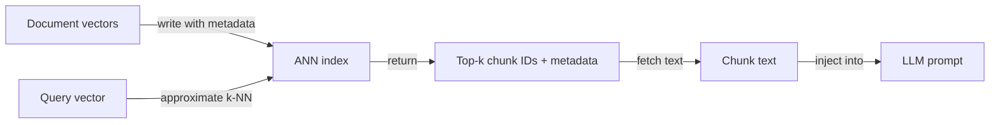
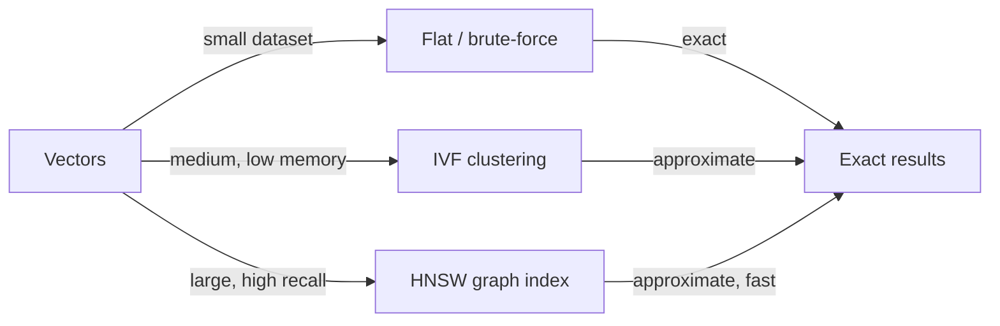

# Bancos de dados vetoriais

## Definição

Bancos de dados vetoriais armazenam vetores de alta dimensão ([embeddings](/docs/rag/embeddings)) e suportam busca rápida por similaridade usando algoritmos como k-vizinhos mais próximos (k-NN) e vizinhos mais próximos aproximados (ANN). Eles são a espinha dorsal da camada de recuperação em sistemas [RAG](/docs/rag), permitindo busca semântica em escala sobre milhões de fragmentos de documentos.

Eles ficam entre os [embeddings](/docs/rag/embeddings) (que produzem os vetores) e o recuperador [RAG](/docs/rag) (que precisa dos k fragmentos mais relevantes para uma consulta dada). Ao contrário dos bancos de dados tradicionais baseados em palavras-chave, os bancos de dados vetoriais medem a **distância semântica**: "suporte ao cliente" pode corresponder a "central de atendimento" se o modelo de embedding os colocar próximos. A maioria dos bancos de dados vetoriais também suporta filtragem de metadados — você pode restringir a recuperação a documentos de uma determinada data, categoria ou fonte.

Escolher o banco de dados vetorial certo depende dos seus requisitos: gerenciado vs. auto-hospedado, escala (milhares vs. centenas de milhões de vetores), capacidades de filtragem de metadados, suporte a busca híbrida (densa + esparsa) e se você precisa de multi-tenancy ou controle de acesso. Ver [arquitetura RAG](/docs/rag/architecture) para como o índice se encaixa na pipeline completa.

## Como funciona

### Indexação e consulta



### Tipos de índice



Os documentos são [incorporados](/docs/rag/embeddings) e seus vetores são escritos em um **índice** (ex. HNSW, IVF ou plano para conjuntos de dados pequenos). No momento da consulta, o **vetor de consulta** é comparado contra o índice via **k-NN** (ou k-NN aproximado para escala); o índice retorna **top-k IDs** e opcionalmente metadados armazenados. Você então busca os fragmentos correspondentes e os passa ao LLM. HNSW (Hierarchical Navigable Small World) é o algoritmo ANN mais popular — oferece tempo de consulta sub-linear com alto recall. Índices planos são exatos mas O(n) e apenas adequados para conjuntos de dados pequenos.

## Quando usar / Quando NÃO usar

| Cenário | Usar BD vetorial | Não usar BD vetorial |
|---|---|---|
| Busca semântica sobre grandes corpus de documentos | Sim — índices ANN lidam com a escala | Não — busca por palavras-chave se você só precisa de correspondência exata de frase |
| RAG com milhões de fragmentos | Sim — construído especificamente para escala vetorial | Não — BDs relacionais com pgvector podem ser suficientes abaixo de ~1M vetores |
| Busca híbrida (semântica + BM25) | Sim — Weaviate, Qdrant suportam híbrido nativamente | Não — puramente densa se suas consultas são sempre semânticas |
| SaaS multi-tenant com namespaces isolados | Sim — Pinecone e Weaviate suportam namespacing | Não — FAISS auto-hospedado não tem multi-tenancy |
| Desenvolvimento offline, local | Sim — Chroma ou FAISS sem infra | Não — BDs cloud gerenciados adicionam custo e latência de rede para desenvolvimento |

## Comparações

| Banco de dados | Hospedagem | Escala | Busca híbrida | Filtros de metadados | Melhor para |
|---|---|---|---|---|---|
| **Pinecone** | Cloud gerenciado | Muito grande (bilhões) | Sim (esparsa + densa) | Sim | Produção em escala, sem gerenciamento de infra |
| **Chroma** | Auto-hospedado / embarcado | Pequeno–médio | Não (apenas densa) | Sim | Desenvolvimento local, prototipagem, nativo Python |
| **Weaviate** | Auto-hospedado ou cloud | Grande | Sim (BM25 + densa) | Sim | Produção com busca híbrida |
| **FAISS** | Auto-hospedado (biblioteca) | Grande | Não | Não | Pesquisa, busca em lote offline |
| **pgvector** | Extensão PostgreSQL | Médio | Parcial (com FTS) | Sim (SQL) | Equipes já no Postgres |
| **Qdrant** | Auto-hospedado ou cloud | Grande | Sim | Sim | Baixa latência, baseado em Rust, open-source |

## Prós e contras

| Prós | Contras |
|---|---|
| Tempo de consulta sub-linear com índices ANN | ANN introduz compromisso de recall vs. busca exata |
| Suporta similaridade semântica out of the box | Armazenamento vetorial é caro em dimensões muito altas |
| Filtros de metadados permitem combinar consultas semânticas + estruturadas | Serviços gerenciados adicionam custo cloud contínuo |
| Escala horizontalmente para grandes corpus | Sem compreensão nativa do texto — depende da qualidade do embedding |

## Exemplos de código

```python
import chromadb
from openai import OpenAI

openai_client = OpenAI()
chroma_client = chromadb.Client()
collection = chroma_client.create_collection("my_docs")

# Helper: embed text
def embed(text: str) -> list[float]:
    return openai_client.embeddings.create(
        model="text-embedding-3-small",
        input=text,
    ).data[0].embedding

# Index documents
documents = [
    "Returns are accepted within 30 days of purchase.",
    "Shipping takes 3–5 business days.",
    "Contact support at support@example.com.",
]
collection.add(
    documents=documents,
    embeddings=[embed(d) for d in documents],
    ids=[f"doc_{i}" for i in range(len(documents))],
)

# Query
query = "What is the return window?"
results = collection.query(
    query_embeddings=[embed(query)],
    n_results=2,
)
for doc in results["documents"][0]:
    print(doc)
```

## Recursos práticos

- [Chroma – Get started](https://docs.trychroma.com/getting-started) — Armazenamento vetorial embarcado para Python, ideal para desenvolvimento local
- [Pinecone – Vector database docs](https://docs.pinecone.io/) — BD vetorial cloud gerenciado com opções serverless e baseadas em pods
- [Weaviate – Documentation](https://weaviate.io/developers/weaviate) — BD vetorial open-source com busca híbrida nativa
- [FAISS – GitHub](https://github.com/facebookresearch/faiss) — Biblioteca Facebook AI Similarity Search para indexação local de alto desempenho
- [pgvector – GitHub](https://github.com/pgvector/pgvector) — Extensão de busca de similaridade vetorial para PostgreSQL

## Veja também

- [RAG](/docs/rag)
- [Embeddings](/docs/rag/embeddings)
- [Arquitetura RAG](/docs/rag/architecture)
- [Busca semântica](/docs/semantic-search)
