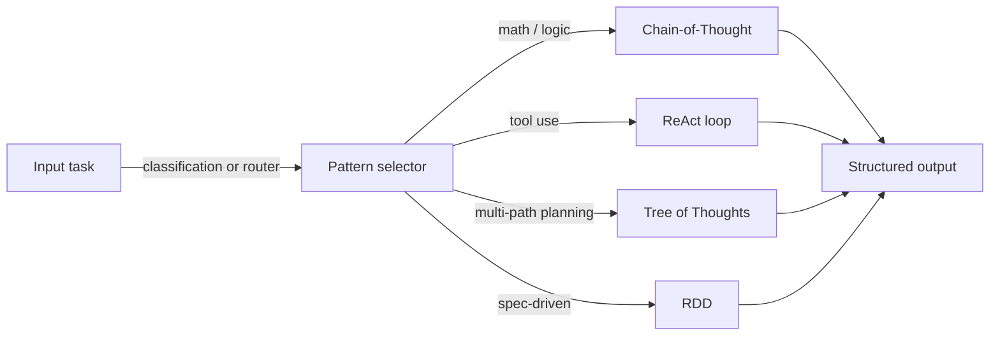
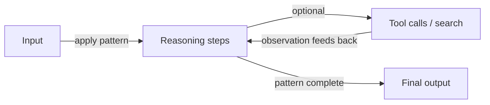

# Padrões de raciocínio

## Definição

Padrões de raciocínio são formas estruturadas de elicitar ou organizar o raciocínio do modelo: cadeia de pensamento (passo a passo), árvore de pensamentos (explorar ramos), ReAct (raciocinar + agir) e RDD (recuperação-decisão-projeto), entre outros. Usar um padrão claro melhora a **confiabilidade** (raciocínio mais consistente) e a **depurabilidade** (você pode inspecionar etapas ou ações).

São usados em [engenharia de prompts](/docs/prompt-engineering) (ex. CoT) e dentro de [agentes](/docs/agents) (ex. ReAct, RDD). Sem um padrão de raciocínio, os modelos tendem a produzir respostas planas e desestruturadas que pulam etapas — um padrão de raciocínio atua como andaime que torna o processo de pensamento do modelo explícito, inspecionável e corrigível. Os padrões também podem ser combinados: CoT pode executar dentro do passo de pensamento de um agente ReAct, e ToT pode alimentar candidatos em um laço de decisão RDD.

A escolha de um padrão depende da complexidade da tarefa, da computação disponível e se o sistema tem acesso a ferramentas ou conhecimento externos. CoT é o ponto de partida de menor custo; ReAct adiciona uso de ferramentas; ToT adiciona busca sobre múltiplos caminhos; RDD adiciona conformidade baseada em especificações. A maioria dos sistemas de produção combina pelo menos dois padrões.

## Como funciona

### Seleção de padrão



### Laço de raciocínio genérico



Você alimenta o **input** (pergunta, tarefa) em um **padrão**: o padrão restringe como o modelo raciocina ou age (ex. "pense passo a passo" ou laços pensamento–ação–observação). O modelo produz um **output** (resposta, sequência de ações). Prompts ou design do sistema encorajam o modelo a mostrar raciocínio ou a intercalar pensamento e ação. Os padrões podem ser combinados (ex. [CoT](/docs/reasoning-patterns/cot) dentro de um laço de [agente](/docs/agents)). Veja as páginas vinculadas para detalhes de cada padrão.

## Quando usar / Quando NÃO usar

| Cenário | Usar padrões de raciocínio | Não usar |
|---|---|---|
| Matemática, lógica ou programação em múltiplas etapas | Sim — CoT melhora a precisão significativamente | Não — prompting de tentativa única frequentemente falha no raciocínio complexo |
| Agentes que usam ferramentas | Sim — ReAct estrutura cada ação com um pensamento | Não — chamadas diretas a ferramentas sem raciocínio aumentam erros |
| Planejamento sobre muitos ramos de solução | Sim — ToT explora e pontua alternativas | Não — CoT é mais barato se normalmente há um caminho correto |
| Tarefas que exigem conformidade com especificações | Sim — RDD faz cumprir especificações recuperadas | Não — geração livre para tarefas criativas abertas |
| Buscas factuais simples | Não — padrões de raciocínio adicionam custo desnecessário | Sim — recuperação ou busca direta é mais rápida |

## Comparações

| Padrão | Mecanismo central | Custo | Melhor tipo de tarefa | Combinável com |
|---|---|---|---|---|
| Chain-of-Thought (CoT) | Etapas de raciocínio sequenciais | Baixo (1 chamada) | Matemática, lógica, dedução | ReAct, ToT, RDD |
| Tree of Thoughts (ToT) | Ramificar, pontuar, expandir | Alto (N chamadas) | Planejamento, busca, criativo | CoT por ramo |
| ReAct | Laço pensamento–ação–observação | Médio (1 chamada + ferramentas) | Agentes com ferramentas | CoT, RDD |
| RDD | Recuperar spec → decidir → gerar → validar | Médio–alto | Conformidade, gen. baseada em spec | ReAct, RAG |

## Prós e contras

| Prós | Contras |
|---|---|
| Torna o raciocínio do modelo explícito e inspecionável | Adiciona tokens (custo e latência) |
| Melhora significativamente a precisão em tarefas estruturadas | O padrão de raciocínio errado para a tarefa pode prejudicar a qualidade |
| Permite depuração inspecionando etapas intermediárias | Nem todos os modelos seguem padrões de forma confiável |
| Combinável — padrões podem ser aninhados ou combinados | Combinações complexas aumentam o esforço de engenharia de prompts |

## Exemplos de código

```python
from openai import OpenAI

client = OpenAI()

def chain_of_thought(question: str) -> str:
    """Zero-shot CoT: append 'Let's think step by step' to elicit reasoning."""
    response = client.chat.completions.create(
        model="gpt-4o-mini",
        messages=[
            {
                "role": "user",
                "content": f"{question}\n\nLet's think step by step.",
            }
        ],
    )
    return response.choices[0].message.content

answer = chain_of_thought("If a train travels 60 km/h for 2.5 hours, how far does it go?")
print(answer)
```

## Recursos práticos

- [Chain-of-Thought Prompting (Wei et al.)](https://arxiv.org/abs/2201.11903) — Artigo CoT original que estabelece o raciocínio passo a passo
- [ReAct: Synergizing Reasoning and Acting (Yao et al.)](https://arxiv.org/abs/2210.03629) — Artigo ReAct que introduz laços pensamento–ação–observação
- [Tree of Thoughts (Yao et al.)](https://arxiv.org/abs/2305.10601) — Artigo ToT sobre raciocínio multi-caminho e busca
- [Anthropic – Prompt engineering overview](https://docs.anthropic.com/en/docs/build-with-claude/prompt-engineering/overview) — Guia prático sobre CoT e raciocínio estruturado

## Veja também

- [Chain-of-thought](/docs/reasoning-patterns/cot)
- [Tree of thoughts](/docs/reasoning-patterns/tot)
- [ReAct](/docs/reasoning-patterns/react)
- [RDD](/docs/reasoning-patterns/rdd)
