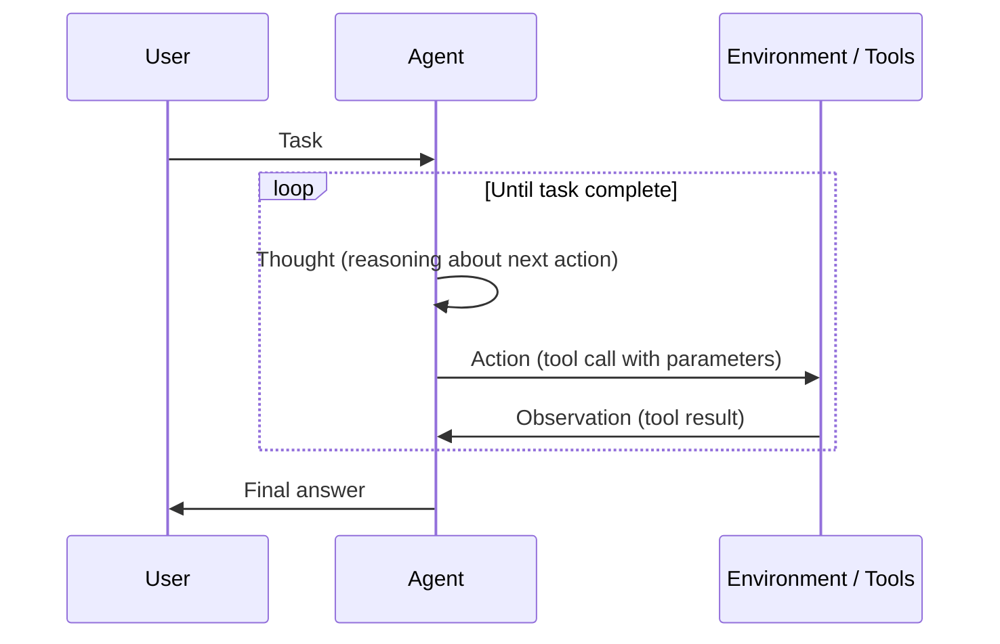
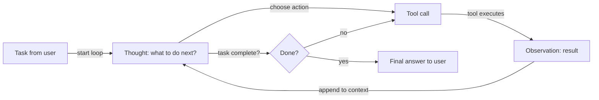

## Definição

ReAct é um paradigma onde o modelo alterna **raciocínio** (o que fazer a seguir, por quê) e **ação** (chamadas de ferramentas). A observação do ambiente é retroalimentada na próxima etapa de raciocínio, formando um loop até que a tarefa seja concluída. Essa intercalação reduz erros causados pelo uso cego ou repetitivo de ferramentas, pois cada ação é precedida de uma justificativa explícita.

A contribuição central do artigo ReAct é mostrar que combinar traços de raciocínio e etapas de ação em uma única chamada ao LLM supera ambos separadamente: o raciocínio puro (CoT) carece de ancoragem factual, e a ação pura (chamada de ferramenta sem pensamento) é propensa a erros e difícil de depurar. Ao tornar os pensamentos visíveis, ReAct também produz traços de agente interpretáveis que os humanos podem inspecionar e corrigir.

É o padrão padrão para [agentes](/docs/agents) que usam ferramentas. Frequentemente combinado com [chain-of-thought](/docs/reasoning-patterns/cot) (raciocínio dentro da etapa de pensamento) e com [RDD](/docs/reasoning-patterns/rdd) quando especificações recuperadas devem guiar cada decisão.

## Como funciona

### Loop pensamento–ação–observação



### Fluxo de decisão do agente



O formato do prompt é **Pensamento → Ação → Observação → Pensamento → … → Resposta Final**. O **usuário** dá uma **tarefa**; o **agente** produz um **pensamento** (raciocínio sobre o que fazer), depois uma **ação** (p. ex., chamada de ferramenta). O **ambiente/ferramentas** retornam uma **observação**, que é adicionada ao contexto para o próximo pensamento. O modelo decide quando chamar ferramentas e quando concluir. Frameworks como LangChain e LlamaIndex implementam agentes no estilo ReAct com registro de ferramentas e manipulação de mensagens.

## Quando usar / Quando NÃO usar

| Cenário | Usar ReAct | Não usar ReAct |
|---|---|---|
| Agente usando múltiplas ferramentas (busca, calculadora, API) | Sim — pensamento antes da ação reduz o mau uso de ferramentas | Não — se apenas uma ferramenta é necessária, uma chamada de função mais simples é suficiente |
| Comportamento de agente depurável necessário | Sim — traços de pensamento são inspecionáveis e registráveis | Não — para pipelines de caixa preta onde traços não são necessários |
| Pesquisa de múltiplas etapas com contexto em evolução | Sim — cada observação informa o próximo pensamento | Não — recuperação única + geração é mais rápida e barata |
| Tarefas de alta confiabilidade (p. ex., execução de código) | Sim — raciocinar antes de agir captura erros prováveis | Não — para tarefas CRUD simples sem ambiguidade |
| Requisitos de latência muito baixa | Não — a geração de pensamentos adiciona tokens por etapa | Sim — chamada de função direta é mais rápida quando o raciocínio é desnecessário |

## Comparações

| Padrão | Tem pensamento explícito | Tem uso de ferramentas | Loop | Melhor para |
|---|---|---|---|---|
| CoT | Sim | Não | Não | Tarefas de raciocínio estático |
| ReAct | Sim | Sim | Sim | Agentes que usam ferramentas |
| Chamada de função (sem pensamento) | Não | Sim | Não | Invocações de ferramentas simples e determinísticas |
| RDD | Sim (guiado por especificação) | Sim | Sim | Agentes de conformidade e orientados a especificações |

## Prós e contras

| Prós | Contras |
|---|---|
| Reduz chamadas cegas ou repetitivas de ferramentas | Tokens extras por etapa (sobrecarga de pensamento) |
| Produz traços interpretáveis e depuráveis | O loop pode durar muito se os critérios de parada forem fracos |
| Funciona bem com LangChain/LlamaIndex nativamente | Requer schemas de ferramentas bem definidos e tratamento de erros |
| Lida naturalmente com tarefas de múltiplas etapas | A qualidade do pensamento depende do modelo subjacente |

## Exemplos de código

```python
from langchain_openai import ChatOpenAI
from langchain.agents import create_react_agent, AgentExecutor
from langchain_community.tools import DuckDuckGoSearchRun
from langchain import hub

# Load a pre-built ReAct prompt template
prompt = hub.pull("hwchase17/react")

# Define tools
tools = [DuckDuckGoSearchRun()]

# Create ReAct agent
llm = ChatOpenAI(model="gpt-4o-mini", temperature=0)
agent = create_react_agent(llm=llm, tools=tools, prompt=prompt)
executor = AgentExecutor(agent=agent, tools=tools, verbose=True, max_iterations=5)

# Run — the agent will produce Thought/Action/Observation traces
result = executor.invoke({"input": "What is the current population of Tokyo?"})
print(result["output"])
```

## Recursos práticos

- [ReAct: Synergizing Reasoning and Acting in LLMs (Yao et al.)](https://arxiv.org/abs/2210.03629) — Artigo original ReAct com benchmarks em HotpotQA, Fever e ALFWorld
- [LangChain – ReAct agent](https://python.langchain.com/docs/concepts/agents/) — Agentes no estilo ReAct com registro de ferramentas no LangChain
- [Anthropic – Tool use guide](https://docs.anthropic.com/en/docs/build-with-claude/tool-use) — Uso nativo de ferramentas do Claude, seguindo padrões pensamento-ação no estilo ReAct

## Fontes

- [ReAct: Synergizing Reasoning and Acting in Language Models (Yao et al., 2022)](https://arxiv.org/abs/2210.03629) — Artigo seminal que introduz o loop interleaved pensamento–ação–observação com benchmarks em HotpotQA, FEVER e ALFWorld.
- [Chain-of-Thought Prompting Elicits Reasoning in Large Language Models (Wei et al., 2022)](https://arxiv.org/abs/2201.11903) — Trabalho fundamental sobre etapas de raciocínio explícitas sobre o qual o ReAct se apoia.
- [Toolformer: Language Models Can Teach Themselves to Use Tools (Schick et al., 2023)](https://arxiv.org/abs/2302.04761) — Trabalho complementar sobre integração auto-supervisionada de ferramentas que sustenta implementações ReAct.
- [Reflexion: Language Agents with Verbal Reinforcement Learning (Shinn et al., 2023)](https://arxiv.org/abs/2303.11366) — Estende o ReAct com reflexão verbal em nível de episódio para auto-aprimoramento iterativo.

## Veja também

- [Agentes](/docs/agents)
- [Padrões de raciocínio](/docs/reasoning-patterns)
- [Chain-of-thought](/docs/reasoning-patterns/cot)
- [RDD](/docs/reasoning-patterns/rdd)
