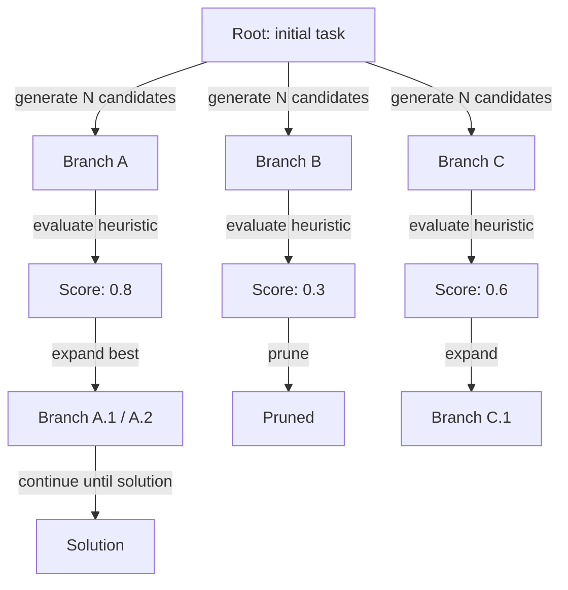
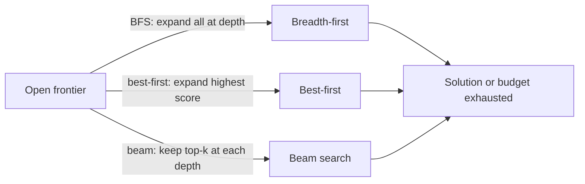

## Definição

Tree of Thoughts (ToT) estende CoT mantendo múltiplos ramos de raciocínio simultaneamente. Em cada etapa, o modelo gera várias continuações candidatas; uma heurística ou um modelo de avaliação separado as pontua, e um algoritmo de busca (melhor primeiro, busca em feixe ou BFS) decide quais ramos expandir mais.

A ideia central é que problemas difíceis — planejamento, jogos, provas complexas — podem exigir retrocesso ou exploração de alternativas antes de se comprometer. Um único caminho de [chain-of-thought](/docs/reasoning-patterns/cot) não tem mecanismo para se recuperar de uma etapa intermediária ruim; ToT mantém explicitamente uma fronteira de ramos promissores e poda os não promissores, semelhante aos algoritmos clássicos de busca em árvore (MCTS, A*) aplicados à geração de linguagem.

Use-o quando um único caminho de [chain-of-thought](/docs/reasoning-patterns/cot) pode travar (p. ex., movimentos de jogo, planejamento de múltiplas etapas) e você pode pagar por múltiplas chamadas ao LLM. Ele troca computação por melhor busca no espaço de soluções. Veja os [padrões de raciocínio](/docs/reasoning-patterns) para o conjunto completo de opções.

## Como funciona

### Expansão e poda da árvore



### Estratégias de busca



Partir de uma **raiz** (p. ex., a pergunta ou estado inicial). **Ramificar**: em cada etapa, gerar várias continuações (p. ex., próximas etapas de raciocínio ou movimentos). **Pontuar** cada ramo com uma heurística ou uma chamada de modelo separada (p. ex., "quão promissora é essa solução parcial numa escala de 1 a 10?"). **Expandir** o(s) melhor(es) nó(s) e repetir; podar ramos de baixa pontuação para limitar o custo. A árvore é construída de forma incremental até que uma solução seja encontrada ou um limite de profundidade/orçamento seja atingido. O fator de ramificação e a profundidade máxima são hiperparâmetros-chave que controlam o trade-off custo/qualidade.

## Quando usar / Quando NÃO usar

| Cenário | Usar ToT | Não usar ToT |
|---|---|---|
| Jogar ou resolver quebra-cabeças com muitos movimentos | Sim — explorar ramos é essencial | Não — CoT suficiente para quebra-cabeças de caminho único |
| Planejamento complexo de múltiplas etapas com retrocesso | Sim — ToT pode se recuperar de becos sem saída | Não — tarefas mais simples não precisam de retrocesso |
| Geração criativa com muitas opções válidas | Sim — gerar e pontuar múltiplos rascunhos | Não — saída criativa única não precisa disso |
| Inferência de produção de alto volume | Não — múltiplas chamadas ao LLM são caras | Sim — usar CoT ou prompting direto em vez disso |
| Restrições de tempo real rígidas | Não — a latência do ToT é alta | Sim — não adequado para respostas abaixo de um segundo |

## Comparações

| Abordagem | Caminhos explorados | Pontuação | Custo | Melhor para |
|---|---|---|---|---|
| CoT | 1 | Nenhuma | Baixo (1 chamada) | Tarefas lineares de múltiplas etapas |
| Autoconsistência | N (paralelo) | Votação majoritária | Médio (N chamadas) | Tarefas com respostas verificáveis |
| ToT | N (sequencial, podado) | Heurística / modelo | Alto (N+ chamadas) | Planejamento, busca, criatividade |
| MCTS (clássico) | N (simulação) | Sinal de recompensa | Muito alto | IA de jogos com recompensa clara |

## Prós e contras

| Prós | Contras |
|---|---|
| Explora e se recupera de becos sem saída | Custo muito alto de tokens e API |
| Produz soluções de maior qualidade em tarefas difíceis | Requer uma boa função de pontuação/avaliação |
| Espelha a busca clássica — fundamentado e adaptável | Complexo de implementar em comparação ao CoT |
| O fator de ramificação é ajustável para o trade-off custo/qualidade | Nem todas as tarefas se beneficiam da busca de múltiplos caminhos |

## Exemplos de código

```python
from openai import OpenAI

client = OpenAI()

def generate_thoughts(state: str, n: int = 3) -> list[str]:
    """Generate N candidate next steps from the current state."""
    response = client.chat.completions.create(
        model="gpt-4o-mini",
        messages=[
            {
                "role": "user",
                "content": (
                    f"Current reasoning state:\n{state}\n\n"
                    f"Generate {n} distinct possible next reasoning steps. "
                    "Number each one."
                ),
            }
        ],
    )
    raw = response.choices[0].message.content
    # Simple parse: split on numbered lines
    return [line.strip() for line in raw.split("\n") if line.strip() and line[0].isdigit()]

def score_thought(state: str, thought: str) -> float:
    """Score a thought's promise on a 0-1 scale."""
    response = client.chat.completions.create(
        model="gpt-4o-mini",
        messages=[
            {
                "role": "user",
                "content": (
                    f"Rate how promising this reasoning step is for solving the task "
                    f"(0 = dead end, 1 = very promising).\n\n"
                    f"State: {state}\nThought: {thought}\n\nScore (0.0–1.0):"
                ),
            }
        ],
    )
    try:
        return float(response.choices[0].message.content.strip())
    except ValueError:
        return 0.5

# Simple best-first ToT (depth 2, branching factor 3)
task = "Plan 3 steps to build a minimal RAG chatbot."
candidates = generate_thoughts(task, n=3)
scored = [(thought, score_thought(task, thought)) for thought in candidates]
best = max(scored, key=lambda x: x[1])
print("Best next step:", best[0])
```

## Recursos práticos

- [Tree of Thoughts (Yao et al.)](https://arxiv.org/abs/2305.10601) — Artigo original ToT com benchmarks game-of-24 e escrita criativa
- [LangChain – Agents and planning](https://python.langchain.com/docs/concepts/agents/) — ToT e padrões de planejamento relacionados
- [Princeton NLP – ToT repository](https://github.com/princeton-nlp/tree-of-thought-llm) — Implementação de referência dos autores do artigo

## Fontes

- [Tree of Thoughts: Deliberate Problem Solving with Large Language Models (Yao et al., 2023)](https://arxiv.org/abs/2305.10601) — Artigo seminal que introduz a busca em árvore multi-caminho sobre etapas de raciocínio com benchmarks no Game of 24 e escrita criativa.
- [Large Language Model Guided Tree-of-Thought (Long, 2023)](https://arxiv.org/abs/2305.08291) — Trabalho simultâneo sobre raciocínio estruturado em árvore com poda baseada em LLM.
- [Chain-of-Thought Prompting Elicits Reasoning in Large Language Models (Wei et al., 2022)](https://arxiv.org/abs/2201.11903) — Base que o ToT estende de raciocínio em caminho único para múltiplos caminhos.
- [Self-Consistency Improves Chain of Thought Reasoning in Language Models (Wang et al., 2022)](https://arxiv.org/abs/2203.11171) — Abordagem relacionada por amostragem que o ToT generaliza com busca estruturada.

## Veja também

- [Chain-of-thought](/docs/reasoning-patterns/cot)
- [Padrões de raciocínio](/docs/reasoning-patterns)
- [Agentes](/docs/agents)
