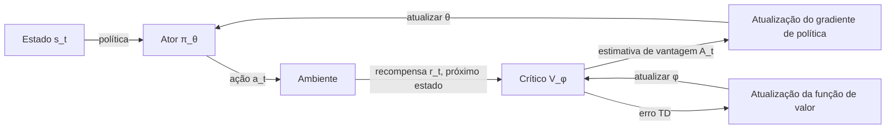

## Definição

Métodos de gradiente de política são uma família de algoritmos de aprendizado por reforço que parametrizam e otimizam diretamente a política π_θ(a|s) — a distribuição de probabilidade sobre ações dado os estados — computando gradientes do retorno esperado com respeito aos parâmetros de política θ. Diferente dos métodos baseados em valor (Q-learning, DQN) que aprendem uma função de valor e derivam a política implicitamente, os métodos de gradiente de política otimizam a política diretamente, tornando-os naturalmente adequados a espaços de ação contínuos e de alta dimensão.

A percepção central é o **teorema do gradiente de política**: o gradiente do retorno esperado J(θ) com respeito aos parâmetros de política pode ser estimado a partir de amostras de interações com o ambiente sem conhecer o modelo de transição:

`∇_θ J(θ) = E[∇_θ log π_θ(a|s) · Q^π(s,a)]`

Essa expectativa é estimada via rollouts de Monte Carlo. Uma **linha de base** aprendida (crítico / função de valor) reduz a variância. O framework ator-crítico combina ambos: o **ator** é a política, o **crítico** é uma função de valor aprendida que fornece a linha de base.

Algoritmos principais:

- **REINFORCE** — gradiente de política Monte Carlo puro. Simples, mas com alta variância.
- **PPO (Proximal Policy Optimization)** — recorta a razão de atualização de política para manter as atualizações pequenas, prevenindo degradação catastrófica de política. O algoritmo de RL profundo mais amplamente usado tanto em robótica quanto em RLHF.
- **SAC (Soft Actor-Critic)** — RL de entropia máxima; adiciona um bônus de entropia para encorajar exploração. Estado da arte para tarefas de controle contínuo e eficiente fora da política.

## Como funciona

### Loop ator-crítico

1. **Coletar rollout** — executar a política atual no ambiente por T passos, registrando tuplas (s, a, r, s').
2. **Estimar vantagens** — computar vantagem A_t = r_t + γV(s_\{t+1\}) - V(s_t) (vantagem TD) ou GAE (Estimação de Vantagem Generalizada) para menor variância.
3. **Atualizar ator** — maximizar E[log π_θ(a|s) · A_t]; recortar a atualização (PPO) ou escalar com entropia (SAC).
4. **Atualizar crítico** — minimizar MSE entre V_φ(s) e os retornos computados.

### Recorte PPO

O PPO define a razão de probabilidade r_t(θ) = π_θ(a_t|s_t) / π_\{θ_old\}(a_t|s_t) e a recorta em [1-ε, 1+ε] (tipicamente ε=0,2). Isso previne grandes atualizações de política que desestabilizam o treinamento enquanto ainda permite melhoria significativa.

### Maximização de entropia SAC

O SAC aumenta a recompensa com um termo de entropia: r'(s, a) = r(s, a) + α H(π(·|s)). Isso encoraja a política a manter diversidade de ações (exploração) enquanto maximiza a recompensa da tarefa. O SAC é fora da política — usa um buffer de replay — tornando-o eficiente em amostras.

## Quando usar / Quando NÃO usar

| Cenário | Usar | Evitar |
|---|---|---|
| Espaços de ação contínuos (robótica, controle) | SAC ou PPO — suporte nativo para ações contínuas | DQN — apenas discreto sem modificação |
| Ajuste fino de LLM (RLHF) | PPO — amplamente adotado, estável | SAC — projetado para controle contínuo |
| Eficiência de amostra é crítica | SAC (buffer de replay fora da política) | PPO (na política — requer novos rollouts) |
| Estabilidade e reprodutibilidade | PPO — hiperparâmetros bem compreendidos | REINFORCE — alta variância |
| Manipulação robótica com múltiplos objetivos | SAC + HER (Hindsight Experience Replay) | Baseado em valor — ruim para controle contínuo |

## Fontes

- [Proximal Policy Optimization Algorithms — Schulman et al. (OpenAI, 2017)](https://arxiv.org/abs/1707.06347)
- [Soft Actor-Critic — Haarnoja et al. (UC Berkeley, 2018)](https://arxiv.org/abs/1801.01290)
- [Controle Contínuo de Alta Dimensão usando GAE — Schulman et al. (2015)](https://arxiv.org/abs/1506.02438)
- [Spinning Up in Deep RL (OpenAI)](https://spinningup.openai.com/en/latest/algorithms/ppo.html)
- [Stable-Baselines3 — Implementações PPO e SAC](https://stable-baselines3.readthedocs.io/en/master/modules/ppo.html)

## Veja também

- [Aprendizado por reforço](/docs/rl)
- [RL profundo](/docs/drl)
- [RLHF](/docs/rl/rlhf)
- [Métodos de alinhamento](/docs/ai-safety/alignment-methods)
