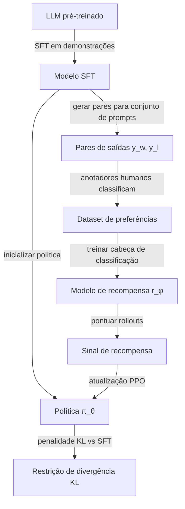

## Definição

O Aprendizado por Reforço com Feedback Humano (RLHF) é a técnica dominante para alinhar grandes modelos de linguagem a valores e preferências humanas após o pré-treinamento supervisionado. Foi demonstrado em escala pela primeira vez no InstructGPT (OpenAI, 2022) e desde então foi usado para treinar GPT-4, Claude 1-3, Gemini, Llama 2-Chat e praticamente todos os modelos de chat implantados publicamente.

O RLHF converte sinais de preferência humana — qual saída é melhor para um dado prompt? — em um sinal de treinamento que pode ajustar o modelo de linguagem usando RL. A percepção central é que preferências humanas são mais fáceis de coletar do que demonstrações humanas de comportamento ideal, porque julgar qualidade é cognitivamente mais simples do que produzir saída ótima.

O pipeline padrão tem três estágios:
1. **Ajuste fino supervisionado (SFT)** em um pequeno conjunto de demonstrações de alta qualidade.
2. **Treinamento do modelo de recompensa (RM)** em comparações de preferência humana.
3. **Ajuste fino por RL** (PPO) do LLM para maximizar a pontuação do modelo de recompensa enquanto permanece próximo ao modelo SFT.

## Como funciona

### Estágio 1: Ajuste fino supervisionado

O LLM base pré-treinado é ajustado em demonstrações escritas por humanos para a tarefa alvo (por exemplo, seguir instruções, responder perguntas de forma útil). Isso produz um modelo SFT que pode seguir instruções básicas, mas ainda pode gerar respostas inseguras ou inúteis.

### Estágio 2: Treinamento do modelo de recompensa

Anotadores humanos visualizam pares de saídas do modelo para o mesmo prompt e são solicitados a escolher qual é melhor (ou avaliar em uma escala). Um modelo de recompensa — tipicamente inicializado a partir do modelo SFT com uma cabeça de regressão escalar — é treinado para prever essas preferências usando perda de ranking em pares. O modelo de recompensa mapeia (prompt, resposta) → recompensa escalar.

### Estágio 3: Ajuste fino PPO

O modelo SFT inicializa a política. O PPO amostra respostas da política atual, as pontua com o modelo de recompensa congelado e atualiza a política para maximizar a recompensa esperada. Uma penalidade de divergência KL entre a política e a referência SFT impede que a política colapse em comportamentos de reward hacking distantes da distribuição de treinamento.

### Alternativas e extensões

| Método | Diferença principal | Quando preferir |
|---|---|---|
| DPO | Sem RL, sem modelo de recompensa — classificação direta de preferências | Mais simples, mais barato, geralmente mesma qualidade |
| RLAIF | Modelo de IA substitui anotadores humanos | Escala para datasets maiores com menor custo |
| Constitutional AI | Modelo se critica com base em princípios → gera dados de preferência | Reduz necessidade de rótulos humanos de inocuidade |
| GRPO | Otimização de política relativa ao grupo — usada no DeepSeek-R1 | Tarefas com foco em raciocínio, matemática, código |

## Quando usar / Quando NÃO usar

| Cenário | Usar RLHF | Evitar |
|---|---|---|
| Alinhar um LLM de chat em utilidade e segurança | Sim — abordagem padrão | DPO se infraestrutura RL não estiver disponível |
| Alinhamento de preferências específicas de domínio (médico, jurídico) | RLHF ou DPO em pares de preferência de domínio | Feedback humano genérico — anotadores sem expertise de domínio |
| Equipe pequena, computação limitada | DPO — mais simples, sem loop RL | PPO RLHF completo — alto overhead de engenharia |
| Pesquisa em raciocínio ou matemática | GRPO ou modelos de recompensa por processo | RLHF de resultado — sinal insuficiente para raciocínio passo a passo |
| Reward hacking é uma preocupação | Adicionar penalidade KL + sondagem adversarial de recompensa | Maximização de recompensa sem restrições |

## Fontes

- [InstructGPT — Treinando modelos de linguagem para seguir instruções com feedback humano (OpenAI, 2022)](https://arxiv.org/abs/2203.02155)
- [Constitutional AI (Anthropic, 2022)](https://arxiv.org/abs/2212.08073)
- [Direct Preference Optimization (Rafailov et al., 2023)](https://arxiv.org/abs/2305.18290)
- [Llama 2 — Modelos fundacionais abertos e de chat ajustados (Meta, 2023)](https://arxiv.org/abs/2307.09288)
- [Scaling RLHF — Anthropic (2023)](https://arxiv.org/abs/2204.05862)

## Veja também

- [Aprendizado por reforço](/docs/rl)
- [Métodos de gradiente de política](/docs/rl/policy-gradient-methods)
- [Métodos de alinhamento](/docs/ai-safety/alignment-methods)
- [LLMs](/docs/llms)
